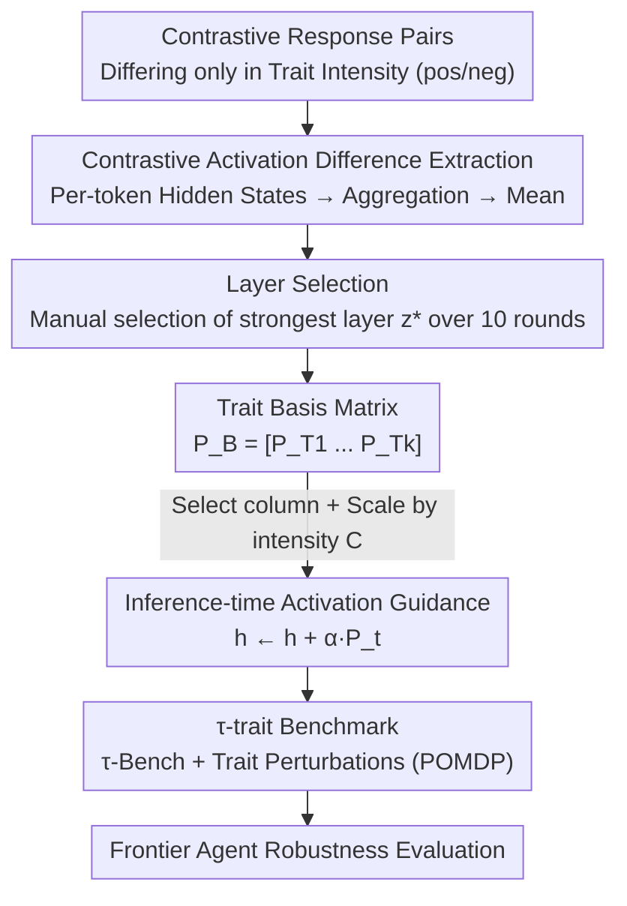

# Impatient Users Confuse AI Agents: High-fidelity Simulations of Human Traits for Testing Agents

**Conference**: ACL 2026 (Oral)  
**arXiv**: [2510.04491](https://arxiv.org/abs/2510.04491)  
**Code**: https://github.com/collinear-ai/tau-trait  
**Area**: LLM Agent / Robustness Testing / Activation Guidance  
**Keywords**: AI Agent Robustness, User Simulation, Activation Guidance, Persona Vectors, $\tau$-Bench

## TL;DR
The authors propose TraitBasis—a fine-tuning-free, model-agnostic, and lightweight method that extracts user trait directions like "impatient/confused/skeptical/incoherent" within the hidden space using contrastive activation differences. These directions can be scaled, combined, and injected during inference to simulate challenging users with high fidelity. Integrating this into $\tau$-Bench to create the $\tau$-trait benchmark, they found that frontier agent performance drops by 4%–20% on average (up to 46%) under varying user behaviors, exposing the illusion that high benchmark scores equate to real-world robustness.

## Background & Motivation
**Background**: The primary goal of multi-turn conversational AI agents is generalization, yet evaluations are often confined to small-scale i.i.d. tasks or agent benchmarks like $\tau$-Bench, AgentBench, and ToolBench. These benchmarks typically rely on system prompts to simulate users.

**Limitations of Prior Work**: Agents that perform well in standard settings often fail in real-world deployment due to insufficient testing—specifically when user behavior deviates from typical intentions or persona distributions. Existing benchmarks have narrow coverage and do not explicitly test robustness; even with multi-turn interactions, simulating users via system prompts struggles to maintain complex, realistic behaviors over long conversations (leading to "persona collapse").

**Key Challenge**: Minor shifts in user behavior (e.g., becoming more impatient, incoherent, or skeptical) cause sharp declines in agent performance. The authors observed that in the airline and retail domains of $\tau$-Bench, GPT-4o, Kimi-K2, and GLM-4.5 dropped by 35%, 46%, and 17% respectively just due to changes in user interaction style. This fragility remains undetected by current benchmarks: agents score high under standard evaluation but collapse in diverse real-world scenarios.

**Goal**: To bridge the "robustness testing gap" by creating a method and benchmark capable of systematically and controllably applying user trait perturbations, establishing a principled link between benchmark results and real-world deployment risks.

**Key Insight**: Assuming that each human-like trait corresponds to a direction in the model's activation space (following the persona vector approach), the goal is not to "teach" the model a trait but to **isolate** the trait directions already encoded in the pre-trained LLM using contrastive samples as lightweight probes.

**Core Idea**: Extract a controllable, scalable, and composable "trait basis" using contrastive activation differences. Inject these via addition during inference to simulate difficult users with high fidelity, thereby upgrading any agent benchmark into a robustness stress test.

## Method

### Overall Architecture
The core of TraitBasis is representing each user trait as a directional vector in the activation space. The process follows four steps: constructing contrastive response pairs differing only in trait intensity, collecting per-token hidden states and aggregating them into conversation vectors, averaging $n$ pairs to obtain the trait vector, and selecting the optimal layer to assemble a "basis matrix." During inference, columns are selected, scaled by target intensity, and added to the hidden states layer by layer. This is integrated with $\tau$-Bench to form the $\tau$-trait robustness benchmark.

### Key Designs

**1. Extracting Trait Vectors via Contrastive Activation Differences: Isolating Trait Directions from Entangled Activations**

Extracting a trait vector from a single response is difficult because outputs entangle traits, intentions, attributes, and styles. The authors construct contrastive response pairs $(Y_{pos}, Y_{neg})$ for the same set of prompts $X=\{x_1,\dots,x_n\}$, where pairs **differ only in the intensity of target trait $T$** (e.g., same intent but different levels of impatience). Averaging over $n$ pairs cancels auxiliary attributes, leaving a robust trait direction. Specifically, for conversation $C_i=(x_i,y_i)$, per-token hidden states at layer $z$ are collected and aggregated into a single vector $P_i^{(z)}:=\frac{1}{L_i}\sum_{t=1}^{L_i} h^{(z)}_{i,t}$. The trait vector is:

$$P_T^{(z)} := \frac{1}{n}\sum_{i=1}^{n}\big(P^{(z)}_{i,\text{pos}} - P^{(z)}_{i,\text{neg}}\big).$$

Ablations show performance saturates at $n=4$. Crucially, few-shot samples do not limit generalization—pre-trained LLMs already encode rich interaction styles. The contrastive pairs act as "probes" rather than "training data," and vectors can even be stimulated using **hand-written** responses (e.g., an impatient prefix gives high probability to trait-specific tokens), generating diverse high-fidelity responses the model might otherwise avoid due to pre-training biases.

**2. Inference-time Activation Guidance + Per-Trait Layer Selection: Precise Scaling without Sacrificing Realism**

After extraction, hidden states at layer $z$ are modified during inference as $h^{(z)} \leftarrow h^{(z)} + \alpha\,P_t^{(z)}$, where $\alpha$ is the calibrated trait intensity. Optimal injection layers vary by trait. The authors generate 10 turns of dialogue per layer and have 5 annotators select the layer $z^*(T)$ producing the "clearest guided output." This additive guidance requires no fine-tuning or extra data. Compared to prompt-based personas, it avoids persona collapse in long dialogues—the latter often fails as simulated users become more realistic, whereas guided injection remains stable. Using Llama-3.1-8B as the user model, this method achieves simulation performance comparable to GPT-4o without fine-tuning.

**3. Trait Basis Composition: Linear Composable Personas via Matrix Concatenation**

Real users often exhibit multiple overlapping traits (e.g., both impatient and skeptical). The authors concatenate $k$ optimal trait vectors into a basis matrix $P_\mathcal{B} = [\,P_{T1}\;P_{T2}\;\cdots\;P_{Tk}\,]\in\mathbb{R}^{d\times k}$, paired with calibrated intensities $\mathbf{C}=[c_1,\dots,c_k]$. During inference for a given $\mathbf{C}$, relevant columns are selected, scaled, and added to hidden states. Composition involves a simple linear superposition of trait vectors weighted by target intensity—the inspiration for the name "Vector Basis." In contrast, prompt-based methods and SFT must explicitly define traits in the system prompt, while LoRA was excluded from composition experiments due to ineffective adapter mixing.

**4. $\tau$-trait Benchmark: Robustness Stress Testing with Trait Vectors as New Dimensions**

TraitBasis is integrated into $\tau$-Bench to create $\tau$-trait, formalizing the task as a POMDP $(\mathcal{S},\mathcal{A},\mathcal{O},\mathcal{T},\mathcal{R},\mathcal{U},\mathcal{V})$ with a trait vector space $\mathcal{V}$. The transition function maps $\mathcal{S}\times\mathcal{A}\times\mathcal{V}\to S\times\mathcal{O}$, where user trait perturbations directly influence environment dynamics. Users are modeled as personas $\mathcal{P}_{\text{User}}=(P_t,P_a,\mathcal{U})$: traits $P_t$ are instantiated via vectors, attributes $P_a$ are partly in prompts and partly hidden in databases accessible only via tools, and $\mathcal{U}$ represents task instructions. Beyond the airline/retail domains, the authors added telecom (5 tables, 17 tools) and telehealth (9 tables, 22 tools) domains with 35 verifiable tasks. They also applied this to a 200-task multi-turn subset of BFCL.

## Key Experimental Results

### Main Results (Four Dimensions, Human vs. LLM-judge)

| Method | Realism Elo↑ (Human) | Fidelity%↑ (Human) | Long-range Consis.%↑ (Human) | Composability%↑ (Human) |
|------|------|------|------|------|
| Prompt-based | 1530 | 75.0 | 1.3 | 37.9 |
| SFT | 1561 | 95.0 | 5.0 | 51.9 |
| LoRA | 1285 | 68.75 | 4.5 | – |
| **TraitBasis** | **1624** | **97.5** | **24.8** | **62.5** |

TraitBasis leads across all human evaluations: 63% win rate in realism (10% higher than SFT, 15% higher than prompt-based); 97.5% fidelity (98.75% excluding neutral cases); 24.8% long-range consistency, and the only method to reliably produce "realistic escalation" (in 52.4% of interactions); 62.5% in composability. **Data efficiency is remarkable**: achieved with only 4 samples, a 3000x improvement over SFT (13k samples). Notably, Claude as an LLM-judge gave nearly opposite scores for composability (erroneously favoring keyword-heavy prompt-based methods), proving human evaluation as the ground truth for this task.

### Performance Drops of Frontier Agents on $\tau$-trait (Excerpt)

| Domain | Model | Skepticism | Confusion | Impatience | Incoherence | Average |
|----|------|------|------|--------|----------|------|
| Airline | GPT-5 | -22.5 | -19.2 | -22.5 | -17.5 | **-20.4** |
| Airline | GLM-4.5 | -11.0 | -16.9 | -12.8 | -12.2 | -13.2 |
| Airline | GPT-4o | -6.7 | -5.0 | -4.4 | -6.7 | -5.7 |
| Retail | Kimi K2 | -21.9 | -45.7 | -31.2 | -21.4 | **-30.0** |
| Retail | GPT-4o | -29.2 | -34.2 | -25.9 | -22.9 | -28.1 |

### Key Findings
- **Frontier Agents are Generally Fragile**: Simply changing user traits leads to average drops of 4%–20% (up to 46%). Even GPT-5 saw ~20% drops in the airline domain, indicating that scaling and post-training have not solved robustness.
- **Confusion and Impatience are Most Lethal**: Kimi K2 dropped 45.7% under "Confusion" in the retail domain, the largest single drop.
- **Prompting Causes Persona Collapse**: As simulated users become more realistic, prompt-based methods cause agents to fail more severely, while vector-guided injection remains stable—directly visualizing why agents fail under real trait drift.
- **Automated Evaluation is Unreliable**: LLM-judges showed near-opposite judgment to humans on composability, highlighting the necessity of human evaluation for this task.

## Highlights & Insights
- **"4 vs. 13k samples" efficiency** is highly compelling: reducing the cost of robustness testing from massive fine-tuning to a few contrastive pairs allows any team to quickly QA their agents.
- **The "Vector Basis" design** is ingenious: it provides a continuous test knob for discrete trait perturbations by being scalable ($\alpha$), composable (linear superposition), and controllable (column selection).
- **Stimulating vectors with handwritten responses** suggests trait directions exist inherently in pre-trained models; the method "lights them up" rather than "injecting" them—an observation transferable to any controlled behavior guidance scenario.
- **Explicitly attributing robustness failure to user behavior**: $\tau$-trait isolates failures caused purely by user behavior through controlled perturbations, building a principled bridge between benchmark scores and deployment risks.

## Limitations & Future Work
- **Static User Model (Llama-3.1-8B)**: While comparable to GPT-4o, vector extraction depends on the model's activation space; cross-family transferability needs further verification (though success on Qwen has been noted).
- **Limited Trait Set**: Four traits (impatience/confusion/skepticism/incoherence) are insufficient to cover the vast spectrum of real user behaviors.
- **Manual Layer Selection**: Identifying the optimal layer $z^*$ for each trait relies on five annotators, limiting automation and scalability.
- **Unsuitability of LLM-judges**: The discrepancy in composability scoring means large-scale evaluation remains heavily dependent on human costs.

## Related Work & Insights
- **vs. $\tau$-Bench / AgentBench / ToolBench**: These test fixed i.i.d. tasks and rely on system prompts without explicit robustness checks; this paper introduces controllable perturbations via trait vectors and adds telecom/telehealth domains.
- **vs. Prompt-based / SFT / LoRA User Simulation**: Prompts offer weak control and suffer from collapse; SFT requires 13k samples; LoRA adapters fail to mix effectively. TraitBasis is superior with only 4 samples, inference guidance, and compositionality.
- **vs. Persona Vectors / Activation Guidance**: Prior work focused on simple traits (sentiment/toxicity). This paper extends the paradigm to complex human personas and emphasizes high-fidelity multi-turn simulation and the evidence of robustness degradation in agents.
- **vs. SAE Sparse Feature Discovery**: While both seek interpretable low-dimensional behavior directions, TraitBasis uses contrastive activation differences rather than learning sparse dictionaries.

## Rating
- Novelty: ⭐⭐⭐⭐⭐ Extends activation guidance to multi-faceted personas and creates a controllable agent robustness benchmark.
- Experimental Thoroughness: ⭐⭐⭐⭐⭐ Includes four RQs, human/LLM dual evaluation, multi-domain $\tau$-trait, and BFCL.
- Writing Quality: ⭐⭐⭐⭐ Clear arguments and high intuition (Figure 1), though notation is dense and the benchmark naming ($\tau$-trait) is slightly abrupt.
- Value: ⭐⭐⭐⭐⭐ Exposes the "high score = robust" fallacy and provides the community with a low-cost, composable stress-testing tool.

<!-- RELATED:START -->

## Related Papers

- [\[ICLR 2026\] Grounding Computer Use Agents on Human Demonstrations](../../ICLR2026/llm_agent/grounding_computer_use_agents_on_human_demonstrations.md)
- [\[ACL 2026\] MAGMA: A Multi-Graph based Agentic Memory Architecture for AI Agents](magma_a_multi-graph_based_agentic_memory_architecture_for_ai_agents.md)
- [\[ICLR 2026\] MCPMark: A Benchmark for Stress-Testing Realistic and Comprehensive MCP Use](../../ICLR2026/llm_agent/mcpmark_a_benchmark_for_stress-testing_realistic_and_comprehensive_mcp_use.md)
- [\[ACL 2026\] Your LLM Agents are Temporally Blind: The Misalignment Between Tool Use Decisions and Human Time Perception](your_llm_agents_are_temporally_blind_the_misalignment_between_tool_use_decisions.md)
- [\[ICML 2026\] EvoClaw: Evaluating AI Agents on Continuous Software Evolution](../../ICML2026/llm_agent/evoclaw_evaluating_ai_agents_on_continuous_software_evolution.md)

<!-- RELATED:END -->
