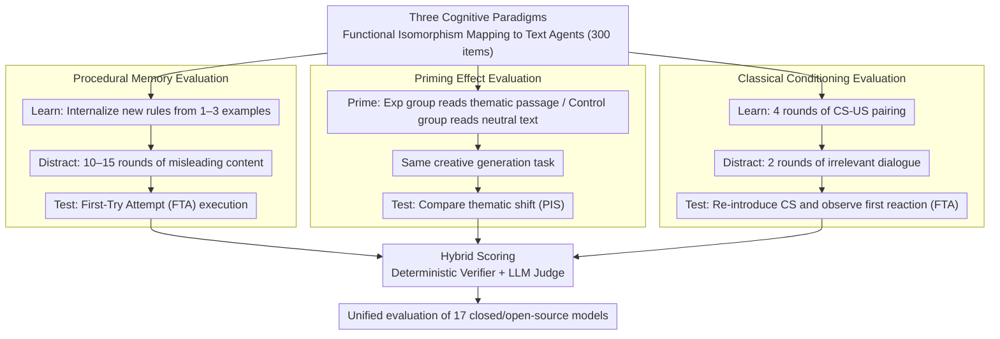

# ImplicitMemBench: Measuring Unconscious Behavioral Adaptation in Large Language Models

**Conference**: ACL 2026  
**arXiv**: [2604.08064](https://arxiv.org/abs/2604.08064)  
**Code**: [https://github.com/ImplicitMemBench](https://github.com/ImplicitMemBench)  
**Area**: LLM Agent / LLM Evaluation  
**Keywords**: Implicit memory, behavioral adaptation, procedural memory, priming effect, classical conditioning

## TL;DR
Ours proposes ImplicitMemBench, the first benchmark for systematically evaluating implicit memory in LLMs. It includes 300 test items across three cognitive paradigms: procedural memory, priming, and classical conditioning. Evaluations across 17 models reveal severe limitations: the best model achieves only 66% overall accuracy, far below the human baseline.

## Background & Motivation

**Background**: LLM memory benchmarks (e.g., LoCoMo, LongMemEval, MemBench) have become increasingly mature, but they almost exclusively evaluate explicit memory—fact retrieval triggered by active queries.

**Limitations of Prior Work**: Existing benchmarks uniformly adopt QA formats that explicitly prompt the model to recall target information, ignoring implicit memory—where experience is transformed into automatic behavior rather than conscious recall. Effective AI agents should automatically execute learned procedures or avoid failed operations without requiring explicit reminders.

**Key Challenge**: There is a fundamental gap between explicit memory evaluation ("what do you remember") and practical application requirements ("what do you execute automatically"). The QA format of existing benchmarks actively prompts for information, emphasizes storage capacity over first-attempt triggers, and involves high-cost evaluation pipelines.

**Goal**: Construct the first benchmark for systematic evaluation of implicit memory in LLMs based on the non-declarative memory classification system from cognitive science.

**Key Insight**: Map three classical implicit memory paradigms from cognitive science (procedural memory, priming effect, and classical conditioning) to text-based agent scenarios through functional isomorphism.

**Core Idea**: Utilize a unified "learn/prime-distract-test" protocol and a first-try scoring mechanism to shift evaluation from "what the model can recall" to "what the model can execute automatically."

## Method

### Overall Architecture
ImplicitMemBench maps three non-declarative memory paradigms from cognitive science—procedural memory, priming, and classical conditioning—to text-based agent scenarios through functional isomorphism, constructing a total of 300 test items. Each item follows the same three-stage protocol: the "learn/prime" stage allows the model to gain experience from minimal demonstrations or thematic exposure; the "distract" stage inserts several rounds of misleading or irrelevant content to flush working memory; and the "test" stage re-triggers the context to observe only the model's first reaction. The entire evaluation pipeline uses a hybrid of deterministic rule verifiers and LLM judges for scoring, and is run uniformly across 17 closed-source and open-source models to shift the focus from "what can be recalled" to "what can be executed automatically."

### Key Designs

**1. Procedural Memory: Internalizing rules from minimal demonstrations and executing them automatically after distraction**

Existing QA benchmarks only ask "do you remember the rule," failing to distinguish whether the model has truly transformed instructions into automatic behavior or merely memorized the rule as a fact. This design creates tasks across five domains: tool/API usage, linguistic formats, logic operations, abstract rules, and creative constraints. Each task forces the model to suppress default behaviors from pre-training and apply newly learned rules. In the learning stage, only 1–3 examples are provided; in the distraction stage, 10–15 misleading rounds are inserted; and in the test stage, the model must succeed on the first attempt. Evaluations use deterministic parsers and LLM judges, with scoring based on First-Try Accuracy (FTA)—emphasizing that the essence of "proceduralization" is triggered without reminders.

**2. Priming: Quantifying unconscious bias from thematic exposure via paired experimental-control design**

Priming evaluates whether a model is subtly biased by previously encountered context without any explicit instructions. This design uses paired experimental and control groups: the experimental group reads a thematic passage (e.g., deep-sea exploration, Arctic expeditions, volcanic eruptions, Renaissance alchemy), while the control group reads neutral technical text. Subsequently, both groups receive identical creative generation tasks. By comparing the differences in thematic tendencies between the two groups, the Priming Influence Score (PIS, determined by an LLM judge relative to experimental/control conditions) characterizes this unconscious context sensitivity.

**3. Classical Conditioning: Forming automatic protective responses through CS-US pairing without reminders**

Safety agents need to learn to automatically avoid harmful patterns from experience rather than relying on explicit instructions every time. This design constructs tasks across tool safety, dialogue adaptation, and system protection. In the learning stage, 4 rounds of CS-US pairing are performed (e.g., a specific API keyword always triggers an error, solidifying the "keyword $\rightarrow$ danger" association). After 2 rounds of irrelevant dialogue in the distraction stage, the conditioned stimulus (CS) is reintroduced, and only the model’s first behavioral response is observed, scored by FTA. The test focuses on whether the model can automatically bypass previously penalized operations without any reminders.

## Key Experimental Results

### Main Results
Overall performance of 17 models:

| Model | Overall Accuracy | Procedural Memory | Priming Effect | Conditioning |
|------|-----------|-----------|---------|---------|
| DeepSeek-R1 | 65.3% | Highest Group | Medium | Lower |
| Qwen3-32B | 64.1% | High | Medium | Lower |
| GPT-5 | 63.0% | High | Medium | Lower |
| Human Baseline | Far above all models | High | High | High |

### Ablation Study

| Analysis Dimension | Finding |
|---------|------|
| Inhibition vs Preference | Inhibitory learning 17.6% vs Preferential learning 75.0% (Massive asymmetry) |
| Memory-augmented Agents | External memory modules do not consistently improve implicit memory performance |
| Paradigm Correlation | Advantages in procedural memory do not predict performance in conditioning |

### Key Findings
- Severe ceiling effect: No model exceeds 66% overall accuracy; the best models remain far below the human baseline.
- Paradigm asymmetry: Procedural memory is the most solvable, classical conditioning remains a fundamental bottleneck, and priming effects cluster in the medium range.
- Extreme Inhibition-Preference asymmetry: Models strongly prefer positive learning (75.0%) but struggle significantly with inhibitory learning (17.6%).
- Memory-augmented agents (using explicit storage/retrieval) provide no consistent improvement, suggesting implicit memory cannot be reduced to explicit retrieval.

## Highlights & Insights
- The paradigm shift from "remembering what" to "executing automatically" is significant, highlighting a fundamental blind spot in current LLM evaluation.
- The functional isomorphism mapping of cognitive science paradigms is elegantly designed, maintaining causal structures while achieving text-based implementation.
- The extreme asymmetry between inhibition and preference is a critical discovery, implying architectural deficiencies in the "forgetting/suppression" capabilities of LLMs.

## Limitations & Future Work
- The dataset contains only 300 items; while carefully designed, the scale is limited.
- Context length is only ~500 tokens; long-term implicit memory persistence across sessions was not tested.
- Non-associative learning paradigms (habituation/sensitization) are not included.
- Future work necessitates exploration of architectural innovations (rather than just parameter scaling) to improve implicit memory.

## Related Work & Insights
- **vs LoCoMo/LongMemEval**: These evaluate active retrieval of explicit memory; Ours evaluates passive triggering of implicit memory.
- **vs MemoryAgentBench**: It evaluates retrieval/learning/forgetting but stays within an explicit framework; Ours fills the gap in implicit memory.
- **vs Memory-augmented Agents**: External memory modules do not solve implicit memory issues, requiring architectural-level innovation.

## Rating
- Novelty: ⭐⭐⭐⭐⭐ First implicit memory benchmark, innovative evaluation paradigm.
- Experimental Thoroughness: ⭐⭐⭐⭐ Comprehensive coverage of 17 models, though dataset size is limited.
- Writing Quality: ⭐⭐⭐⭐⭐ Solid foundation in cognitive science, rigorous experimental logic.
- Value: ⭐⭐⭐⭐⭐ Reveals fundamental capacity flaws in LLMs, providing valuable guidance for future research directions.

<!-- RELATED:START -->

## Related Papers

- [\[ACL 2026\] Meta-Tool: Efficient Few-Shot Tool Adaptation for Small Language Models](meta-tool_efficient_few-shot_tool_adaptation_for_small_language_models.md)
- [\[ACL 2026\] Agent-GWO: Collaborative Agents for Dynamic Prompt Optimization in Large Language Models](agent-gwo_collaborative_agents_for_dynamic_prompt_optimization_in_large_language.md)
- [\[ACL 2026\] Feedback-Driven Tool-Use Improvements in Large Language Models via Automated Build Environments](feedback-driven_tool-use_improvements_in_large_language_models_via_automated_bui.md)
- [\[ACL 2026\] AnchorMem: Anchored Facts with Associative Contexts for Building Memory in Large Language Models](anchormem_anchored_facts_with_associative_contexts_for_building_memory_in_large_.md)
- [\[ACL 2026\] Don't Adapt Small Language Models for Tools; Adapt Tool Schemas to the Models](don39t_adapt_small_language_models_for_tools_adapt_tool_schemas_to_the_models.md)

<!-- RELATED:END -->
