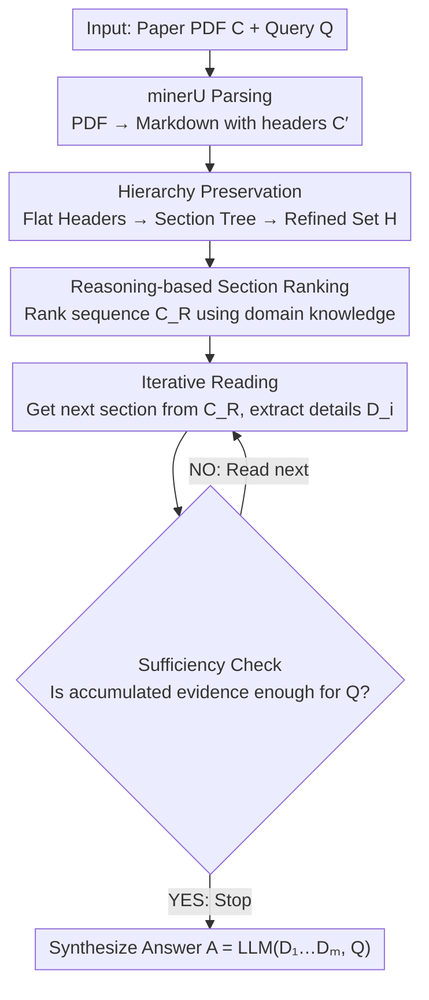

# IntrAgent: An LLM Agent for Content-Grounded Information Retrieval through Literature Review

**Conference**: ACL 2026  
**arXiv**: [2604.22861](https://arxiv.org/abs/2604.22861)  
**Code**: https://github.com/FengboMa/IntrAgent (Available)  
**Area**: LLM Agent / Scientific Literature Retrieval  
**Keywords**: Content-grounded retrieval, Section ranking, Iterative reading, Sufficiency check, Scientific QA

## TL;DR
IntrAgent decomposes the process of "researchers reading papers to find information" into a two-stage pipeline: "ranking sections by structure, then iteratively reading sections and stopping when sufficient." This allows the LLM to extract fine-grained answers faithfully aligned with queries from a full scientific paper without relying on vector retrieval, outperforming RAG and research agent baselines by an average of 13.2% across five STEM fields on the new IntraBench benchmark.

## Background & Motivation
**Background**: In scientific research, precisely extracting fine-grained information such as "experimental settings, parameters, and conclusions" from papers is a high-frequency demand. Current mainstream solutions either feed the entire paper into an LLM (suffering from context length limits and "lost in the middle" issues) or use RAG to split the paper into 500-token chunks, recalling chunks based on semantic similarity to concatenate into a prompt.

**Limitations of Prior Work**: The "chunking + cosine similarity" approach of RAG completely ignores the hierarchical structure of scientific papers—a query like "excitation laser wavelength" may not semantically match a section title like "Experiment Setup-SERS measurement." Consequently, recalled chunks are often from the Introduction where "laser" appears, and feeding irrelevant context to the LLM decreases accuracy. Existing "research agents" like PaperQA2 or SciMaster, originally designed for web-search-style QA, degrade into RAG when forced into "single-paper QA" scenarios.

**Key Challenge**: Scientific papers have clear priors for "question-to-relevant-section" mappings, but RAG's flat retrieve-then-generate architecture flattens this hierarchy. Furthermore, relevant evidence may span multiple non-adjacent sections, making it difficult to "read enough" in a single retrieval, while traditional pipelines lack explicit stopping criteria, leading to premature termination and hallucinations.

**Goal**: (1) Formally define a new task, IntraView—given a full paper $C$ and query $Q$, output a concise answer $A$ strictly constrained by $C$; (2) Design an agent capable of leveraging section hierarchies and judging "information sufficiency"; (3) Provide a cross-disciplinary benchmark for fair evaluation.

**Key Insight**: Mimic human literature reading behavior—first scan the table of contents to locate sections most likely to contain the answer, then read details section by section, judging whether the information is sufficient before writing the answer.

**Core Idea**: Replace "semantic similarity chunking and retrieval" with "structure-aware section ranking + iterative reading with sufficiency checks," explicitly incorporating human reading strategies into the agent's action space.

## Method

### Overall Architecture
The input is a PDF paper $C$ and a research query $Q$, with the goal of producing a concise answer $A$ strictly constrained by $C$. IntrAgent mimics the human reading path by splitting the task into two sequential stages: First, "structure-aware section ranking"—using minerU to convert the PDF into Markdown $C'$ with header tags, letting the LLM reconstruct the header hierarchy tree to obtain a refined heading set $H=\{h_1,\dots,h_n\}$, followed by reasoning-based ranking to get a reordered sequence $C_R$. Next is "iterative reading with sufficiency checks"—traversing $C_R$, extracting details, and judging whether accumulated evidence is sufficient to answer $Q$ after each section. Once sufficient, it stops and synthesizes $A=\mathrm{LLM}(D_1,\dots,D_m,Q)$. Section parsing and hierarchy management are handled by deterministic Python code, while semantic tasks like ranking, extraction, sufficiency judgment, and synthesis are performed by the LLM, achieving a "code handles structure, LLM handles understanding" approach.

### Key Designs

**1. Hierarchy Preservation: Reconstructing a section tree from a flat header list**

Flat header lists output by minerU (e.g., `#` lists) result in models seeing an isolated "SERS measurement" without knowing its parent topic, often misranking semantically similar but contextually distant sections. This design captures all `#` headers into an initial set $H_0$, uses an LLM to infer parent nodes and return paths from root to node, and then uses deterministic rules to prune redundant paths where no text exists between parent and child. This explicitly constructs relationships like "Experiment Setup → SERS measurement." Ablation studies show that removing this feature causes accuracy for GPT-4o/4.1/DS-R1 to drop from 65.6/72.5/67.6 to 60.7/70.3/64.2.

**2. Reasoning-Based Section Ranking: Selecting sections via domain knowledge rather than literal similarity**

The "question → section" mapping in scientific papers relies heavily on domain common sense, whereas RAG's cosine similarity only looks at literal wording—a query for "excitation laser wavelength" barely matches "Experiment Setup-SERS measurement" literally, though it is the correct place to look. This design bypasses similarity calculations; given $H$ and $Q$, it prompts the LLM to "rank which sections are most likely to contain the answer to $Q$ from highest to lowest and provide reasons," obtaining a ranked sequence $R=[r_1,\dots,r_n]$. Example outputs show the model reasoning that "laser wavelength is typically part of experimental setup," a piece of common sense that embedding retrieval misses.

**3. Information Sufficiency Check: Self-evaluating "is it enough" after each section**

Relevant evidence can be scattered across non-adjacent sections. Traditional pipelines lack explicit stopping criteria, leading to early termination or hallucinations. After reading each section, this design asks the LLM to judge if the cumulative $\{D_1,\dots,D_i\}$ is sufficient to answer $Q$ based *only* on extracted sentences (explicitly forbidding guessing). If NO, it reads the next section; if YES, it terminates and synthesizes the answer. This addresses two issues—forcing continued reading when evidence is split across sections, and stopping immediately when evidence is found to prevent irrelevant sections from diluting the signal. It also provides three confidence levels (Conservative / Balanced / Aggressive) for users to trade off between "stability" and "efficiency." In the physics subset, disabling this to read only the Top-1 section caused GPT-4o accuracy to plummet from 75.4% to 32.2%.

### A Full Example
Taking "What is the excitation laser wavelength?" from the physics subset: minerU converts the PDF to Markdown $C'$ with `#` tags; hierarchy preservation reconstructs the tree to link "Experiment Setup → SERS measurement"; reasoning-based ranking uses domain knowledge to place "Experiment Setup-SERS measurement" at Rank 1 (instead of an Introduction paragraph containing "laser"); iterative reading extracts $D_1$ containing the wavelength; the sufficiency check returns YES, stopping further reading; finally, the LLM synthesizes $D_1$ into a grounded short answer. No vector similarity was used.

### Loss & Training
IntrAgent is a training-free agent framework; all decisions rely on prompting and reasoning without parameter updates. The only tunable components are the confidence levels (affecting average iterations: Conservative $\approx$ 9.9 steps, Balanced $\approx$ 5.1 steps, Aggressive $\approx$ 3.9 steps) and the choice of backbone LLM.

## Key Experimental Results

### Main Results
Evaluation used the IntraBench benchmark: 5 STEM domains (Physics-SERS / Public Health-Epidemic Modeling / Earth Science-Remote Sensing / Engineering-Human Factors / Materials-Additive Manufacturing) $\times$ 25 expert-selected papers $\times$ 63 expert-designed questions = 315 test instances. Accuracy was calculated by mapping free-form LLM answers to multiple-choice options via GPT-4.1.

| Backbone LLM | Strongest Baseline | IntrAgent | Gain |
|---|---|---|---|
| GPT-4o | 62.1 (LongRAG) | 70.0 | +7.9 |
| GPT-4.1 | 64.7 (LongRAG) | 75.8 | +11.1 |
| DeepSeek-R1 | 65.5 (LongRAG) | 74.4 | +8.9 |
| o3 | 60.4 (Vanilla RAG MiniLM) | 73.4 | +13.0 |
| o4-mini | 61.5 (Vanilla RAG MiniLM) | 73.8 | +12.3 |
| Gemini-2.5 Pro | 61.8 (Vanilla RAG MiniLM) | 75.9 | +14.1 |
| Llama-3.1-70B | 61.4 (Vanilla RAG GritLM) | 68.8 | +7.4 |
| **Cross-domain Average** | — | — | **+13.2** |

IntrAgent was the champion across all seven backbones. The top performers (GPT-4.1 / Gemini-2.5 Pro) both reached $\approx$ 75.9%, suggesting model capacity is no longer the primary bottleneck.

### Ablation Study

| Configuration | GPT-4o | GPT-4.1 | DeepSeek-R1 | Description |
|---|---|---|---|---|
| Full (w/ Hierarchy Preservation) | 65.6 | 72.5 | 67.6 | Complete design |
| w/o Hierarchy Preservation | 60.7 | 70.3 | 64.2 | Ranking flat headers, drops 2.2–4.9 pts |
| w/o Sufficiency Check (Top-1 only) | 32.2 | — | — | Physics subset; GPT-4o drops from 75.4 to 32.2 |

Confidence Levels (GPT-4o, Physics subset):

| Confidence | Accuracy | Avg Iterations | Median Tokens |
|---|---|---|---|
| Conservative | 58.9 | 9.9 | 7853 |
| Balanced (Default) | 68.3 | 5.1 | 6376 |
| Aggressive | 62.7 | 3.9 | 2233 |

### Key Findings
- **Sufficiency check is the lifeline**: Removing it results in 32.2% accuracy, proving that simple reasoning-ranking is just another form of RAG; only the "stop when ready" mechanism elevates IntrAgent to 75%+.
- **Reading more doesn't guarantee accuracy**: The Conservative mode, reading nearly 10 sections, performed $\approx$ 10 points worse than Balanced, aligning with LongRAG's finding that excessive context dilutes signals.
- **Model Agnosticism**: IntrAgent outperformed the strongest baselines across all seven backbones, showing performance gains stem from architectural design rather than model scaling.
- **Header Robustness**: When section titles were modified to "Elementary School level," "Noisy," or "Shakespearean" versions, accuracy only dropped from 89.2 to 84.6.
- **Evaluation Stability**: GPT-4.1's automatic mapping matched human annotations on 63/65 physics questions, providing strong evidence for the reliability of the evaluation protocol.

## Highlights & Insights
- **Explicit Structural Priors**: Hard-coding the "Scientific Paper = Header Tree" prior into the agent workflow, rather than hoping for implicit encoding in vector space, directly challenges the flat RAG paradigm. This is applicable to any structured document QA (contracts, manuals, technical reports).
- **Sufficiency Check = Retrieval with Stop Tokens**: Converting retrieval from a hard-coded Top-K to an LLM-evaluated open loop provides an adaptive stopping criterion. This could be integrated back into RAG as "iterative-RAG with a sufficiency gate."
- **Product-Oriented Design**: Exposing the "number of sections to read" as a user-facing knob (confidence level) is more controllable than letting the model decide entirely, benefiting cost-quality trade-offs in production.
- **Filling the Cross-Disciplinary Benchmark Gap**: Unlike existing LitQA/LitQA2 which cover only biology, IntraBench spans 5 STEM fields with 315 questions, strictly emphasizing that answers must be grounded in the paper without extrapolation.

## Limitations & Future Work
- **Multimodality**: The authors acknowledge that figures and tables, which often carry critical experimental trends, are not handled. The scope is also limited to primary research papers, excluding reviews.
- **In-house observations**: (a) Parsing depends on minerU; it may fail on scanned or strangely formatted legacy papers, propagating errors to the hierarchy tree. (b) The Sufficiency Check relies entirely on LLM self-evaluation; confidence levels act like prompt-engineered "temperature knobs" without theoretical guarantees. (c) Evaluation via mapping to multiple-choice options may mask true generation quality (verbosity/hallucination).
- **Improvements**: Moving from prompt-based sufficiency checks to uncertainty-based metrics (e.g., self-consistency or token logprob); introducing OCR for tables/figures for a multimodal version; using a reranker to accelerate the retrieval stage and reduce LLM calls.

## Related Work & Insights
- **vs LongRAG**: While LongRAG packs more chunks into long contexts, Ours actively selects chunks via structure and iteration. IntrAgent outperforms LongRAG by 6–14 points, proving "selecting accurately is better than packing more."
- **vs PaperQA2 / SciMaster**: These agents rely on web search; without it, they degrade to RAG. Ours proves that an agent specifically designed for grounded retrieval is superior to a general agent forced into the task.
- **vs DRAGIN / R²AG**: Unlike work improving RAG at the retrieval layer (re-ranking), IntrAgent moves reasoning to the "section level," which closer resembles human reading strategies and avoids the difficulty of semantic alignment at the chunk level.

## Rating
- **Novelty**: ⭐⭐⭐⭐ Combining "hierarchical ranking + sufficiency check" for scientific literature QA is novel, though individual components have precursors in RAG improvement literature.
- **Experimental Thoroughness**: ⭐⭐⭐⭐⭐ 7 backbones $\times$ 5 domains $\times$ 12+ baselines + 3 ablation sets + header robustness + protocol self-check. Very comprehensive.
- **Writing Quality**: ⭐⭐⭐⭐ Clear structure and intuitive case diagrams, though some terminology (e.g., "mindset bionics") feels slightly contrived.
- **Value**: ⭐⭐⭐⭐ Provides a new task, benchmark, and method. Significant for the "serious research assistant" industry line; IntraBench is a valuable community asset.

<!-- RELATED:START -->

## Related Papers

- [\[ACL 2026\] PRInTS: Process Reward Modeling for Long-range Information Retrieval](prints_reward_modeling_for_long-horizon_information_seeking.md)
- [\[ACL 2026\] ToolOmni: Enabling Open-World Tool Use via Agentic Learning with Proactive Retrieval and Grounded Execution](toolomni_enabling_open-world_tool_use_via_agentic_learning_with_proactive_retrie.md)
- [\[ACL 2026\] OCR-Memory: Optical Context Retrieval for Long-Horizon Agent Memory](ocr-memory_optical_context_retrieval_for_long-horizon_agent_memory.md)
- [\[ACL 2026\] ZARA: Training-Free Motion Time-Series Reasoning via Evidence-Grounded LLM Agents](zara_training-free_motion_time-series_reasoning_via_evidence-grounded_llm_agents.md)
- [\[ACL 2026\] SafeMCP: Proactive Power Regulation for LLM Agent Defense via Environment-Grounded Look-Ahead Reasoning](safemcp_proactive_power_regulation_for_llm_agent_defense_via_environment-grounde.md)

<!-- RELATED:END -->
