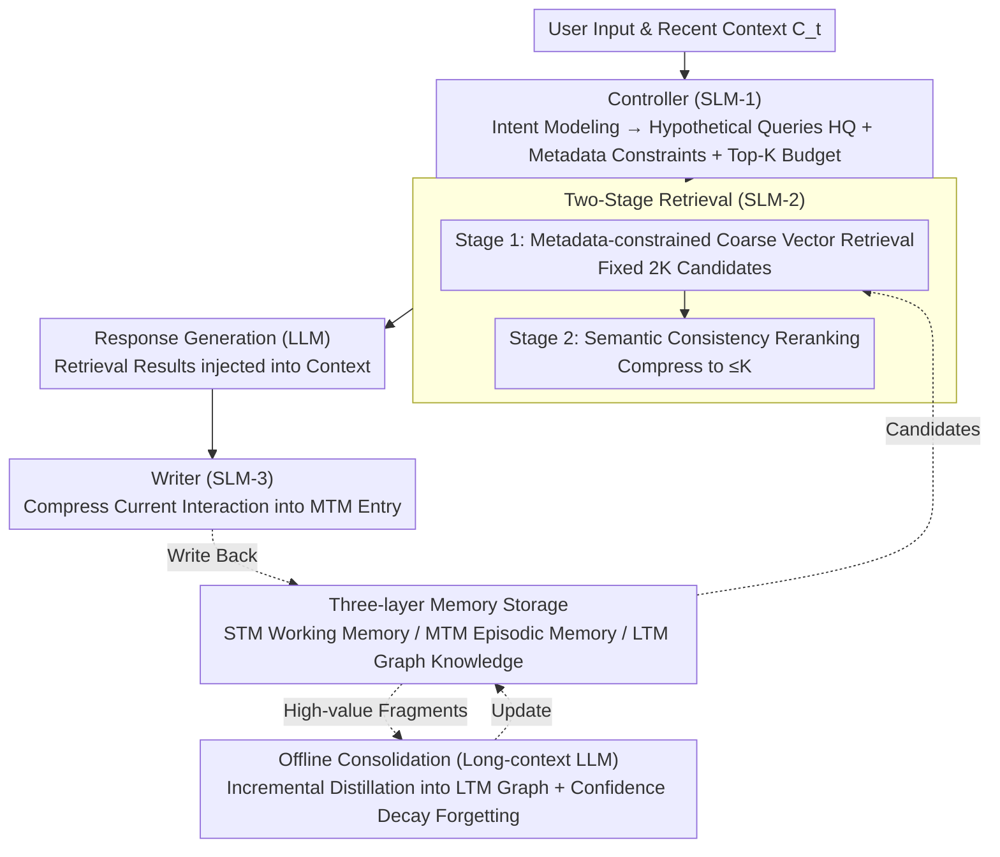

# Lightweight LLM Agent Memory with Small Language Models

**Conference**: ACL 2024 (Assuming 2026 is a typo in source or futuristic placeholder)
**arXiv**: [2604.07798](https://arxiv.org/abs/2604.07798)  
**Code**: None  
**Area**: LLM Agent / Memory Systems  
**Keywords**: Agent Memory, Small Language Models, Lightweight Retrieval, Online-Offline Decoupling, Long-term Dialogue

## TL;DR

This paper proposes LightMem, a lightweight LLM agent memory system driven by multiple specialized Small Language Models (SLMs). By modularizing memory operations into a Controller (SLM-1), Selector (SLM-2), and Writer (SLM-3), and decoupling online processing from offline consolidation, it achieves an average F1 improvement of approximately 2.5 on the LoCoMo benchmark (compared to A-MEM), while maintaining an 83ms retrieval latency and 581ms end-to-end latency.

## Background & Motivation

**Background**: LLM-driven agents excel in long-term dialogues, multi-step reasoning, and task interactions but are limited by context windows, requiring external memory to maintain consistency across turns. Existing memory systems can be divided into two categories: retrieval-based external memory (e.g., MemoryBank, ReadAgent), which is efficient but suffers from retrieval noise and unstable accuracy, and LLM-driven memory operations (e.g., A-MEM, HiAgent), which offer higher accuracy but accumulate significant latency due to repeated large model calls.

**Limitations of Prior Work**: (1) Retrieval-based methods are limited by the simplicity of query construction and candidate filtering, introducing retrieval noise that leads to unstable response accuracy; (2) LLM-driven methods achieve memory operations through repetitive model calls in long-term interactions, accumulating non-trivial runtime overhead; (3) Existing systems lack explicit decoupling between online and offline processes, making it difficult to optimize the trade-off between efficiency and effectiveness.

**Key Challenge**: High-frequency online memory operations require low latency and controllability, but improving memory accuracy usually necessitates stronger model reasoning capabilities. Mixing heavy abstraction and consolidation operations into the online path severely slows down response times.

**Goal**: Design a lightweight memory system that assigns high-frequency online memory operations to specialized SLMs while deferring heavy abstraction and consolidation to offline processing, achieving efficient and accurate memory invocation within a limited computational budget.

**Key Insight**: Recent advances in SLMs allow them to reliably handle structured decision-making tasks (e.g., intent routing, query construction, semantic filtering). These tasks emphasize predictable behavior and low overhead rather than maximizing generative capacity.

**Core Idea**: Synergize multiple specialized SLMs to handle online memory operations (query parsing, retrieval, writing) and delegate heavy consolidation to an offline large model to achieve an optimal balance between efficiency and effectiveness.

## Method

### Overall Architecture

LightMem splits memory operations into online and offline paths. The Mechanism is to "let the model of the right scale do the right thing": high-frequency online operations emphasizing predictable behavior are assigned to three specialized SLMs, while low-frequency, heavy consolidation requiring strong reasoning is pushed to an offline LLM. In the online path, SLM-1 (Controller) performs intent modeling and retrieval control, converting user input into Hypothetical Queries (HQ) and allocating retrieval budgets. SLM-2 (Selector) executes a two-stage retrieval, performing coarse vector retrieval followed by semantic consistency reranking. SLM-3 (Writer) compresses interactions into compact MTM entries and maintains them incrementally. The offline path utilizes a long-context model to distill high-value MTM fragments into de-identified long-term semantic knowledge (LTM), stored in a graph-structured knowledge base, thereby continuously accumulating long-term memory without slowing down responses.

### Key Designs

**1. Three-layer Memory Storage (STM/MTM/LTM): Temporal Hierarchical Layering**

Information at different time scales requires different storage and retrieval strategies. LightMem defines three layers: STM is working memory within the SLM context window, updated per turn but not persisted or retrieved. MTM is the carrier of personalized episodic memory, where each entry stores semantic summaries, temporal info, access statistics, embedding vectors, and user identifiers, with a capacity limit $|M_u^{\text{MTM}}| \leq B$ ($B=10^4$). It is incrementally maintained by the Writer (SLM-3), which evicts stale or low-value entries when the limit is exceeded. LTM stores de-identified semantic knowledge distilled offline from high-value MTM fragments, organized in a lightweight graph structure to support multi-hop reasoning and cross-user sharing.

**2. Controller (SLM-1): Translating Raw Input into a Structured Retrieval Plan**

Pure retrieval methods suffer from noisy results due to simple query construction. The Controller acts as a "retrieval manager": it infers coarse-grained intent (e.g., whether the query depends on recent episodic details or long-term knowledge), rewrites the input into a set of hypothetical queries (HQ) $\{q_t^{(i)}\}$ to improve recall coverage, and generates metadata constraints $\phi_t$ (user ID, time windows, labels) and a fixed Top-K budget. The final request $\mathcal{Q}_t = \langle \{q_t^{(i)}\},\ \phi_t,\ K \rangle$ is passed downstream. This explicit planning reduces noise through user isolation and ensures predictable behavior using a 1B-scale SLM.

**3. Two-Stage Retrieval (SLM-2): Balancing Coverage and Precision**

Pure vector retrieval misses fine-grained semantic consistency, while direct LLM retrieval over the entire database is too costly. Stage 1 performs coarse vector retrieval under metadata constraints from the Controller, returning $2K$ candidates total ($2K/n$ per HQ). In Stage 2, the Selector (SLM-2) performs semantic consistency checks on the $|C|=2K$ candidates, compressing them into final results $|R_t| \leq K$. This 2:1 compression provides stable computation, semantic refinement beyond vector similarity, and explicit noise suppression by discarding half the candidates.

**4. Offline Consolidation: Incremental Distillation of High-Value Fragments**

Abstraction and consolidation are heavy operations that would slow down online latency if mixed. An offline long-context LLM processes incremental batches (newly written or re-activated MTM entries), abstracting fragments into privacy-preserving knowledge candidates. It locates the nearest semantic anchors in the LTM via similarity search and performs incremental insertion and linking. A confidence decay is applied to weakly supported candidates to implement natural forgetting.

### Loss & Training

SLM-2 is fine-tuned using LoRA on 2,000 constructed (Query, Subgraph, Path) samples. Other SLMs use quantized deployments of Llama-3.2-1B-Instruct (default) or Qwen2.5-1.5B-Instruct. MTM capacity is capped at $B=10^4$, maintained by evicting stale/low-value entries. Offline consolidation is handled by a long-context LLM, fully decoupled from the online path.

## Key Experimental Results

### Main Results

**LoCoMo Benchmark Results (GPT-4o-mini as Response Generator)**

| Method | Single-hop F1 | Multi-hop F1 | Temporal F1 | Open-domain F1 | Adversarial F1 | Token Length |
|------|--------------|-------------|------------|---------------|---------------|-------------|
| LoCoMo | 40.36 | 25.02 | 18.41 | 12.04 | 69.23 | 16,910 |
| MemGPT | 41.04 | 26.65 | 25.52 | 9.15 | 43.29 | 16,977 |
| A-MEM | 44.65 | 27.02 | 45.85 | 12.14 | 50.03 | 2,520 |
| LightMem | **45.81** | **28.85** | **46.28** | **13.52** | **54.57** | 1,150 |

**DialSim Benchmark Results (GPT-4o-mini)**

| Method | F1 | BLEU-1 | ROUGE-L | METEOR | SBERT |
|------|-----|--------|---------|--------|-------|
| LoCoMo | 2.55 | 3.13 | 2.75 | 1.64 | 15.76 |
| A-MEM | 3.45 | 3.37 | 3.54 | 2.05 | 19.51 |
| LightMem | **4.12** | **3.95** | **4.20** | **2.48** | **23.40** |

### Ablation Study

**DialSim Ablation (Llama-3.2-1B)**

| Configuration | F1 | SBERT |
|------|-----|-------|
| LightMem (Full) | 4.12 | 23.40 |
| w/o Semantic Reranking | 3.83 | 22.82 |
| w/o HQ and Retrieval Routing | 3.87 | - |
| w/o MTM | 3.75 | - |
| w/o Offline Consolidation | 3.96 | - |

**Latency Analysis (GPT-4o-mini)**

| Method | Retrieval Latency P50 (ms) | Retrieval Latency P95 (ms) | E2E P50 (ms) | E2E P95 (ms) |
|------|------------------|------------------|----------------|----------------|
| A-MEM | 856 | 1583 | 914 | 3682 |
| MemGPT | 143 | 451 | 2087 | 3451 |
| LightMem | **83** | **167** | **581** | **1325** |

### Key Findings

- LightMem consistently outperforms baselines across all model scales (GPT-4o to Llama-3.2-1B).
- Compared to A-MEM, LightMem reduces retrieval latency by 10x (856ms → 83ms P50) and E2E latency by ~36%.
- LightMem achieves better performance using only ~1K tokens of context compared to methods using 16K+ tokens.
- As MTM grows to 10,000 entries, LightMem maintains stable performance due to Stage 2 filtering, while pure vector retrieval F1 drops from 3.95 to 3.83.
- Error injection tests show SLM-2 semantic reranking is the most critical component.

## Highlights & Insights

- The philosophy of "right model scale for the right task" is effectively implemented—SLMs handle high-frequency structured tasks, while LLMs handle low-frequency heavy tasks.
- The 2:1 compression strategy in two-stage retrieval is simple yet effective, ensuring computational stability and noise suppression through SLM verification.
- The LTM graph structure supports multi-hop reasoning and knowledge sharing while protecting privacy via de-identification.

## Limitations & Future Work

- SLM-2 requires fine-tuning on constructed data, and its generalization to new domains needs further verification.
- Offline consolidation depends on long-context LLMs, which may not be feasible in strictly edge-deployment scenarios.
- Detailed analysis of the LTM graph maintenance and natural forgetting mechanism is lacking.
- Evaluation is limited to two dialogue benchmarks; applicability to more complex agent tasks (e.g., tool use) remains to be verified.

## Related Work & Insights

- **vs A-MEM**: A-MEM uses LLM-driven notes and auto-linking for self-organizing memory but lacks online/offline decoupling. LightMem reduces latency 10x by replacing online LLM calls with SLMs.
- **vs MemGPT**: MemGPT treats context as virtual memory but relies on long-context replay (~16K tokens). LightMem achieves better performance with only ~1K tokens.
- **vs MemoryBank/ReadAgent**: These pure retrieval methods are significantly weaker than LightMem in multi-hop and temporal reasoning tasks.

## Rating

- Novelty: ⭐⭐⭐⭐ Significant architectural innovation in SLM-driven modular memory and decoupling.
- Experimental Thoroughness: ⭐⭐⭐⭐⭐ Comprehensive coverage of 6 backbone models, 5 baselines, detailed ablations, and latency analyses.
- Writing Quality: ⭐⭐⭐⭐ Clear structure and design, though some notation definitions are scattered.
- Value: ⭐⭐⭐⭐ Provides a practical, high-efficiency memory solution for long-term dialogue agents.

<!-- RELATED:START -->

## Related Papers

- [\[ACL 2026\] Don't Adapt Small Language Models for Tools; Adapt Tool Schemas to the Models](don39t_adapt_small_language_models_for_tools_adapt_tool_schemas_to_the_models.md)
- [\[ACL 2026\] CLAG: Adaptive Memory Organization via Agent-Driven Clustering for Small Language Model Agents](clag_adaptive_memory_organization_via_agent-driven_clustering_for_small_language.md)
- [\[ACL 2026\] Polaris: A Gödel Agent Framework for Small Language Models through Experience-Abstracted Policy Repair](polaris_a_gödel_agent_framework_for_small_language_models_through_experience-abs.md)
- [\[ACL 2026\] Meta-Tool: Efficient Few-Shot Tool Adaptation for Small Language Models](meta-tool_efficient_few-shot_tool_adaptation_for_small_language_models.md)
- [\[NeurIPS 2025\] Distilling LLM Agent into Small Models with Retrieval and Code Tools](../../NeurIPS2025/llm_agent/distilling_llm_agent_into_small_models_with_retrieval_and_co.md)

<!-- RELATED:END -->
