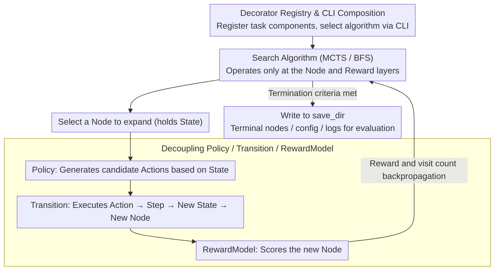

# LiTS: A Modular Framework for LLM Tree Search

**Conference**: ACL 2026  
**arXiv**: [2603.00631](https://arxiv.org/abs/2603.00631)  
**Code**: https://github.com/xinzhel/lits-llm  
**Area**: LLM Agent / Tree Search / Reasoning Framework  
**Keywords**: LLM Tree Search, MCTS, BFS, Agent Framework, Tool Use

## TL;DR
LiTS decomposes LLM tree search into Policy, Transition, RewardModel, and unified data structures. Utilizing a decorator registry, it enables the modular reuse of search algorithms, components, and task logic across mathematical reasoning, environmental planning, and tool-use tasks. Furthermore, the study identifies that policy diversity in open-text action spaces serves as a primary bottleneck for tree search.

## Background & Motivation
**Background**: Methods such as Tree-of-Thoughts, RAP, ReST-MCTS, and LATS frame LLM reasoning as a search problem, exploring multiple reasoning trajectories via MCTS, BFS, or similar planning algorithms. These approaches are particularly compelling for complex mathematics, planning, and tool-use scenarios.

**Limitations of Prior Work**: Existing implementations are often deeply coupled with specific tasks. Switching tasks requires rewriting state structures, action generation, environment transitions, reward models, and evaluation logic. Moreover, ensuring consistent domain components when comparing different search algorithms is difficult, leading to redundant engineering efforts for both algorithm researchers and domain experts.

**Key Challenge**: Tree search requires a unified search interface, yet the forms of states, actions, tools, environments, and rewards across LLM tasks vary significantly. The framework must be abstract enough to support general algorithms like MCTS/BFS while remaining flexible enough for users to inject domain-specific prompts, tools, and transitions.

**Goal**: The authors aim to propose a modular Python framework that allows domain experts to modify only the task logic and algorithm researchers to focus solely on search algorithms, enabling the orthogonal combination of components, algorithms, and task types.

**Key Insight**: LiTS decouples LLM reasoning agents into three categories of components: Policy (generates actions), Transition (executes actions and updates states), and RewardModel (provides value signals for search). All components communicate through universal structures like Action, Step, State, and Node, combined via a registry and CLI.

**Core Idea**: Transforming LLM tree search from a "one monolithic implementation per paper" approach into a "registrable, replaceable, and reusable component grammar."

## Method
LiTS is not a single algorithm but a framework. Its essence lies in defining a unified grammar that allows different task types to be operated upon by tree search agents: in language-grounded reasoning, actions are text thoughts; in tool-use, actions are structured tool calls; in environment-grounded tasks, actions are environment commands. All, however, implement the same interface.

### Overall Architecture
The architecture is divided from bottom to top into data structures, components, prompts, agents, and run artifacts. Data structures define Action, Step, State, and Node; components define Policy, Transition, and RewardModel. The PromptRegistry supports fallbacks for explicit parameters, task names, task types, and defaults. Agents include both chain agents and tree search agents. At runtime, all configurations, checkpoints, terminal nodes, and logs are written to a single save_dir to facilitate posterior evaluation.

The framework covers three task categories: Environment Grounded (e.g., BlocksWorld, Crosswords), Language Grounded (e.g., MATH500), and Tool Use (e.g., MapEval-SQL). Users extend the framework using decorators such as `@register_transition`, `@register_dataset`, `@register_policy`, `@register_search`, and `@register_resource`.

### Key Designs

**1. Unified Data Structure: Action → Step → State → Node: Decoupling search algorithms from task details**

If the search loop depends directly on specific task objects, cross-task reuse becomes impossible. LiTS utilizes a four-layer structure to separate search semantics from task semantics: Action is the atomic action produced by the Policy; Step encapsulates the action along with its execution result; State accumulates a sequence of Steps and provides a render method; and Node attaches search-related fields such as parent, children, reward, and visit count. Different tasks only need to implement corresponding subclasses—such as ThoughtStep for math reasoning, SubQAStep for sub-problem decomposition, ToolUseAction for tool use, or EnvAction for environment interaction—while algorithms like MCTS and BFS operate solely on the Node and trajectory interfaces, remaining agnostic to whether the underlying logic involves SQL or BlocksWorld.

**2. Decoupling Policy / Transition / RewardModel: Separating candidate generation, state transition, and path scoring**

Tying the generation, execution, and scoring of actions together makes it difficult to replace any single part. LiTS splits these into three modules: the Policy generates candidate actions based on the current state, the Transition executes actions and returns new states, and the RewardModel provides value signals for nodes or actions. Chain-based methods require only Policy + Transition, while Tree-based methods additionally integrate the RewardModel. This allows the same task components to be reused across MCTS and BFS, and the same search algorithm to be tested for generalization on new tasks. This decoupling is what allows ToT-BFS and ReST-MCTS to share the exact same ConcatPolicy, ConcatTransition, and GenerativePRM.

**3. Decorator Registry & CLI-first Composition: Extending tasks without modifying the core package**

To ensure usability, LiTS minimizes the code required to integrate new elements via a decorator system. Adding a Crosswords task only requires a `@register_transition`, a prompt, and a `@register_dataset`; it can then be executed via the command line using `--dataset crosswords`. MapEval-SQL returns tools and tool_context through the dataset and resource registry. To switch search algorithms, one simply injects a custom BFS using `@register_search("bfs")`. This design ensures domain experts face minimal learning costs as the core package remains untouched.

### A Complete Example: Running MCTS on BlocksWorld

The BlocksWorld planning task illustrates how this grammar functions. A user registers the task's Policy (generating moves based on block positions), Transition (executing moves and updating state), and RewardModel (evaluating distance to the goal layout). The CLI then specifies MCTS with 10 iterations, a branching factor of 3, and a maximum depth of 6.

During search, the root Node holds the initial State. In each iteration, MCTS selects a node for expansion and invokes the Policy to generate up to 3 candidate Actions. Each Action is transformed into a Step via the Transition, appended to a new State, and attached as a child Node. The RewardModel then scores the node for backpropagation to update visit counts and values. The algorithm operates entirely at the Node/reward level. This pipeline enables MCTS to improve accuracy on BlocksWorld from 26.7% (Chain) to 66.7%.

### Loss & Training
LiTS itself does not train models and lacks a unified loss function. The "training strategy" in the experiments primarily refers to search configurations and inference resource settings. Environment-grounded and tool-use experiments utilize Claude 3.5 Sonnet via AWS Bedrock, with costs reported. Language-grounded MATH500 experiments use self-deployed Llama3-8B or Llama3-8B-Instruct, with wall-clock time reported. BlocksWorld MCTS uses 10 iterations, branching factor 3, max depth 6; Crosswords MCTS uses 30 iterations, max depth 10; all tree search methods on MATH500 use 10 iterations, branching factor 3, and temperature 0.7-0.8.

## Key Experimental Results

### Main Results
The experimental goal is to verify component reusability rather than achieving new SOTA. Experiments in planning, tool-use, and math reasoning demonstrate various extension paths.

| Task | Method | Out Tok | Cost / Time | Calls | Acc |
|------|------|---------|-------------|--------|-----|
| BlocksWorld (30 ex.) | Chain | 17K | $1.48 | N/A | 26.7% |
| BlocksWorld (30 ex.) | MCTS | 488K | $21.99 | N/A | 66.7% |
| Crosswords (30 ex.) | Chain | 2.5K | $0.28 | N/A | 6.67% / 10.33% |
| Crosswords (30 ex.) | MCTS | 14K | $2.42 | N/A | 0% / 22.67% |
| MapEval-SQL (10 ex.) | ReAct | 10.6K | $0.57 | 62 | 40% |
| MATH500 (100 ex.) | CoT | 12.9K | 0.6h | 100 | 17% |
| MATH500 (100 ex.) | RAP (MCTS) | 4.47M | 8.0h | 3.6K | 18% |
| MATH500 (100 ex.) | ReST (MCTS) | 2.24M | 26.0h | 4.0K | 37% |
| MATH500 (100 ex.) | ToT (BFS) | 1.53M | 14.7h | 2.8K | 39% |

### Ablation Study
Rather than traditional ablation, the paper provides a crucial failure analysis: in open action spaces like Crosswords, temperature escalation fails to resolve action repetition. This suggests that policy diversity, rather than reward quality, is the bottleneck for tree search.

| Crosswords Action Diversity Metric | Value |
|----------------------------------|------|
| Unique states visited | 16 |
| Avg. policy calls per state | 7.9 |
| Duplicate rate (all) | 81.1% |
| Duplicate rate (incorrect) | 81.0% |
| Correct outputs | 17.3% |

### Key Findings
- In BlocksWorld, MCTS improves accuracy from 26.7% to 66.7%, demonstrating that tree search significantly benefits from finite action spaces and reliable transitions.
- In Crosswords, MCTS achieves 0% exact match but 22.67% partial match, with a duplicate rate of 81.1%. Even with an oracle reward, search fails due to insufficient action diversity.
- On MapEval-SQL, ReAct achieves 40% over 10 samples. MCTS on 3 samples costs $18.40 (approx. $6.13/example vs. ReAct's $0.05/example) with 0% accuracy, primarily due to self-preference bias in the LLM-as-judge reward model.
- On MATH500, ToT-BFS and ReST-MCTS use the same ConcatPolicy, ConcatTransition, and GenerativePRM. BFS (39%) slightly outperforms MCTS (37%) with significantly lower wall-clock time (14.7h vs. 26.0h).
- RAP using user-registered components only reaches 18% on MATH500, suggesting that component formulation may be more critical than the search algorithm itself.

## Highlights & Insights
- The core contribution of LiTS is engineering abstraction. it clarifies the reusable boundaries of tree search: algorithms manage Nodes and rewards, task logic manages Actions/Steps/States, and tool-use manages BaseTool and the resource registry.
- The framework facilitates "fair comparisons" of algorithms. For instance, ReST-MCTS and ToT-BFS can share identical built-in components, ensuring that observed differences are due to the search algorithm alone.
- The mode collapse finding is insightful: in open-text action spaces, LLM sampling randomness occurs at the token level rather than the action semantic level; thus, increasing temperature may still result in semantically redundant actions.
- For tool-use agents, reward model quality is the practical bottleneck. Failure on MapEval-SQL indicates that if the LLM-as-judge prefers verbose but incorrect SQL, tree search will exhaust its budget in the wrong direction.

## Limitations & Future Work
- Experiments are demonstration-focused with small sample sizes: 100 samples for MATH500, 30 for BlocksWorld/Crosswords, and 10 for MapEval-SQL.
- The Crosswords mode-collapse was only demonstrated in one open action environment; systematic validation across more tasks and decoding strategies is required.
- Tool-use tree search is hindered by LLM-as-judge reward bias; future work needs calibrated verifiers or task-specific PRMs.
- Current built-in algorithms are limited to MCTS and BFS; A* and beam search variants remain for future expansion.
- Throughput is an engineering challenge; scaling tree search requires concurrent and batched LLM calls.
- BaseTool currently requires manual Python class registration; the authors plan to introduce MCP (Model Context Protocol) to allow external tool servers to connect via standard JSON-RPC.

## Related Work & Insights
- **vs LLM Reasoners**: While LLM Reasoners supports tree search, task logic is more prone to coupling with configuration; LiTS emphasizes component sharing and registry-based extension.
- **vs LangGraph**: LangGraph is suitable for agent graph orchestration but lacks native tree search algorithms; LiTS provides pre-implemented MCTS/BFS for cross-task reuse.
- **vs Tree-of-Thoughts / RAP / ReST-MCTS**: These are specific reasoning methods; LiTS acts as a unified platform where their structures can be decomposed into registrable components.
- **Insights for Future Work**: When developing new tree search algorithms, researchers should report component formulation and reward quality; the algorithm is not the only variable, as policy action diversity often determines the performance ceiling.

## Rating
- Novelty: ⭐⭐⭐⭐ Framework abstraction is not a brand-new concept, but the component boundaries and registry design are highly practical.
- Experimental Thoroughness: ⭐⭐⭐ Demonstrations cover three task types, but sample sizes and SOTA comparisons are limited.
- Writing Quality: ⭐⭐⭐⭐ The architecture, extension examples, and failure analyses are clearly presented.
- Value: ⭐⭐⭐⭐ Substantial engineering value for LLM agent/tree search researchers and tool developers.

<!-- RELATED:START -->

## Related Papers

- [\[ICLR 2026\] Tree Search for LLM Agent Reinforcement Learning](../../ICLR2026/llm_agent/tree_search_for_llm_agent_reinforcement_learning.md)
- [\[ACL 2026\] OctoTools: An Agentic Framework with Extensible Tools for Complex Reasoning](octotools_an_agentic_framework_with_extensible_tools_for_complex_reasoning.md)
- [\[ACL 2026\] HAG: Hierarchical Demographic Tree-based Agent Generation for Topic-Adaptive Simulation](hag_hierarchical_demographic_tree-based_agent_generation_for_topic-adaptive_simu.md)
- [\[ICLR 2026\] ToolTree: Efficient LLM Agent Tool Planning via Dual-Feedback Monte Carlo Tree Search and Bidirectional Pruning](../../ICLR2026/llm_agent/tooltree_efficient_llm_tool_planning_via_dual-feedback_monte_carlo_tree_search_a.md)
- [\[ICML 2025\] KBQA-o1: Agentic Knowledge Base Question Answering with Monte Carlo Tree Search](../../ICML2025/llm_agent/kbqa-o1_agentic_knowledge_base_question_answering_with_monte_carlo_tree_search.md)

<!-- RELATED:END -->
