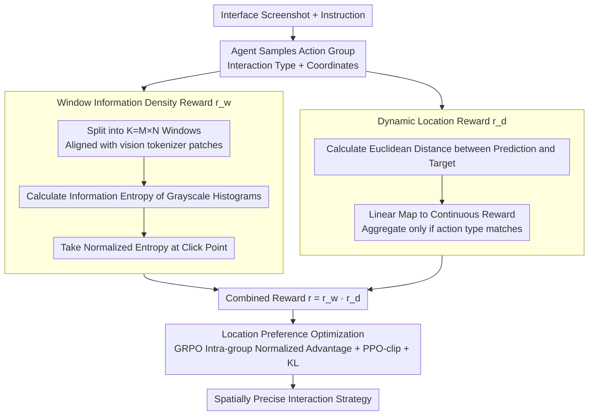

# LPO: Towards Accurate GUI Agent Interaction via Location Preference Optimization

**Conference**: ACL 2026 Findings  
**arXiv**: [2506.09373](https://arxiv.org/abs/2506.09373)  
**Code**: [GitHub](https://github.com/jqtangust/LPO)  
**Area**: GUI Agents  
**Keywords**: GUI Interaction, Location Preference Optimization, Reinforcement Learning, Information Entropy, GRPO

## TL;DR

This paper proposes Location Preference Optimization (LPO), which optimizes the spatial localization accuracy of GUI agents through entropy-based window rewards and physical distance-based dynamic location rewards integrated with the GRPO framework, achieving SOTA performance in both offline and online evaluations.

## Background & Motivation

**Background**: Autonomous GUI agents automate graphical user interface operations via natural language, becoming a significant direction for AI applications. Most GUI agents rely on Supervised Fine-Tuning (SFT), achieving preliminary success in predicting interaction behaviors.

**Limitations of Prior Work**: SFT methods face severe challenges in **spatial localization** due to limited capacity in perceiving and interpreting location data. Although some methods attempt to enhance UI action decision accuracy with Reinforcement Learning (RL), existing RL strategies lack mechanisms for **precisely evaluating interaction location accuracy**: UI-TARS uses text-level exact matching; UI-R1 and InfiGUI-R1 use bounding box IoU; GUI-R1 relies on fixed location boundaries. These methods provide only coarse-grained spatial evaluation.

**Key Challenge**: The core of GUI interaction lies in precise coordinate localization, yet existing reward functions cannot capture **continuous distance relationships**—predictions close to the target but outside the bounding box receive the same zero reward as those far from the target.

**Goal**: Design a location-aware preference optimization method to empower GUI agents with more precise spatial interaction capabilities. **Key Insight**: Users tend to interact in regions with high information density, and predictions with shorter distances should receive higher rewards. **Core Idea**: Utilize information entropy to guide regional exploration while using physical distance to construct continuous reward signals.

## Method

### Overall Architecture

LPO addresses the "imprecise clicking" issue of SFT-trained GUI agents. Existing RL rewards are either based on text matching or bounding box IoU, providing only discrete, coarse-grained feedback where a one-pixel deviation earns the same zero score as a massive miss. LPO models GUI interaction as an MDP, where the state $s_t \in \mathbb{R}^{C \times H \times W}$ is the interface screenshot and the action $a_t = (\mathcal{A}_t \times \mathcal{E}_t)$ includes interaction type and coordinates. After the agent samples a set of actions for each state, it calculates a combined reward by multiplying the "Window Information Density Reward $r_w$" (identifying the correct region) by the "Dynamic Location Reward $r_d$" (pinpointing the precise location). This reward is fed into GRPO for relative group optimization within a large action space, ultimately outputting an interaction strategy with superior spatial localization precision.

### Key Designs

**1. Window Information Density Reward $r_w$: Guiding Attention to Functional Areas via Information Entropy**

Interaction elements on GUIs (buttons, input boxes, text) are typically clustered in areas with sharp pixel variations and high information density, while blank backgrounds contain few targets. LPO partitions the screenshot into $K = M \times N$ windows and calculates the information entropy of the grayscale histogram for each window: $\mathcal{H}_{i,j} = -\sum_{b=1}^{B} p_b(\mathbf{W}_{i,j}) \log_2 p_b(\mathbf{W}_{i,j})$. The predicted coordinates are mapped to their corresponding window, and the normalized entropy $r_w = \mathcal{H}_{i^*,j^*} / (\max_{i,j} \mathcal{H}_{i,j} + \epsilon)$ serves as the reward. Window partitioning is intentionally aligned with the vision tokenizer's patch scheme to ensure reward granularity matches model perception granularity, stabilizing the strategy toward regions likely to contain interactive elements.

**2. Dynamic Location Reward $r_d$: Continuous Physical Distance over Discrete Boundaries**

The fundamental flaw of rewards like bounding box IoU is the non-differentiable step function—points inside score while points outside are zeroed, failing to distinguish between "near misses" and "far misses." LPO shifts to directly measuring the Euclidean distance between predicted coordinates $(x^{*k}, y^{*k})$ and targets $(x^k, y^k)$, mapping it linearly to a reward: $r_k = \max(0, 1 - \frac{\sqrt{(x^k - x^{*k})^2 + (y^k - y^{*k})^2}}{d_{\max}})$. This is aggregated only when action types match: $r_d = \frac{1}{K}\sum_{k=1}^{K} r_k$. Closer proximity yields higher rewards, providing a smooth gradient that allows the strategy to continuously converge toward the ground truth.

**3. Location Preference Optimization: Integrating Location Rewards into GRPO**

With continuous reward signals, LPO updates the strategy using the GRPO framework. For each state, a group of actions $\{a_g\}_{g=1}^{G}$ is sampled. The product of the two rewards $r^{(g)} = r_w^{(g)} \cdot r_d^{(g)}$ is calculated and normalized within the group to obtain the relative advantage $A^{(g)}$. The policy is updated using the PPO-clip objective with KL regularization. This multiplicative combination forces the agent to simultaneously "see the right area" and "hit the right spot" to achieve high scores, while the intra-group comparison of GRPO is naturally suited for GUI scenarios characterized by large action spaces and sparse rewards.

### Loss & Training

The SFT stage utilizes multiple internal datasets to train basic interaction capabilities. The RL stage employs preference data from datasets such as MMind2Web, AITZ, and OmniAct. The learning rate is $1 \times 10^{-6}$, lower clipping $\epsilon_1 = 0.2$, upper clipping $\epsilon_2 = 0.28$, and KL coefficient $\beta = 1 \times 10^{-4}$. The base model is Ovis2 8B. Training required approximately 300 H100 GPU hours.

## Key Experimental Results

### Main Results

| Benchmark | Metric | LPO | GUI-R1 | InfiGUI-R1 | UI-R1 | Base SFT |
|------|------|-----|--------|------------|-------|----------|
| Mind2Web Cross-Task | Step SR | **49.5** | 46.6 | 35.8 | 24.9 | 38.2 |
| Mind2Web Cross-Task | Ele.Acc | **64.3** | 62.5 | 62.6 | 59.5 | 60.3 |
| VisualWebBench | Average | **79.5** | 78.8 | 78.5 | 78.7 | 78.7 |
| ScreenSpot V2 | Average | **90.5** | 88.7 | 89.5 | 88.2 | 89.5 |
| WebVoyager | Overall | **57.6** | 37.5 | 54.1 | 47.3 | 48.0 |

### Ablation Study

| Configuration | Step SR (Cross-Task) | Ele.Acc | Note |
|------|---------------------|---------|------|
| LPO (Full) | **49.5** | **64.3** | Full model |
| w/o $r_d$ | 42.3 | 56.7 | Removing dynamic location reward significantly drops element accuracy |
| w/o $r_w$ | 46.4 | 62.7 | Removing window entropy reward drops overall accuracy |

### Key Findings
- LPO achieves SOTA on both offline benchmarks (Mind2Web, VisualWebBench, ScreenSpot V2) and online evaluation (WebVoyager).
- The dynamic location reward $r_d$ has the greatest impact on element localization accuracy (Ele.Acc), which drops by 7.6% when removed.
- The window information density reward $r_w$ is more critical for decision accuracy, as Step SR decreases by 3.1% upon its removal.
- While existing baselines (UI-R1, GUI-R1) show local advantages on specific sites, LPO exhibits much stronger overall consistency.

## Highlights & Insights
- The entropy-driven window reward is a simple yet effective prior—functional areas indeed have higher information density, making it transferable to other visual interaction tasks.
- Replacing discrete bounding box judgments with continuous distance rewards is a natural and elegant improvement that eliminates artificial thresholding.
- The multiplicative combination of two rewards compels the agent to optimize both "macro-region selection" and "micro-coordinate precision."
- The GRPO-based exploration mechanism is well-suited for GUI scenarios involving large spaces and sparse rewards.
- Validation via online evaluation (WebVoyager) strengthens the practical applicability of the method.

## Limitations & Future Work
- High dependency on large-scale grounding datasets with precise annotations makes data collection and labeling expensive, limiting widespread adoption.
- Training requires roughly 300 GPU hours, which may restrict real-time applications and smaller teams.
- Window partitioning depends on the vision tokenizer's patch scheme, and its generalization across different base models remains to be verified.
- Entropy rewards might not be robust for specific interfaces (e.g., sparse high-contrast elements on a solid white background).
- Future work could explore self-supervised location rewards without ground-truth coordinates and joint optimization with multi-step planning.

## Related Work & Insights
- **vs UI-TARS**: UI-TARS uses DPO, requiring manual construction of positive/negative pairs; LPO uses GRPO for automatic exploration, reducing human intervention.
- **vs GUI-R1**: GUI-R1 uses fixed location boundaries for rewards; LPO's continuous distance reward is more precise.
- **vs InfiGUI-R1**: InfiGUI-R1 uses bounding box IoU; LPO utilizes coordinate distance directly for finer granularity.

## Rating
- Novelty: ⭐⭐⭐⭐ Entropy window rewards and dynamic distance rewards are meaningful innovations in GUI RL reward design.
- Experimental Thoroughness: ⭐⭐⭐⭐⭐ Covers 3 offline benchmarks + 1 online benchmark with fair comparisons against 4 RL baselines and clear ablation.
- Writing Quality: ⭐⭐⭐⭐ Motivation diagrams (Figure 1) intuitively illustrate the limitations of current methods, and the derivation is clear.
- Value: ⭐⭐⭐⭐ Provides a practical and effective RL training strategy for high-precision interaction in GUI agents.

<!-- RELATED:START -->

## Related Papers

- [\[AAAI 2026\] DEPO: Dual-Efficiency Preference Optimization for LLM Agents](../../AAAI2026/llm_agent/depo_dual-efficiency_preference_optimization_for_llm_agents.md)
- [\[AAAI 2026\] ProBench: Benchmarking GUI Agents with Accurate Process Information](../../AAAI2026/llm_agent/probench_benchmarking_gui_agents_with_accurate_process_infor.md)
- [\[ICML 2026\] Video2GUI: Synthesizing Large-Scale Interaction Trajectories for Generalized GUI Agent Pretraining](../../ICML2026/llm_agent/video2gui_synthesizing_large-scale_interaction_trajectories_for_generalized_gui_.md)
- [\[ACL 2026\] Towards Scalable Lightweight GUI Agents via Multi-role Orchestration](towards_scalable_lightweight_gui_agents_via_multi-role_orchestration.md)
- [\[ICCV 2025\] UIPro: Unleashing Superior Interaction Capability for GUI Agents](../../ICCV2025/llm_agent/uipro_unleashing_superior_interaction_capability_for_gui_agents.md)

<!-- RELATED:END -->
