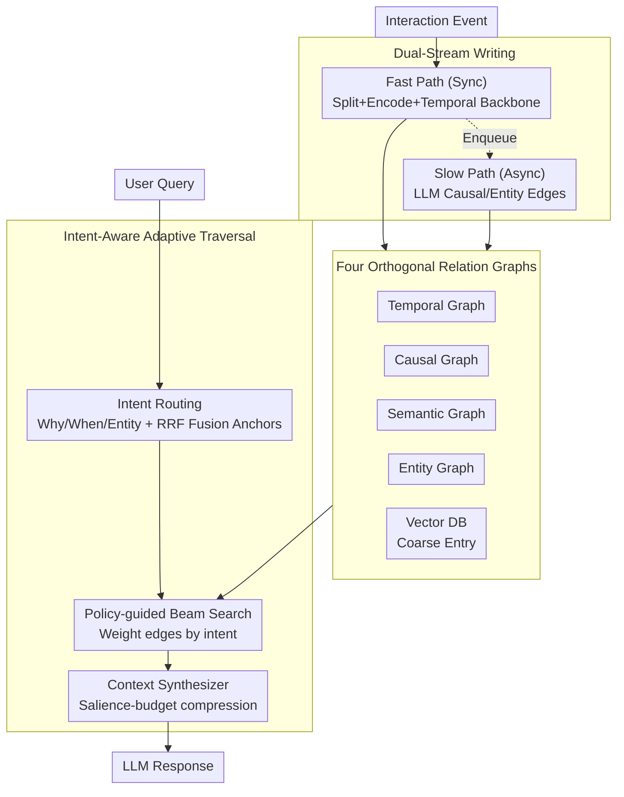

# MAGMA: A Multi-Graph based Agentic Memory Architecture for AI Agents

**Conference**: ACL 2026  
**arXiv**: [2601.03236](https://arxiv.org/abs/2601.03236)  
**Code**: https://github.com/FredJiang0324/MAGMA (Available)  
**Area**: LLM Agent / Long-term Memory / Graph Retrieval  
**Keywords**: Multi-graph memory, agentic memory, intent-aware, dual-stream writing, LoCoMo  

## TL;DR
MAGMA decouples the memory of LLM agents into four orthogonal relation graphs: semantic, temporal, causal, and entity. It employs intent routing and adaptive beam search for policy-guided traversal across the appropriate graphs, complemented by a dual-stream writing mechanism ("Fast Path" for synchronous ingestion and "Slow Path" for asynchronous LLM consolidation). On LoCoMo, it achieves a Judge score of 0.700, comprehensively outperforming A-MEM, Nemori, and MemoryOS, while maintaining a query latency of only 1.47s (40% faster than the runner-up).

## Background & Motivation

**Background**: LLMs are constrained by fixed context windows, preventing cross-session memory. This has led to the Memory-Augmented Generation (MAG) paradigm: using external memory $\mathcal{M}_t$ that evolves with interaction, where $o_t = \mathrm{LLM}(q_t, \mathrm{Retrieve}(q_t, \mathcal{M}_t))$ and $\mathcal{M}_{t+1} = \mathrm{Update}(\mathcal{M}_t, q_t, o_t)$. Representative systems include MemGPT, A-MEM (Zettelkasten-style linked notes), Nemori (event segmentation), MemoryOS, GraphRAG, and Zep.

**Limitations of Prior Work**: ① Nearly all solutions cram memory into a single repository (vector store or a single KG) and use cosine similarity for retrieval, causing temporal, causal, and entity relationships to be entangled. ② This "associative proximity" can identify "what happened" but fails to answer "why," making causal chain reasoning impossible. ③ A-MEM's note network relies primarily on semantic embeddings, missing temporal/causal chains; Nemori incorporates event segmentation but lacks explicit differentiation of relational dimensions within narrative structures. ④ Writing and retrieval are typically coupled on a synchronous path, where complex structural reasoning blocks agent responses.

**Key Challenge**: Memory must enable both "fast recall" and "deep reasoning"—the synchronous path must be fast to avoid blocking the user, yet structural relationship reasoning requires LLM calls that are slow and expensive. Furthermore, retrieval must be precise across different query types (why/when/entity), which a single similarity metric cannot achieve.

**Goal**: (a) Replace a single repository with multi-view relation graphs; (b) enable retrieval to dynamically select graph views based on query intent; (c) decouple "fast" writing from "consolidation."

**Key Insight**: Drawing inspiration from the complementary learning systems (CLS) in cognitive science—where the hippocampus is fast and the cortex is slow—and borrowing "read-path multi-view + asynchronous indexing" concepts from systems design.

**Core Idea**: Four orthogonal relation graphs + intent-aware policy-guided graph traversal + dual-stream read/write architecture.

## Method

### Overall Architecture

MAGMA aims to satisfy two conflicting requirements: memory must provide "fast recall" without blocking the user, while also enabling "deep reasoning" to answer "why" questions. It accomplishes this by separating the system into three collaborative layers: read, store, and write. The storage layer is no longer a single vector database but a time-varying directed multigraph $\mathcal{G}_t=(\mathcal{N}_t,\mathcal{E}_t)$, where nodes $n_i = \langle c_i, \tau_i, \mathbf{v}_i, \mathcal{A}_i\rangle$ store event content, timestamps, dense vectors, and structured attributes. Edges are partitioned into four orthogonal relation graphs based on semantic dimensions, supplemented by a vector database for coarse-grained entry points. The read path first utilizes intent routing to determine the query's nature, then performs adaptive topological retrieval on the corresponding relation graph, followed by a Context Synthesizer to assemble the answer. The write path is split into two streams: a synchronous Fast Path for lightweight encoding and an asynchronous Slow Path that uses an LLM to complement the graph with implicit causal and entity relations.

### Key Designs

**1. Four Orthogonal Relation Graphs as Data Structure: Decoupling a Single Memory into Four Accessible Relation Views**

Previous memory systems, whether vector databases or single KGs, entangle temporal, causal, and entity relations within cosine similarity. Consequently, "similar events" are often mistaken as "causal events." MAGMA partitions the edge set $\mathcal{E}$ into four semantic subspaces: the **Temporal Graph** forms an immutable temporal chain strictly based on $\tau_i < \tau_j$ for a chronological baseline; the **Causal Graph** generates directed edges via a consolidation module when the conditional score $S(n_j\mid n_i, q) > \delta$ to support "why" queries; the **Semantic Graph** connects events with undirected edges where $\cos(\mathbf{v}_i, \mathbf{v}_j) > \theta_{\mathrm{sim}}$; and the **Entity Graph** links events to abstract entity nodes to resolve "same object" identification across time. The vector database is retained as an anchor entry point. These four graphs are complementary rather than redundant: the temporal chain ensures chronological correctness, the causal chain answers "why," and the entity chain maintains object permanence. Ablation studies show that removing any single graph leads to performance degradation.

**2. Intent-Aware Adaptive Traversal: Determining Query Intent Before Policy-Guided Beam Search**

Single cosine retrieval naturally favors "topic proximity," which often leads to distraction by semantically similar but causally irrelevant nodes (adversarial queries cause A-MEM and others to drop to 0.2–0.6). MAGMA first uses a lightweight classifier to map the query to an intent $T_q \in \{\mathrm{Why}, \mathrm{When}, \mathrm{Entity}\}$, with a temporal parser converting expressions like "last Friday" into absolute time windows. It then utilizes Reciprocal Rank Fusion $S_{\mathrm{anchor}} = \mathrm{TopK}\sum_{m\in\{vec,key,time\}}\frac{1}{k+r_m(n)}$ to fuse vector, keyword, and temporal signals to locate entry anchors. Subsequently, a heuristic beam search is performed where the transition score is $S(n_j\mid n_i, q) = \exp\big(\lambda_1\phi(\mathrm{type}(e_{ij}), T_q) + \lambda_2 \mathrm{sim}(\vec n_j, \vec q)\big)$. Here, $\phi(r, T_q) = \mathbf{w}_{T_q}^\top \mathbf{1}_r$ weights edge types based on intent (e.g., "why" gives weights of 3–5 to causal edges; "entity" gives 2.5–6 to entity edges). The top-$k$ nodes are selected at each layer, with a decay factor $\gamma$ to inhibit depth explosion. This explicitly encodes the human intuition of "determine what to look for before searching" into path control.

**3. Dual-Stream Writing: Decoupling Low-Latency Response from Deep Structural Reasoning**

In practical deployment, the user experience bottleneck is synchronous latency, while causal reasoning can take several seconds. Coupling writing and structural reasoning on the synchronous path would block the agent. MAGMA decouples writing into two streams: the **Fast Path** (Algo 2) is synchronous, performing event segmentation, vector encoding, appending temporal backbone edges $n_{t-1}\to n_t$, and writing to the vector database before pushing the node ID to a queue. This process avoids LLM calls, reducing user-facing latency to millisecond-level vector encoding. The **Slow Path** (Algo 3) uses an asynchronous worker to retrieve nodes from the queue, pulls the 2-hop neighborhood $\mathcal{N}_{\mathrm{local}}$, and uses an LLM $\Phi$ to infer implicit causal and entity edges $\mathcal{E}_{\mathrm{new}} = \Phi_{\mathrm{reason}}(\mathcal{N}(n_t), \mathcal{H}_{\mathrm{history}})$ to write back to the graph. This corresponds to the complementary division of labor between the hippocampus (fast) and neocortex (slow) in CLS theory.

### A Complete Example

Consider an adversarial "why" query: "Why did Alice cancel her trip on Friday?" The intent router identifies $T_q=\mathrm{Why}$, and the temporal parser locks the time window for last Friday. RRF fuses vector, keyword, and temporal signals to select the node "Alice mentioned the trip" as the anchor. Beam search assigns high weights to causal edges due to the "why" intent; instead of drifting toward the semantically similar "Alice likes traveling," it follows the causal edge to the chain of reasons. Finally, the Context Synthesizer uses a salience budget to retain full text for key nodes on the path while compressing low-score nodes into markers like "...3 intermediate events...", providing the LLM with a causally complete yet concise context to generate the answer. On this path, the Fast Path already ensured Alice's utterances were immediately retrievable, while the causal edges were asynchronously supplemented by the Slow Path.

### Loss & Training
- MAGMA is a **training-free** architecture for retrieval and LLM prompting with no learned parameters. All LLM calls use gpt-4o-mini (T=0). Embeddings use all-MiniLM-L6-v2 (384-dim) or OpenAI text-embedding-3-small (1536-dim). Hyperparameters $\lambda_1=1.0$ and $\lambda_2=0.3$–$0.7$, beam width, $\mathrm{MaxDepth}=5$, and $\mathrm{Budget}=200$ were empirically tuned on LoCoMo.
- Token budgeting compresses low-score nodes into "...3 intermediate events..." while preserving high-score nodes in full, keeping the context within the prompt window.

## Key Experimental Results

### Main Results

**LoCoMo (LLM-as-Judge, gpt-4o-mini)**

| Method | Multi-Hop | Temporal | Open-Domain | Single-Hop | Adversarial | Overall |
|---|---|---|---|---|---|---|
| Full Context | 0.468 | 0.562 | 0.486 | 0.630 | 0.205 | 0.481 |
| A-MEM | 0.495 | 0.474 | 0.385 | 0.653 | 0.616 | 0.580 |
| MemoryOS | 0.552 | 0.422 | 0.504 | 0.674 | 0.428 | 0.553 |
| Nemori | 0.569 | **0.649** | 0.485 | 0.764 | 0.325 | 0.590 |
| **MAGMA** | **0.528** | **0.650** | **0.517** | **0.776** | **0.742** | **0.700** |

Overall relative Gain of +18.6%~45.5%. The most significant improvement is in the Adversarial dimension (0.742 vs. the second-best 0.616), demonstrating that intent routing + causal edges effectively block distractors that are semantically similar but structurally irrelevant.

**LongMemEval (Avg. context >100K tokens)**: MAGMA achieves an Avg accuracy of 61.2% > Nemori 56.2% > Full-context 55.0%. Notably, MAGMA uses only 0.7–4.2K tokens per query (vs. 101K for Full-context), representing **>95% token savings**.

### Ablation Study

| Configuration | Judge | F1 | BLEU-1 |
|---|---|---|---|
| MAGMA (Full) | **0.700** | 0.467 | 0.378 |
| w/o Adaptive Policy | 0.637 | 0.413 | 0.357 |
| w/o Causal Links | 0.644 | 0.439 | 0.354 |
| w/o Temporal Backbone | 0.647 | 0.438 | 0.349 |
| w/o Entity Links | 0.666 | 0.451 | 0.363 |
| Causal Only | 0.590 (Overall) | – | – |
| Temporal Only | 0.577 | – | – |
| Entity Only | 0.531 | – | – |

Removing the Adaptive Policy caused the largest drop (-0.063), proving intent routing is the core. Causal and Temporal links are also critical (dropping -0.05+ each). Entity links had the smallest but still consistent contribution.

### Key Findings
- The largest gain was in the Adversarial dimension (+12.6 over second-best A-MEM), indicating distractor resistance relies on "structural alignment" rather than "semantic matching"—a blind spot for single-graph systems.
- MAGMA's total query latency of 1.47s is 65% of A-MEM (2.26s), due to early pruning in the adaptive policy and the dual-stream offloading. While A-MEM is the most token-efficient (2.62k), its Judge score is only 0.580, suggesting excessive pruning loses critical evidence.
- All three single-graph-only configurations scored Overall < 0.60, proving the four relationships are not interchangeable. Causal-only was superior in the Adversarial dimension (0.680), highlighting the robustness of causal edges.
- MAGMA maintains performance while distilling contexts to < 5K tokens in ultra-long context scenarios, essentially performing a "structural compression."

## Highlights & Insights
- The abstraction of "Memory = Multi-view Relation Graphs" is elegant: four independent graphs with a unified node identity allow retrieval to be routed by query dimension, enabling more precise intent-specific path control than a single heterogeneous KG like GraphRAG.
- Dual-stream writing is the most valuable engineering design—it gracefully decouples "low-latency agent response" from "deep reasoning for long-term memory" using a producer-consumer queue. Most RAG/agent systems should default to this asynchronous consolidation model.
- Fusing vec + keyword + time anchors via RRF, combined with intent-weighted edge type bonuses, provides a hybrid retrieval paradigm that incorporates symbolic, dense, and temporal signals into beam search. This can be extended to any graph-based RAG.
- Salience-based token budgeting compresses low-relevance nodes into brevity codes like "...3 events...", maintaining prompt conciseness without losing path continuity—an insightful prompt engineering tactic for LLM-as-interpreter tasks.

## Limitations & Future Work
- Heavy reliance on LLMs for structural extraction in the Slow Path; if the LLM produces hallucinated edges, errors propagate to retrieval. The authors use conservative thresholds but cannot eliminate this entirely.
- Multi-graph storage and dual-stream processing introduce engineering complexity and storage overhead, which may be too heavy for resource-constrained scenarios (edge devices/personal agents).
- Evaluation is limited to conversational long-context benchmarks like LoCoMo/LongMemEval; it does not cover diverse agentic scenarios like multi-modality, tool use, or code agents. The intent classification (why/when/entity) is also relatively coarse.
- No growth curve is provided for retrieval time as the memory graph explodes; sparsification strategies for entity and causal graphs in long-term operation are missing.
- Parameters are empirically tuned without systematic policy learning; future work could use RL to learn traversal weights $\mathbf{w}_{T_q}$.

## Related Work & Insights
- **vs A-MEM (Xu 2025)**: Both use structured memory, but A-MEM relies on Zettelkasten-style linear notes + semantic retrieval without partitioned relationship dimensions. MAGMA's explicit four graphs + intent routing provides a clear dividend in the Adversarial dimension (0.742 vs. 0.616).
- **vs Nemori (Nan 2025)**: Nemori excels at event segmentation and representation alignment, but its internal structure consists of narrative chunks without explicit causal/entity edges. Ablation shows that removing causal links from MAGMA drops performance by 0.056.
- **vs GraphRAG / Zep**: Both are graph-based RAG. GraphRAG is driven by offline community summaries, while Zep is a single temporal KG. MAGMA's split-graph + asynchronous consolidation + intent routing is a more lightweight, online-evolvable design.
- **vs MemGPT / MemoryOS**: These lean toward an OS metaphor with paged memory management; MAGMA leans toward reasoning structures and cognitive science (CLS).

## Rating
- Novelty: ⭐⭐⭐⭐ The combination of orthogonal graphs, intent routing, and dual-stream writing is unique in the agentic memory space.
- Experimental Thoroughness: ⭐⭐⭐⭐ Comprehensive with two benchmarks, four baselines, two types of ablation (leave-one-out and single-graph-only), and efficiency analysis.
- Writing Quality: ⭐⭐⭐⭐ Clean formulas and a case study walkthrough make the abstract pipeline tangible.
- Value: ⭐⭐⭐⭐ For those deploying agentic memory, the dual-stream and intent routing patterns are directly applicable.

<!-- RELATED:START -->

## Related Papers

- [\[ACL 2026\] Dynamic Generation of Multi-LLM Agents Communication Topologies with Graph Diffusion Models](dynamic_generation_of_multi-llm_agents_communication_topologies_with_graph_diffu.md)
- [\[ICML 2026\] Memory is Reconstructed, Not Retrieved: Graph Memory for LLM Agents](../../ICML2026/llm_agent/memory_is_reconstructed_not_retrieved_graph_memory_for_llm_agents.md)
- [\[ACL 2026\] SEARL: Joint Optimization of Policy and Tool Graph Memory for Self-Evolving Agents](searl_joint_optimization_of_policy_and_tool_graph_memory_for_self-evolving_agent.md)
- [\[ACL 2026\] Topology Matters: Measuring Memory Leakage in Multi-Agent LLMs](topology_matters_measuring_memory_leakage_in_multi-agent_llms.md)
- [\[CVPR 2026\] RAAS: LLM Agentic System Architecture Search with GRPO](../../CVPR2026/llm_agent/raas_llm_agentic_system_architecture_search_with_grpo.md)

<!-- RELATED:END -->
