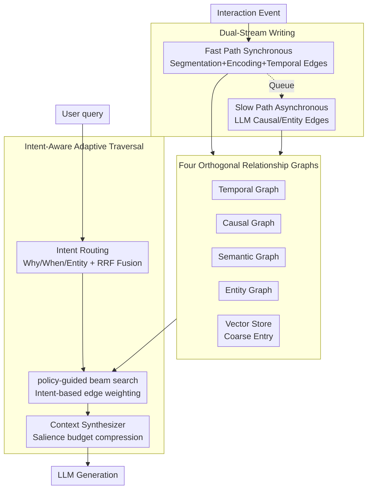

# MAGMA: A Multi-Graph based Agentic Memory Architecture for AI Agents

**Conference**: ACL 2026  
**arXiv**: [2601.03236](https://arxiv.org/abs/2601.03236)  
**Code**: https://github.com/FredJiang0324/MAGMA (Available)  
**Area**: LLM Agent / Long-term Memory / Graph Retrieval  
**Keywords**: Multi-graph memory, agentic memory, intent-aware, dual-stream writing, LoCoMo

## TL;DR
MAGMA decomposes the memory of an LLM agent into four orthogonal relationship graphs: semantic, temporal, causal, and entity. It employs intent routing and adaptive beam search for policy-guided traversal retrieval on the appropriate graph, complemented by a dual-stream writing architecture featuring "Fast Path synchronous storage + Slow Path asynchronous LLM consolidation." On LoCoMo, it achieves a Judge score of 0.700, outperforming A-MEM, Nemori, and MemoryOS, while maintaining a query latency of only 1.47s (40% faster than the runner-up).

## Background & Motivation

**Background**: LLMs are limited by fixed context windows and cannot maintain memory across sessions. This led to the Memory-Augmented Generation (MAG) paradigm: using an external memory $\mathcal{M}_t$ that evolves with interactions, $o_t = \mathrm{LLM}(q_t, \mathrm{Retrieve}(q_t, \mathcal{M}_t))$, $\mathcal{M}_{t+1} = \mathrm{Update}(\mathcal{M}_t, q_t, o_t)$. Representative systems include MemGPT, A-MEM (Zettelkasten chain-of-thought notes), Nemori (event segmentation), MemoryOS, GraphRAG, and Zep.

**Limitations of Prior Work**: ① Almost all solutions store memory in a single repository (vector store or single KG) and use cosine similarity for retrieval, causing temporal, causal, and entity relationships to be entangled. ② This "associative proximity" can identify "what happened" but cannot answer "why," failing at causal chain reasoning. ③ A-MEM's note network relies primarily on semantic embeddings, missing temporal/causal chains; Nemori has event segmentation but lacks explicit differentiation of relationship dimensions in its internal narrative structure. ④ Writing and retrieval are typically coupled on a synchronous path; complex structural reasoning blocks agent responses.

**Key Challenge**: Memory needs to support both "fast recall" and "deep reasoning"—the synchronous path must be fast and not block the user, yet structural relationship reasoning requires LLM calls, which are slow and expensive. Simultaneously, retrieval must be precise across different query types (why/when/entity), which a single similarity metric cannot achieve.

**Goal**: (a) Replace the single repository with a multi-view relationship graph; (b) enable retrieval to dynamically select graph views based on query intent; (c) decouple "fast" writing from "consolidation."

**Key Insight**: Borrowing from the Complementary Learning Systems (CLS) in cognitive science (fast hippocampus, slow cortex) and the "read-path multi-view + asynchronous indexing" idea from systems design.

**Core Idea**: Four orthogonal relationship graphs + intent-aware policy-guided graph traversal + dual-stream read/write architecture.

## Method

### Overall Architecture

MAGMA aims to satisfy two conflicting requirements: memory must provide "fast recall" without blocking the user, and "deep reasoning" to answer "why." The approach divides the system into three collaborative layers: read, store, and write. The storage layer is no longer a single vector database but a time-varying directed multigraph $\mathcal{G}_t=(\mathcal{N}_t,\mathcal{E}_t)$, where nodes $n_i = \langle c_i, \tau_i, \mathbf{v}_i, \mathcal{A}_i\rangle$ store event content, timestamps, dense vectors, and structured attributes. Edges are partitioned into four orthogonal relationship graphs by semantic dimension, accompanied by a vector database as a coarse-filtering entry point. The read path first uses intent routing to determine the query's purpose and then performs adaptive topological retrieval on the corresponding graph. Finally, the Context Synthesizer assembles the answer. The write path is split into two streams: the Fast Path synchronously stores data with lightweight encoding, while the Slow Path asynchronously uses an LLM to supplement latent causal and entity relationships in the graph.

### Key Designs

**1. Four Orthogonal Relationship Graphs as Data Structure: Decomposing a single memory store into four independently accessible relationship views**

Previous memory systems, whether vector stores or single KGs, entangle temporal, causal, and entity relationships within cosine similarity, often leading to "similar events" being mistaken for "causal events." MAGMA partitions the edge set $\mathcal{E}$ into four semantic subspaces: the Temporal Graph follows a strict $\tau_i < \tau_j$ immutable temporal chain providing a sequence baseline; the Causal Graph generates directed edges via the consolidation module when condition scores $S(n_j\mid n_i, q) > \delta$, specifically supporting "why" queries; the Semantic Graph uses undirected edges to connect events where $\cos(\mathbf{v}_i, \mathbf{v}_j) > \theta_{\mathrm{sim}}$; and the Entity Graph links events to abstract entity nodes, solving the "same object" identification across periods. The vector store is retained as an anchor entry point. The four graphs are complementary rather than redundant: the temporal chain ensures sequence accuracy, the causal chain answers "why," and the entity chain maintains object permanence. Ablation studies show performance drops when any graph is removed.

**2. Intent-Aware Adaptive Traversal: Determining query intent before performing policy-guided beam search on corresponding graphs**

Standard cosine retrieval naturally favors "topical similarity," potentially being misled by semantically similar but causally irrelevant distractors. MAGMA first uses a lightweight classifier to map the query to an intent $T_q \in \{\mathrm{Why}, \mathrm{When}, \mathrm{Entity}\}$, while a temporal parser converts expressions like "last Friday" into absolute time windows. It then utilizes Reciprocal Rank Fusion $S_{\mathrm{anchor}} = \mathrm{TopK}\sum_{m\in\{vec,key,time\}}\frac{1}{k+r_m(n)}$ to fuse vector, keyword, and temporal signals to locate entry anchors. Subsequently, a heuristic beam search is performed where each transition score is $S(n_j\mid n_i, q) = \exp\big(\lambda_1\phi(\mathrm{type}(e_{ij}), T_q) + \lambda_2 \mathrm{sim}(\vec n_j, \vec q)\big)$. Here, $\phi(r, T_q) = \mathbf{w}_{T_q}^\top \mathbf{1}_r$ weights edge types based on intent (e.g., weight 3–5 for causal edges in "why" queries; weight 2.5–6 for entity edges in "entity" queries). Each layer selects top-$k$ nodes, applying a decay factor $\gamma$ to prevent depth explosion. This explicitly encodes the human intuition of "deciding what to look for before searching" into path control.

**3. Dual-Stream Writing: Decoupling "low-latency response" from "deep structural reasoning"**

In practical deployments, synchronous latency is the bottleneck for user experience, whereas causal reasoning takes seconds. MAGMA decouples writing into two streams: the Fast Path (Algo 2) runs synchronously, performing event segmentation, vector encoding, appending temporal backbone edges $n_{t-1}\to n_t$, writing to the vector store, and pushing node IDs to a queue. It avoids LLM calls, reducing user-facing latency to millisecond-level encoding. The Slow Path (Algo 3) uses an asynchronous worker to retrieve nodes from the queue, extract a 2-hop neighborhood $\mathcal{N}_{\mathrm{local}}$, and use an LLM $\Phi$ to infer latent causal and entity edges $\mathcal{E}_{\mathrm{new}} = \Phi_{\mathrm{reason}}(\mathcal{N}(n_t), \mathcal{H}_{\mathrm{history}})$ before writing them back to the graph. This mirrors the complementary roles of the hippocampus (fast) and neocortex (slow) in CLS theory.

### Walkthrough Example

Consider an adversarial "why" query: "Why did Alice cancel her trip on Friday?" The intent router identifies $T_q=\mathrm{Why}$ and the temporal parser locks the window to last Friday. RRF fuses vector, keyword, and temporal signals to select the event "Alice mentions trip" as the anchor. Due to the "why" intent, beam search assigns high weight to causal edges, avoiding semantically similar distractors like "Alice loves traveling" and instead following the causal edges to the reason. The Context Synthesizer uses a salience budget to retain full text for key nodes while compressing low-score nodes into "...3 intermediate events...", allowing the LLM to generate a causally complete and concise answer. On this path, the Fast Path had already ensured Alice's utterances were immediately retrievable, while the causal edges were asynchronously added by the Slow Path.

### Loss & Training
- MAGMA is a **training-free** architecture; it uses retrieval, graph traversal, and LLM calls without learnable parameters. All LLM calls use gpt-4o-mini (T=0). Embeddings use all-MiniLM-L6-v2 (384-dim) or OpenAI text-embedding-3-small (1536-dim). Hyperparameters $\lambda_1=1.0, \lambda_2=0.3$–$0.7$, beam width, $\mathrm{MaxDepth}=5$, and $\mathrm{Budget}=200$ were tuned based on LoCoMo.
- A token budgeting strategy compresses low-score nodes into "...3 intermediate events..." while high-score nodes retain full text, keeping context within the prompt window.

## Key Experimental Results

### Main Results

**LoCoMo (LLM-as-Judge, gpt-4o-mini)**

| Method | Multi-Hop | Temporal | Open-Domain | Single-Hop | Adversarial | Overall |
|---|---|---|---|---|---|---|
| Full Context | 0.468 | 0.562 | 0.486 | 0.630 | 0.205 | 0.481 |
| A-MEM | 0.495 | 0.474 | 0.385 | 0.653 | 0.616 | 0.580 |
| MemoryOS | 0.552 | 0.422 | 0.504 | 0.674 | 0.428 | 0.553 |
| Nemori | 0.569 | **0.649** | 0.485 | 0.764 | 0.325 | 0.590 |
| **MAGMA** | **0.528** | **0.650** | **0.517** | **0.776** | **0.742** | **0.700** |

Overall relative Gain of +18.6%~45.5%. The most significant improvement is in Adversarial (0.742 vs. the next best 0.616), indicating that intent routing + causal edges effectively block "semantically similar but structurally irrelevant" distractors.

**LongMemEval (Avg. context >100K tokens)**: MAGMA's Avg accuracy 61.2% > Nemori 56.2% > Full-context 55.0%. MAGMA uses only 0.7–4.2K tokens per query (vs. 101K for Full-context), achieving **>95% token savings**.

### Ablation Study

| Configuration | Judge | F1 | BLEU-1 |
|---|---|---|---|
| MAGMA (Full) | **0.700** | 0.467 | 0.378 |
| w/o Adaptive Policy | 0.637 | 0.413 | 0.357 |
| w/o Causal Links | 0.644 | 0.439 | 0.354 |
| w/o Temporal Backbone | 0.647 | 0.438 | 0.349 |
| w/o Entity Links | 0.666 | 0.451 | 0.363 |
| Causal Only | 0.590 (Overall) | – | – |
| Temporal Only | 0.577 | – | – |
| Entity Only | 0.531 | – | – |

Removing Adaptive Policy caused the largest drop (-0.063), proving intent routing is the core mechanism. Causal and Temporal links are also critical.

### Key Findings
- The Adversarial dimension saw the largest gain (+12.6 over second-best A-MEM), showing distractor resistance relies on "structural alignment" rather than "semantic matching"—a blind spot for single-graph systems.
- MAGMA's total query latency of 1.47s is 65% of A-MEM's (2.26s), due to early pruning in the adaptive policy and the dual-stream offloading. While A-MEM is most token-efficient (2.62k), its Judge score is only 0.580; excessive compression loses critical evidence.
- All single-graph-only configurations yielded Overall scores < 0.60, proving the four relationship types are non-interchangeable. Causal-only dominated the Adversarial category (0.680), suggesting causal edges provide extreme robustness to noise.
- Under ultra-long contexts, MAGMA maintains performance with < 5K tokens, demonstrating that multi-graph + adaptive policy performs effective "structural compression."

## Highlights & Insights
- The abstraction of "Memory = Multi-view Relationship Graph" is elegant: four independent graphs with unified node identities allow retrieval to be routed by intent, offering better path control than single heterogeneous KGs like GraphRAG.
- Dual-stream writing is a highly practical design—it uses a producer-consumer queue to elegantly decouple "agent response latency" from "deep long-term memory reasoning." RAG/agent systems should default to this asynchronous consolidation mode.
- Fusing vec + keyword + time anchors with RRF and applying intent-weighted edge type bonuses provides a hybrid search paradigm that incorporates symbolic, dense, and temporal signals into beam search, applicable to any graph-based RAG.
- Salience-based token budgeting compresses low-relevance nodes (e.g., "...3 events..."), maintaining prompt conciseness without losing chain continuity—a useful insight for LLM-as-interpreter prompting.

## Limitations & Future Work
- Heavy reliance on the LLM for the Slow Path structural extraction—hallucinated edges could propagate errors; the authors use a conservative threshold but cannot eliminate this entirely.
- Multi-graph storage and dual-stream processing introduce engineering complexity and storage overhead, which might be too heavy for resource-constrained scenarios (edge devices).
- Evaluation is limited to conversational long-contexts (LoCoMo / LongMemEval) and does not cover multimodal, tool-use, or code agents. The three-way intent classification is relatively coarse.
- Retrieval time growth curves for exploding memory graphs are not provided, and sparsification strategies for entity/causal graphs in long-running scenarios are missing.
- All parameters are empirically tuned; future work could use RL to learn the traversal weights $\mathbf{w}_{T_q}$.

## Related Work & Insights
- **vs A-MEM (Xu 2025)**: Both use structured memory, but A-MEM employs Zettelkasten linear notes + semantic retrieval without relationship partitioning. MAGMA's explicit four graphs and intent routing yield a 0.742 vs 0.616 advantage in the Adversarial dimension.
- **vs Nemori (Nan 2025)**: Nemori excels at event segmentation and representation alignment, but its internal structure is a narrative chunk without explicit causal/entity edges.
- **vs GraphRAG / Zep**: Both are graph-based. GraphRAG is offline community-summary driven; Zep is a single temporal KG. MAGMA's graph partitioning + asynchronous consolidation + intent routing is a lighter, online-evolvable design.
- **vs MemGPT / MemoryOS**: These rely more on OS metaphors and paged memory management; MAGMA leans toward reasoning structures and cognitive science (CLS).

## Rating
- Novelty: ⭐⭐⭐⭐ The combination of orthogonal multi-graphs, intent routing, and dual-stream writing is unique in agentic memory.
- Experimental Thoroughness: ⭐⭐⭐⭐ Two benchmarks, four baselines, two types of ablations, and efficiency analysis.
- Writing Quality: ⭐⭐⭐⭐ Clean formulas; case studies and walkthroughs make the abstract pipeline concrete.
- Value: ⭐⭐⭐⭐ The dual-stream and intent routing patterns are directly applicable for production deployment of agentic memory.

<!-- RELATED:START -->

## Related Papers

- [\[ACL 2026\] Dynamic Generation of Multi-LLM Agents Communication Topologies with Graph Diffusion Models](dynamic_generation_of_multi-llm_agents_communication_topologies_with_graph_diffu.md)
- [\[ACL 2026\] SEARL: Joint Optimization of Policy and Tool Graph Memory for Self-Evolving Agents](searl_joint_optimization_of_policy_and_tool_graph_memory_for_self-evolving_agent.md)
- [\[CVPR 2026\] RAAS: LLM Agentic System Architecture Search with GRPO](../../CVPR2026/llm_agent/raas_llm_agentic_system_architecture_search_with_grpo.md)
- [\[NeurIPS 2025\] A-MEM: Agentic Memory for LLM Agents](../../NeurIPS2025/llm_agent/a-mem_agentic_memory_for_llm_agents.md)
- [\[ACL 2026\] How Adversarial Environments Mislead Agentic AI](how_adversarial_environments_mislead_agentic_ai.md)

<!-- RELATED:END -->
