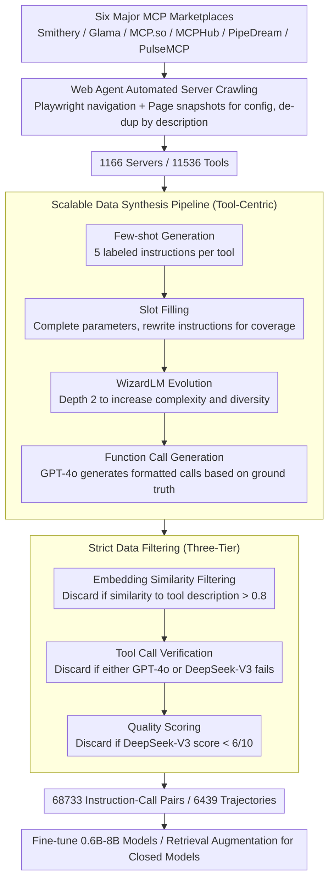

# MCP-Flow: Facilitating LLM Agents to Master Real-World, Diverse and Scaling MCP Tools

**Conference**: ACL 2026  
**arXiv**: [2510.24284](https://arxiv.org/abs/2510.24284)  
**Code**: [https://github.com/wwh0411/MCP-Flow](https://github.com/wwh0411/MCP-Flow)  
**Area**: LLM Agent / Tool Use  
**Keywords**: Model Context Protocol, Tool Use, Automated Data Construction, Large-scale Benchmark, LLM Agent

## TL;DR

MCP-Flow proposes a Web Agent-based automated pipeline to collect tool information from 1166 real-world MCP servers and synthesize 68,733 high-quality training data points. This allows small-scale fine-tuned models (0.6B-8B) to outperform SOTA large models like GPT-4o in MCP tool utilization.

## Background & Motivation

**Background**: The Model Context Protocol (MCP) is rapidly developing as a unified framework for interactions between LLMs and external tools, with numerous MCP servers and tools emerging in the community. Existing research has begun building benchmarks to evaluate the MCP usage capabilities of models, but severe limitations remain.

**Limitations of Prior Work**: Three key issues exist—(1) Existing MCP research covers only a small number of servers ($\le 20$), which is far below the scale and diversity of the real MCP ecosystem; (2) Server collection relies heavily on manual curation, failing to keep pace with the rapid growth of MCP servers; (3) No existing framework provides training support, serving only as evaluation platforms rather than mechanisms for improving model capabilities.

**Key Challenge**: The gap between the complexity, diversity, and rapid growth of the real-world MCP ecosystem and the current limited MCP usage capabilities of LLMs—even SOTA models like Claude-3.5-Sonnet perform poorly in simple settings.

**Goal**: (1) Automate large-scale server discovery and data collection; (2) Synthesize high-quality and diverse training data; (3) Validate the dataset's value through training, retrieval augmentation, and complex task evaluation.

**Key Insight**: Utilize Web Agents (Playwright) to automate navigation of MCP marketplaces instead of manual scraping; combine few-shot generation, slot filling, and WizardLM evolution to synthesize diverse data.

**Core Idea**: Construct a large-scale real-world MCP training dataset using an automated pipeline (server discovery + data synthesis + strict filtering), enabling small models to achieve or even surpass the MCP tool-use capabilities of large models through fine-tuning.

## Method

### Overall Architecture

MCP-Flow aims to bridge the chasm between the "real, diverse, and expanding" MCP tool ecosystem and LLM tool-use capabilities, whereas past benchmarks only covered roughly twenty manually curated servers and lacked training capabilities. It structures the entire pipeline into two fully automated links: the front end uses a Web Agent to discover and scrape server configurations in bulk from six real-world MCP marketplaces, resulting in raw materials for 1,166 servers and 11,536 tools; the back end feeds this information into a "generation-evolution-filtering" data synthesis pipeline. This pipeline generates ground-truth labeled instructions from a tool-centric perspective, enhances complexity via WizardLM evolution, and removes noise through three layers of filtering. The final output consists of 68,733 instruction-function call pairs and 6,439 trajectories for fine-tuning small models or performing retrieval-augmentation for closed-source models.

### Key Designs

**1. Web Agent Automated Server Crawling: Replacing per-site parsing logic with high-level instructions**

Traditional crawlers require custom parsing code for each website's HTML structure, making it impossible to keep up with the rapid growth of MCP servers. MCP-Flow utilizes a Playwright Web Agent to autonomously navigate targeted server pages within a predefined workflow, extracting JSON configurations directly via page snapshots. This uniformly covers platforms like Smithery, Glama, MCP.so, MCPHub, PipeDream, and PulseMCP. A key insight is performing de-duplication based on tool description lists rather than server names or providers—since the same server often changes names or interfaces across platforms, whereas functional signatures remain stable.

**2. Scalable Data Synthesis Pipeline: Ensuring natural alignment between instructions and ground truth from a tool-centric perspective**

To ensure instructions carry correct tool labels, MCP-Flow avoids the "write instruction then label tool" reverse process. Instead, it starts from the tool using a four-step generation: (a) Few-shot generation, producing 5 instructions with intrinsic ground-truth labels for each tool; (b) Slot filling, treating required parameters as slots to complete missing values and rewrite instructions for parameter coverage; (c) WizardLM evolution, randomly selecting evolution directions like concretization or reasoning at a depth of 2 to enhance complexity at a controlled cost; (d) Function call generation, producing formatted calls using GPT-4o based on ground-truth tools and input schemas.

**3. Strict Data Filtering: A three-tier gatekeeping process to remove low-quality samples**

Synthetic data inevitably includes trivial or erroneous samples. MCP-Flow employs three independent filtering steps: (a) Embedding similarity filtering, calculating the embedding similarity between instructions and tool descriptions and discarding those exceeding a $0.8$ threshold to avoid trivial tool selection; (b) Tool call verification, requiring GPT-4o and DeepSeek-V3 to independently select the correct tool from the ground truth plus two random candidates; (c) Quality scoring, using DeepSeek-V3 to discard samples scoring below 6/10.

### Loss & Training

Standard instruction fine-tuning is applied to train Qwen-0.6B/4B and Llama3.1-8B on the synthetic data. Additionally, a retrieval-augmentation scheme is provided—retrieving similar examples from the dataset to enhance the MCP usage capabilities of closed-source models.

## Key Experimental Results

### Main Results

**MCP Tool Selection and Formatting (10-Tool Setting)**

| Model | Seen Tool | Unseen Tool | Unseen Server |
|------|-----------|-------------|---------------|
| GPT-4o (Tool/Param/AST) | 88.6/68.2/58.8 | 85.0/71.4/62.0 | 81.4/55.6/50.8 |
| Claude-3.5-Sonnet | 85.8/68.6/56.6 | 83.0/74.4/63.6 | 72.6/56.0/48.4 |
| MCP-Flow-Qwen-0.6B | **96.8/87.2/75.4** | **98.2/86.8/75.2** | **98.4/70.6/58.0** |
| MCP-Flow-Qwen-4B | **99.2/91.8/81.2** | **98.6/91.4/78.2** | **98.4/72.2/59.8** |
| MCP-Flow-Llama-8B | **98.6/91.0/81.6** | **99.0/91.2/77.6** | **99.4/77.0/65.2** |

**100-Tool Large-Scale Setting**

| Model | Tool | Param | AST |
|------|------|-------|-----|
| GPT-4o | 72.3 | 66.9 | 53.8 |
| MCP-Flow-Qwen-0.6B | 64.7 | 63.4 | 51.6 |
| MCP-Flow-Qwen-4B | **81.7** | **82.1** | **67.0** |

### Ablation Study

| Configuration | Key Metrics | Note |
|------|---------|------|
| Full MCP-Flow Data | — | Baseline |
| W/O WizardLM Evolution | Decrease | Lower instruction complexity and diversity |
| W/O Slot Filling | Decrease | Incomplete parameter coverage |
| W/O Quality Filtering | Decrease | Low-quality samples introduce noise |

### Key Findings

- **0.6B models can surpass GPT-4o**: MCP-Flow-Qwen-0.6B achieved 96.8% Tool accuracy in the 10-tool setting, far exceeding GPT-4o's 88.6%, demonstrating the value of specialized training data.
- While performance for all models decreases as the number of tools increases, MCP-Flow models decline more slowly; at the 100-tool setting, the 4B model still outperforms GPT-4o.
- Retrieval augmentation improved GPT-4o's Tool accuracy on Seen Test from 88.6% to 91.2% (+2.6%) and Unseen Tool from 85.0% to 87.8% (+2.8%).
- On complex GAIA agent tasks, replacing initial tool calls with MCP-Flow enhanced agent performance while reducing inference costs.

## Highlights & Insights

- The Web Agent-driven automated crawling pipeline is highly practical—it eliminates the need for per-platform parsing code and supports incremental updates, combining engineering wisdom with research contribution.
- The insight to de-duplicate by tool description rather than name reflects a deep understanding of the MCP ecosystem.
- The tool-centric data synthesis approach (determining the target tool before generating the instruction) ensures label accuracy, which is more reliable than the reverse process.

## Limitations & Future Work

- Servers requiring API keys or proprietary software were excluded, potentially omitting important production-grade tools.
- Data synthesis relies on GPT-4o, introducing dependency on a specific model.
- Evaluation was limited to tool selection and formatting, with limited assessment of multi-step tool-chain reasoning.
- Server quality is inconsistent, and some responses from servers may be unreliable.

## Related Work & Insights

- **vs ToolBench**: ToolBench uses RapidAPI's REST APIs, which are unstable and lack standardization; MCP-Flow leverages the unified MCP protocol for more reliable tool interaction.
- **vs MCPBench/MCP-Zero**: These benchmarks cover only 10-300 servers and lack training support; MCP-Flow covers 1166 servers and provides comprehensive training data.

## Rating

- Novelty: ⭐⭐⭐⭐ The automated pipeline and large-scale dataset construction are practical contributions, though the core methods (few-shot + evolution + filtering) are not entirely new.
- Experimental Thoroughness: ⭐⭐⭐⭐⭐ Comprehensive multi-model comparisons, three test splits, varied tool counts, retrieval augmentation, and agent task evaluations.
- Writing Quality: ⭐⭐⭐⭐ The structure is clear, though some details (e.g., selection of filtering thresholds) could be discussed more extensively.
- Value: ⭐⭐⭐⭐⭐ Fills the gap in training data for the MCP field and significantly advances LLM Agent tool-use research.

<!-- RELATED:START -->

## Related Papers

- [\[ICLR 2026\] MCP-Bench: Benchmarking Tool-Using LLM Agents with Complex Real-World Tasks via MCP Servers](../../ICLR2026/llm_agent/mcp-bench_benchmarking_tool-using_llm_agents_with_complex_real-world_tasks_via_m.md)
- [\[ICLR 2026\] MCPMark: A Benchmark for Stress-Testing Realistic and Comprehensive MCP Use](../../ICLR2026/llm_agent/mcpmark_a_benchmark_for_stress-testing_realistic_and_comprehensive_mcp_use.md)
- [\[ICML 2026\] MCP-Persona: Evaluating LLM Agent Capabilities in Real-World Personal Applications via Environment Simulation](../../ICML2026/llm_agent/mcp-persona_benchmarking_llm_agents_on_real-world_personal_applications_via_envi.md)
- [\[ACL 2026\] Shopping Companion: A Memory-Augmented LLM Agent for Real-World E-Commerce Tasks](shopping_companion_a_memory-augmented_llm_agent_for_real-world_e-commerce_tasks.md)
- [\[ICLR 2026\] OSWorld-MCP: Benchmarking MCP Tool Invocation in Computer-Use Agents](../../ICLR2026/llm_agent/osworld-mcp_benchmarking_mcp_tool_invocation_in_computer-use_agents.md)

<!-- RELATED:END -->
