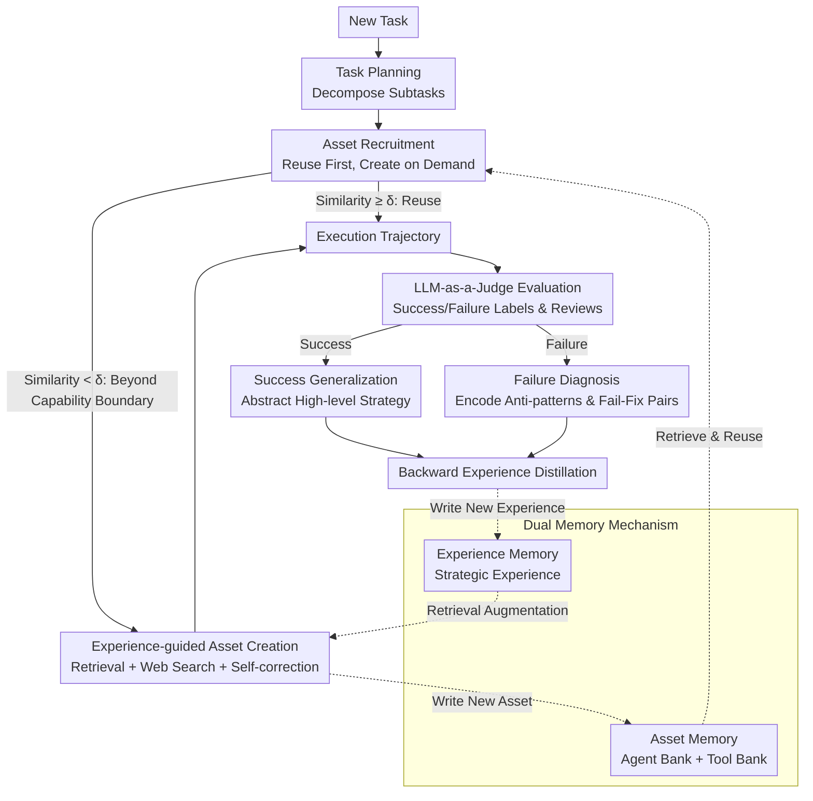

# Mem²Evolve: Towards Self-Evolving Agents via Co-Evolutionary Capability Expansion and Experience Distillation

**Conference**: ACL 2026  
**arXiv**: [2604.10923](https://arxiv.org/abs/2604.10923)  
**Code**: [https://buaa-irip-llm.github.io/Mem2Evolve](https://buaa-irip-llm.github.io/Mem2Evolve)  
**Area**: Model Compression  
**Keywords**: Self-evolving Agent, Dual Memory Mechanism, Capability Expansion, Experience Distillation, Co-evolution

## TL;DR
This paper proposes Mem²Evolve, a self-evolving agent framework that achieves co-evolution of capability expansion and experience distillation through a dual memory mechanism (Asset Memory + Experience Memory). It achieves an average Pass@1 of 70.24% across 8 benchmarks in 6 task categories, outperforming the strongest experience-centric and capability-centric baselines by 11.80% and 6.46%, respectively.

## Background & Motivation

**Background**: LLM Agents are evolving from static, task-specific systems toward self-evolving systems capable of leveraging past experiences and autonomously expanding their capabilities. Current self-evolution frameworks primarily follow two paradigms: experience-centric evolution (optimizing execution strategies, prompts, or building experience pools) and capability-centric evolution (expanding capability boundaries by dynamically creating new tools or expert agents).

**Limitations of Prior Work**: Existing frameworks treat these two evolutionary processes in isolation. Experience-centric evolution is limited by predefined static toolsets and cannot handle tasks beyond existing capability boundaries. Capability-centric evolution creates new assets from scratch without empirical guidance, failing to leverage verified strategies or avoid known pitfalls, which leads to irreproducible successes and repetitive errors.

**Key Challenge**: Capability expansion and experience accumulation are inherently interdependent—new capabilities enable agents to complete more tasks and gain more experience, while experience guides better capability expansion. However, existing methods overlook this intrinsic synergy.

**Goal**: To design a self-evolving agent framework that unifies capability expansion and experience distillation within the same evolutionary loop to achieve co-evolution.

**Key Insight**: Inspired by Piaget's equilibration theory—where intelligence evolves through the interaction of assimilation (integrating new experiences) and accommodation (adjusting internal structures)—the agent's evolution is analogized to a cognitive development process.

**Core Idea**: Implement the co-evolution of capabilities and experience through a dual memory mechanism (Asset Memory for reusable capabilities and Experience Memory for strategic experiences) within a cycle of forward reasoning and backward evolution.

## Method

### Overall Architecture
Mem²Evolve decomposes self-evolution into a closed loop of "forward reasoning + backward evolution." Faced with a new task, the agent first performs task planning, then recruits expert agents and tools from asset memory using a "reuse first, create on demand" approach (forward reasoning). After task completion, an LLM-as-a-Judge evaluates the trajectory. High-quality new assets are consolidated into asset memory, while success/failure experiences are distilled into experience memory (backward evolution). Both memory banks are synchronized after each task, allowing capability boundaries and strategic experience to grow together in the same loop.

### Key Designs

**1. Dual Memory Mechanism: Separate Storage and Mutual Support**

Experience-centric frameworks are limited by fixed toolsets, while capability-centric frameworks create assets blindly without experience. Mem²Evolve bridges these paths using two types of memory. Asset Memory $\mathcal{M}_A = \mathcal{B}_{agt} \cup \mathcal{B}_{tool}$ handles "Capability": Agent Bank stores roles, expertise, and strategies, while Tool Bank stores MCP-compliant tools (code, docs). Experience Memory $\mathcal{M}_E = \mathcal{E}_{agt} \cup \mathcal{E}_{tool}$ handles "Knowledge": strategic experiences distilled from past successes and failures, including application scenarios and core knowledge.

The complementarity of these two is the fulcrum of the framework—capability expansion without experience is blind, and experience accumulation without capability expansion is capped by fixed tools.

**2. Experience-guided Asset Creation: Building Tools on Verified Experience**

When a subtask's similarity to asset memory is below threshold $\delta$, the agent identifies it as beyond boundaries and triggers creation. Unlike creating from scratch, tool generation is augmented by both past experience and real-time retrieval: $m_{tool}^{new} \sim \pi_\theta(s_i \mid \text{Retrieve}(s_i, \mathcal{E}_{tool}), \text{Web}(s_i))$. After generation, a Self-Correction Loop is performed: the LLM synthesizes test cases from reviews, and only assets passing all tests are stored.

This "Experience + Web + Self-test" guardrail increased the first-pass success rate from 53.1% to 72.4% (a 36.3% relative improvement) and reduced the average debugging iterations from 1.01 to 0.48.

**3. Backward Experience Distillation: Extracting Transferable Knowledge**

Once a task is finished, the LLM-as-a-Judge evaluates execution quality. Based on the result, two distillation paths are taken: Success Generalization abstracts effective practices into high-level guidelines, while Failure Diagnosis encodes pitfalls into anti-patterns and failure-fix pairs. Distilled experiences are then merged: $\mathcal{M}_E \leftarrow \mathcal{M}_E \cup \{e_{\text{new}}\}$.

Distilling from both signals helps the agent replicate effective strategies and avoid known traps, converging both "accidental success" and "repetitive errors."

### A Full Example
Taking a GAIA task requiring parsing a specific file format: in the forward phase, task planning identifies a "parse file" subtask. Its similarity is below $\delta$, triggering experience-guided tool creation. The agent retrieves relevant parsing experience from $\mathcal{E}_{tool}$, uses web search to write the tool code, and adds it to the Tool Bank after passing the self-correction loop. In the backward phase, if the task succeeds, Success Generalization extracts a guideline like "validate headers before chunked parsing" into $\mathcal{M}_E$. For future similar tasks, the tool is reused and the experience is retrieved directly.

### Loss & Training
This is an inference-time framework and does not involve model parameter training. Asset recruitment relies on embedding similarity (threshold $\delta$), and task evaluation relies on LLM-as-a-Judge. All baselines and Mem²Evolve use GPT-5-chat as the backbone LLM.

## Key Experimental Results

### Main Results

| Method | GAIA Total | ALFWorld | HotpotQA | AIME24 | AIME25 | Average |
|--------|------------|----------|----------|--------|--------|---------|
| GPT-5 (ReAct) | 18.47 | 86.87 | 41.40 | 66.67 | 60.00 | 48.27 |
| AFLOW (Exp-Centric) | 19.75 | 93.40 | 60.80 | 66.67 | 63.33 | 58.44 |
| Alita (Cap-Centric) | 72.73 | 86.13 | 58.80 | 70.00 | 66.67 | 63.78 |
| Mem²Evolve | **76.31** | **94.31** | **60.80** | **76.70** | **73.33** | **70.24** |

### Ablation Study

| Configuration | Average Pass@1 | Decline |
|---------------|----------------|---------|
| Full Mem²Evolve | 70.24 | – |
| w/o Tool Creation | 59.96 | ↓10.28 |
| w/o Agent Memory | 65.51 | ↓4.73 |
| w/o Tool Memory | 67.11 | ↓3.13 |
| w/o Expert Agent Creation | 68.52 | ↓1.72 |

### Key Findings
- Dynamic tool creation is the most critical component (10.28% drop if removed), indicating that expanding toolsets is vital for complex tasks.
- Experience guidance improved the first-pass success rate of tool creation from 53.1% to 72.4%, with debugging iterations reduced by more than half.
- Cross-task initialization (using GAIA memory for other tasks) consistently improved performance, close to 25% of same-task initialization, proving memory transferability.
- On GAIA, Mem²Evolve reached 76.31% Pass@1, second only to OpenAI DeepResearch's 67.36% (a proprietary system), showing significant potential.

## Highlights & Insights
- The co-evolutionary paradigm of dual memory is the primary contribution—unifying "assimilation" (experience accumulation) and "accommodation" (capability adjustment) in one framework.
- The "Reuse first, Create on demand" strategy is highly practical. Using the similarity threshold $\delta$ avoids unnecessary overhead while allowing on-the-fly expansion.
- Cross-task memory transfer results are impressive: memory accumulated from GAIA improved performance on HotpotQA and AIME without negative transfer, suggesting distilled experience is abstract and general.

## Limitations & Future Work
- Dependency on sandbox environments for executing generated code limits deployment in open-world environments requiring local file systems or unrestricted network access.
- Continuous growth of memory banks may lead to retrieval efficiency and noise issues; long-term memory management (forgetting, compression) is not discussed.
- Evaluation reliability of LLM-as-a-Judge without ground-truth labels may affect the quality of backward evolution.
- Tool creation quality is bounded by the LLM's code generation abilities; complex tools may require more iterations.

## Related Work & Insights
- **vs Alita (Qiu et al., 2025)**: Alita supports dynamic tool creation but lacks experience guidance. Mem²Evolve adds experience-guided creation and distillation, improving average performance by 6.46%.
- **vs AFLOW (Zhang et al., 2025)**: AFLOW optimizes module combinations through search but is limited by fixed tools. Mem²Evolve expands toolsets while accumulating experience, improving average performance by 11.80%.

## Rating
- Novelty: ⭐⭐⭐⭐ Proposed the first co-evolutionary paradigm for capability and experience.
- Experimental Thoroughness: ⭐⭐⭐⭐⭐ Covers 8 benchmarks over 6 task types; comprehensive ablation and transfer analysis.
- Writing Quality: ⭐⭐⭐⭐ Clear diagrams and insightful theoretical analogies.
- Value: ⭐⭐⭐⭐ Provides a practical framework for building general self-evolving agents.

<!-- RELATED:START -->

## Related Papers

- [\[ICML 2026\] EvolveR: Self-Evolving LLM Agents through an Experience-Driven Lifecycle](../../ICML2026/llm_agent/evolver_self-evolving_llm_agents_through_an_experience-driven_lifecycle.md)
- [\[ACL 2026\] ExpSeek: Self-Triggered Experience Seeking for Web Agents](expseek_self-triggered_experience_seeking_for_web_agents.md)
- [\[ICLR 2026\] Your Agent May Misevolve: Emergent Risks in Self-evolving LLM Agents](../../ICLR2026/llm_agent/your_agent_may_misevolve_emergent_risks_in_self-evolving_llm_agents.md)
- [\[ACL 2026\] HeLa-Mem: Hebbian Learning and Associative Memory for LLM Agents](hela-mem_hebbian_learning_and_associative_memory_for_llm_agents.md)
- [\[ACL 2026\] SEARL: Joint Optimization of Policy and Tool Graph Memory for Self-Evolving Agents](searl_joint_optimization_of_policy_and_tool_graph_memory_for_self-evolving_agent.md)

<!-- RELATED:END -->
