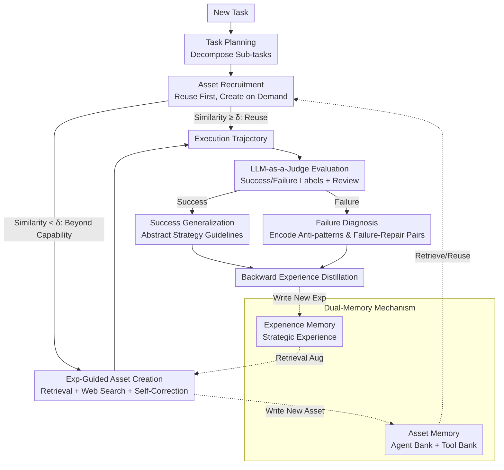

# Mem²Evolve: Towards Self-Evolving Agents via Co-Evolutionary Capability Expansion and Experience Distillation

**Conference**: ACL 2026  
**arXiv**: [2604.10923](https://arxiv.org/abs/2604.10923)  
**Code**: [https://buaa-irip-llm.github.io/Mem2Evolve](https://buaa-irip-llm.github.io/Mem2Evolve)  
**Area**: Model Compression  
**Keywords**: Self-evolving Agent, Dual-memory Mechanism, Capability Expansion, Experience Distillation, Co-evolution

## TL;DR
Ours proposes Mem²Evolve, a self-evolving agent framework that achieves co-evolution of capability expansion and experience distillation through a dual-memory mechanism (Asset Memory + Experience Memory). It achieves an average Pass@1 of 70.24% across 8 benchmarks in 6 task categories, outperforming the strongest experience-centric and capability-centric baselines by 11.80% and 6.46%, respectively.

## Background & Motivation

**Background**: LLM Agents are evolving from static, task-specific systems to self-evolving systems capable of utilizing past experiences and autonomously expanding their capabilities. Current self-evolving frameworks primarily follow two paradigms: experience-centric evolution (optimizing execution strategies, prompts, or building experience pools) and capability-centric evolution (expanding capability boundaries by dynamically creating new tools or expert agents).

**Limitations of Prior Work**: These two evolutionary processes are treated separately by existing frameworks. Experience-centric evolution is limited by predefined static toolsets, unable to handle tasks beyond existing capability boundaries. Capability-centric evolution creates new assets from scratch without empirical guidance, failing to leverage verified strategies or avoid known pitfalls, leading to non-reproducible success and repetitive errors.

**Key Challenge**: Capability expansion and experience accumulation are inherently interdependent—new capabilities enable agents to complete more tasks and thus gain more experience, while experience guides better capability expansion—but existing methods ignore this intrinsic collaborative relationship.

**Goal**: Design a self-evolving agent framework that unifies capability expansion and experience distillation within the same evolutionary loop to achieve co-evolution.

**Key Insight**: Inspired by Piaget’s equilibration theory—where intelligence evolves through the interaction of assimilation (integrating new experiences) and accommodation (adjusting internal structures)—agent evolution is analogized to a cognitive development process.

**Core Idea**: Through a dual-memory mechanism (Asset Memory for storing reusable capabilities and Experience Memory for storing strategic experience), co-evolution of capabilities and experience is realized in a cycle of forward reasoning and backward evolution.

## Method

### Overall Architecture
Mem²Evolve decomposes self-evolution into a "forward reasoning + backward evolution" closed loop. Facing a new task, the agent first performs task planning and then recruits expert agents and tools from asset memory following a "reuse first, create on demand" policy (forward). After task completion, an LLM-as-a-Judge evaluates the trajectory, depositing high-quality new assets into Asset Memory and distilling success/failure experiences into Experience Memory (backward). Both memory banks are synchronized after each task, allowing capability boundaries and strategic experience to grow collaboratively within the same cycle rather than being optimized in isolation.

### Key Designs

**1. Dual-Memory Mechanism: Separate Storage and Mutual Support for Capabilities and Experience**

Pure experience-centric frameworks are limited by fixed toolsets, while pure capability-centric frameworks blindly create assets without experience. Mem²Evolve stitches these lines together using two types of memory. Asset Memory $\mathcal{M}_A = \mathcal{B}_{agt} \cup \mathcal{B}_{tool}$ manages "Capability": Agent Bank stores roles, expertise, and strategies, while Tool Bank stores MCP-compliant executable tools. Experience Memory $\mathcal{M}_E = \mathcal{E}_{agt} \cup \mathcal{E}_{tool}$ manages "Knowledge": strategic experience distilled from past outcomes, including applicability scenarios and core knowledge.

The complementary relationship between the two is the fulcrum of the framework—capability expansion without experience guidance is blind, and experience accumulation without capability expansion is capped by fixed tools.

**2. Experience-Guided Asset Creation: Building Tools on Verified Experience**

When a sub-task similarity to Asset Memory is below threshold $\delta$, the agent identifies it as beyond current boundaries and triggers creation. Unlike creating from scratch, tool generation is augmented by past experience and real-time retrieval: $m_{tool}^{new} \sim \pi_\theta(s_i \mid \text{Retrieve}(s_i, \mathcal{E}_{tool}), \text{Web}(s_i))$. After generation, a Self-Correction Loop is executed: the LLM synthesizes test cases from review comments, and only assets passing all tests are stored.

This "Experience + Web + Self-test" guardrail raised the first-pass success rate from 53.1% to 72.4% (a 36.3% relative Gain) and halved the average debugging iterations from 1.01 to 0.48.

**3. Backward Experience Distillation: Extracting Transferable Knowledge from Trajectories**

Once a task is finished, the LLM-as-a-Judge evaluates execution quality, providing success/failure labels and reviews. Two distillation paths follow: Success Generalization abstracts effective practices into high-level strategy guides; Failure Diagnosis encodes pitfalls into anti-patterns and failure-repair pairs. The distilled experience is then merged: $\mathcal{M}_E \leftarrow \mathcal{M}_E \cup \{e_{\text{new}}\}$.

Key to this is utilizing both success and failure signals—success experiences help the agent replicate effective strategies, while failure experiences help it avoid known traps, converging both "unpredictable accidental success" and "repetitive similar errors."

### Mechanism Example
Using a GAIA task requiring specific file format parsing: in the forward stage, task planning decomposes a "read and parse file" sub-task with similarity $< \delta$, triggering experience-guided tool creation. It retrieves relevant parsing experience from $\mathcal{E}_{tool}$, uses web search to write code, passes the self-correction loop, and completes execution. In the backward stage, the LLM-as-a-Judge determines success; Success Generalization extracts a strategy guide for "header validation before chunked parsing" and writes it to $\mathcal{M}_E$. For the next similar task, the tool is directly reused, and the experience is retrieved, bypassing exploration.

### Loss & Training
Ours is an inference-time framework and does not involve model training. Asset recruitment relies on embedding similarity (threshold $\delta$), and task evaluation relies on LLM-as-a-Judge. GPT-5-chat is used as the backbone LLM for all baselines and Mem²Evolve.

## Key Experimental Results

### Main Results

| Method | GAIA Total | ALFWorld | HotpotQA | AIME24 | AIME25 | Average |
|------|-----------|----------|----------|--------|--------|------|
| GPT-5 (ReAct) | 18.47 | 86.87 | 41.40 | 66.67 | 60.00 | 48.27 |
| AFLOW (Exp-Centric) | 19.75 | 93.40 | 60.80 | 66.67 | 63.33 | 58.44 |
| Alita (Cap-Centric) | 72.73 | 86.13 | 58.80 | 70.00 | 66.67 | 63.78 |
| Mem²Evolve (Ours) | **76.31** | **94.31** | **60.80** | **76.70** | **73.33** | **70.24** |

### Ablation Study

| Configuration | Average Pass@1 | Gain/Drop |
|------|-----------|------|
| Full Mem²Evolve | 70.24 | – |
| w/o Tool Creation | 59.96 | ↓10.28 |
| w/o Agent Memory | 65.51 | ↓4.73 |
| w/o Tool Memory | 67.11 | ↓3.13 |
| w/o Expert Agent Creation | 68.52 | ↓1.72 |

### Key Findings
- Dynamic tool creation is the most critical component (10.28% drop if removed), indicating that expanding toolsets is vital for complex tasks.
- Experience guidance improved the first-pass rate of tool creation from 53.1% to 72.4%, reducing debugging iterations by more than half.
- Cross-task initialization (using GAIA memory for other tasks) consistently improved performance, with effects nearly 25% of same-task initialization, demonstrating good transferability of memory.
- On GAIA, Mem²Evolve reached 76.31% Pass@1, second only to OpenAI DeepResearch's 67.36% (a proprietary system at the time), showing the framework's strong potential.

## Highlights & Insights
- The co-evolutionary paradigm of dual-memory is the primary contribution—inspired by Piaget's theory, it unifies "assimilation" (experience accumulation) and "accommodation" (capability adjustment). This analogy provides both a theoretical foundation and practical value, making the framework's logic highly intuitive.
- The "Reuse first, Create on demand" strategy is highly practical. Using the similarity threshold $\delta$ to automatically determine if a task exceeds capability boundaries avoids unnecessary overhead while allowing immediate expansion when needed.
- Cross-task memory transfer results are impressive: memory accumulated from GAIA data provided gains in completely different tasks like HotpotQA and AIME without negative transfer, suggesting distilled experiences have high abstraction and generality.

## Limitations & Future Work
- The framework relies on sandbox environments for executing auto-generated code, limiting deployment in open-world environments requiring direct local file system or unrestricted network access.
- Continuous growth of asset and experience memories may lead to retrieval efficiency and noise issues; long-term memory management (e.g., forgetting, compression) remains unaddressed.
- Reliability of LLM-as-a-Judge evaluation without ground-truth labels may impact backward evolution quality.
- Quality of tool creation is bounded by the LLM's code generation capability; complex tools may still require significant iterations.

## Related Work & Insights
- **vs Alita (Qiu et al., 2025)**: Alita supports dynamic tool creation but lacks experience guidance. Mem²Evolve adds experience-guided creation and distillation, yielding a 6.46% average performance Gain.
- **vs AFLOW (Zhang et al., 2025)**: AFLOW optimizes module combinations via search but is limited by static toolsets. Mem²Evolve accumulates experience while expanding toolsets, yielding an 11.80% average performance Gain.

## Rating
- Novelty: ⭐⭐⭐⭐ Proposes the first co-evolutionary paradigm for capability expansion and experience distillation with clear theoretical motivation.
- Experimental Thoroughness: ⭐⭐⭐⭐⭐ Comprehensive analysis across 6 task types, 8 benchmarks, and extensive ablation/transfer studies.
- Writing Quality: ⭐⭐⭐⭐ Clear architecture diagrams and an insightful analogy to Piaget's theory.
- Value: ⭐⭐⭐⭐ Provides a practical framework foundation for building general-purpose self-evolving agents.

<!-- RELATED:START -->

## Related Papers

- [\[ICML 2026\] EvolveR: Self-Evolving LLM Agents through an Experience-Driven Lifecycle](../../ICML2026/llm_agent/evolver_self-evolving_llm_agents_through_an_experience-driven_lifecycle.md)
- [\[ACL 2026\] ExpSeek: Self-Triggered Experience Seeking for Web Agents](expseek_self-triggered_experience_seeking_for_web_agents.md)
- [\[ICLR 2026\] Your Agent May Misevolve: Emergent Risks in Self-evolving LLM Agents](../../ICLR2026/llm_agent/your_agent_may_misevolve_emergent_risks_in_self-evolving_llm_agents.md)
- [\[ACL 2026\] SEARL: Joint Optimization of Policy and Tool Graph Memory for Self-Evolving Agents](searl_joint_optimization_of_policy_and_tool_graph_memory_for_self-evolving_agent.md)
- [\[ACL 2026\] HeLa-Mem: Hebbian Learning and Associative Memory for LLM Agents](hela-mem_hebbian_learning_and_associative_memory_for_llm_agents.md)

<!-- RELATED:END -->
