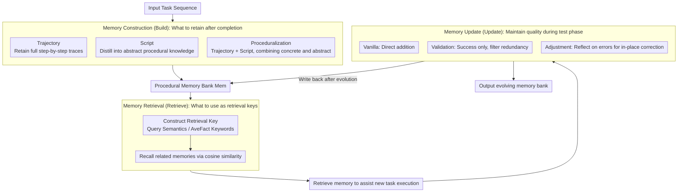

# Mem^p: Exploring Agent Procedural Memory

**Conference**: ACL 2026 Findings  
**arXiv**: [2508.06433](https://arxiv.org/abs/2508.06433)  
**Code**: [GitHub](https://github.com/zjunlp/MemP)  
**Area**: Model Compression  
**Keywords**: Procedural Memory, Agent Learning, Trajectory Distillation, Memory Update, Lifelong Learning

## TL;DR

This paper proposes the Mem^p framework to systematically study how to build learnable, updatable, and lifelong evolving procedural memory for LLM Agents. By distilling past task trajectories into fine-grained step-by-step instructions and high-level script abstractions, combined with a dynamic update mechanism (addition/validation/reflection/elimination), the authors achieve continuous success rate improvements and significant reductions in execution steps on TravelPlanner and ALFWorld.

## Background & Motivation

**Background**: LLM Agents are capable of handling complex multi-step tasks (e.g., Deep Research, GUI operations, long-range tool calls), but the execution process requires dozens of operations and heavy token consumption. Currently, Agents start from scratch each time they face a new task, failing to reuse previously accumulated experience.

**Limitations of Prior Work**: (1) Procedural knowledge in existing Agents is either hard-coded in prompt templates or implicitly hidden in model parameters, making it difficult to update; (2) Frameworks like LangGraph and AutoGPT provide coarse-grained memory abstractions (buffers, rule blocks) but lack systematic optimization for the lifecycle operations of construction, retrieval, patching, and elimination; (3) While works like Voyager and AWM utilize procedural memory, they lack a systematic analysis of different construction/retrieval/update strategies.

**Key Challenge**: Many complex tasks share deep structural similarities. Agents acquire certain procedural knowledge in early tasks but cannot effectively transfer it to subsequent tasks, leading to repetitive exploration and token waste.

**Goal**: (1) Treat procedural memory as a first-class optimization object and systematically explore its construction, retrieval, and update strategies; (2) Enable Agents to distill reusable experience from past trajectories and evolve continuously in new tasks.

**Key Insight**: Inspired by human procedural memory (e.g., riding a bike, typing), humans avoid re-learning by compiling skills into automated subroutines. Analogously, Agents should transform successful trajectories into reusable reasoning patterns and tool sequences.

**Core Idea**: Treat procedural memory as an optimizable knowledge base. Through a tripartite strategy of "trajectory distillation + vector retrieval + dynamic updating," the Agent accumulates and refines experience during continuous task execution.

## Method

### Overall Architecture

Mem^p models Agent interaction as an MDP and extends the policy from $\pi(a_t|s_t)$ to $\pi_{m^p}(a_t|s_t)$ with procedural memory, upgrading memory from implicit parameters/handwritten prompts to a first-class object that can be systematically optimized. The entire workflow follows: "Input task sequence → Build: distill completed trajectories into memory → Retrieve: recall relevant memory by similarity to assist new tasks → Update: dynamically add/delete/modify the memory bank during testing → Output evolving memory bank Mem." Each of the three modules provides multiple replaceable strategies for ablation.

### Key Designs

**1. Memory Construction (Build): Balancing "Concreteness" of Trajectories and "Abstraction" of Scripts**

Construction addresses "what should be stored after task completion," formalized as $m^{p_t} = B(\tau_t, r_t)$. The paper presents three granularities: Trajectory retains the full step-by-step interaction traces; Script uses an LLM to analyze "golden" trajectories and distill them into abstract procedural knowledge; Proceduralization concatenates the full trajectory with high-level scripts, providing both concrete examples and abstract guidance.

The tradeoff between the three reflects a contradiction: trajectories provide precise execution context but poor generalization, while scripts provide abstract guidance but lose details. Proceduralization combines the strengths of both—the script part generalizes better on new test sets, while the trajectory part is more precise for similar tasks—making it the optimal construction method across all models and datasets.

**2. Memory Retrieval (Retrieve): Determining Recall Quality via Key Construction**

When facing a new task, memory is recalled based on similarity. Cosine similarity is written as $m_{retrieved} = \arg\max_{m^{p_i} \in Mem} \frac{\phi(t_{new}) \cdot \phi(t_i)}{\|\phi(t_{new})\| \, \|\phi(t_i)\|}$. Recall accuracy depends on how the key is built. The paper compares three: Random Sample; Query, which uses the description as the key for semantic similarity; and AveFact, which uses an LLM to extract task keywords and calculates average keyword similarity.

In terms of performance, Query captures more appropriate matches through semantic context, while AveFact improves retrieval efficiency by focusing on core task elements. Both significantly outperform random sampling, indicating that the retrieval bottleneck lies not in the similarity operator itself, but in how to construct a key that hits "deep structural similarities."

**3. Memory Update (Update): Maintaining Quality through Reflection and Error Correction rather than Blind Addition**

The memory bank requires continuous maintenance during the test phase, formulated as $M(t+1) = U(M(t), E(t), \tau_t)$, where $U = Add(M_{new}) \ominus Del(M_{obs}) \oplus Update(M_{est})$. The paper compares three levels: Vanilla, which appends after every $t$ tasks; Validation, which keeps only successful trajectories and filters failures or redundancies; and Adjustment, which performs in-place correction by combining the error trajectory with the original memory when retrieved memory leads to failure.

Simple addition leads to memory bloat and quality dilution by noise. The reflection-based Adjustment is most effective; by constantly refining memory through error correction, the Agent approaches linear mastery gains in continuous tasks, achieving +0.7 higher score and 14 fewer steps than the second-best strategy by the final task set.

### Loss & Training

Mem^p is an inference-time framework and does not involve model training. During the construction phase, GPT-4o, Claude-3.5-sonnet, and Qwen2.5-72B are used as backbone models. Retrieval uses text embedding distance for vector similarity.

## Key Experimental Results

### Main Results

**Comparison of Build Strategies (TravelPlanner #CS / ALFWorld Test)**

| Model | Strategy | TravelPlanner #CS↑ | ALFWorld Test↑ | Steps↓ |
|------|------|-------------------|----------------|--------|
| GPT-4o | No Memory | 71.93 | 42.14 | 23.76 |
| GPT-4o | Script | 72.08 | 56.43 | 18.52 |
| GPT-4o | Trajectory | 76.02 | 74.29 | 16.49 |
| GPT-4o | Proceduralization | **79.94** | **77.86** | **15.01** |
| Qwen2.5-72B | No Memory | 56.57 | 41.25 | 21.38 |
| Qwen2.5-72B | Proceduralization | **63.82** | **77.19** | **15.32** |

### Ablation Study

**Comparison of Retrieve Strategies (TravelPlanner, GPT-4o)**

| Retrieval Strategy | #CS↑ | #HC↑ | Steps↓ |
|---------|------|------|--------|
| No Memory | 71.93 | 12.88 | 17.84 |
| Random Sample | 74.59 | 6.72 | 15.12 |
| Key=Query | 73.38 | 8.95 | 15.44 |
| Key=AveFact | **76.02** | 8.25 | **14.64** |

### Key Findings

- Proceduralization (Trajectory + Script) is the optimal strategy across all models and datasets; on ALFWorld, GPT-4o improved from 42.14% to 77.86% (+35.72%).
- The reflective update mechanism outperforms the second-best strategy by +0.7 points and reduces steps by 14 by the final task group, proving that error correction during continuous updates is crucial.
- Procedural memory constructed by a strong model (GPT-4o) still improves task completion by 5% and reduces steps by 1.6 when transferred to a weaker model (Qwen2.5-14B), demonstrating cross-model transferability.
- Performance continues to improve as the number of retrieved memories increases, but excessive retrieval introduces imprecise memories, leading to performance degradation.

## Highlights & Insights

- The idea of treating procedural memory as a first-class optimization object is valuable. Unlike previous fragmented memory enhancement works, Mem^p systematically deconstructs the dimensions of construction, retrieval, and update for ablation.
- Cross-model transferability of memory is an important finding, suggesting that strong models can accumulate experience to "teach" weaker models, acting as a form of knowledge distillation performed at inference time.
- The reflective update strategy yields the best results, echoing research in self-refinement. Refining memory by learning from failures is more effective for Agents than simple accumulation.

## Limitations & Future Work

- Validated only on TravelPlanner and ALFWorld, with limited task diversity.
- Memory retrieval relies on vector similarity, which may fail for tasks that are structurally similar but semantically divergent.
- The update strategy relies only on standard benchmark reward signals and lacks more fine-grained feedback mechanisms.
- Long-term forgetting and capacity limits of memory have not been explored.

## Related Work & Insights

- **vs Voyager/AWM**: These works use procedural memory to enhance Agent capabilities but lack systematic analysis of construction/retrieval/update strategies. Mem^p fills this gap.
- **vs ExpeL**: ExpeL focuses on learning from experience; Mem^p focuses more on structured memory management and lifecycle optimization.
- **vs AutoManual**: AutoManual automatically generates manuals; Mem^p additionally introduces dynamic updating and cross-model transfer capabilities.

## Rating

- Novelty: ⭐⭐⭐⭐ Systematic analysis of procedural memory dimensions is valuable, though individual component designs are relatively straightforward.
- Experimental Thoroughness: ⭐⭐⭐⭐ Three backbone models, two datasets, and multi-dimensional ablations, though task types are limited.
- Writing Quality: ⭐⭐⭐⭐ Clear framework and systematic experimental design, though some descriptions are slightly wordy.
- Value: ⭐⭐⭐⭐ Provides practical design guidelines and empirical references for Agent memory system design.

<!-- RELATED:START -->

## Related Papers

- [\[ACL 2026\] Exploring Reasoning Reward Model for Agents](exploring_reasoning_reward_model_for_agents.md)
- [\[ACL 2026\] HeLa-Mem: Hebbian Learning and Associative Memory for LLM Agents](hela-mem_hebbian_learning_and_associative_memory_for_llm_agents.md)
- [\[NeurIPS 2025\] A-MEM: Agentic Memory for LLM Agents](../../NeurIPS2025/llm_agent/a-mem_agentic_memory_for_llm_agents.md)
- [\[ACL 2026\] From Storage to Experience: A Survey on the Evolution of LLM Agent Memory Mechanisms](from_storage_to_experience_a_survey_on_the_evolution_of_llm_agent_memory_mechani.md)
- [\[ACL 2026\] OCR-Memory: Optical Context Retrieval for Long-Horizon Agent Memory](ocr-memory_optical_context_retrieval_for_long-horizon_agent_memory.md)

<!-- RELATED:END -->
