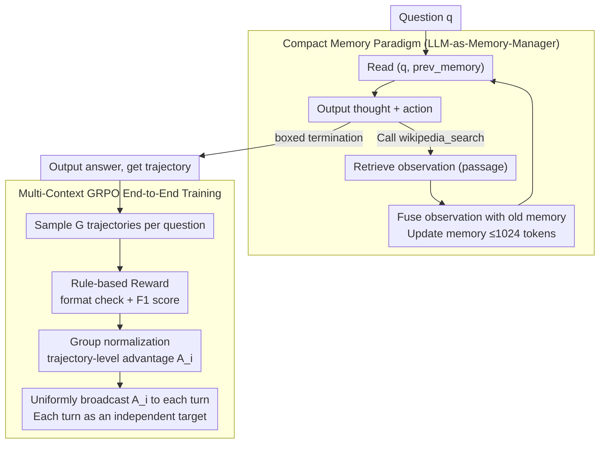

# MemSearcher: Training LLMs to Reason, Search and Manage Memory via End-to-End RL

**Conference**: ACL 2026  
**arXiv**: [2511.02805](https://arxiv.org/abs/2511.02805)  
**Code**: https://github.com/icip-cas/MemSearcher (Available)  
**Area**: LLM Agent / RL / Search Agent  
**Keywords**: Search Agent, Memory Management, GRPO, Multi-Context RL, ReAct Alternative

## TL;DR
MemSearcher replaces the traditional "history concatenation" of search agents with an "LLM-managed compact memory." Each reasoning step only receives `(question, memory)` instead of the full sequence `(question, t₁, a₁, o₁, …)`. By employing multi-context GRPO, it propagates the advantage of the entire trajectory to each step for independent optimization. Across 7 QA benchmarks, MemSearcher 3B/7B/14B consistently outperforms same-sized ReAct baselines—with the 7B model even surpassing the 32B ReSearch—while maintaining a constant context length under 4K tokens.

## Background & Motivation
**Background**: Most LLM-based search agents (Search-R1, ReSearch, AutoRefine, R1-Searcher, etc.) follow the ReAct paradigm. This involves appending each `thought-action-observation` triple to the context to decide the next action. While this is the de facto standard for RL-based search agents and achieves strong multi-hop QA performance when combined with end-to-end training (GRPO/PPO), it has significant drawbacks.

**Limitations of Prior Work**: Cramming all history into the context leads to two fatal issues:
1.  **Linear Context Expansion**: Observation tokens in search agents are typically retrieved passages, which can range from hundreds to thousands of tokens. Over multiple rounds, context easily exceeds 10K, leading to "lost-in-the-middle" effects, performance decay, and GPU memory explosion due to KV cache growth.
2.  **Noise Overwhelming Signals**: Most retrieved passages are irrelevant to the core question. When mixed into history, they make it difficult for the LLM to focus on key facts. For example, as shown in Figure 2 of the paper, ReAct often confuses a character's fictional girlfriend with the actor's real-life partner.

**Key Challenge**: Search agents require multi-turn history for multi-hop reasoning, yet "concatenating everything" is unsustainable for long-horizon tasks. This creates a fundamental tension between reasoning depth and computational context.

**Goal**: (i) Maintain $O(1)$ context length relative to the number of turns $n$; (ii) enable the LLM to learn what to remember and what to discard; (iii) train this capability end-to-end via RL without manual memory state annotations.

**Key Insight**: Instead of adding external modules like RAG, Knowledge Graphs, or structured memory, the authors use a single **backbone LLM to serve as both the reasoning engine and the memory manager**. A single prompt produces the thought and action, and after the observation is returned, the LLM outputs an updated memory. The training difficulty lies in the fact that the input context $c_{i,j} = (q, m_{i,j-1})$ changes at every turn, turning a single trajectory into multiple independent optimization targets. Vanilla GRPO, which calculates one reward for a whole trajectory, cannot be directly applied.

**Core Idea**: (1) Framework: Use natural language memory within `<memory>` tags, where the LLM acts as both actor and memory manager at each turn. (2) Training: Propose multi-context GRPO, where a single trajectory reward is transformed into an advantage $A_i$ and **uniformly propagated** to all turns within that trajectory, treating each turn as an independent optimization target.

## Method

### Overall Architecture
MemSearcher employs the same backbone LLM as a reasoner, actor, and memory manager. Each turn, it receives only `(question, memory)` rather than the full history. The LLM outputs a thought and action to call search tools; once an observation is retrieved, the LLM consolidates it into a natural language `<memory>` block (≤1024 tokens), overwriting the previous state. This continues until a final answer is produced in a `\boxed{}` tag. This process is trained using multi-context GRPO, which broadcasts sparse trajectory rewards to each turn, enabling the model to learn "search-as-you-remember" end-to-end without manual memory labels.

This design reduces context growth from linear to constant, significantly lowering computational costs:

| Method | Context per Turn | FLOPs per Turn | Total FLOPs | GPU Memory |
| :--- | :--- | :--- | :--- | :--- |
| ReAct | $O(n)$ | $O(n)$ | $O(n^2)$ | $O(n)$ |
| **MemSearcher** | $O(1)$ | $O(1)$ | $O(n)$ | $O(1)$ |

### Key Designs

**1. Compact Memory Paradigm (LLM-as-Memory-Manager): Turning the backbone into its own curator**

While ReAct accumulates every `thought-action-observation` into the context, MemSearcher changes the input per turn from $c_i = (q, t_1, a_1, o_1, \ldots)$ to $c_i = (q, m_{i-1})$. A single turn in trajectory $i$ at step $j$ is formatted as $(q, m_{i,j-1}, t_{i,j}, a_{i,j}, o_{i,j}, m_{i,j})$, with thoughts in `<think>`, actions in `<tool_call>`, observations in `<tool_response>`, and memory in `<memory>`. The backbone reads the current memory, decides an action, receives an observation, and then rewrites the memory to incorporate useful information for answering $q$ while retaining relevant details from $m_{i-1}$, keeping the length within 1024 tokens.

Unlike external RTM/KG modules that require separate training or break differentiability, this self-managed memory maintains an end-to-end pipeline using one LLM. Using natural language instead of latent tokens ensures the memory remains interpretable and debuggable.

**2. Multi-Context GRPO: Broadcasting trajectory-level rewards to independent turns**

Self-managed memory creates a "multi-context" problem: each turn in a trajectory has a different input $c_{i,j}$, which treats each turn as a separate prompt-response pair. Standard GRPO, which computes a single ratio for a whole completion, fails here. MemSearcher solves this by sampling $G$ trajectories for a question, calculating a final reward $R_i$ for each, and normalizing these within the group to get a trajectory-level advantage $A_i$. This advantage is then uniformly broadcast to every turn: $A_{i,j} = A_i, \forall j \in [1, n_i]$. Each turn's importance ratio $r_{i,j}(\theta) = \pi_\theta(T_{i,j}|c_{i,j}) / \pi_{\theta_{\text{old}}}(T_{i,j}|c_{i,j})$ is then optimized independently within the GRPO framework. This forces the sparse outcome reward to propagate back through all turns, allowing the model to learn which memory-update strategies led to success.

**3. Reward Design and Training Stability: Rule-based rewards with format warm-up**

The system uses no process supervision, relying purely on rule-based rewards: $R=0$ for incorrect formats, $R=0.1$ for correct formats with F1=0, and $R=F1$ for scores above zero. This 0.1 "bonus" acts as a warm-up, preventing the model from getting stuck with zero signal in early training. Using F1 instead of Exact Match (EM) provides a more fine-grained signal for partially correct answers.

### Loss & Training
Training was performed using the `verl` library with Qwen2.5-3B/7B/14B-Instruct as backbones. Data was sourced from the Search-R1 NQ and HotpotQA training splits. Models were trained for one epoch (batch size 256, 5 rollouts) on H100 clusters. The reward curve shows two phases: a rapid spike in the first 25 steps (learning tools and memory formatting) followed by a gradual increase (learning reasoning strategies).

## Key Experimental Results

### Main Results

**Average EM Score across 7 Benchmarks (Avg.): 3B/7B/14B vs. SOTA baselines**:

| Size | Strongest Baseline | Ours | Gain |
| :--- | :--- | :--- | :--- |
| 3B | AutoRefine-3B-base = 40.5 | **MemSearcher-3B = 43.8** | +3.3 |
| 7B | ReSearch-7B = 43.6 / R1-Searcher-7B = 40.2 | **MemSearcher-7B = 48.9** | +5.3 |
| 14B+ | Search-R1-14B-base = 47.8 / ReSearch-32B = 48.3 | **MemSearcher-14B = 51.7** | +3.4 vs 32B |

**Key Findings**: MemSearcher-3B (43.8) already outperforms all 7B baselines. MemSearcher-7B (48.9) surpasses the 32B ReSearch. This indicates that by reducing context overhead, the model's capacity is directed more effectively toward search-based reasoning.

**Selected Dataset Results**:

| Dataset | Search-R1-7B-base | ReSearch-7B | **MemSearcher-7B** |
| :--- | :--- | :--- | :--- |
| NQ | 48.0 | 40.9 | **52.7** |
| TriviaQA | 63.8 | 63.7 | **68.1** |
| PopQA | 45.7 | 44.6 | 47.8 |
| HotpotQA | 43.3 | 43.5 | **50.8** |
| 2Wiki | 38.2 | 47.6 | 48.6 |
| Musique | 19.6 | 22.3 | **25.8** |
| Bamboogle | 43.2 | 42.4 | **48.8** |

### Ablation Study

**RL Training vs. No Training (Qwen2.5-Instruct base)**:

| Model | w/o Training | w/ MemSearcher RL | Gain |
| :--- | :--- | :--- | :--- |
| Qwen2.5-3B-Instruct | 14.4 | 43.8 | **+29.4** |
| Qwen2.5-7B-Instruct | 25.8 | 48.9 | **+23.1** |
| Qwen2.5-14B-Instruct | 27.7 | 51.7 | **+24.0** |

→ The framework requires RL to "unlock" its potential; zero-shot prompting is insufficient.

**RL vs. SFT (Qwen2.5-3B)**:

| Method | Avg |
| :--- | :--- |
| SFT (using Qwen2.5-72B distilled trajectories) | 28.5 |
| **RL** | **43.8** |

→ SFT using a larger teacher fails to reach the performance of RL (a 15.3 point gap), as the teacher (72B) itself is not optimized for the MemSearcher paradigm. RL allows the model to discover optimal self-management strategies through exploration.

**Memory Length Ablation (256/512/1024/2048 tokens)**:
- Simpler datasets (Bamboogle) saturate at 256 tokens.
- Complex multi-hop tasks (Musique) show continuous improvement up to 1024 tokens.
- 1024 tokens is chosen as the optimal tradeoff.

**Context Length Comparison**: While ReSearch context grows linearly towards 10K+ after 5 turns, MemSearcher stays consistently below 4K tokens, regardless of the number of turns.

## Highlights & Insights
- **"Backbone as Memory Manager" is a minimalist and elegant design**: It eliminates extra modules and preserves end-to-end differentiability. It demonstrates that a single LLM can efficiently juggle reasoning, acting, and memorizing.
- **Multi-Context GRPO is a generalizable algorithm**: The "trajectory-level advantage propagation" concept can be applied to any multi-turn RL scenario where context changes per turn but rewards are sparse (e.g., long-term dialog, multi-step tool use).
- **Constant Context = Deployment Ready**: The largest cost for search agent services is the KV cache of long contexts. MemSearcher reduces this to $O(1)$, making it highly friendly for lower-VRAM GPUs like RTX 4090 or A10.
- **Improved Performance through "Learning to Forget"**: Counter-intuitively, keeping more history is not always better. Selective forgetting and compact summarization dominate cluttered raw histories in search tasks.
- **Capability Density**: 3B models beating 32B baselines proves that paradigm innovation can be more powerful than model scaling in the agentic era.

## Limitations & Future Work
- **Limitations**: (1) The memory mechanism is a simple natural language overwrite; more complex hierarchical or structured memory was not explored. (2) Multi-context GRPO might still exhibit length biases in specific cases. (3) Format rewards might occasionally encourage "format-correct but factual-wrong" output early on.
- **Future Work**: Implementing hierarchical memory (short-term working memory + long-term archival); applying auxiliary rewards for memory quality; and generalizing the multi-context GRPO to dense, turn-level signals.

## Related Work & Insights
- **Comparison with ReAct-based agents**: ReAct agents accumulate history and face context death. MemSearcher breaks the linear constraint and achieves superior performance.
- **Comparison with Real-Web Agents**: MemSearcher on local Wikipedia dumps outperforms agents using real Google search APIs, suggesting that paradigm design provides greater gains than index quality.
- **Insight**: Paradigm shifts often cannot be distilled via SFT from old-paradigm teachers. They require RL exploration to unlock the true potential of the new architecture.

## Rating
- Novelty: ⭐⭐⭐⭐ (Innovative fusion of self-managed memory and broadcasted RL advantages.)
- Experimental Thoroughness: ⭐⭐⭐⭐⭐ (Broad dataset coverage, multiple model sizes, and detailed context cost analysis.)
- Writing Quality: ⭐⭐⭐⭐ (Clear contrast with ReAct paradigms and well-visualized logic.)
- Value: ⭐⭐⭐⭐⭐ (High industrial utility due to context cost reduction and significant performance gains for small models.)

<!-- RELATED:START -->

## Related Papers

- [\[ACL 2026\] StructMem: Structured Memory for Long-Horizon Behavior in LLMs](structmem_structured_memory_for_long-horizon_behavior_in_llms.md)
- [\[NeurIPS 2025\] LC-Opt: Benchmarking Reinforcement Learning and Agentic AI for End-to-End Liquid Cooling Optimization in Data Centers](../../NeurIPS2025/llm_agent/lc-opt_benchmarking_reinforcement_learning_and_agentic_ai_for_end-to-end_liquid_.md)
- [\[ACL 2026\] BAPO: Boundary-Aware Policy Optimization for Reliable Agentic Search](bapo_boundary-aware_policy_optimization_for_reliable_agentic_search.md)
- [\[ACL 2026\] OCR-Memory: Optical Context Retrieval for Long-Horizon Agent Memory](ocr-memory_optical_context_retrieval_for_long-horizon_agent_memory.md)
- [\[ACL 2026\] LiTS: A Modular Framework for LLM Tree Search](lits_a_modular_framework_for_llm_tree_search.md)

<!-- RELATED:END -->
