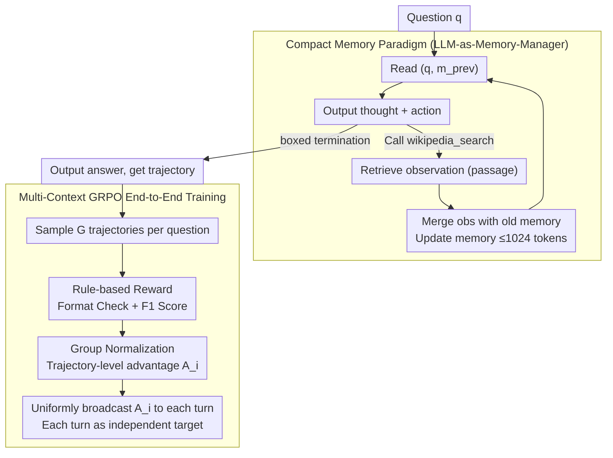

# MemSearcher: Training LLMs to Reason, Search and Manage Memory via End-to-End RL

**Conference**: ACL 2026  
**arXiv**: [2511.02805](https://arxiv.org/abs/2511.02805)  
**Code**: https://github.com/icip-cas/MemSearcher (Available)  
**Area**: LLM Agent / RL / Search Agent  
**Keywords**: Search Agent, Memory Management, GRPO, Multi-Context RL, ReAct Alternative

## TL;DR
MemSearcher replaces the "history concatenation" of search agents with "LLM-managed compact memory"—where only the `(question, memory)` is processed each round instead of `(question, t₁, a₁, o₁, …)`. Utilizing multi-context GRPO, it propagates the advantage of the entire trajectory to each round for independent optimization. MemSearcher outperforms same-sized ReAct baselines across 3B/7B/14B scales on 7 QA benchmarks (the 7B model even surpasses the 32B ReSearch) while maintaining a constant context length of <4K tokens.

## Background & Motivation
**Background**: Most LLM-based search agents (Search-R1, ReSearch, AutoRefine, R1-Searcher, etc.) follow the ReAct paradigm—accumulating `thought-action-observation` into the context to let the LLM decide the next search step. This "dialogue history concatenation" is the de facto standard for RL-based search agents and has achieved strong multi-hop QA performance when combined with end-to-end GRPO/PPO training.

**Limitations of Prior Work**: ReAct's approach of stuffing all history into the context has two fatal issues:
1.  **Linear Context Expansion**: Observation tokens in search agents are retrieved passages, often numbering hundreds to thousands per round. Multi-round execution easily exceeds 10K tokens, leading to "lost-in-the-middle" issues, performance degradation in long contexts, and GPU memory explosion due to KV cache.
2.  **Noise Overpowering Signal**: Most retrieved passages are irrelevant to the question. Mixing them in history makes it difficult for the LLM to focus on key facts; Figure 2 in the paper shows a counterexample where ReAct confuses "a character's girlfriend" with "the actor's real-life partner."

**Key Challenge**: A search agent must see multi-round history for multi-hop reasoning, yet "seeing history = concatenating everything" is unsustainable in long-run scenarios. These two aspects create fundamental tension.

**Goal**: (i) Maintain the context length at $O(1)$ relative to the number of rounds $n$; (ii) enable the LLM to learn "what to remember and what to discard"; (iii) train end-to-end via RL without manual annotation of memory states.

**Key Insight**: Rather than using external RAG/KG/structured memory modules, the authors **let the same backbone LLM serve as both the reasoning engine and memory manager**. A single prompt outputs the thought+action and then outputs the updated memory after the observation returns. The difficulty in training this "self-reflective memory" lies in the fact that the input context $c_{i,j} = (q, m_{i,j-1})$ is different for each round, turning a trajectory into "multiple independent optimization targets," which vanilla GRPO (calculating one reward per trajectory) cannot handle directly.

**Core Idea**: (1) Framework: Use `<memory>` tags for natural language memory, where the LLM acts as both actor and memory manager in each round. (2) Training: Propose multi-context GRPO—calculating one reward per trajectory → one advantage → **uniformly propagating** this advantage to all turns within the trajectory → optimizing each turn as an independent goal.

## Method

### Overall Architecture
MemSearcher enables the backbone LLM to function simultaneously as a reasoner, actor, and memory manager. Each round, only the `(question, memory)` is fed into the model, unlike the full history concatenation in ReAct. The LLM outputs thought+action to call search tools, and then updates a natural language `<memory>` (≤1024 tokens) by integrating the retrieved observation, repeating this cycle until a boxed answer $\boxed{}$ is given. Supporting this is the multi-context GRPO, which broadcasts sparse trajectory-level rewards to each round to optimize this "search-while-remembering" paradigm end-to-end without manual memory annotations.

This design compresses the context length from linear to constant relative to the number of rounds $n$, significantly reducing computational costs:

| Method | Context per Round | FLOPs per Round | Total FLOPs | GPU Memory |
| :--- | :--- | :--- | :--- | :--- |
| ReAct | $O(n)$ | $O(n)$ | $O(n^2)$ | $O(n)$ |
| **Ours** | $O(1)$ | $O(1)$ | $O(n)$ | $O(1)$ |

### Key Designs

**1. LLM-as-Memory-Manager Paradigm: Teaching the backbone what to keep and discard**

ReAct stacks all thought-action-observation into the context, where search observations are often thousand-token passages. MemSearcher changes the context from $c_i = (q, t_1, a_1, o_1, \ldots)$ to $c_i = (q, m_{i-1})$. The $j$-th turn of the $i$-th trajectory is $(q, m_{i,j-1}, t_{i,j}, a_{i,j}, o_{i,j}, m_{i,j})$, with thought in `<think>`, action in `<tool_call>`, observation in `<tool_response>`, and memory in `<memory>`. Each round follows a closed loop: LLM reads $(q, m_{i,j-1})$ → outputs thought+action (call search or boxed termination) → environment returns observation → LLM is called again to merge $(o_{i,j}, m_{i,j-1})$ into a new $m_{i,j}$ (≤1024 tokens) based on instructions to retain useful information.

Unlike external memory (RAG/KG/Mem0) which requires separate retriever training, this self-managed memory requires no extra model, remains end-to-end differentiable, and uses natural language for interpretability.

**2. Multi-Context GRPO: Broadcasting "one reward per trajectory" to independent optimizations**

Self-managed memory presents a training challenge: the context $c_{i,j}=(q, m_{i,j-1})$ changes each turn, effectively splitting one trajectory into multiple independent optimization targets. Since vanilla GRPO only calculates reward for the entire trajectory, the solution is: sample $G$ trajectories for each question $q$, calculate the final reward $R_i$, and derive a trajectory-level advantage $A_i$ via group normalization. This $A_i$ is then uniformly broadcast to all turns: $A_{i,j} = A_i,\ \forall j \in [1, n_i]$. Each turn is treated as an independent target where the objective sums over all $(i,j)$ with importance ratio $r_{i,j}(\theta) = \pi_\theta(T_{i,j}|c_{i,j}) / \pi_{\theta_{\text{old}}}(T_{i,j}|c_{i,j})$. Search observation tokens are masked to stabilize training.

**3. Reward Design and Training Stability: Rule-based rewards with format warm-up**

The process relies entirely on rule-based rewards: format errors receive $R=0$, correct format with F1=0 receives $R=0.1$, and F1>0 yields $R=F1$. The 0.1 format reward serves as a "warm-up bonus" to provide early signals. Using F1 instead of Exact Match (EM) allows partially correct answers to provide gradients.

### Loss & Training
Training uses the `verl` library with Qwen2.5-3B/7B/14B-Instruct as backbones. The knowledge source is a 2018 Wikipedia dump with an E5 retriever. Training data uses the NQ + HotpotQA split from Search-R1. 3B/7B models were trained on 8×H100, and 14B on 2×8×H100 for one epoch. The reward curve shows two stages: a sharp rise in the first 25 steps (learning tools + memory) followed by a slow ascent (refining strategies).

## Key Experimental Results

### Main Results

**Average EM Score (Avg.) on 7 Benchmarks: Ours vs. SOTA Baselines**:

| Scale | Strongest Baseline | Ours | Gain |
| :--- | :--- | :--- | :--- |
| 3B | AutoRefine-3B-base = 40.5 | **MemSearcher-3B = 43.8** | +3.3 |
| 7B | ReSearch-7B = 43.6 / R1-Searcher-7B = 40.2 | **MemSearcher-7B = 48.9** | +5.3 |
| 14B+ | Search-R1-14B-base = 47.8 / ReSearch-32B = 48.3 | **MemSearcher-14B = 51.7** | +3.4 vs 32B |

**Key Findings**: MemSearcher-3B (43.8) already exceeds all 7B baselines. MemSearcher-7B (48.9) outperforms the 32B ReSearch. This indicates that saving context length allows the model to dedicate more capacity to reasoning.

### Ablation Study

**RL training vs. No training (Qwen2.5-Instruct base)**:
The framework requires RL to unlock its potential; pure prompting is insufficient, with performance gains exceeding +20.0 EM across all scales.

**RL vs. SFT (Qwen2.5-3B)**:
SFT on trajectories distilled from Qwen2.5-72B yielded only 28.5 (vs. 43.8 for RL). Since the 72B teacher had not mastered the MemSearcher paradigm, it was an ineffective teacher, highlighting the necessity of RL exploration.

**Memory Length Ablation (256 - 2048 tokens)**:
Simple datasets (e.g., Bamboogle) saturate at 256 tokens, while complex multi-hop tasks (e.g., Musique) benefit from 1024 tokens. 1024 tokens is the engineered sweet spot.

**Context Length Comparison**: MemSearcher maintains an average context <4K tokens across rounds (near-horizontal line), whereas ReSearch grows linearly, exceeding 10K after 5 turns.

## Highlights & Insights
- **"Backbone as Memory Manager" is a minimalist design**: It eliminates extra modules and preserves end-to-end trainability while maintaining interpretability through natural language.
- **Multi-Context GRPO is a general algorithmic contribution**: It is applicable to any multi-turn RL scenario where each turn has a different context but share a trajectory-level sparse reward (e.g., tool use, multi-turn dialogue).
- **Constant Context for Industrial Deployment**: By reducing context complexity to $O(1)$, MemSearcher drastically lowers the KV cache cost, making it friendly for consumer-grade GPUs like the 4090.
- **Improved Performance through Selective Forgetting**: Conventional intuition suggests "more context = better," but MemSearcher proves that selective forgetting in a compact memory dominates a cluttered history in search tasks.
- **Capability Density**: The fact that a 3B model outperforms a 7B baseline and a 7B model outperforms a 32B model suggests that paradigm innovation can substitute for model scaling.

## Limitations & Future Work
- **Destructive Overwriting**: The current memory mechanism uses a simple overwrite, which lacks a long-term archival mechanism and may lose early information in extremely long tasks.
- **Static Knowledge Source**: Experiments were conducted on a 2018 Wikipedia dump; real-world web search performance is unverified.
- **Implicit Memory Reward**: There is no explicit reward for memory quality; it relies entirely on the final answer's signal.
- **Future Directions**: Exploring hierarchical memory (short-term working memory + long-term archival) and adaptive memory lengths.

## Related Work & Insights
- **vs. ReAct / Search-R1 / ReSearch**: These models stack history linearly; MemSearcher achieves $O(1)$ context and superior performance.
- **vs. MEM1 / MemAgent**: This is the first work to combine memory management with end-to-end RL using multi-context GRPO.
- **Insight**: New paradigms must be trained via RL exploration rather than imitation (SFT) because existing large models (potential teachers) have not mastered these new interaction patterns.

## Rating
- Novelty: ⭐⭐⭐⭐ (Combination of memory-managed search and multi-context GRPO).
- Experimental Thoroughness: ⭐⭐⭐⭐⭐ (Tested across 7 datasets, 3 model sizes, and compared against 8 baselines).
- Writing Quality: ⭐⭐⭐⭐ (Clear comparisons and rigorous formulations).
- Value: ⭐⭐⭐⭐⭐ (Open code, deployment-friendly, and significant capacity density improvements).

<!-- RELATED:START -->

## Related Papers

- [\[ICLR 2026\] Unlocking Long-Horizon Agentic Search with Large-Scale End-to-End RL](../../ICLR2026/llm_agent/unlocking_long-horizon_agentic_search_with_large-scale_end-to-end_rl.md)
- [\[ACL 2026\] StructMem: Structured Memory for Long-Horizon Behavior in LLMs](structmem_structured_memory_for_long-horizon_behavior_in_llms.md)
- [\[ACL 2026\] BAPO: Boundary-Aware Policy Optimization for Reliable Agentic Search](bapo_boundary-aware_policy_optimization_for_reliable_agentic_search.md)
- [\[ACL 2026\] Topology Matters: Measuring Memory Leakage in Multi-Agent LLMs](topology_matters_measuring_memory_leakage_in_multi-agent_llms.md)
- [\[ICLR 2026\] Look Back to Reason Forward: Revisitable Memory for Long-Context LLM Agents](../../ICLR2026/llm_agent/look_back_to_reason_forward_revisitable_memory_for_long-context_llm_agents.md)

<!-- RELATED:END -->
