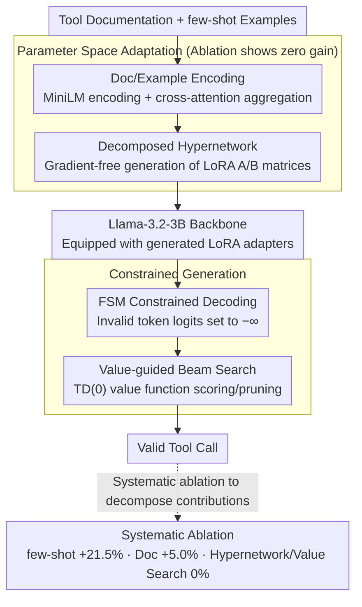

# Meta-Tool: Efficient Few-Shot Tool Adaptation for Small Language Models

**Conference**: ACL 2026 Findings  
**arXiv**: [2604.20148](https://arxiv.org/abs/2604.20148)  
**Code**: [GitHub](https://github.com/techsachinkr/Meta-Tool)  
**Area**: Model Compression  
**Keywords**: Small language models, tool use, few-shot adaptation, hypernetwork, negative results

## TL;DR
Through a systematic comparison of hypernetwork LoRA adaptation vs. carefully designed few-shot prompting across four benchmarks, it was found that a 228-million-parameter hypernetwork provides zero gain—few-shot examples contribute +21.5%, document encoding contributes +5.0%, and the hypernetwork contributes 0%. A 3B model with effective prompting achieves 79.7% of average GPT-5 performance with 10x lower latency.

## Background & Motivation

**Background**: Tool-augmented LLM Agents are a current research focus, but an "adaptation bottleneck" exists: frontier models (e.g., GPT-5) possess strong tool-calling capabilities but suffer from high latency and cost, while small language models (SLMs) are efficient but lack procedural knowledge for specific tools. Prevailing adaptation strategies are polarized—ICL is flexible but limited by context windows, while SFT is effective but requires massive labeled data and retraining when APIs change.

**Limitations of Prior Work**: Hypernetworks have demonstrated rapid adaptation in other NLP tasks—generating LoRA adapter weights from task descriptions for "instant fine-tuning." A natural question arises: can hypernetworks provide additional gains over few-shot prompting for tool-use scenarios?

**Key Challenge**: Which is the true driver of tool-use performance: complex parameter-space adaptation mechanisms (hypernetworks) or simple in-context learning (few-shot + documentation)?

**Goal**: Systematically answer "what drives tool-use performance in small models" through rigorous controlled experiments.

**Key Insight**: Design four progressively complex adaptation mechanisms (few-shot, document encoding, hypernetwork LoRA, value-guided beam search) to perform a comprehensive ablation across four benchmarks covering different tool modalities.

**Core Idea**: A well-validated **negative result**—hypernetworks are ineffective for tool use because few-shot examples and structured documentation already fully specify the task, rendered parameter updates redundant. This shifts practitioner attention from complex adaptation architectures back to prompt engineering and example selection.

## Method

### Overall Architecture
Using Llama-3.2-3B-Instruct as a unified backbone, the process of "how a small model learns to call tools" is decomposed into four layered adaptation mechanisms, which are then disassembled via controlled experiments to identify the actual drivers. The input consists of tool documentation and several few-shot examples. The model processes these through document/example encoding, hypernetwork LoRA generation, FSM constrained decoding, and value-guided beam search to output schema-compliant tool calls. The design aims to quantify the contribution of each component rather than just building a stronger system.

### Key Designs

**1. Decomposed Hypernetwork: Making "Instant Fine-tuning" Runnable on Consumer GPUs**

The hypernetwork enables gradient-free adaptation—generating LoRA adapter weights directly from tool documentation and examples, avoiding per-task retraining. The pipeline has three steps: encoding documentation into $v_{doc}$ using MiniLM, aggregating examples into a prototype vector $v_{proto}$ via cross-attention, projecting the concatenated representation into a hidden space using a shared MLP with learnable embeddings for the first 7 layers' q/k/v projections, and finally generating LoRA A/B matrices through secondary low-rank decomposition. This decomposition reduces memory complexity from $O(L \cdot d \cdot r)$ to $O(L \cdot d \cdot \text{factor})$, allowing the 227.8M parameter hypernetwork to be trained within 24GB of VRAM. This sophisticated design was ultimately proven redundant by experiments, but its "completeness" ensures the credibility of the negative conclusion—failure was not due to a weak hypernetwork implementation.

**2. FSM Constrained Decoding: Offloading Grammatical Correctness from the Model**

Tool calls require strictly valid JSON, and grammatical errors are a high-frequency source of failure for 3B models. Each tool schema is compiled into a regex-driven Finite State Machine (FSM). During decoding, logits for tokens that would violate the current FSM state are set to negative infinity, preventing the sampling of illegal branches. This results in 100% compliance with JSON syntax and type constraints. The significance lies in responsibility separation: deterministic syntax checking is handled by the FSM, allowing the neural network to focus solely on the semantic level of "which tool to call and with what parameters."

**3. Value-guided Beam Search: Adding Functional Correctness Scoring**

FSMs ensure valid syntax but cannot prevent "syntactically correct but functionally wrong" calls. A value function $V_\phi(s)$, learned via TD(0) from synthetic data generated through a schema perturbation pipeline (value replacement, boundary testing, parameter deletion), estimates the success probability of intermediate states. During inference, value function scores and LLM log-likelihoods are combined in beam search to prune candidates that are syntactically valid but functionally hopeless. This is the final and heaviest layer of the adaptation mechanisms—yet ablation showed it, like the hypernetwork, provided no measurable gain.

**4. Systematic Ablation: Supporting "Ineffectiveness" Conclusions with Controlled Variables**

Proving a method is "useless" requires cleaner experimental design than proving one is "useful." Four cross-configurations decompose contributions: 0-shot/no-doc (lower bound), 0-shot+doc (quantifies documentation contribution), 5-shot/no-doc (quantifies example contribution), and 5-shot+doc (full configuration). Sensitivity curves for 0–5 shots and noise robustness tests were added. This isolated design allowed for the decomposition: few-shot examples contribute +21.5%, documentation +5.0%, and hypernetworks 0%.

### Loss & Training
The value function $V_\phi$ is learned using TD(0) on synthetic trajectories (see original Appendix G for losses). Hypernetwork-generated LoRA is gradient-free at inference; training costs are concentrated on the value function and hypernetwork themselves. The base model is loaded with 4-bit quantization (NF4) to meet low-latency deployment goals.

## Key Experimental Results

### Main Results (Execution Success Rate %)

| Model | Gorilla | Spider 2.0 | WebArena | InterCode | Average | Latency (ms) |
|------|---------|-----------|----------|-----------|------|---------|
| GPT-5 (few-shot) | 38.0 | 72.0 | 54.0 | 72.0 | 59.0 | ~16,490 |
| AgentLM-7B | 8.0 | 44.0 | 8.0 | 40.0 | 25.0 | ~8,880 |
| Llama-3.2-3B | 34.0 | 62.0 | 28.0 | 44.0 | 42.0 | ~1,621 |
| **Meta-Tool (3B)** | **38.0** | **64.0** | **32.0** | **54.0** | **47.0** | **~1,576** |

### Ablation Study

| Configuration | Gorilla | Spider 2.0 | WebArena | InterCode | Average |
|------|---------|-----------|----------|-----------|------|
| 0-shot + No Doc | 0.0 | 4.0 | 0.0 | 10.0 | 3.5 |
| 0-shot + Doc | 2.0 | 24.0 | 26.0 | 50.0 | 25.5 |
| 5-shot + No Doc | 34.0 | 62.0 | 28.0 | 44.0 | 42.0 |
| **5-shot + Doc** | **38.0** | **64.0** | **32.0** | **54.0** | **47.0** |
| + Hypernetwork LoRA | 38.0 | 64.0 | 32.0 | 54.0 | **47.0 (Zero change)** |

### Key Findings
- **Hypernetwork contribution is exactly 0%**: Enabling/disabling the hypernetwork yielded identical results across all four benchmarks, despite the generation of non-trivial weight matrices.
- **Few-shot examples are the primary driver**: Contributing +21.5 percentage points.
- **1-shot provides most of the gain**: The transition from 0→1 shot improved performance by +8 pp on average, with peaks in Spider 2.0 (+20 pp) and Gorilla (+22 pp).
- **Error analysis shows semantic reasoning as the bottleneck**: Of 722 failure cases, residual errors in schema-heavy tasks were almost entirely semantic errors.
- **The 3B model achieves 79.7% of GPT-5 performance with 10x lower latency.**

## Highlights & Insights
- **High-quality negative results** are the primary contribution: The paper shows that "seemingly plausible methods actually do not work" rather than just claiming a method is better. This provides significant value to the community by preventing redundant efforts.
- **"Few-shot examples fully specify the tool-use task"**: For structured output tasks like tool calling, a few correct input-output examples provide all the information the model needs; additional parameter-space adaptation is redundant.
- **Direct deployment guidance**: Practitioners do not need complex meta-learning architectures; focus should remain on curating high-quality few-shot examples and structured documentation, significantly simplifying engineering.

## Limitations & Future Work
- Validated on only one 3B model; conclusions might vary with model scale.
- The test set of 50 samples per benchmark is small, potentially affecting statistical power.
- The hypernetwork architecture design itself may not be optimal; negative results could be implementation-specific.
- Multi-turn tool-use scenarios were not tested.
- Future work could explore if specific sub-scenarios (e.g., extremely low-resource or highly dynamic APIs) exist where hypernetworks become effective.

## Related Work & Insights
- **vs. Gorilla/ToolLLM**: These use large-scale fine-tuning but fail with dynamic APIs. Meta-Tool indicates few-shot ICL is a more flexible alternative.
- **vs. JTPRO**: JTPRO optimizes prompts and descriptions; Meta-Tool's findings support the effectiveness of text-level (rather than parameter-level) optimization.
- **vs. HyperLoRA/Zhyper**: While effective for other NLP tasks, hypernetworks fail here, likely because tool use is more focused on structured pattern matching.

## Rating
- Novelty: ⭐⭐⭐⭐ Negative results have significant value; rigorous experimental design, though no new "method" is proposed.
- Experimental Thoroughness: ⭐⭐⭐⭐ Four benchmarks, full ablation, sensitivity, and noise analysis, though sample sizes are relatively small.
- Writing Quality: ⭐⭐⭐⭐⭐ Clear logical structure; effective presentation of negative results.
- Value: ⭐⭐⭐⭐ Direct guidance for the tool-use community, potentially saving significant R&D effort.

<!-- RELATED:START -->

## Related Papers

- [\[ACL 2026\] Don't Adapt Small Language Models for Tools; Adapt Tool Schemas to the Models](don39t_adapt_small_language_models_for_tools_adapt_tool_schemas_to_the_models.md)
- [\[ACL 2025\] Adaptive Tool Use in Large Language Models with Meta-Cognition Trigger](../../ACL2025/llm_agent/meco_metacognition_tool_use.md)
- [\[ACL 2026\] Lightweight LLM Agent Memory with Small Language Models](lightweight_llm_agent_memory_with_small_language_models.md)
- [\[ACL 2026\] ImplicitMemBench: Measuring Unconscious Behavioral Adaptation in Large Language Models](implicitmembench_measuring_unconscious_behavioral_adaptation_in_large_language_m.md)
- [\[ACL 2026\] FAMA: Failure-Aware Meta-Agentic Framework for Open-Source LLMs in Interactive Tool Use Environments](fama_failure-aware_meta-agentic_framework_for_open-source_llms_in_interactive_to.md)

<!-- RELATED:END -->
