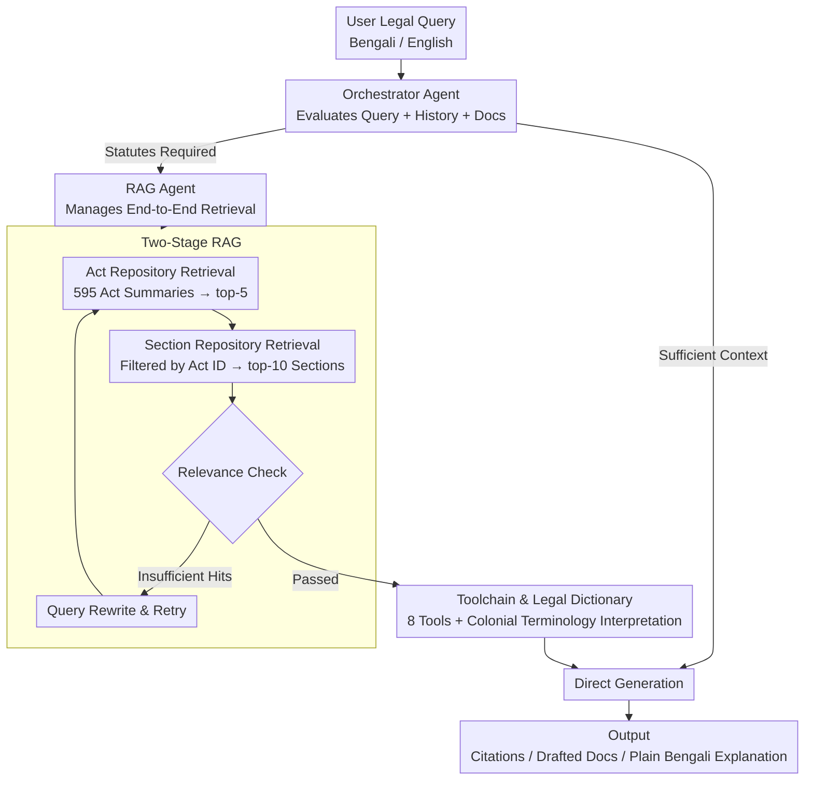

# Mina: A Multilingual LLM-Powered Legal Assistant Agent for Bangladesh

**Conference**: ACL 2026 Findings  
**arXiv**: [2511.08605](https://arxiv.org/abs/2511.08605)  
**Code**: [GitHub](https://github.com/)  
**Area**: LLM Agent / Legal NLP  
**Keywords**: Legal Assistant, Multilingual Agent, RAG, Bangladesh Law, Low-resource Languages

## TL;DR
Mina is developed as a multilingual LLM legal assistant specifically for Bangladesh's legal landscape. By utilizing a two-stage RAG pipeline to accurately retrieve acts and sections, combined with a toolchain and multilingual embeddings, it achieved a $75\text{--}80\%$ passing rate in the Bangladesh Bar Council MCQ exams. The operational cost of legal consultation is reduced to only $0.12\text{--}0.61\%$ of traditional methods.

## Background & Motivation

**Background**: The judiciary in Bangladesh faces a backlog of $3.7\text{--}4.4$ million cases with only $2,100$ judges (approximately $1$ per $90,000$ people). Civil disputes often span decades, and legal fees are high and unregulated, while public legal aid remains underfunded.

**Limitations of Prior Work**: (1) AI legal assistants lack support for Bengali and are not adapted to the Bangladesh legal jurisdiction; (2) The legal system is rooted in colonial-era codes containing significant Persian-origin terminology, which English-centric models struggle to process; (3) Low-income populations face triple barriers: complex legal language, opaque procedures, and high costs.

**Key Challenge**: The triple scarcity of language, legal framework, and resources—characterized by a lack of Bengali NLP tools, highly specialized and cross-lingual legal terminology, and low legal/digital literacy among target users.

**Goal**: To build a localized multilingual legal assistant capable of drafting legal documents, citing statutes, and translating complex legal jargon into plain Bengali explanations.

**Key Insight**: Rather than pursuing innovation in a single module, the study combines mature components (multilingual embeddings, RAG, LangGraph Agent) and deeply adapts them for a bilingual, low-resource legal environment.

**Core Idea**: A two-stage RAG pipeline (retrieving act summaries first, then specific sections) combined with a custom legal dictionary and a multi-agent workflow to achieve jurisdiction-specific, precise legal responses.

## Method

### Overall Architecture
Mina is a multi-agent system deeply adapted for bilingual, low-resource legal scenarios. At its core is an Orchestrator Agent that receives Bengali/English legal queries. Based on the conversation history and uploaded documents, it determines the response path: it generates a direct response if internal context is sufficient; otherwise, it delegates to the RAG Agent. The RAG Agent triggers a two-stage retrieval process for statutes and invokes external tools as needed to produce cited regulations, drafted documents, or plain Bengali explanations. The entire pipeline focuses on the collaborative synergy of multilingual embeddings, hierarchical retrieval, LangGraph state machines, and legal dictionaries within jurisdiction-specific constraints.

### Key Designs

**1. Two-Stage RAG: Locating Acts then Sections to Prevent Cross-Act Interference**
A fatal flaw of naive RAG in legal contexts is the mixing of irrelevant sections from different acts into a single retrieval, leading to "hallucinated" legal advice. This system splits retrieval into two layers: an Act database ($595$ LLM-generated summaries) and a Section database ($18,023$ indexed chunks). During a query, semantic keywords first retrieve the top-5 relevant acts. Subsequently, act IDs are used to filter the section database to retrieve the top-10 relevant sections. Finally, a relevance check is performed; if the results are insufficient, the query is rewritten for a retry. This hierarchy ensures breadth at the act level and precision at the section level, mimicking the human intuition of "finding the right law before the right clause."

**2. Dual-Agent Architecture: Decoupling Decision and Retrieval for Maintainability**
The system separates "whether to retrieve" from "how to retrieve" into different roles. The Orchestrator Agent evaluates the query and context to decide between a direct response or triggering retrieval, while the RAG Agent specifically manages the end-to-end retrieval process. Both operate on the LangGraph state machine, supporting persistent memory across turns. This separation makes the system modular, allowing each agent to be independently debugged or extended without altering conversational strategies.

**3. Toolchain and Legal Dictionary: Filling the Domain Knowledge Gap in Colonial Terminology**
The primary hurdle for models is the heavy use of Persian-origin terminology in colonial-era codes. The system provides 8 specialized tools: document parsers (pptx/docx/pdf), keyword generators (LLM + Regex fallback), DuckDuckGo search, query relevance analyzers, socio-economic simulation modules, and a critical custom legal dictionary. The dictionary explicitly interprets Persian-origin and colonial terms, providing domain knowledge that general-purpose multilingual LLMs cannot cover through pre-training alone.

### Loss & Training
This paper does not involve model training. The system is built upon prompt engineering and RAG using pre-trained LLMs. Evaluation covers 13 models, including GPT-4o, Gemini series, Llama series, and Qwen.

## Key Experimental Results

### Main Results (Bar Council MCQ Exam, 2-Step RAG + Tools)

| Model | 2022 | 2023 | Note |
|------|--------|--------|------|
| Gemini-2.5-Flash | **$77.0\%$** | **$77.0\%$** | Top performer, matching/exceeding human average |
| GPT-4o | $73.6\%$ | $72.2\%$ | Strong baseline |
| Llama3.1-70B | $42.4\%$ | $46.2\%$ | Best open-source |
| Qwen3-30B | $70.8\%$ | $72.4\%$ | Runner-up open-source |
| w/o RAG (GPT-4o) | $18.6\%$ | $19.2\%$ | Importance of RAG |

### Ablation Study (RAG)

| Configuration | MCQ Accuracy | Note |
|------|-----------|------|
| w/o RAG | $18.6\%$ | No retrieval, near-random guessing |
| Naive RAG | $62.4\%$ | Single-stage retrieval, frequent act confusion |
| 2-Step RAG | $69.2\%$ | Two-stage retrieval improves precision |
| 2-Step RAG + Tools | $73.6\%$ | Full system performance |

### Key Findings
- RAG is the core of the system: Without RAG, GPT-4o score drops to $18.6\%$ (close to the $25\%$ random choice baseline), but surges to $69.2\%$ with 2-Step RAG.
- Two-stage RAG consistently outperforms naive RAG by $7\text{--}10$ percentage points, validating the hierarchical design.
- Small models ($<4\text{B}$) perform poorly even with RAG, suggesting a minimum scale is required for legal reasoning.
- Cost analysis indicates Mina's operational cost is only $0.12\text{--}0.61\%$ of traditional legal consultations, representing a $99.4\text{--}99.9\%$ cost reduction.

## Highlights & Insights
- A prime example of system-level rather than module-level innovation—deep adaptation for bilingual low-resource legal contexts yields high practical value.
- The 2-stage RAG design is simple yet effective: macro-positioning of acts followed by micro-positioning of sections avoids the critical issue of cross-act confusion.
- Passing the Bar Council exam serves as a compelling evaluation metric, directly validating the system's utility in real-world legal scenarios.

## Limitations & Future Work
- The legal database currently covers only $595$ acts; many regulations and precedents in Bangladesh have yet to be digitized.
- Lack of evaluation in real-world user scenarios (outside of exams) where needs may differ from standardized test questions.
- The socio-economic simulation module's effectiveness and evaluation details are insufficiently explored.
- Model-generated legal advice carries the risk of misuse, as it lacks formal legal authority.

## Related Work & Insights
- **vs. General Legal AI**: Existing systems like Harvey AI target Anglo-American law and cannot handle the specificities of the Bangladesh legal system.
- **vs. General RAG**: Naive RAG leads to severe errors in legal contexts due to act confusion; the two-stage design is key to domain adaptation.
- **vs. Multilingual LLMs**: Even Bengali-supporting LLMs lack jurisdiction-specific knowledge; RAG and legal dictionaries bridge this gap.

## Rating
- Novelty: ⭐⭐⭐ Primarily system integration innovation.
- Experimental Thoroughness: ⭐⭐⭐⭐ 13 models, multi-year exam evaluation, legal expert review.
- Writing Quality: ⭐⭐⭐⭐ Detailed background and clear motivation.
- Value: ⭐⭐⭐⭐⭐ High social impact by addressing legal accessibility in low-resource environments.

<!-- RELATED:START -->

## Related Papers

- [\[AAAI 2026\] Agent-SAMA: State-Aware Mobile Assistant](../../AAAI2026/llm_agent/agent-sama_state-aware_mobile_assistant.md)
- [\[ACL 2025\] LegalAgentBench: Evaluating LLM Agents in Legal Domain](../../ACL2025/llm_agent/legalagentbench_evaluating_llm_agents_in_legal_domain.md)
- [\[ICLR 2026\] Towards Multimodal Data-Driven Scientific Discovery Powered by LLM Agents](../../ICLR2026/llm_agent/towards_multimodal_data-driven_scientific_discovery_powered_by_llm_agents.md)
- [\[ACL 2026\] MOOSE-Copilot: A Web-Based Interactive Assistant for Unified Exploratory and Fine-Grained Scientific Hypothesis Discovery](moose-copilot_a_web-based_interactive_assistant_for_unified_exploratory_and_fine.md)
- [\[ACL 2026\] From Storage to Experience: A Survey on the Evolution of LLM Agent Memory Mechanisms](from_storage_to_experience_a_survey_on_the_evolution_of_llm_agent_memory_mechani.md)

<!-- RELATED:END -->
