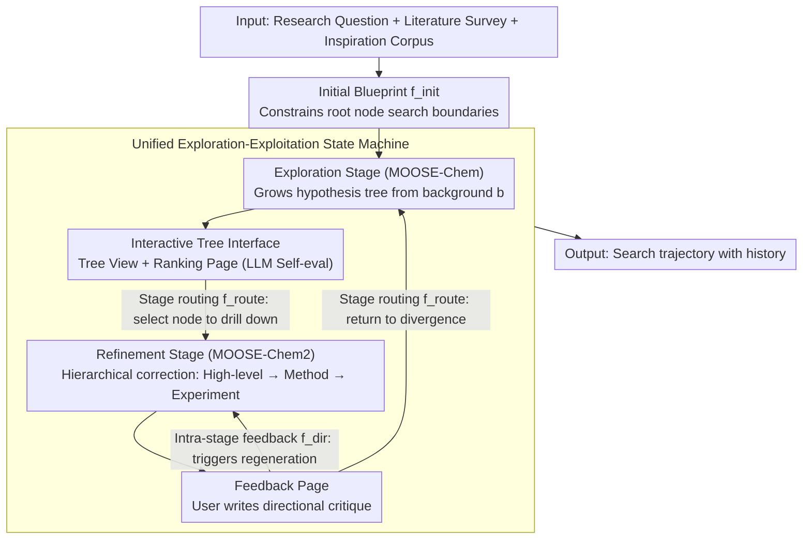

# MOOSE-Copilot: A Web-Based Interactive Assistant for Unified Exploratory and Fine-Grained Scientific Hypothesis Discovery

**Conference**: ACL 2026  
**arXiv**: [2605.29475](https://arxiv.org/abs/2605.29475)  
**Code**: https://moosedemo.com (Demo website; GitHub link not provided in the cache)  
**Area**: LLM Agent / Scientific Discovery  
**Keywords**: Scientific Hypothesis Discovery, Human-AI Collaboration, Exploration-Exploitation, Interactive Agents, MOOSE-Chem  

## TL;DR
MOOSE-Copilot unifies divergent exploration of scientific ideas and convergent refinement of fine-grained hypotheses into a visual human-AI collaborative system, significantly enhancing hypothesis discovery through three explicit human signals: initial blueprints, stage routing, and feedback.

## Background & Motivation
**Background**: LLMs have been utilized in scientific workflows for hypothesis generation, experimental design, paper writing, and peer review assistance. "Scientific hypothesis discovery" occurs early in the research process, directly influencing subsequent experimental directions and potential value. Existing automated discovery systems are generally divided into two categories: those focused on divergent exploration (generating diverse high-level ideas from background) and those focused on fine-grained optimization (refining methods and experimental details from an initial concept).

**Limitations of Prior Work**: These two types of systems are typically treated as independent tasks. Exploratory systems expand directions but often produce coarse and non-specific outputs; fine-grained systems can polish an idea into an executable plan but rely on a pre-selected starting point. More importantly, many agent workflows run autonomously, leaving domain experts to filter results post-hoc without the ability to correct trajectories in real-time.

**Key Challenge**: Scientific discovery requires both exploration and exploitation. Searching across high-level inspiration spaces and fine-grained experimental spaces simultaneously leads to combinatorial explosion. Conversely, relying solely on manual control loses the LLM's advantages in large-scale generation and local refinement.

**Goal**: The authors aim to establish a unified framework that links the exploratory search of MOOSE-Chem with the fine-grained refinement of MOOSE-Chem2, while allowing human experts to inject directional information at key nodes to decide where to start, when to switch to refinement, and how to regenerate based on feedback.

**Key Insight**: This paper formalizes human-in-the-loop not merely as a UI feature but as a Human-AI Interaction Interface (HAII) protocol. Human inputs are modeled as routing operators and constraint signals within the search process to prune search spaces, specify granularity transitions, and correct current trajectories.

**Core Idea**: Decompose the combined space of "divergent search + convergent optimization" into a controllable human-AI collaborative search trajectory using structured human signals.

## Method
The core of MOOSE-Copilot is not a new single-stage generator, but rather the integration of the existing MOOSE-Chem and MOOSE-Chem2 into a unified state machine equipped with a visual interactive interface. The left side handles exploration, expanding a hypothesis tree from background and inspiration corpora; the right side handles exploitation, refining a coarse-grained node into a complete research plan. The user acts as a navigator, deciding which nodes deserve further exploration, which should be refined, and which results require regeneration based on feedback.

### Overall Architecture
Input includes the research question, optional literature survey, optional inspiration knowledge corpus, and the user's initial blueprint. The system first combines background $b$ and inspiration knowledge $i_j$ via MOOSE-Chem to generate a hypothesis tree; each path represents a sequence of inspiration-driven updates. Subsequently, the user selects a hypothesis node to route to MOOSE-Chem2. MOOSE-Chem2 then uses a hierarchical search strategy, starting from high-level corrections and converging toward methodological details and experimental designs.

The output is not a single answer but a search trajectory with history. The interface provides an Input Page, Tree View, Ranking Page, and Feedback Page. The Tree View shows how hypotheses evolve from different inspirations, the Ranking Page displays LLM self-evaluation scores, and the Feedback Page allows users to choose between continued exploration or fine-grained refinement while entering directional feedback.

### Key Designs

**1. Unified Exploration-Exploitation State Machine: Closing the loop between divergent search and fine-grained optimization**

Running exploratory systems alone often yields coarse, unexecutable ideas, while running refinement systems alone lacks a mechanism to determine the starting idea. MOOSE-Copilot integrates both into a single state machine. The exploration stage approximates $P(h \mid b)$, continuously selecting inspirations and updating intermediate hypotheses to grow a tree. The refinement stage treats a selected initial hypothesis $h_0$ as the optimization target, correcting it across different abstraction layers to improve executability and consistency. Sharing a single search trajectory allows exploration outputs to naturally serve as refinement starting points, while refinement weaknesses can flow back to exploration for re-diversification.

**2. Three Classes of HAII Guidance Signals: Formalizing "human-in-the-loop" as three search operators**

The most difficult task for autonomous systems is determining when to continue diverging vs. when to converge, and which branch is worth pursuing—decisions where domain experts can provide intuitive insights in seconds. The paper abstracts human input into three operators: $f_{init}$ (Initial Blueprint) constrains the search boundaries of the root node; $f_{route}$ (Inter-stage Routing) lets users decide when to drill down from the conceptual space $\mathcal{C}$ to the execution space $\mathcal{E}$; and $f_{dir}$ (Intra-stage Feedback) incorporates critiques into the context to trigger regeneration. This division allows for the marginal contribution of each signal to be measured independently.

**3. Interactive Tree Interface: Making the evolution process visible and reversible**

Scientists require more than automated outputs; they need to know how an idea grew, where it branched, and why a specific path was chosen. MOOSE-Copilot represents each hypothesis as a node in a tree, complemented by an active dashboard. The visual interface allows the search trajectory to be tracked or reverted, making the human signals mentioned above operational.

### Mechanism Example: From Background to an Executable Hypothesis

A researcher inputs a chemical background $b$ and an inspiration corpus, defining the reaction system focus via $f_{init}$. MOOSE-Chem expands the hypothesis tree under these constraints. The researcher browses coarse-grained nodes in the Tree View, evaluates self-scores in the Ranking Page, and uses $f_{route}$ to route the most promising hypothesis into MOOSE-Chem2. MOOSE-Chem2 then converges toward methodological details and experimental designs. If the researcher identifies flaws in the experimental design, a directional critique ($f_{dir}$) triggers regeneration. Continuous feedback cycles increase the recall of ground-truth elements while reducing the number of search steps.

### Loss & Training
No new large models were trained; the study primarily evaluates the system's responsiveness to human guidance. Experiments use oracle-simulated evaluation: an oracle LLM accesses ground-truth fine-grained hypotheses to generate directional critiques without leaking direct answers. Node selection is also simulated via oracle ranking to represent high-quality expert routing.

## Key Experimental Results

### Main Results
Experiments were conducted on TOMATO-Chem2, containing research questions, literature surveys, and fine-grained hypothesis annotations from 51 top-tier papers. The metric used is the recall of generated hypotheses relative to ground-truth elements.

| Method | Configuration | Recall | Search Steps |
|------|----------|--------|--------------|
| baseline_MC | MOOSE-Chem exploration only | 11.44% | N/A |
| baseline_MC2 | MOOSE-Chem2 refinement only | 10.33% | 478.6 |
| MC_with_hint | MOOSE-Chem + initial blueprint | 15.37% | N/A |
| MC_with_feedback_with_hint | Initial blueprint + oracle ranking + feedback + MOOSE-Chem | 16.93% | N/A |
| MC2_with_MC_input_oracle_rank | MOOSE-Chem2 following oracle selection from exploration | 18.26% | 336.6 |
| MC2_with_feedback_oracle_rank | Oracle selection + 1 feedback refinement | 21.98% | 166.1 |
| MC2_with_strong_feedback_x4_oracle_rank | Oracle selection + 4 strong feedback refinements | 26.96% | 90.1 |

### Ablation Study

| Guidance Signal | Comparison Setting | Observation |
|----------|----------|------|
| Initial Blueprint | MC 11.44% vs MC_with_hint 15.37% | Initial constraints significantly narrow the search range and improve exploration quality. |
| Stage Routing | Self-ranking into MC2 (12.74%) vs. Oracle-ranking into MC2 (18.26%) | The choice of which node to drill down into largely determines the ceiling for subsequent refinement. |
| Directional Feedback | Standard feedback x1 (21.98%) vs. Strong feedback x4 (26.96%) | Stronger, clearer feedback continuously drives higher recall and reduces search steps. |
| Full Autonomy | baseline_MC2 | Without human routing and feedback, fine-grained search is costly (478.6 steps) and less effective (10.33%). |

### Key Findings
- **Initial Blueprint**: Anchors exploration to a reasonable starting point, preventing the system from searching blindly in an oversized conceptual space.
- **Routing**: Routing from exploratory outputs to refinement is critical; oracle selection outperforms self-ranking significantly (18.26% vs 12.74%).
- **Feedback**: Feedback goes beyond linguistic refinement; it shifts the search trajectory. Strong feedback (x4) achieved the highest recall (26.96%) while reducing search steps to 90.1.

## Highlights & Insights
- The most valuable aspect is formalizing "human participation" into three specific control signals rather than a vague concept of human-in-the-loop. This allows for measuring the marginal contribution of expert signals.
- The paper distinguishes between exploratory and fine-grained hypothesis discovery. MOOSE-Copilot emphasizes the evolution of an idea from coarse to fine rather than just the final output.
- The tree-based interface is well-suited for scientific research, where experts often compare, backtrack, and drill down into different branches.
- Oracle-simulated evaluation tests the system's upper bound: if expert signals are optimal, the framework can effectively leverage them.

## Limitations & Future Work
- The system lacks integrated automated experimental execution; thus, the "hypothesis generation to experimental falsification" loop is incomplete.
- It does not employ specific post-training methods for hypothesis discovery; quality remains dependent on the underlying LLM and existing MOOSE modules.
- Current evaluation uses oracle simulation, which proves the protocol's effectiveness but may not represent the real-world cognitive load or feedback quality of human scientists.
- Future work could integrate experimental execution and literature retrieval to derive $f_{dir}$ from physical results rather than just text.

## Related Work & Insights
- **vs. MOOSE-Chem**: While MOOSE-Chem focuses on inspiration-driven search, this work adds blueprints, routing, and subsequent refinement.
- **vs. MOOSE-Chem2**: MOOSE-Chem2 focuses on refinement; this work addresses where the initial hypothesis originates and how to transition between stages.
- **vs. IdeaSynth / NOVA / LLM-SR**: Unlike systems emphasizing automated generation, MOOSE-Copilot focuses on interaction protocols and visual controllability.
- **Insight**: For scientific agents, "controllable intermediate states" may be more important than "end-to-end automation." Abstracting user operations into evaluable signals is key for future discovery systems.

## Rating
- Novelty: ⭐⭐⭐⭐☆ Unified HAII protocol for exploration and refinement is distinctive.
- Experimental Thoroughness: ⭐⭐⭐☆☆ Clear ablations provided, but relies heavily on oracle simulations without extensive real-world user studies.
- Writing Quality: ⭐⭐⭐⭐☆ Clear mapping between motivation, protocols, and the interface.
- Value: ⭐⭐⭐⭐☆ Significantly contributes to human-AI collaboration design for complex scientific workflows.

<!-- RELATED:START -->

## Related Papers

- [\[ICLR 2026\] Repurposing Synthetic Data for Fine-grained Search Agent Supervision](../../ICLR2026/llm_agent/repurposing_synthetic_data_for_fine-grained_search_agent_supervision.md)
- [\[ICML 2026\] Towards Diverse Scientific Hypothesis Search with Large Language Models](../../ICML2026/llm_agent/towards_diverse_scientific_hypothesis_search_with_large_language_models.md)
- [\[ICLR 2026\] SR-Scientist: Scientific Equation Discovery With Agentic AI](../../ICLR2026/llm_agent/sr-scientist_scientific_equation_discovery_with_agentic_ai.md)
- [\[CVPR 2026\] Seeing as Experts Do: A Knowledge-Augmented Agent for Open-Set Fine-Grained Visual Understanding](../../CVPR2026/llm_agent/seeing_as_experts_do_a_knowledge-augmented_agent_for_open-set_fine-grained_visua.md)
- [\[ICLR 2026\] Towards Multimodal Data-Driven Scientific Discovery Powered by LLM Agents](../../ICLR2026/llm_agent/towards_multimodal_data-driven_scientific_discovery_powered_by_llm_agents.md)

<!-- RELATED:END -->
