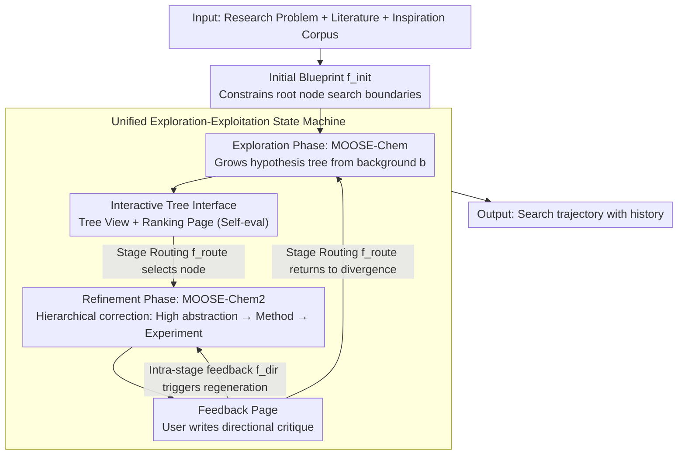

# MOOSE-Copilot: A Web-Based Interactive Assistant for Unified Exploratory and Fine-Grained Scientific Hypothesis Discovery

**Conference**: ACL 2026  
**arXiv**: [2605.29475](https://arxiv.org/abs/2605.29475)  
**Code**: https://moosedemo.com (Demo site; GitHub link not provided in cache)  
**Area**: LLM Agent / Scientific Discovery  
**Keywords**: Scientific Hypothesis Discovery, Human-AI Collaboration, Exploration-Exploitation, Interactive Agent, MOOSE-Chem  

## TL;DR
MOOSE-Copilot integrates divergent scientific idea exploration and convergent fine-grained hypothesis refinement into a unified visual human-AI collaborative system, significantly enhancing hypothesis discovery performance through three explicit human signals: initial blueprints, stage routing, and feedback.

## Background & Motivation
**Background**: LLMs have been applied to scientific workflows including hypothesis generation, experimental design, paper writing, and peer review assistance. "Scientific hypothesis discovery" occurs early in the research process and directly influences the direction and potential value of subsequent experiments. Existing automated discovery systems are generally divided into two categories: those focused on divergent exploration (generating diverse high-level ideas from background) and those focused on fine-grained optimization (completing methods, experiments, and execution details from an initial concept).

**Limitations of Prior Work**: These two categories are typically treated as isolated tasks. Exploratory systems expand directions but often produce coarse, non-specific outputs; fine-grained systems polish an idea into an executable plan but rely on a pre-selected starting point. Furthermore, most agent workflows run autonomously, leaving domain experts to filter results post-hoc without the ability to provide timely course corrections.

**Key Challenge**: Scientific discovery requires simultaneous exploration and exploitation. Fully automated joint searching in a high-level inspiration space and a fine-grained experimental space faces combinatorial explosion. Conversely, relying solely on manual control sacrifices the advantages of LLMs in large-scale generation and local refinement.

**Goal**: The authors aim to establish a unified framework that links the exploratory search of MOOSE-Chem with the fine-grained refinement of MOOSE-Chem2, allowing human experts to inject directional information at critical nodes to decide where to start, when to transition to refinement, and how to regenerate based on feedback.

**Key Insight**: Instead of treating human-in-the-loop as a mere UI feature, the paper formalizes it as a Human-AI Interaction Interface (HAII) protocol. Human inputs are modeled as routing operators and constraint signals within the search process, used to prune the search space, specify granularity transitions, and correct the current trajectory.

**Core Idea**: Use structured human signals to decompose the joint space of "divergent search + convergent optimization" into a controllable human-AI collaborative search trajectory.

## Method
The core of MOOSE-Copilot is not a new single-stage generator, but rather the integration of the existing MOOSE-Chem and MOOSE-Chem2 into a unified state machine equipped with a visual interaction interface. The left side handles exploration, expanding a hypothesis tree from background and inspiration corpora; the right side handles exploitation, refining a selected coarse-grained node into a complete research proposal layer by layer. The user acts as a navigator in the middle, deciding which nodes warrant further exploration, which should be drilled down for refinement, and which generation results require revision based on feedback.

### Overall Architecture
Inputs include research problems, optional literature surveys, an optional inspiration knowledge corpus, and the user's initial blueprint. The system first combines background $b$ and inspiration knowledge $i_j$ via MOOSE-Chem to incrementally generate a hypothesis tree, where each path represents a sequence of inspiration-driven updates. Subsequently, the user selects a hypothesis node from the tree and routes it to MOOSE-Chem2. MOOSE-Chem2 employs a hierarchical search strategy, starting from high-level abstractions (corrections) and converging toward methodological details and experimental designs.

The output is not a single answer but a search trajectory with history. The interface provides an input page, tree view, ranking page, and feedback page: the tree view visualizes how hypotheses evolve from different inspirations; the ranking page shows LLM self-evaluation scores; the feedback page allows users to choose between continued exploration or fine-grained refinement, providing directional feedback.

### Key Designs

**1. Unified Exploration-Exploitation State Machine: Closing the loop between divergent search and fine-grained optimization**

Running an exploratory system in isolation often leads to rough, non-executable ideas, while running a refinement system alone lacks a mechanism to determine its starting point. MOOSE-Copilot addresses this by placing both within the same state machine. The exploration phase approximates $P(h \mid b)$ by selecting inspirations and updating intermediate hypotheses to grow a tree. The refinement phase treats a selected initial hypothesis $h_0$ from the tree as the optimization target, correcting it across levels of abstraction to improve executability and consistency. Sharing a search trajectory allows exploration outputs to naturally seed refinement, while refinement flaws can flow back into exploration for re-diversification.

**2. Three Classes of HAII Guidance Signals: Formalizing "Human-in-the-Loop" as search operators**

The hardest part for an autonomous system is judging when to continue diverging, when to converge, and which branch is worth pursuing—tasks where domain experts use intuition. The paper abstracts human input into three operators: $f_{init}$ (initial blueprint) constrains the root node search boundaries to prevent blind searching; $f_{route}$ (inter-stage routing) lets users decide when to drill down from conceptual space $\mathcal{C}$ to execution space $\mathcal{E}$ (or vice versa); $f_{dir}$ (intra-stage feedback) incorporates user critiques into the context to trigger regenerative generation. This allows the marginal contribution of each signal—starting point, stage transition, and trajectory correction—to be measured independently.

**3. Interactive Tree Interface: Visualizing hypothesis evolution with backtracking**

Scientists require more than a single automated answer; they need to understand how an idea grew, where it branched, and why a specific path is valuable. MOOSE-Copilot represents each hypothesis as a node in a tree. The tree view shows inspiration-driven evolution, the ranking page provides LLM self-evaluation scores, and the feedback page allows users to toggle between "continue exploration" and "enter refinement," providing specific feedback to guide subsequent calls to MOOSE-Chem or MOOSE-Chem2. This makes the search trajectory traceable and reversible.

### A Complete Example: From Background to Executable Hypothesis

A researcher inputs a chemical background $b$ and inspiration corpus, writing an initial blueprint $f_{init}$ to specify the target reaction system. MOOSE-Chem expands a hypothesis tree within these constraints. The researcher browses coarse-grained nodes in the tree view, compares self-evaluation scores, and uses $f_{route}$ to route the most promising hypothesis into MOOSE-Chem2. MOOSE-Chem2 converges toward method details and experimental design. If the experimental design is flawed, the researcher provides a directional critique ($f_{dir}$), triggering regeneration. Through several rounds of feedback, the recall of ground-truth elements in the hypothesis increases while search steps decrease.

### Loss & Training
No new model training is conducted; the system focuses on assessing response to human guidance signals. Evaluation utilizes oracle-simulated evaluation: an oracle LLM accesses the ground-truth fine-grained hypothesis but only generates directional critiques without leaking the answer. Node selection is simulated via oracle ranking to establish a performance upper bound under high-quality expert signals.

## Key Experimental Results

### Main Results
Experiments were conducted on TOMATO-Chem2, containing research problems, literature surveys, and fine-grained hypothesis annotations from 51 top-tier papers. Performance is measured by the recall of generated hypotheses relative to ground-truth elements.

| Method | Main Setting | Recall | Search Steps |
|------|----------|--------|--------------|
| baseline_MC | MOOSE-Chem only (Exploration) | 11.44% | N/A |
| baseline_MC2 | MOOSE-Chem2 only (Refinement) | 10.33% | 478.6 |
| MC_with_hint | MOOSE-Chem + initial blueprint | 15.37% | N/A |
| MC_with_feedback_with_hint | Initial blueprint + oracle ranking + feedback + MOOSE-Chem | 16.93% | N/A |
| MC2_with_MC_input_oracle_rank | MOOSE-Chem output + Oracle selection into MOOSE-Chem2 | 18.26% | 336.6 |
| MC2_with_feedback_oracle_rank | Oracle selection + 1 feedback refinement | 21.98% | 166.1 |
| MC2_with_strong_feedback_x4_oracle_rank | Oracle selection + 4 strong feedback refinements | 26.96% | 90.1 |

### Ablation Study
| Guidance Signal | Comparison Setting | Observation |
|----------|----------|------|
| Initial Blueprint | MC 11.44% vs MC_with_hint 15.37% | Initial constraints significantly narrow the search space and improve exploration quality. |
| Stage Routing | Self-ranking 12.74% vs Oracle-ranking 18.26% | Node selection for drilling down largely determines the refinement ceiling. |
| Directional Feedback | Feedback x1 21.98% vs Strong Feedback x4 26.96% | Stronger, clearer feedback consistently increases recall and reduces search steps. |
| Autonomous Refinement | baseline_MC2 10.33% at 478.6 steps | Without human routing and feedback, fine-grained search is costly and inefficient. |

### Key Findings
- The initial blueprint restricts exploration to a reasonable starting vicinity, preventing blind searching in overly large conceptual spaces.
- Routing is critical: moving from MOOSE-Chem to MOOSE-Chem2 via oracle selection yields 18.26% recall, compared to 12.74% via self-ranking.
- Feedback does more than refine phrasing; it alters the search trajectory during refinement. Strong feedback (x4) achieved the highest recall (26.96%) and reduced search steps to 90.1.

## Highlights & Insights
- The most valuable contribution is formalizing "human participation" as three control signals in a search process rather than a vague "human-in-the-loop" concept. This allows for measuring the marginal contribution of expert signals.
- The paper distinguishes between exploratory and fine-grained hypothesis discovery. Unlike agents that only show a final idea, MOOSE-Copilot emphasizes the evolution of an idea from coarse to fine.
- The tree interface suits scientific workflows where researchers compare, backtrack, and drill down across multiple branches.
- Oracle-simulated evaluation tests the system capacity: if expert signals are optimal, can the framework handle it? The results suggest it can, though real user studies remain necessary.

## Limitations & Future Work
- The system lacks integrated automated experiment execution; the loop from "hypothesis generation" to "experimental falsification" is incomplete.
- It does not use specialized post-training for scientific discovery; generation quality relies on the underlying LLM and existing MOOSE modules.
- Current evaluations use oracles to simulate high-quality signals, proving protocol effectiveness but not accounting for real-world user costs, cognitive load, or feedback quality.
- Future work could integrate experiment execution and literature retrieval, using $f_{dir}$ derived from experimental results rather than just human text.

## Related Work & Insights
- **vs MOOSE-Chem**: MOOSE-Chem models exploration as inspiration-driven search. This paper preserves that capability while adding blueprints, routing, and refinement.
- **vs MOOSE-Chem2**: MOOSE-Chem2 focuses on refining an initial hypothesis. This paper addresses where that hypothesis comes from and how to iterate based on feedback.
- **vs IdeaSynth / NOVA / LLM-SR**: These systems emphasize automated generation or iteration. MOOSE-Copilot emphasizes the interaction protocol and visual controllability.
- **Insight**: For scientific agents, "controllable intermediate states" may be more important than "end-to-end automation." Abstracting user actions into evaluable signals is key for next-generation discovery systems.

## Rating
- Novelty: ⭐⭐⭐⭐☆ Distinctive integration of exploration and refinement into an HAII protocol, though underlying modules are reused.
- Experimental Thoroughness: ⭐⭐⭐☆☆ Clear ablations, but relies heavily on oracle-simulated settings with limited real user testing.
- Writing Quality: ⭐⭐⭐⭐☆ Logical mapping between motivation, protocol, and interface.
- Value: ⭐⭐⭐⭐☆ Highly relevant for human-AI collaborative design in complex scientific discovery.

<!-- RELATED:START -->

## Related Papers

- [\[ICLR 2026\] SR-Scientist: Scientific Equation Discovery With Agentic AI](../../ICLR2026/llm_agent/sr-scientist_scientific_equation_discovery_with_agentic_ai.md)
- [\[CVPR 2026\] Seeing as Experts Do: A Knowledge-Augmented Agent for Open-Set Fine-Grained Visual Understanding](../../CVPR2026/llm_agent/seeing_as_experts_do_a_knowledge-augmented_agent_for_open-set_fine-grained_visua.md)
- [\[ICLR 2026\] NewtonBench: Benchmarking Generalizable Scientific Law Discovery in LLM Agents](../../ICLR2026/llm_agent/newtonbench_benchmarking_generalizable_scientific_law_discovery_in_llm_agents.md)
- [\[ICML 2025\] Evaluating Retrieval-Augmented Generation Agents for Autonomous Scientific Discovery in Astrophysics](../../ICML2025/llm_agent/evaluating_retrieval-augmented_generation_agents_for_autonomous_scientific_disco.md)
- [\[ICML 2025\] Open Source Planning & Control System with Language Agents for Autonomous Scientific Discovery](../../ICML2025/llm_agent/open_source_planning_control_system_with_language_agents_for_autonomous_scientif.md)

<!-- RELATED:END -->
