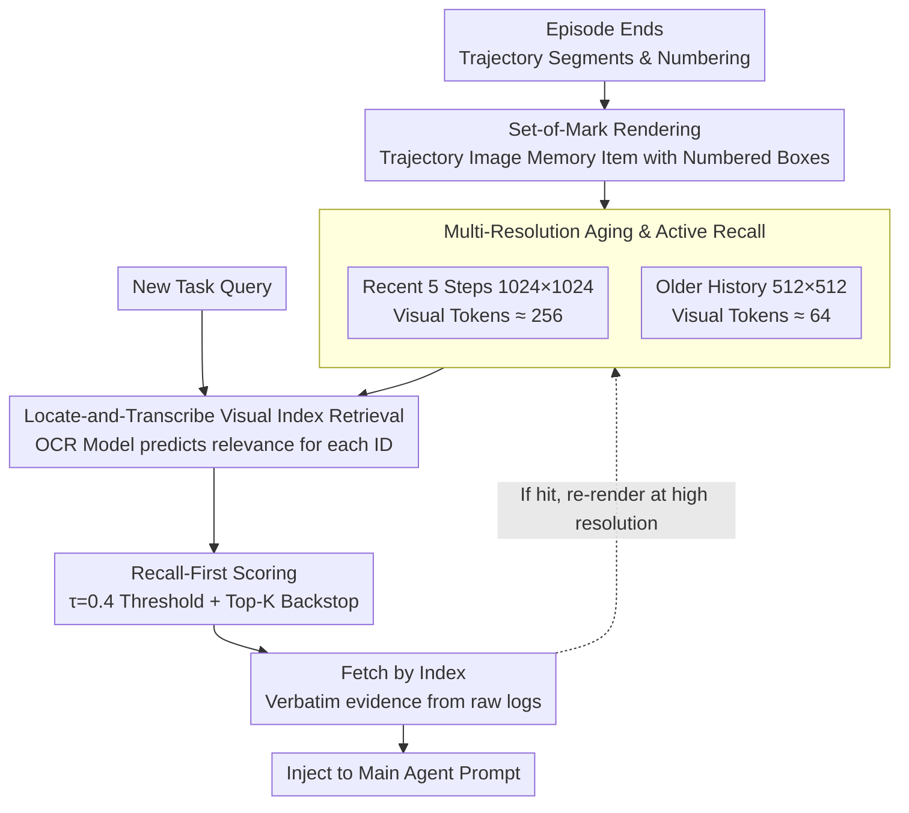

# OCR-Memory: Optical Context Retrieval for Long-Horizon Agent Memory

**Conference**: ACL 2026  
**arXiv**: [2604.26622](https://arxiv.org/abs/2604.26622)  
**Code**: Not disclosed (No link provided in paper)  
**Area**: LLM Agent / Long-term Memory  
**Keywords**: Optical Context Compression, Agent Memory, Visual Retrieval, Long Context, Set-of-Mark  

## TL;DR
OCR-Memory renders long-horizon agent interaction trajectories into images with numbered anchors, allowing a fine-tuned OCR retriever to first localize relevant segments in visual space and then retrieve original text by index. This approach maintains complete history under strict context budgets and improves long-horizon task performance on Mind2Web and AppWorld.

## Background & Motivation
**Background**: LLM agents are evolving from single-round QA systems toward long-term interactive systems, such as web operations, mobile app navigation, tool calling, and continuous task processing. The capability of such systems depends not only on current reasoning but also on the ability to reuse failure causes, operation paths, tool feedback, and environmental states accumulated in past episodes.

**Limitations of Prior Work**: The most direct approach is placing historical trajectories into external memory and using text retrieval or summarization to fit relevant content into the prompt. However, raw trajectories often contain massive intermediate reasoning, actions, web structures, API returns, and error messages; storing them in full is token-intensive. While summarization and skill abstraction save tokens, they easily lose precise fields, temporal relationships, and low-level details. When a task requires revisiting a specific button, error message, parameter name, or multi-step causal chain from an old step, compressed text memory appears too coarse.

**Key Challenge**: Long-term agent memory simultaneously requires "high capacity" and "high fidelity." Text context window constraints force a choice: either retain massive raw history but fail to fit it in the prompt, or compress history at the cost of detail. Traditional RAG also encounters semantically similar but logically irrelevant segments, while generative memory retrieval may hallucinate vague history into plausible but non-existent evidence.

**Goal**: The authors aim to construct a long-term memory module that can store arbitrarily long historical trajectories, consume very little context budget during retrieval, and ensure that the evidence provided to the main Agent is original-level, traceable, and low-hallucination. The problem is decomposed into three sub-problems: high-density trajectory storage, identifying relevant segments from compressed representations, and restoring segments into trusted text.

**Key Insight**: The paper borrows from the "optical context compression" observation represented by DeepSeek-OCR: dense text can be rendered as images and input into models as a relatively small number of visual tokens. Images here are not for the Agent to perceive a scene, but serve as a high-density long-term memory medium. If the visual model is only responsible for localizing relevant regions rather than generating final text, "finding locations in images" can be decoupled from "returning original evidence text."

**Core Idea**: Replace pure text memory with image memory containing visual anchors. The model outputs indices of relevant segments, and original text is deterministically retrieved from external logs, exchanging visual compression for larger effective memory capacity.

## Method
The core of OCR-Memory is not having the main Agent directly read all historical images, but placing a specialized "optical retriever" alongside it. This retriever performs one task: given the current task query and historical trajectory images, it determines which numbered segments might be useful. The evidence injected into the main Agent's prompt remains text, but this text is not "generated" by the visual model; it is retrieved verbatim from original logs based on indices.

### Overall Architecture
The system maintains an external memory bank where each memory item contains three parts: an image rendered from historical trajectory chunks, the original text segments corresponding to each numbered block in the image, and metadata such as timestamps and episode IDs. After an episode ends, the system segments the user input, Agent reasoning, tool calls, tool returns, and environment feedback, assigns a unique ID to each segment, and marks them on the image with red boxes and numbers.

When a new task arrives, OCR-Memory does not cram all historical text into the main Agent. Instead, it inputs the current query and historical images into a DeepSeek-OCR-style retrieval model. The model outputs a relevance probability or binary label for each numbered block in each memory image. The system selects segments based on thresholds and Top-K rules. Finally, the `Fetch` operation uses these indices to retrieve verbatim evidence from original logs, which is then concatenated and injected into the main Agent's prompt.

This workflow splits Agent memory into two layers: the image layer for low-token wide-range scanning, and the text log layer for high-fidelity evidence recovery. The main Agent sees precisely retrieved text context rather than summaries freely generated by an OCR model.

### Key Designs

**1. Locate-and-Transcribe Visual Index Retrieval: Changing "Evidence Generation" to "Index Selection"**

Historical retrieval typically suffers from slow long-sequence decoding and visual models hallucinating non-existent information when transcribing low-resolution images. The solution here is to prevent the model from writing evidence, forcing it only to select indices. Each memory item is represented as $m_i=(I_i,\{s_{i,k}\}_{k=1}^{K_i},\pi_i)$, where $I_i$ is the trajectory image with numbers, $s_{i,k}$ is the text for index $k$, and $\pi_i$ is metadata. The retrieval model outputs binary relevance for each segment, yielding an index set $\hat{S}(q)=\{(i,k)\mid \hat{y}_{i,k}=1\}$, followed by a $Fetch$ of $s_{i,k}$ from logs. The task is constrained to verifiable pointer selection, ensuring text injected into the Agent is verbatim from the database, reducing hallucinations and decoding costs.

**2. Recall-prioritized Scoring and Selection: Prefer Extra to Missing**

In long-horizon Agent tasks, missing a critical historical step is often more fatal than adding irrelevant segments. Therefore, retrieval rules explicitly favor recall. Although the model provides binary labels, the system reads the logits for labels "1" and "0" to calculate relevance probability $p_{i,k}=\exp z_{i,k}(1)/(\exp z_{i,k}(1)+\exp z_{i,k}(0))$. Selection uses a low threshold $\tau=0.4$, with a Top-K backstop (Top-K=5, total cap 20) if no high-confidence segments are found. This recall-biased rule ensures the retriever retains minimal historical clues even when uncertain.

**3. Multi-resolution Memory Aging and Active Recall: Blur Old Memory, Sharpen on Hit**

Saving all history as high-resolution images leads to visual token explosion. This system implements "memory decay" as adaptive compression: the most recent 5 interaction steps use $1024 \times 1024$ resolution (approx. 256 tokens), while older history is downsampled to $512 \times 512$ (approx. 64 tokens). Once a low-resolution memory is retrieved, the system re-renders it at high resolution from original logs and maintains that fidelity for the remainder of the episode. The rationale is that most old history only requires semantic outlines, while only the few reactivated instances deserve full detail, achieving a dynamic compromise between capacity and readability.

### Loss & Training
OCR-Memory is built on DeepSeek-OCR 3B, though the original model is optimized for transcription rather than "finding supporting segments based on a question." Thus, the authors adapted HotpotQA into a visual retrieval dataset: candidate paragraphs for each question are rendered as numbered images, and paragraph indices of supporting facts are used as binary labels.

The training objective is weighted binary cross-entropy. Since relevant segments are far fewer than irrelevant ones, the authors set $w_+ = 2.0$ and $w_- = 1.0$ to penalize false negatives. The vision encoder is frozen, and only the language decoder is fine-tuned using LoRA (applied to q_proj, k_proj, v_proj, o_proj; rank 16, alpha 32, dropout 0.05).

For hyper-parameters, the model is trained on the HotpotQA distractor split for 3 epochs using AdamW, peak learning rate $1e^{-5}$, 10% warmup, and global batch size of 128. To match inference-time resolution changes, a resolution curriculum is used: $1024 \times 1024$ and $512 \times 512$ are sampled with probabilities $[0.3, 0.7]$, training the model to perform index selection on both clear and blurred images.

The main Agent is decoupled from the memory module. The default reasoning model is GPT-4 (temperature 0). Generalization experiments also replaced it with Qwen3-32B to verify that gains stem from the memory mechanism rather than a specific reasoning model.

## Key Experimental Results

### Main Results
Evaluation was conducted on Mind2Web Cross-Task split and AppWorld. Metrics for Mind2Web include Element Accuracy, Action F1, Step Success Rate (SR), and Task SR. AppWorld reports success rates across difficulty levels. All methods are constrained by a 4096-token context budget.

| Method | Mind2Web Ele Acc | Mind2Web F1 | Mind2Web Step SR | Mind2Web Task SR | AppWorld Easy | AppWorld Med | AppWorld Hard | AppWorld Avg |
|------|------------------|-------------|------------------|------------------|---------------|--------------|---------------|--------------|
| Zero-Shot | 40.1 | 46.2 | 37.9 | 2.2 | 68.7 | 36.2 | 20.9 | 41.9 |
| Text Retrieval | 41.3 | 48.2 | 38.9 | 2.7 | 72.5 | 44.8 | 21.4 | 46.2 |
| MemoryBank | 43.8 | 49.5 | 39.2 | 3.3 | 81.3 | 50.1 | 24.9 | 52.1 |
| AWM | 49.1 | 55.7 | 42.6 | 4.3 | 84.1 | 53.6 | 27.2 | 55.0 |
| ACON | 48.2 | 54.1 | 41.4 | 4.1 | 84.8 | 55.1 | 28.7 | 56.2 |
| OCR-Memory | 53.8 | 59.2 | 46.1 | 4.8 | 86.2 | 57.4 | 30.8 | 58.1 |

OCR-Memory outperforms text retrieval and existing memory systems on both benchmarks. On Mind2Web, compared to AWM, Element Accuracy increased from 49.1 to 53.8, and Step SR from 42.6 to 46.1. On AppWorld, the advantage is most pronounced in the Hard subset: OCR-Memory reached 30.8, significantly higher than Text Retrieval (21.4) and AWM (27.2). This indicates that visual compression does not just save tokens; it actively helps the system recover access to complex historical details.

### Ablation Study
The first focus is the Set-of-Mark (SoM) mechanism. The authors compared the full method against a variant generating relevant text directly and another predicting bounding boxes.

| Configuration | Ele Acc | Step SR | Retrieval Latency | Description |
|------|---------|---------|----------|------|
| OCR-Memory Full | 53.8 | 46.1 | 1.7s | With SoM IDs; outputs indices and fetches raw text |
| w/o SoM (Text Gen) | 46.5 | 39.2 | 5.3s | Model generates text; more hallucinations and slower |
| w/o SoM (BBox) | 49.2 | 44.5 | 2.1s | Predicts box coordinates; less precise than ID selection |

Without SoM, the model either enters free-generation mode or provides unstable spatial boxes. Numbered anchors transform image retrieval into a list-based evidence selection task, improving both accuracy and latency.

The multi-resolution active recall experiment demonstrates that dynamic compression is more stable than fixed low-resolution and more token-efficient than fixed high-resolution.

| Resolution Strategy | Step SR | Task SR | Avg Visual Tokens/Frame | Description |
|------------|---------|---------|--------------------|------|
| Static Low-Res 512×512 | 39.7 | 2.9 | 65 | Most efficient, but old images too blurry for semantics |
| Static High-Res 1024×1024 | 46.5 | 4.9 | 256 | Slightly higher performance, but prohibitive long-term cost |
| Dynamic (Ours) | 46.1 | 4.8 | 82 | Approaches high-res performance at low-res cost |

Further analysis on retrieval accuracy and system cost:

| Analysis Item | Baseline/Comp. | OCR-Memory Result | Main Conclusion |
|--------|----------|-----------------|----------|
| NIAH 4k / 32k | Visual Compressed Retrieval | 98.5 / 94.1 Recall@1 | Maintains high precision as context grows to 32k |
| Experience Retrieval | Dense Text-RAG | Recall@1 78.6 vs 52.7 | Optical retrieval finds relevant historical segments better |
| Evidence Fidelity | Generative Retrieval | 100.0 vs 84.3 | Index-based fetching prevents evidence corruption |
| System Efficiency | Text-RAG | 596 vs 3980 tokens/step | Saves 6.7× prompt tokens at 1.7s latency & 1.47MB/episode |

### Key Findings
- **SoM numbered anchors** are the core engineering design; they relieve the visual model of "writing evidence," restricting it to "finding evidence."
- **Multi-resolution mechanisms** provide value through cost curves rather than single peak scores; the dynamic strategy achieves high success with only 82 visual tokens.
- **OCR-Memory excels under tight token budgets**; it outperforms Text-RAG across 1024 to 8192 token ranges, solving context bottlenecks rather than just increasing model capacity.
- **Backbone agnostic**: Switching to Qwen3-32B still yielded gains, suggesting the benefits come from the memory architecture.
- **Resource Trade-off**: The system explicitly trades disk space, rendering, and visual retrieval latency for significant token savings in the main reasoning context.

## Highlights & Insights
- Using "images" as a compression medium for Agent history, rather than just for environmental observation, turns visual tokens into capacity expanders for long-term text memory.
- The **Locate-and-Transcribe** design is clean: localization is handled by neural models, while transcription is handled by a deterministic database, leveraging VLM visual understanding without the risks of free-form generation.
- The evaluation goes beyond "compression ratio" to include task success, retrieval-level Recall/MRR, evidence fidelity, latency, and storage, reflecting real-world Agent deployment trade-offs.
- The **active recall mechanism** provides a natural state management for long-term memory: aging into blurriness and sharpening upon access. This could be extended to text summaries or vector stores where access frequency dictates fidelity.
- A key takeaway for other Agent systems is "**indexed evidence recovery**." Even without OCR, forcing models to output verifiable pointers from which the system retrieves raw evidence can reduce hallucinations in any RAG system.

## Limitations & Future Work
- Requires training a specialized optical retriever, which has a higher upfront cost than training-free methods like BM25 or dense retrieval.
- Rendering interaction logs as images introduces computational overhead and significantly increases disk usage (1.47MB/episode vs. 18KB for text).
- Deployment requires maintaining additional parameters for the DeepSeek-OCR vision encoder/decoder, increasing memory and engineering complexity.
- Highly dependent on rendering quality. For massive tables, dynamic pages, or tiny fonts in logs, $512 \times 512$ thumbnails may still lose critical local clues.
- The current aging strategy is simple (two tiers). Future work could learn finer-grained fidelity strategies based on task importance or failure frequency.
- Privacy and security: Historical images may contain sensitive user data, which is harder to partially redact or control for permissions compared to plain text logs.

## Related Work & Insights
- **vs Text-RAG**: Text-RAG is simpler and faster but OCR-Memory is more stable for long history and tight token budgets.
- **vs MemoryBank**: MemoryBank focuses on user preferences/status via summaries; OCR-Memory focuses on fine-grained evidence recovery for complex operation steps.
- **vs AWM**: AWM abstracts history into workflows; OCR-Memory retains raw evidence, which is superior when tasks depend on specific elements or API details.
- **vs ACON**: ACON optimizes long-range information within text context; OCR-Memory shifts the compression carrier to the visual modality.
- **vs DeepSeek-OCR**: Validates the feasibility of optical context compression; this work adapts it for Agent memory by adding SoM and index-based retrieval.

## Rating
- **Novelty**: ⭐⭐⭐⭐⭐ Using visual modality as a long-term memory medium for agents is very innovative; Locate-and-Transcribe precisely addresses hallucination.
- **Experimental Thoroughness**: ⭐⭐⭐⭐☆ Covers main tasks, ablations, long-context retrieval, and costs, but lacks real-world long-term deployment and privacy stress tests.
- **Writing Quality**: ⭐⭐⭐⭐☆ Clear methodology and dense tables, though some formatting of formulas and tables is mechanical.
- **Value**: ⭐⭐⭐⭐⭐ Highly relevant for long-horizon agents and web automation, especially where context windows remain expensive and fidelity is paramount.

<!-- RELATED:START -->

## Related Papers

- [\[ACL 2026\] StructMem: Structured Memory for Long-Horizon Behavior in LLMs](structmem_structured_memory_for_long-horizon_behavior_in_llms.md)
- [\[ACL 2026\] TiMem: Temporal-Hierarchical Memory Consolidation for Long-Horizon Conversational Agents](timem_temporal-hierarchical_memory_consolidation_for_long-horizon_conversational.md)
- [\[ACL 2026\] Grounding Agent Memory in Contextual Intent](grounding_agent_memory_in_contextual_intent.md)
- [\[ACL 2026\] Lightweight LLM Agent Memory with Small Language Models](lightweight_llm_agent_memory_with_small_language_models.md)
- [\[ICML 2026\] ACON: Optimizing Context Compression for Long-horizon LLM Agents](../../ICML2026/llm_agent/acon_optimizing_context_compression_for_long-horizon_llm_agents.md)

<!-- RELATED:END -->
