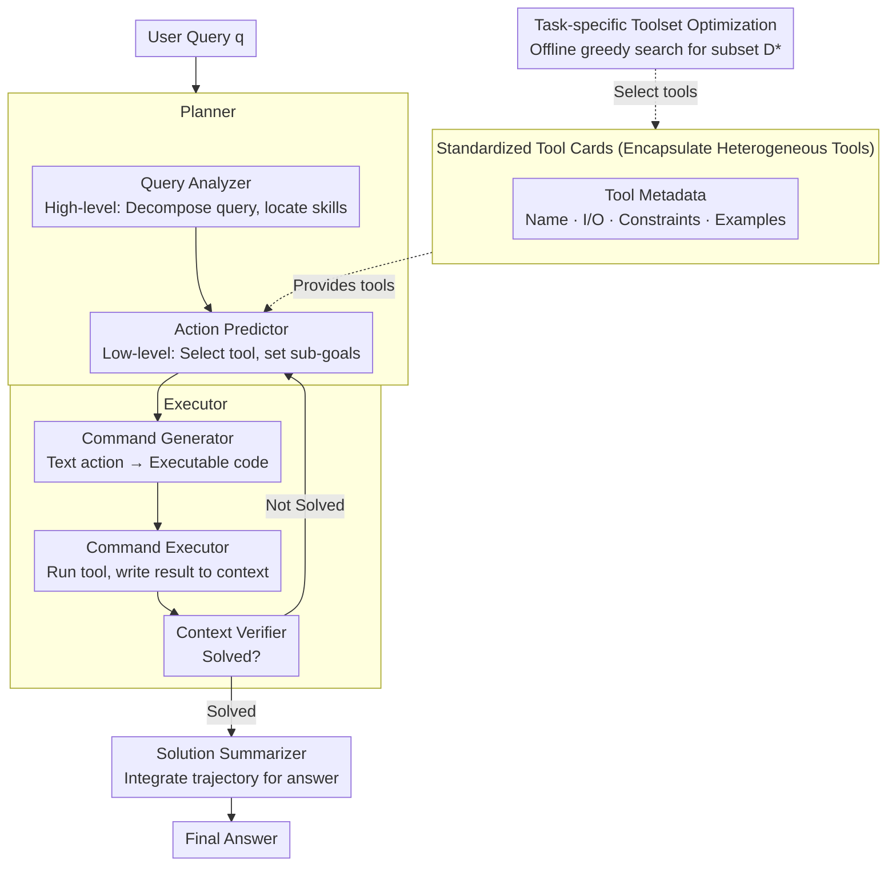

# OctoTools: An Agentic Framework with Extensible Tools for Complex Reasoning

**Conference**: ACL 2026  
**arXiv**: [2502.11271](https://arxiv.org/abs/2502.11271)  
**Code**: [https://github.com/octotools/octotools](https://github.com/octotools/octotools)  
**Area**: LLM Reasoning  
**Keywords**: Agent framework, tool-augmented reasoning, multi-step planning, tool cards, extensibility

## TL;DR

OctoTools is a training-free, user-friendly, and extensible multi-agent framework. By utilizing standardized **Tool Cards** to encapsulate heterogeneous tools, a **Planner-Executor** separation paradigm, and a **task-specific toolset optimization** algorithm, it achieves an average accuracy improvement of +9.3% over GPT-4o and up to +10.6% over frameworks like AutoGen and LangChain across 16 diverse benchmarks.

## Background & Motivation

**Background**: LLMs have made rapid progress in tasks such as summarization, translation, and code generation. However, complex reasoning tasks involving multi-step logic decomposition or specialized domain knowledge remain challenging. Tool-augmented LLMs represent a promising direction by offloading specialized sub-tasks to external tools (search engines, calculators, domain-specific models, etc.).

**Limitations of Prior Work**: (1) Many methods require significant training data and fine-tuning, limiting adaptability to new domains; (2) some methods are only applicable to specific domains (chemistry, vision, medicine, etc.) and lack generality; (3) existing general frameworks (AutoGen, LangChain, GPT-Functions) focus more on high-level abstractions or multi-agent collaboration, with insufficient quantitative evaluation of complex reasoning; (4) merging planning and code execution into a single model leads to cognitive overload and errors.

**Key Challenge**: How to construct an agent framework that is simultaneously general (cross-domain) and efficient (multi-step reasoning + tool calling) without requiring additional training.

**Goal**: Propose a training-free, modular, and extensible agent framework that consistently improves performance across diverse complex reasoning tasks.

**Key Insight**: Standardize tool encapsulation (Tool Cards), decouple strategic planning from command execution (Planner vs. Executor), and automate tool selection (Toolset Optimization algorithm).

**Core Idea**: Construct a modular multi-step reasoning pipeline through standardized tool card interfaces, a hierarchical Planner-Executor architecture, and greedy toolset optimization, where each component focuses on its specific role.

## Method

### Overall Architecture

Given a user query $q$ and a pre-trained model $\text{LLM}_\theta$, OctoTools operates iteratively: The **Planner** first performs high-level planning—the Query Analyzer decomposes the query and identifies required skills and candidate tools; then it performs low-level planning at each step—the Action Predictor selects the tool for the current step and sets sub-goals. This is handed to the **Executor**: the Command Generator translates textual actions into executable code, the Command Executor calls the tool and writes structured results into the context, and the Context Verifier determines if the problem is solved—if not, it returns to the next planning step; if solved, the **Solution Summarizer** integrates the entire trajectory to generate the final answer. All tools are encapsulated via standardized **Tool Cards**, and the subset of tools actually callable for each task is selected offline by a **task-specific toolset optimization** algorithm.

### Key Designs

**1. Standardized Tool Cards: Encapsulating Heterogeneous Tools with a Unified Interface**

OctoTools wraps diverse tools—such as search engines, code executors, and domain classifiers—into "Tool Cards." Each card describes a tool using standardized metadata: name, input/output types, usage constraints, best practices, and calling examples, implementing two fixed functions: `execute()` and `get_metadata()`. Crucially, metadata is written for the LLM; the Planner autonomously judges whether a tool fits the current sub-goal by reading the card, eliminating the need to hard-code tool logic. Integrating a new tool only requires adding a compliant card without modifying framework code. This addresses the common pain point where adding tools requires extensive engineering, making tool expansion truly plug-and-play.

**2. Planner-Executor Separation: Decoupling "Thinking" from "Doing"**

Requiring a single LLM to both plan and generate/execute code often leads to errors due to role overload. OctoTools decouples decision-making and execution into two agents. The Planner focuses on "thinking": the Query Analyzer performs high-level planning by analyzing the query and identifying needed skills; the Action Predictor follows with low-level planning, selecting tools and sub-goals step-by-step. The Executor focuses on "doing": the Command Generator translates actions into Python commands, the Command Executor runs them, and the Context Verifier checks if the information is sufficient to answer. Finally, the Solution Summarizer integrates the reasoning trajectory. Using specialized prompt templates for each component improves reliability and makes debugging easier.

**3. Task-specific Toolset Optimization: Automatically Selecting Effective Tool Subsets**

Exposing all available tools to the Planner simultaneously can introduce noise and reduce accuracy. OctoTools uses a three-stage greedy search on a validation set: it first establishes a baseline with a base toolset $\mathcal{D}_{\text{base}}$; then it adds candidate tools $d_i$ individually to measure marginal gain $\Delta_{d_i} = \text{Acc}(\mathcal{D}_i) - \text{Acc}(\mathcal{D}_{\text{base}})$; finally, it aggregates all tools with positive gains into an optimal toolset $\mathcal{D}^* = \mathcal{D}_{\text{base}} \cup \{d_i \mid \Delta_{d_i} > 0\}$. While this greedy strategy bypasses the global optimum of $2^n$ subsets, it reduces complexity to $O(n)$ and outperforms "all-tool" configurations in most experiments.

## Key Experimental Results

### Main Results

| Method | Avg Accuracy (16 tasks) | vs 0-shot | vs CoT |
|---|---|---|---|
| GPT-4o 0-shot | 49.2% | — | — |
| GPT-4o CoT | 50.8% | — | — |
| OctoTools_base (Base tools only) | 53.4% | +4.2% | +2.6% |
| **OctoTools** (Optimized toolset) | **58.5%** | **+9.3%** | **+7.7%** |

| Method | Avg Accuracy | vs OctoTools |
|---|---|---|
| AutoGen | 47.9% | -10.6% |
| GPT-Functions | 51.0% | -7.5% |
| LangChain | 51.2% | -7.3% |
| **OctoTools** | **58.5%** | — |

### Ablation Study

| Ablation Dimension | Result |
|---|---|
| Base tools vs. All tools vs. Optimized toolset | 53.9% vs. 57.4% vs. 58.9% |
| Max Steps (1→10 steps) | Performance generally scales with step count |
| Weak LLM (GPT-4o-mini) | Still achieves +7.1% average gain |

### Key Findings

1. **Significant Differences in Tool Usage**: OctoTools has an external tool usage rate of 67.8%, while AutoGen is only 10.6% and LangChain is 10.7%—indicating that competing frameworks fail to effectively utilize external tools.
2. **Contributions of Decomposition vs. Tools**: Tasks fall into three categories: those benefiting from multi-step decomposition (e.g., Hallusion-VD), those benefiting from tool calling (e.g., PathCLS +22.2%), and those benefiting from both (e.g., Game of 24).
3. **Largest Gains in Medical Domain**: PathCLS (+22.2%) and PathVQA (+21.4%) show that introducing domain-specific tools (like the CONCH pathology classifier) is highly valuable.
4. **Agentic Task (GAIA-Text) Improvement**: +9.7% gain on tasks requiring coordination of 5 different tools, demonstrating the framework's advantage in complex multi-step tasks.

## Highlights & Insights

1. **Tool Cards are the Core Design Highlight**: Standardized metadata allows tools to be autonomously understood and selected by the LLM, enabling true open-ended tool extension.
2. **88-page Paper with Extremely Detailed Analysis**: Includes full configurations for 16 benchmarks and 11 tools, extensive visualizations, and case studies, serving as a high-quality reference for future research.
3. **Clear Planner-Executor Separation**: Avoids cognitive overload by separating planning from code generation, with specialized prompt templates for each role.
4. **Greedy Toolset Optimization is Simple yet Effective**: While not guaranteeing global optimality, experiments prove it outperforms the full toolset configuration in most scenarios.

## Limitations & Future Work

1. **Dependency on GPT-4o**: All primary experiments are based on GPT-4o; performance on open-source models is unknown (only GPT-4o-mini was tested).
2. **Toolset Optimization Requires Validation Set**: Greedy search requires ~100 validation samples, making it unavailable for cold-start scenarios.
3. **Single-Agent Architecture**: Does not explore multi-agent collaboration; complex tasks might benefit from inter-agent discussion and correction.
4. **Sequential Execution**: Only one tool is called per step; lack of parallel tool calls may affect efficiency.
5. **Tool Card Design Requires Manual Effort**: While easier than before, writing metadata and examples still requires human participation.

## Related Work & Insights

1. **Chameleon (Lu et al., 2023)**: A prior plug-and-play compositional reasoning framework, but with limited tool support and no multi-step iteration.
2. **Visual Sketchpad (Hu et al., 2024)**: A visual reasoning agent, but restricted to the visual domain.
3. **AutoGen/LangChain**: General agent frameworks that underperform compared to OctoTools on complex reasoning benchmarks.
4. **ReAct (Yao et al., 2022)**: The classic paradigm of interleaved reasoning and acting; OctoTools builds upon this by introducing tool cards and hierarchical planning.

## Rating

- **Novelty**: ⭐⭐⭐⭐ — The Tool Card standardization and Planner-Executor separation are elegantly designed; the toolset optimization is practical.
- **Experimental Thoroughness**: ⭐⭐⭐⭐⭐ — 16 benchmarks, 4 comparison frameworks, and exhaustive case studies across 88 pages.
- **Writing Quality**: ⭐⭐⭐⭐ — Clear structure, rich visualizations, and intuitive case presentations.
- **Value**: ⭐⭐⭐⭐ — Provides a practical template for an open-source agent framework, offering high reference value for agent developers.

<!-- RELATED:START -->

## Related Papers

- [\[ACL 2025\] Agentic Reasoning: A Streamlined Framework for Enhancing LLM Reasoning with Agentic Tools](../../ACL2025/llm_agent/agentic_reasoning_tools.md)
- [\[ACL 2026\] GOAT: A Training Framework for Goal-Oriented Agent with Tools](goat_a_training_framework_for_goal-oriented_agent_with_tools.md)
- [\[ACL 2026\] Don't Adapt Small Language Models for Tools; Adapt Tool Schemas to the Models](don39t_adapt_small_language_models_for_tools_adapt_tool_schemas_to_the_models.md)
- [\[ACL 2026\] MCP-Flow: Facilitating LLM Agents to Master Real-World, Diverse and Scaling MCP Tools](mcp-flow_facilitating_llm_agents_to_master_real-world_diverse_and_scaling_mcp_to.md)
- [\[ICLR 2026\] An Agentic Framework with LLMs for Solving Complex Vehicle Routing Problems](../../ICLR2026/llm_agent/an_agentic_framework_with_llms_for_solving_complex_vehicle_routing_problems.md)

<!-- RELATED:END -->
