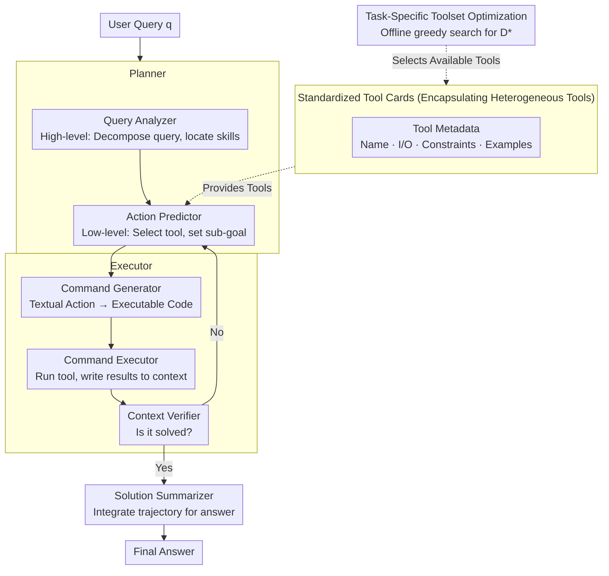

# OctoTools: An Agentic Framework with Extensible Tools for Complex Reasoning

**Conference**: ACL 2026  
**arXiv**: [2502.11271](https://arxiv.org/abs/2502.11271)  
**Code**: [https://github.com/octotools/octotools](https://github.com/octotools/octotools)  
**Area**: LLM Reasoning  
**Keywords**: Agent framework, tool-augmented reasoning, multi-step planning, tool cards, extensibility

## TL;DR

OctoTools is a training-free, user-friendly, and extensible multi-agent framework that encapsulates heterogeneous tools via standardized **Tool Cards**, employs a **Planner-Executor** separation paradigm, and utilizes a **task-specific toolset optimization** algorithm. It achieves an average accuracy improvement of +9.3% over GPT-4o and up to +10.6% over frameworks like AutoGen/LangChain across 16 diverse benchmarks.

## Background & Motivation

**Background**: LLMs have made significant progress in tasks like summarization, translation, and code generation, but complex reasoning tasks involving multi-step logic decomposition or domain-specific knowledge remain challenging. Tool-augmented LLMs represent a promising direction by offloading specialized sub-tasks to external tools (search engines, calculators, domain models, etc.).

**Limitations of Prior Work**: (1) Many methods require substantial training data and fine-tuning, limiting adaptability to new domains; (2) Some methods are domain-specific (chemistry, vision, medical, etc.) and lack generality; (3) Existing general frameworks (AutoGen, LangChain, GPT-Functions) focus more on high-level abstraction or multi-agent collaboration, with insufficient quantitative evaluation for complex reasoning; (4) Merging planning and code execution into a single model leads to cognitive overload and errors.

**Key Challenge**: How to build an agent framework that is simultaneously general (cross-domain), efficient (multi-step reasoning + tool calling), and requires no additional training.

**Goal**: Propose a training-free, modular, and extensible agent framework that consistently improves performance across diverse complex reasoning tasks.

**Key Insight**: Standardize tool encapsulation (Tool Cards), decouple strategic planning from command execution (Planner vs. Executor), and automate tool selection (task-specific toolset optimization).

**Core Idea**: Construct a modular multi-step reasoning pipeline through standardized tool card interfaces + layered Planner-Executor architecture + greedy toolset optimization, where every component focuses on its specific role.

## Method

### Overall Architecture

Given a user query $q$ and a pre-trained model $\text{LLM}_\theta$, OctoTools operates iteratively: The **Planner** first performs high-level planning—the Query Analyzer decomposes the query and identifies required skills and candidate tools; it then performs low-level planning at each step—the Action Predictor selects a tool for the current step and sets a sub-goal. The task is then handed to the **Executor**: the Command Generator translates textual actions into executable code, the Command Executor calls the tools and writes structured results into the context, and the Context Verifier determines if the problem is solved. If not, it returns to the next planning step; if solved, the **Solution Summarizer** integrates the entire trajectory to generate the final answer. All tools are encapsulated via standardized **Tool Cards**, and the actual subset of tools available for each task is selected offline by the **task-specific toolset optimization** algorithm.

### Key Designs

**1. Standardized Tool Cards: Encapsulating Heterogeneous Tools with a Unified Interface**

OctoTools wraps diverse tools—such as search engines, code executors, and domain classifiers—into "Tool Cards." Each card describes a tool using standardized metadata: name, input/output types, usage constraints, best practices, and call examples, implementing two fixed functions: `execute()` and `get_metadata()`. Crucially, metadata is written for the LLM; the Planner reads the cards to autonomously judge whether a tool fits the current sub-goal, eliminating the need to hard-code tool logic into the framework. Adding a new tool only requires a new compliant card without changing framework code. This addresses the pain point of "extensive engineering for every new tool" in previous frameworks, making tool extension truly plug-and-play.

**2. Planner-Executor Separation Architecture: Decoupling "How to Do" from "Specific Execution"**

Requiring a single LLM to perform both planning and code generation often leads to errors due to role overload. OctoTools decouples decision-making and execution into two agents. The Planner focuses on "thinking": the Query Analyzer performs high-level planning by reading the query and identifying skills and candidate tools; the Action Predictor follows with low-level planning, selecting specific tools and sub-goals step-by-step. The Executor focuses on "doing": the Command Generator translates textual actions into executable Python commands, the Command Executor runs the tools and writes results back, and the Context Verifier checks if information is sufficient to answer, deciding whether to iterate or finish. Finally, the Solution Summarizer integrates the reasoning trajectory. Each component uses specialized prompt templates, improving reliability and making error diagnosis easier.

**3. Task-Specific Toolset Optimization: Automatically Selecting Effective Tool Subsets**

Extending all available tools to the Planner simultaneously can introduce noise and decrease accuracy. OctoTools uses a three-stage greedy search on a validation set: first, run a baseline accuracy with a base toolset $\mathcal{D}_{\text{base}}$; then, add candidate tools $d_i$ individually to measure marginal gain $\Delta_{d_i} = \text{Acc}(\mathcal{D}_i) - \text{Acc}(\mathcal{D}_{\text{base}})$; finally, aggregate all tools with positive gains into the optimal toolset $\mathcal{D}^* = \mathcal{D}_{\text{base}} \cup \{d_i \mid \Delta_{d_i} > 0\}$. While this greedy strategy sacrifices global optimality (avoiding $2^n$ permutations), it reduces complexity to $O(n)$ and outperforms "all-tools" configurations in most tasks.

## Key Experimental Results

### Main Results

| Method | Avg. Accuracy (16 tasks) | vs 0-shot | vs CoT |
|---|---|---|---|
| GPT-4o 0-shot | 49.2% | — | — |
| GPT-4o CoT | 50.8% | — | — |
| OctoTools_base (Base tools only) | 53.4% | +4.2% | +2.6% |
| **OctoTools** (Optimized toolset) | **58.5%** | **+9.3%** | **+7.7%** |

| Method | Avg. Accuracy | vs OctoTools |
|---|---|---|
| AutoGen | 47.9% | -10.6% |
| GPT-Functions | 51.0% | -7.5% |
| LangChain | 51.2% | -7.3% |
| **OctoTools** | **58.5%** | — |

### Ablation Study

| Ablation Dimension | Result |
|---|---|
| Base Tools vs. All Tools vs. Optimized Toolset | 53.9% vs. 57.4% vs. 58.9% |
| Max Steps (1→10 steps) | Performance generally improves with more steps |
| Weaker LLM (GPT-4o-mini) | Still achieves an average gain of +7.1% |

### Key Findings

1. **Significant Difference in Tool Utilization**: OctoTools' external tool usage rate is 67.8%, compared to AutoGen's 10.6% and LangChain's 10.7%—indicating that competing frameworks fail to effectively utilize external tools.
2. **Contributions of Decomposition vs. Tools**: Tasks can be categorized into three types: those benefiting mostly from multi-step decomposition (e.g., Hallusion-VD), those benefiting from tool calls (e.g., PathCLS +22.2%), and those benefiting from both (e.g., Game of 24).
3. **Largest Gains in Medical Domain**: PathCLS +22.2%, PathVQA +21.4%, showing the high value of integrating specialized domain tools (e.g., the CONCH pathology classifier).
4. **Significant Boost in Proxy Tasks (GAIA-Text)**: +9.7%, requiring the coordination of 5 different tools, demonstrating the framework's advantage in complex multi-step tasks.

## Highlights & Insights

1. **Tool Cards are the core design highlight**: Standardized metadata descriptions allow tools to be autonomously understood and selected by the LLM, achieving true open-ended tool extension.
2. **Extremely detailed analysis in an 88-page paper**: Including complete configurations for 16 benchmarks and 11 tools, extensive visualizations, and case studies, providing high reference value for future research.
3. **Clear Planner-Executor separation**: Avoids LLM overload from simultaneous planning and code generation, with specialized prompt templates for each component.
4. **Simple yet effective greedy toolset optimization**: Although not guaranteed to find a global optimum, experiments prove it outperforms the "all-tools" configuration in most tasks.

## Limitations & Future Work

1. **Dependence on GPT-4o**: All experiments are based on GPT-4o; performance on open-source models is unknown (only GPT-4o-mini was tested).
2. **Toolset optimization requires a validation set**: Greedy search requires ~100 validation samples, making it unavailable for cold-start scenarios.
3. **Single-Agent Architecture**: Multi-agent collaboration scenarios were not explored; complex tasks might benefit from discussion and correction between agents.
4. **Sequential Execution**: Only one tool is called per step; the lack of support for parallel tool calls may impact efficiency.
5. **Human effort in Tool Card design**: While adding tools is simpler than before, it still requires manual writing of metadata and examples.

## Related Work & Insights

1. **Chameleon (Lu et al., 2023)**: A previous plug-and-play compositional reasoning framework, but with limited tool support and no multi-step iteration.
2. **Visual Sketchpad (Hu et al., 2024)**: A visual reasoning agent, but restricted to the visual domain.
3. **AutoGen/LangChain**: General agent frameworks that quantitatively perform worse than OctoTools on complex reasoning benchmarks.
4. **ReAct (Yao et al., 2022)**: The classic paradigm of interleaved reasoning and acting; OctoTools builds on this by introducing Tool Cards and hierarchical planning.

## Rating

- **Novelty**: ⭐⭐⭐⭐ — Clever design of standardized Tool Cards and the Planner-Executor paradigm; practical toolset optimization algorithm.
- **Experimental Thoroughness**: ⭐⭐⭐⭐⭐ — 16 benchmarks, 4 comparison frameworks, exhaustive ablation, and case studies; the 88-page paper is exceptionally comprehensive.
- **Writing Quality**: ⭐⭐⭐⭐ — Clear structure, rich visualizations, and intuitive case presentations.
- **Value**: ⭐⭐⭐⭐ — Provides a practical open-source agent framework template with high reference value for agent developers.

<!-- RELATED:START -->

## Related Papers

- [\[ACL 2025\] Agentic Reasoning: A Streamlined Framework for Enhancing LLM Reasoning with Agentic Tools](../../ACL2025/llm_agent/agentic_reasoning_tools.md)
- [\[ACL 2026\] GOAT: A Training Framework for Goal-Oriented Agent with Tools](goat_a_training_framework_for_goal-oriented_agent_with_tools.md)
- [\[ACL 2026\] Don't Adapt Small Language Models for Tools; Adapt Tool Schemas to the Models](don39t_adapt_small_language_models_for_tools_adapt_tool_schemas_to_the_models.md)
- [\[ACL 2026\] MCP-Flow: Facilitating LLM Agents to Master Real-World, Diverse and Scaling MCP Tools](mcp-flow_facilitating_llm_agents_to_master_real-world_diverse_and_scaling_mcp_to.md)
- [\[ACL 2026\] Temp-R1: A Unified Autonomous Agent for Complex Temporal KGQA via Reverse Curriculum Reinforcement Learning](temp-r1_a_unified_autonomous_agent_for_complex_temporal_kgqa_via_reverse_curricu.md)

<!-- RELATED:END -->
