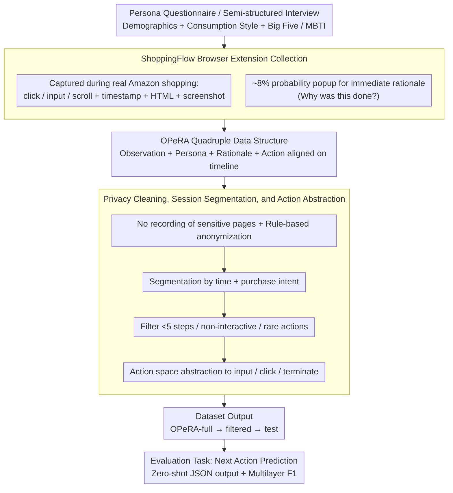

# OPeRA: A Dataset of Observation, Persona, Rationale, and Action for Evaluating LLMs on Human Online Shopping Behavior Simulation

**Conference**: ACL 2026  
**arXiv**: [2506.05606](https://arxiv.org/abs/2506.05606)  
**Code**: No public code; Dataset: [HuggingFace](https://huggingface.co/datasets/NEU-HAI/OPeRA)  
**Area**: LLM Agent / User Behavior Simulation / Dataset  
**Keywords**: User behavior simulation, Online shopping, Persona, Rationale, Web Agent evaluation

## TL;DR

OPeRA is a user behavior dataset collected from real Amazon shopping processes. It aligns personas, web observations, fine-grained actions, and real-time rationales on the same timeline to evaluate whether LLMs can truly simulate a specific user's next shopping behavior.

## Background & Motivation

**Background**: LLM agents are capable of performing tasks such as searching, navigating, purchasing, and form filling in web environments. They are also frequently used as "user proxies" in UI/UX testing, social science experiments, and recommender system evaluations.

**Limitations of Prior Work**: Many existing evaluations only focus on task completion or aggregate results such as final surveys, purchases, or clicks. These metrics fail to address a more detailed question: Does the model observe the page, weigh preferences, explain rationales, and take actions at each step like a real user?

**Key Challenge**: Task-oriented web agents pursue the shortest path and high success rates, whereas real human shopping behavior often involves non-linear paths like iterative comparisons, reading reviews, modifying search terms, and abandoning purchases. To evaluate "human-likeness," one must record not only actions but also the page context at the time of the action, the user's long-term preferences, and their immediate reasoning.

**Goal**: To build a public dataset and benchmark that allows researchers to evaluate an LLM's ability to simulate the next behavior of a specific user on the same set of real trajectories.

**Key Insight**: The authors chose online shopping as the starting point because shopping inherently involves individual preferences, budget constraints, brand/price/review trade-offs, multi-step page interactions, and clear session outcomes, making it a suitable testing ground for personalized behavior simulation.

**Core Idea**: A browser extension is used to synchronously collect Observation, Persona, Rationale, and Action during natural shopping by real users. This allows both "what the user did" and "why they did it" to be integrated into the behavior simulation evaluation of LLM agents.

## Method

### Overall Architecture

The construction of OPeRA follows a "collection-cleaning-evaluation" pipeline. Participants first complete a persona questionnaire (with optional semi-structured interviews) and then use the ShoppingFlow Chrome extension for four weeks to shop on Amazon as usual. The extension records actions, timestamps, target elements, full and simplified HTML, screenshots, and product metadata in the background. It prompts users for "why they did this" (rationale) with a probability of approximately 8%. Raw logs undergo privacy cleaning, session segmentation, action filtering, and action space abstraction to produce OPeRA-full and OPeRA-filtered (optimized for modeling), from which OPeRA-test is derived. Each shopping session is organized as a time series. The model task is to solve $a_t = F_{action}(a_{1\ldots t-1}, r_{1\ldots t-1}, o_{1\ldots t}, P_i)$—given the user persona $P_i$, historical actions $a$, historical rationales $r$, and current web observations $o$, predict the next action.

### Key Designs

**1. OPeRA Quadruple Data Structure: Feeding "What is Seen" and "Why it is Done" to the Model**

Previous e-commerce datasets mostly retained aggregated results like clicks or purchases, losing the page context and the user's internal reasons. OPeRA unifies four types of signals needed for behavior simulation into the same user trajectory: each user has a persona (long-term preferences like demographics, shopping habits, consumer style, Big Five, MBTI), each session is a time-ordered action trace, some actions have user-provided rationales, and each step is paired with web observations (full/simplified HTML, screenshots, product metadata). Thus, Observation corresponds to the environment, Persona to the user's long-term state, Rationale to the immediate intent, and Action to the verifiable output.

**2. ShoppingFlow Browser Extension: Low-interference Granular Signal Capture in Real Shopping**

Asking annotators for reasons post-hoc introduces recall bias, while asking users to explain every step disrupts the natural shopping flow. OPeRA uses an extension as a compromise. The Content Script captures interactions (click, input, scroll) and records timestamps, target elements, and HTML within Amazon pages. The Background Script handles page-level events, navigation, and uploads. Rationale popups are triggered after key interactions with an ~8% probability to capture the immediate mental state while keeping the disturbance to natural behavior acceptable.

**3. Privacy Cleaning, Session Segmentation, and Action Abstraction: Transforming Raw Logs into a Public Benchmark**

Raw web logs are noisy and pose privacy risks. The system avoids recording sensitive pages (login, account, checkout) and uses rule-based scripts to mask names, zip codes, addresses, affiliations, and payment info. Continuous behavior streams are segmented by time intervals and purchase intent events. Sessions with fewer than 5 steps or actions on non-interactive areas/rare pages are filtered. For evaluation, the action space is compressed into input, click, and terminate, with clicks further subdivided into semantic types (review, search, product_option, product_link, purchase) to create a reproducible benchmark.

### Loss & Training

This paper does not train a new model but establishes a zero-shot, prompt-based evaluation protocol. Models must output the next action in strict JSON format: click requires a target, input requires a field and text, and terminate indicates the end of the session. Scoring utilizes exact match and multilayer F1. Exact match is used for full action generation, while macro/weighted F1 is used for high-level action types, weighted F1 for click sub-types, and session outcome evaluation to measure if the model predicts purchase or termination.

## Key Experimental Results

### Main Results

OPeRA-full contains 692 shopping sessions, 28,904 action-observation pairs, and 604 manual rationales contributed by 51 users.  
OPeRA-filtered contains 527 sessions, 5,856 pairs, and 207 rationales after cleaning and abstraction.  
OPeRA-test comprises 90 sessions from 15 users, evaluating GPT-4.1, DeepSeek-R1, Claude-3.7-Sonnet, and Llama-3.3-70B-Instruct.

| Model | Next Action Acc. | Action Type Macro F1 | Click Type Weighted F1 | Outcome Weighted F1 |
|-------|------------------|----------------------|------------------------|---------------------|
| GPT-4.1 | 21.51 | 48.78 | 44.47 | 47.54 |
| DeepSeek-R1 | 14.75 | 27.37 | 35.12 | 46.36 |
| Claude-3.7-Sonnet | 10.75 | 31.58 | 27.27 | 43.52 |
| Llama-3.3-70B-Instruct | 8.31 | 24.29 | 19.99 | 36.64 |

Main findings indicate that even for the strongest model (GPT-4.1), the exact match for the next action is only ~21.5%, exposing the difficulty of fine-grained human simulation.

### Ablation Study

The authors examined the impact of persona and historical rationales on model behavior.

| Model / Config | Next Action Acc. | Action Type Macro F1 | Click Type Weighted F1 | Outcome Weighted F1 |
|----------------|------------------|----------------------|------------------------|---------------------|
| GPT-4.1 full | 21.51 | 48.78 | 44.47 | 47.54 |
| GPT-4.1 w/o persona | 22.06 | 45.55 | 43.45 | 58.47 |
| GPT-4.1 w/o rationale | 21.28 | 34.93 | 42.63 | 51.17 |
| DeepSeek-R1 full | 14.75 | 27.37 | 35.12 | 46.36 |
| DeepSeek-R1 w/o rationale | 15.74 | 27.16 | 32.65 | 47.92 |
| Claude-3.7 full | 10.75 | 31.58 | 27.27 | 43.52 |
| Claude-3.7 w/o rationale | 10.08 | 26.06 | 20.29 | 43.10 |
| Llama-3.3 full | 8.31 | 24.29 | 19.99 | 36.64 |
| Llama-3.3 w/o rationale | 8.76 | 23.60 | 19.22 | 34.19 |

The persona acts as a prior for "how this user usually shops," helping with action and click type classification, though it can become noise if not integrated properly with page state. Rationales provide more stable benefits; removing them often leads to drops in action type or outcome prediction, confirming that why a user acts helps align the current intent.

### Key Findings

- The primary source of error is incorrect click targets: models usually know a user will click but struggle to select the specific button, item, filter, or review entry a real user would choose on a complex page.
- Terminate actions are rarely predicted by models, especially Claude and Llama. This suggests current LLM agents have an optimization bias toward "completing tasks," whereas real users frequently leave due to dissatisfaction or indecision.
- Inputting exact search queries is difficult. Search terms are not just semantic repetitions but the result of user goals, brand preferences, budgets, and page feedback.
- The value of OPeRA lies in demonstrating that current LLMs are weak at step-level personalized simulation of real users.

## Highlights & Insights

- **Capturing rationales at the moment of behavior**: This is closer to the user's true mental state than post-hoc labeling and allows models to learn the "reason behind the action."
- **Quadruple structure as an agent evaluation foundation**: It covers the primary variables of personalized behavior simulation: Environment (Observation), Long-term state (Persona), Local intent (Rationale), and Verifiable output (Action).
- **Discrepancy between web agents and human simulation**: Completing a task is not equivalent to simulating a person. Real users browse aimlessly, hesitate, read reviews, and exit early—behaviors often ignored by task-oriented agents.
- **Multidisciplinary value**: The dataset connects recommendation, UX, and agent research, supporting next-action prediction, personalized recommendation, and synthetic user trajectory generation.

## Limitations & Future Work

- The data is confined to Amazon online shopping and English-speaking users; cross-cultural and cross-platform generalization requires verification.
- OPeRA-filtered omits actions like scroll and navigate to maintain evaluability, sacrificing some continuity of real web browsing.
- Although screenshots were collected, they were not used in the experiments; visual layout and images significantly influence shopping decisions.
- Rationales are sparsely sampled, and popups may slightly interfere with natural behavior.
- Minor inconsistencies exist between action counts in the text and table captions in the current version.

## Related Work & Insights

- **vs. E-commerce Datasets (Amazon Review, Taobao, etc.)**: Those are larger and suitable for recommendation but lack step-by-step web observations and immediate rationales; OPeRA has higher semantic density.
- **vs. Web Agent Benchmarks (Mind2Web, WebArena, etc.)**: Those emphasize task completion or instruction following with synthetic trajectories; OPeRA emphasizes natural behavior and predicting the "next step of this specific person."
- **vs. Role-playing Agents/Social Simulation**: Many works use persona prompts for plausible group behavior but lack validation against real trajectories; OPeRA provides grounded supervision signals.
- **Insight**: To train more human-like shopping agents, persona prompts are insufficient. One may need rationales as intermediate supervision and include "hesitation" or "termination" in reward functions while modeling both structure and vision.

## Rating

- Novelty: ⭐⭐⭐⭐⭐ Systematically integrating Observation, Persona, Rationale, and Action from real shopping into a public benchmark is highly valuable.
- Experimental Thoroughness: ⭐⭐⭐⭐ Covers four strong models and ablation studies, though it remains focused on zero-shot evaluation.
- Writing Quality: ⭐⭐⭐⭐ The data construction process is clear and tables are helpful.
- Value: ⭐⭐⭐⭐⭐ Directly relevant to LLM agents, personalized recommendation, and digital twin modeling.

<!-- RELATED:START -->

## Related Papers

- [\[ACL 2026\] StructMem: Structured Memory for Long-Horizon Behavior in LLMs](structmem_structured_memory_for_long-horizon_behavior_in_llms.md)
- [\[ACL 2026\] HAG: Hierarchical Demographic Tree-based Agent Generation for Topic-Adaptive Simulation](hag_hierarchical_demographic_tree-based_agent_generation_for_topic-adaptive_simu.md)
- [\[ACL 2026\] CodeStruct: Code Agents over Structured Action Spaces](codestruct_code_agents_over_structured_action_spaces.md)
- [\[CVPR 2026\] WebChain: A Large-Scale Human-Annotated Dataset of Real-World Web Interaction Traces](../../CVPR2026/llm_agent/webchain_a_large-scale_human-annotated_dataset_of_real-world_web_interaction_tra.md)
- [\[ICML 2026\] MCP-Persona: 用环境模拟评估 LLM agent 在真实个人化应用上的能力](../../ICML2026/llm_agent/mcp-persona_benchmarking_llm_agents_on_real-world_personal_applications_via_envi.md)

<!-- RELATED:END -->
