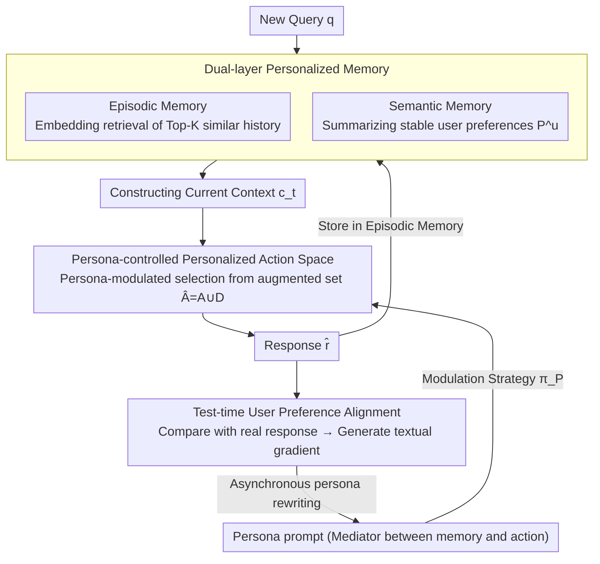

# PersonaAgent: Bridging Memory and Action for Personalized LLM Agents

**Conference**: ACL2026  
**arXiv**: [2506.06254](https://arxiv.org/abs/2506.06254)  
**Code**: The paper has not explicitly released the code  
**Area**: LLM Agent / Personalized Agents  
**Keywords**: Personalized Agent, Long-term Memory, Persona Prompt, Test-time Alignment, LaMP

## TL;DR
PersonaAgent connects user history with tool-based actions through "personalized memory + personalized actions + test-time optimizable persona prompts," significantly outperforming baselines such as RAG, PAG, ReAct, and MemBank on multiple LaMP personalized decision-making tasks.

## Background & Motivation
**Background**: While LLM agents can call tools, maintain memory, and perform multi-step reasoning, most remain biased toward generic task execution. Personalization is commonly seen in user profiling, retrieval-augmented generation (RAG), or user-specific fine-tuning, which typically utilize personal information only during the text generation phase.

**Limitations of Prior Work**: The action space of generic agents does not vary by user, leading to "one-size-fits-all" strategies. User-specific fine-tuning is difficult to support for large-scale users and frequent updates. Fixed RAG/PAG workflows, while capable of reading user data, lack agentic decision-making capabilities and cannot continuously adjust tool calls or behavioral strategies.

**Key Challenge**: True personal intelligence requires satisfying agentic intelligence, real-world deployment viability, personal data utilization, and real-time preference alignment simultaneously. Existing methods often cover only one or two of these. Personalization should not only occur in the final output text but also influence which tools the agent selects, which memories it retrieves, and how it interprets the current task.

**Goal**: The authors aim to establish a unified framework that allows LLM agents to read user history, abstract long-term preferences, call personalized tools, and dynamically update the user persona based on recent interactions at test time when executing personalized tasks.

**Key Insight**: The paper defines a persona as a unique system prompt for each user. It is not a static profile but an intermediary between the memory and action modules: memory provides evidence for the persona, the persona controls actions, and action results in turn update memory and the persona.

**Core Idea**: Use the persona prompt as the central controller of the personalized agent and optimize this controller at test time through textual feedback from recent interactions.

## Method
The design of PersonaAgent can be understood as adding a "user-level operating system" layer to a generic LLM agent. While an ordinary agent selects tools based on task context, PersonaAgent first compresses user history into an actionable persona, which then influences tool selection, memory retrieval, reasoning paths, and final decisions.

### Overall Architecture
The framework consists of two complementary modules and an intermediary variable. The personalized memory module is responsible for storing user interactions, divided into episodic memory and semantic memory. The personalized action module adjusts tool calls and behavioral strategies based on the persona. The persona prompt converts user evidence from memory into behavioral constraints that the agent can use at each step.

When a new query arrives, the system first retrieves similar history from episodic memory and combines it with stable user profiles from semantic memory to form a context. Subsequently, the agent selects actions under persona modulation—such as using external knowledge, retrieving personalized history, updating memory, or performing persona-guided reasoning. The test-time alignment module simulates recent user interactions, compares the textual differences between the agent's response and the real user response, and generates a "textual gradient" using an LLM to update the persona.

### Key Designs

**1. Dual-layer Personalized Memory: Using episodic layer for evidence and semantic layer for preferences**

Relying solely on episodic retrieval makes the context long and noisy; relying only on a user profile flattens specific behavioral details. PersonaAgent splits memory into two layers to handle both ends: episodic memory stores $(q_i,r_i^{gt},m_i)$ for each user, retrieving Top-K precedents via embedding similarity; semantic memory uses a summarization prompt to abstract the collection of events into a stable user profile $P^u=f_s(S_t,D^u)$. The two layers serve distinct functions: the episodic layer allows the agent to see "what this user did specifically before," and the semantic layer helps it maintain "what the user's long-term preference is." Consequently, the retrieved context contains concrete evidence without being overwhelmed by noise.

**2. Persona-Controlled Personalized Action Space: Moving personalization from "answer content" to "action selection"**

The key to many personalized tasks is not just "sounding like the user," but knowing when to consult personal history, when to rely on external knowledge, and when to let long-term preferences override generic judgments—generic agents' action spaces do not change per user. PersonaAgent expands the action set from generic $A$ to $\hat{A}=A\cup D$, where $D$ includes tools for accessing user data and history. The action policy is defined as $a_t\sim\pi_P(\cdot|c_t)$, modulated by persona $P$. Thus, the persona is no longer just a stylistic decoration during final generation but directly determines which tool to select, which memory to retrieve, and which reasoning path to follow at each step. Personalization is injected at the action layer rather than just the output layer.

**3. Test-time User Preference Alignment: Using textual gradients to evolve personas with recent behavior**

User preferences drift, and a single summarized profile cannot be accurate forever, yet training a model for each user is unfeasible. PersonaAgent's solution is test-time persona optimization: given a recent batch $D_{batch}=\{(q_j,\hat{r}_j,r_j^{gt})\}$, the LLM compares the agent's simulated response with the user's real response to generate a natural language textual loss feedback, which LLM_update then uses to rewrite the persona. Formally, this is equivalent to solving:

$$P^*=\arg\min_P\sum_j L(\hat{r}_j,r_j^{gt}\mid q_j)$$

where the "gradient" is feedback described in text by the LLM, and the "update" is the LLM rewriting the persona prompt. The entire optimization is performed asynchronously, avoiding latency for the next online response—bypassing the cost of frequent model training in large-scale scenarios while retaining individual-level continuous adaptation.

### Mechanism: Closing the loop for a personalized query

When a new query $q$ arrives, the system first retrieves Top-K similar precedents from episodic memory via embedding similarity and layers them with the stable profile from semantic memory to form the current context $c_t$. The agent then selects an action from the extended action space $\hat{A}$ under the modulation of persona $P$—which might involve retrieving more personal history, calling external knowledge, performing persona-guided reasoning, or updating memory—to finally provide a response $\hat{r}$. This interaction's $(q,\hat{r},r^{gt})$ is stored in episodic memory. Once a batch of recent interactions is collected, the test-time alignment module asynchronously compares simulated and real responses, generating textual feedback to rewrite the persona to better fit the user. Consequently, the next query uses a refined persona: memory feeds evidence to the persona, the persona controls the action, and the action results flow back to update memory and the persona, forming a closed loop more akin to a long-term personal assistant than a fixed RAG process.

### Loss & Training
PersonaAgent does not rely on user-level model fine-tuning; instead, it performs test-time optimization via prompts and textual feedback. The paper formalizes persona optimization as $P^*=\arg\min_P\sum_j L(\hat{r}_j,r_j^{gt}|q_j)$, but the actual gradient is represented as natural language feedback by LLM_grad and the persona is rewritten by LLM_update. In experiments, Claude-3.5 Sonnet is used as the unified execution model by default, keeping input and output formats consistent to isolate the gains provided by the framework design.

## Key Experimental Results

### Main Results

| Task | Metric | Strong Baseline | PersonaAgent | Gain |
|------|------|--------|--------------|------|
| LaMP-1 Citation Identification | Acc / F1 | MemBank 0.862 / 0.861 | 0.919 / 0.918 | Clear improvement in personalized citation selection |
| LaMP-2M Movie Tagging | Acc / F1 | MemBank 0.470 / 0.391 | 0.513 / 0.424 | Better capture of user movie preferences |
| LaMP-2N News Categorization | Acc / F1 | PAG 0.768 / 0.509 | 0.796 / 0.532 | Combining profile with action outperforms fixed workflows |
| LaMP-3 Product Rating | MAE / RMSE | ICL 0.277 / 0.543 | 0.241 / 0.509 | Lowest error in numerical rating |

### Ablation Study

| Configuration | LaMP-1 Acc/F1 | LaMP-2M Acc/F1 | LaMP-2N Acc/F1 | LaMP-3 MAE/RMSE | Description |
|------|---------------|----------------|----------------|-----------------|------|
| Full PersonaAgent | 0.919 / 0.918 | 0.513 / 0.424 | 0.796 / 0.532 | 0.241 / 0.509 | Complete System |
| w/o alignment | 0.894 / 0.893 | 0.487 / 0.403 | 0.775 / 0.502 | 0.259 / 0.560 | General decrease without test-time alignment |
| w/o persona | 0.846 / 0.855 | 0.463 / 0.361 | 0.769 / 0.483 | 0.277 / 0.542 | Persona mediator is critical for memory-action bridging |
| w/o Memory | 0.821 / 0.841 | 0.460 / 0.365 | 0.646 / 0.388 | 0.348 / 0.661 | Lack of historical user context causes significant harm |
| w/o Action | 0.764 / 0.789 | 0.403 / 0.329 | 0.626 / 0.375 | 0.375 / 0.756 | Reasoning alone is insufficient; personalized actions are most critical |

### Key Findings
- PersonaAgent achieved the best performance across all four decision-making tasks, notably improving Acc on LaMP-1 from MemBank's 0.862 to 0.919, indicating that persona-guided memory/action is effective for topic-level user interests.
- Ablations show that the action module has the greatest impact; without it, LaMP-3 MAE worsened from 0.241 to 0.375. This suggests that personalized tool actions are more important than simply forcing user profiles into the prompt.
- Test-time scaling provides benefits: increasing the alignment batch size, adding a small number of alignment iterations, and retrieving more memory entries enhanced personalization on LaMP-2M, though gains plateaued or slightly decreased after approximately 3 iterations.
- In efficiency analysis, PersonaAgent averaged 1.79 seconds per sample, slower than PAG's 1.24 seconds but significantly faster than ReAct's 2.61 seconds and MemBank's 2.92 seconds; authors emphasize that persona optimization is asynchronous and does not add to real-time online latency.
- In cold-start experiments restricting each user to 10 historical interactions, PersonaAgent remained the best across all four LaMP tasks, e.g., 0.845 Acc on LaMP-1 and 0.301 MAE on LaMP-3.

## Highlights & Insights
- The most valuable part of the paper is the elevation of the persona from "text describing the user" to a "policy mediator controlling agent actions." This ensures personalization is not just a style adjustment at the end but integrated throughout retrieval, tool selection, and reasoning.
- Test-time textual gradients are well-suited for personalization. They require no parameter training per user and do not require users to explicitly write preferences; as long as real responses from recent interactions exist, the persona can be iteratively rewritten.
- The closed-loop design of memory and action is natural. Action results update memory, memory rewrites the persona, and the persona controls the next round of actions, making this closer to a long-term personal assistant than fixed RAG flows.
- Ablation results provide a clear signal: for a personalized agent, adding memory is insufficient; memory must influence the action policy.

## Limitations & Future Work
- Authors acknowledge that textual feedback may overlook implicit or multimodal user signals, such as emotions, visual preferences, behavioral dwell time, etc. Future work could incorporate clicks, voice, images, or physiological feedback into persona updates.
- Frequent use of personalized data for memory retrieval and persona optimization poses privacy risks. The paper mentions exploring privacy-preserving mechanisms like federated learning, though they are not implemented in the current framework.
- The experiments primarily validate on LaMP tasks; stability during long-term real-world deployment regarding preference drift, malicious feedback, data expiration, and cross-device synchronization has not been systematically evaluated.
- Automatic persona prompt updates might accumulate errors. If a ground truth for an interaction is noisy, the textual gradient might push the persona toward incorrect preferences, requiring more robust update and rollback mechanisms.

## Related Work & Insights
- **vs RAG / PAG**: RAG retrieves user history, and PAG uses profiles, but both are usually fixed workflows; PersonaAgent allows the persona to modulate action policy, deciding when, what, and how to retrieve and use evidence.
- **vs ReAct**: ReAct possesses tool-use and reasoning capabilities but lacks user-level alignment; PersonaAgent adds personalized memory and persona control to a ReAct-like agentic loop.
- **vs MemBank**: MemBank emphasizes long-term memory but lacks strong personalized action control; PersonaAgent's ablations show that while memory is important, the action module and persona bridge are the core of performance.
- **vs User-specific Fine-tuning**: Fine-tuning can achieve individual alignment but is costly to compute and maintain; PersonaAgent avoids the cost of frequently updating model parameters in large-scale scenarios via test-time prompt optimization.

## Rating
- Novelty: ⭐⭐⭐⭐ High conceptual integration by combining memory, action, and persona prompts into a test-time optimizable framework.
- Experimental Thoroughness: ⭐⭐⭐⭐ Includes main experiments, ablations, persona analysis, test-time scaling, base model variations, efficiency, and cold starts; real-world online user studies are missing.
- Writing Quality: ⭐⭐⭐⭐ Clear motivation and comprehensive tables; some descriptions of formulas and algorithms lean toward prompt engineering and could be more specific.
- Value: ⭐⭐⭐⭐⭐ Highly insightful for building personal assistants, recommender agents, and long-term interactive systems, especially the persona-as-controller design.

<!-- RELATED:START -->

## Related Papers

- [\[ACL 2026\] ProPer Agents: Proactivity Driven Personalized Agents for Advancing Knowledge Gap Navigation](proper_agents_proactivity_driven_personalized_agents_for_advancing_knowledge_gap.md)
- [\[ICML 2026\] Memory is Reconstructed, Not Retrieved: Graph Memory for LLM Agents](../../ICML2026/llm_agent/memory_is_reconstructed_not_retrieved_graph_memory_for_llm_agents.md)
- [\[ICLR 2026\] FingerTip 20K: A Benchmark for Proactive and Personalized Mobile LLM Agents](../../ICLR2026/llm_agent/fingertip_20k_a_benchmark_for_proactive_and_personalized_mobile_llm_agents.md)
- [\[ACL 2026\] CodeStruct: Code Agents over Structured Action Spaces](codestruct_code_agents_over_structured_action_spaces.md)
- [\[ACL 2026\] Shopping Companion: A Memory-Augmented LLM Agent for Real-World E-Commerce Tasks](shopping_companion_a_memory-augmented_llm_agent_for_real-world_e-commerce_tasks.md)

<!-- RELATED:END -->
