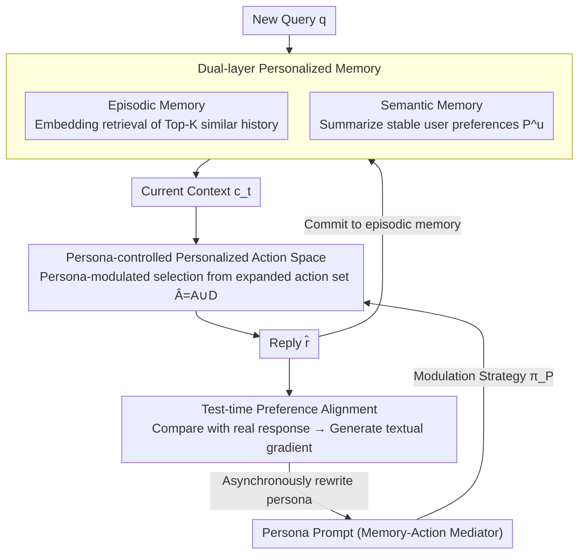

# PersonaAgent: Bridging Memory and Action for Personalized LLM Agents

**Conference**: ACL2026  
**arXiv**: [2506.06254](https://arxiv.org/abs/2506.06254)  
**Code**: Code not explicitly released in the paper  
**Area**: LLM Agent / Personalized Agents  
**Keywords**: Personalized Agent, Long-term Memory, Persona Prompt, Test-time Alignment, LaMP

## TL;DR
PersonaAgent bridges user history and tool actions using "personalized memory + personalized actions + test-time optimized persona prompts," significantly outperforming baselines such as RAG, PAG, ReAct, and MemBank on multiple LaMP personalized decision-making tasks.

## Background & Motivation
**Background**: LLM agents can already invoke tools, maintain memory, and perform multi-step reasoning, but most agents remain biased toward general-purpose task execution. Personalization is commonly seen in user profiling, retrieval augmentation, or user-specific fine-tuning, which typically only utilize personal information during the text generation stage.

**Limitations of Prior Work**: General agents have action spaces that do not vary by user, leading to "one-size-fits-all" strategies. User-specific fine-tuning is difficult to scale for large user bases and frequent updates. While fixed RAG/PAG workflows can read user data, they lack agentic decision-making capabilities and cannot continuously adjust tool calls or behavioral strategies.

**Key Challenge**: True personal intelligence requires satisfying agentic intelligence, real-world deployment viability, personal data utilization, and real-time preference alignment simultaneously. Existing methods often cover only one or two of these. Personalization should not just occur in the final response text but also influence tool selection, memory retrieval, and task interpretation.

**Goal**: The authors aim to establish a unified framework where LLM agents can read user history, abstract long-term preferences, invoke personalized tools, and dynamically update user personas based on recent interactions during test time.

**Key Insight**: The paper defines a persona as a unique system prompt for each user. It is not a static profile but a mediator between the memory module and the action module: memory provides evidence for the persona, the persona controls actions, and action results in turn update the memory and the persona.

**Core Idea**: Use a persona prompt as the central controller of the personalized agent and optimize this controller at test time via textual feedback from recent interactions.

## Method
The design of PersonaAgent can be understood as adding a "user-level operating system" to a general LLM agent. A standard agent selects tools based on task context; PersonaAgent first compresses user history into an actionable persona, which then influences tool selection, memory retrieval, reasoning paths, and final decisions.

### Overall Architecture
The framework consists of two complementary modules and a mediating variable. The personalized memory module stores user interactions across episodic memory and semantic memory. The personalized action module adjusts tool calls and behavioral strategies based on the persona. The persona prompt converts user evidence from memory into behavioral constraints for each agent step.

When a new query arrives, the system retrieves similar history from episodic memory and combines it with the stable user profile from semantic memory to form the context. The agent then selects actions under persona modulation, such as using external knowledge, retrieving personalized history, updating memory, or performing persona-guided reasoning. A test-time alignment module simulates recent user interactions, compares the text differences between agent replies and ground-truth user responses, and uses an LLM to generate a "textual gradient" to update the persona.

### Key Designs

**1. Dual-layer Personalized Memory: Evidence via Episodic Layer, Preferences via Semantic Layer**

Relying solely on episodic retrieval leads to noisy, long contexts; relying solely on a user profile wipes out specific behavioral details. PersonaAgent splits memory into two layers to address both: episodic memory stores $(q_i,r_i^{gt},m_i)$ for each user, retrieving Top-K historical precedents via embedding similarity when a new query arrives; semantic memory uses a summarization prompt to abstract the collection of events into a stable user profile $P^u=f_s(S_t,D^u)$. Each layer serves its purpose—the episodic layer allows the agent to see "specifically what the user did before," while the semantic layer ensures it adheres to "the user's long-term preferences." Consequently, the retrieved context contains specific evidence without being overwhelmed by noise.

**2. Persona-Controlled Personalized Action Space: Moving Personalization from "Content" to "Action Selection"**

The key to many personalized tasks is not "speaking like the user," but knowing when the agent should look at personal history, when to rely on external knowledge, and when to let long-term preferences override general judgment—yet a general agent's action space does not change per user. PersonaAgent expands the action set from a general $A$ to $\hat{A}=A\cup D$, where $D$ includes tools for accessing user data and history. The action strategy is defined as $a_t\sim\pi_P(\cdot|c_t)$, modulated by persona $P$. Thus, the persona is no longer just a stylistic decoration during final generation; it directly determines which tool to select, which memory to retrieve, and which reasoning path to take. Personalization is injected into the action layer rather than just the output layer.

**3. Test-time User Preference Alignment: Evolving Persona with Textual Gradients**

User preferences drift, and a one-time profile cannot remain accurate forever, yet training a model for every user is infeasible. PersonaAgent's solution is test-time persona optimization: given a recent batch $D_{batch}=\{(q_j,\hat{r}_j,r_j^{gt})\}$, the LLM compares the agent's simulated replies with real user responses to generate natural language "textual loss feedback," which an LLM_update then uses to rewrite the persona. Formally, this is equivalent to solving:

$$P^*=\arg\min_P\sum_j L(\hat{r}_j,r_j^{gt}\mid q_j)$$

where the "gradient" is textual feedback described by an LLM, and the "update" is the LLM rewriting the persona prompt. The entire optimization executes asynchronously, avoiding latency for the next online response—bypassing the costs of frequent model training in large-scale scenarios while retaining individual-level adaptation.

### Mechanism: Closing the Loop for a Personalized Query

When a new query $q$ arrives, the system first retrieves the Top-K similar precedents from episodic memory using embedding similarity and superimposes the stable profile $P^u$ from semantic memory to form the current context $c_t$. Next, under the modulation of persona $P$, the agent selects an action from the expanded action space $\hat{A}$—this might involve retrieving more personal history, invoking external knowledge, performing persona-guided reasoning, or updating memory—to ultimately provide a reply $\hat{r}$. This interaction $(q,\hat{r},r^{gt})$ is committed to episodic memory. Once enough recent interactions form a batch, the test-time alignment module asynchronously compares simulated and real responses, generating textual feedback to rewrite the persona into a form closer to the user. Thus, the next query uses a refined persona: memory feeds evidence to the persona, the persona controls actions, and action results flow back to update memory and persona, forming a closed loop more akin to a long-term personal assistant than a fixed RAG pipeline.

### Loss & Training
PersonaAgent does not rely on user-level model fine-tuning; instead, it performs test-time optimization via prompts and textual feedback. The paper formalizes persona optimization as $P^*=\arg\min_P\sum_j L(\hat{r}_j,r_j^{gt}|q_j)$, but actual gradients are represented by an LLM_grad via natural language feedback, followed by persona rewriting by an LLM_update. By default, Claude-3.5 Sonnet is used as the unified execution model in experiments, maintaining consistent input/output formats to isolate gains from framework design.

## Key Experimental Results

### Main Results

| Task | Metric | Strong Baseline | PersonaAgent | Gain |
|------|------|--------|--------------|------|
| LaMP-1 Citation Identification | Acc / F1 | MemBank 0.862 / 0.861 | 0.919 / 0.918 | Significant improvement in personalized citation selection |
| LaMP-2M Movie Tagging | Acc / F1 | MemBank 0.470 / 0.391 | 0.513 / 0.424 | Better capture of user movie preferences |
| LaMP-2N News Categorization | Acc / F1 | PAG 0.768 / 0.509 | 0.796 / 0.532 | Profile+Action combination superior to fixed workflow |
| LaMP-3 Product Rating | MAE / RMSE | ICL 0.277 / 0.543 | 0.241 / 0.509 | Lowest error in numerical rating |

### Ablation Study

| Configuration | LaMP-1 Acc/F1 | LaMP-2M Acc/F1 | LaMP-2N Acc/F1 | LaMP-3 MAE/RMSE | Description |
|------|---------------|----------------|----------------|-----------------|------|
| Full PersonaAgent | 0.919 / 0.918 | 0.513 / 0.424 | 0.796 / 0.532 | 0.241 / 0.509 | Full system |
| w/o alignment | 0.894 / 0.893 | 0.487 / 0.403 | 0.775 / 0.502 | 0.259 / 0.560 | Performance drop across the board without test-time alignment |
| w/o persona | 0.846 / 0.855 | 0.463 / 0.361 | 0.769 / 0.483 | 0.277 / 0.542 | Persona mediator is critical for memory-action bridging |
| w/o Memory | 0.821 / 0.841 | 0.460 / 0.365 | 0.646 / 0.388 | 0.348 / 0.661 | Missing user context significantly hurts performance |
| w/o Action | 0.764 / 0.789 | 0.403 / 0.329 | 0.626 / 0.375 | 0.375 / 0.756 | Reasoning alone is insufficient; personalized action is key |

### Key Findings
- PersonaAgent is the top performer across four decision-making tasks; notably, on LaMP-1, Acc increased from MemBank's 0.862 to 0.919, indicating that persona-guided memory/action is effective for topic-level user interests.
- Ablations show the action module has the greatest impact; removing it caused LaMP-3 MAE to degrade from 0.241 to 0.375. This suggests personalized tool actions are more important than simply stuffing user profiles into prompts.
- Test-time scaling yields benefits: increasing the alignment batch size, adding alignment iterations, and retrieving more memory entries all enhance personalization on LaMP-2M, though benefits plateau after ~3 iterations.
- Efficiency analysis shows PersonaAgent averages 1.79 seconds per sample, slower than PAG (1.24s) but significantly faster than ReAct (2.61s) and MemBank (2.92s); authors emphasize that persona optimization is asynchronous and does not add to real-time online latency.
- In cold-start experiments limited to 10 historical interactions per user, PersonaAgent remained optimal across four LaMP tasks (e.g., LaMP-1 Acc 0.845, LaMP-3 MAE 0.301).

## Highlights & Insights
- The most valuable contribution is elevating the persona from "text describing the user" to a "strategic mediator controlling agent actions." This ensures personalization is not just stylistic but permeates retrieval, tool selection, and reasoning.
- Test-time textual gradients are well-suited for personalization. They require no parameter training per user and do not require users to explicitly state preferences; as long as real responses for recent interactions exist, the persona can be iteratively rewritten.
- The closed-loop design of memory and action is natural. Action results update memory, which rewrites the persona, which in turn controls the next round of actions—closer to a long-term personal assistant than fixed RAG flows.
- Ablation results send a clear signal: for personalized agents, adding memory is not enough; memory must influence the action policy.

## Limitations & Future Work
- The authors acknowledge that textual feedback may overlook implicit or multi-modal user signals, such as emotion, visual preferences, or behavior dwell time. Future work could incorporate clicks, voice, images, or physiological feedback into persona updates.
- Frequent use of personalized data for memory retrieval and persona optimization poses privacy risks. The paper mentions exploring privacy-preserving mechanisms like federated learning, though they are not yet implemented in the current framework.
- Experiments focused on LaMP tasks; system evaluation in real-world long-term deployments regarding preference drift, malicious feedback, data expiration, and cross-device sync is still needed.
- Automatic persona prompt updates might accumulate errors. If a specific interaction's ground truth is noisy, the textual gradient might push the persona toward incorrect preferences, necessitating more robust update and rollback mechanisms.

## Related Work & Insights
- **vs RAG / PAG**: RAG retrieves user history and PAG uses profiles, but both are typically fixed workflows. PersonaAgent lets the persona modulate action policy, deciding when, what, and how to use evidence.
- **vs ReAct**: ReAct possesses tool-use and reasoning capabilities but lacks user-level alignment. PersonaAgent adds personal memory and persona control to ReAct-style agentic loops.
- **vs MemBank**: MemBank emphasizes long-term memory but has weaker control over personalized actions. PersonaAgent's ablation shows that while memory is important, the action module and persona bridge are the core of performance.
- **vs User-specific Fine-tuning**: Fine-tuning provides individual alignment but at high computational and maintenance costs. PersonaAgent avoids frequent parameter updates in large-scale scenarios by using test-time prompt optimization.

## Rating
- Novelty: ⭐⭐⭐⭐ High integration of memory, action, and persona prompt into a test-time optimizable personalized agent framework.
- Experimental Thoroughness: ⭐⭐⭐⭐ Includes main results, ablation, persona analysis, test-time scaling, base model variations, efficiency, and cold-start; lacks real online user studies.
- Writing Quality: ⭐⭐⭐⭐ Clear motivation, comprehensive tables; some formula and algorithm descriptions lean toward prompt engineering and could be more specific.
- Value: ⭐⭐⭐⭐⭐ Highly inspiring for building personal assistants, recommender agents, and long-term interaction systems, especially the persona-as-controller design.

<!-- RELATED:START -->

## Related Papers

- [\[ACL 2026\] ProPer Agents: Proactivity Driven Personalized Agents for Advancing Knowledge Gap Navigation](proper_agents_proactivity_driven_personalized_agents_for_advancing_knowledge_gap.md)
- [\[ICLR 2026\] FingerTip 20K: A Benchmark for Proactive and Personalized Mobile LLM Agents](../../ICLR2026/llm_agent/fingertip_20k_a_benchmark_for_proactive_and_personalized_mobile_llm_agents.md)
- [\[ACL 2026\] Shopping Companion: A Memory-Augmented LLM Agent for Real-World E-Commerce Tasks](shopping_companion_a_memory-augmented_llm_agent_for_real-world_e-commerce_tasks.md)
- [\[ACL 2026\] CodeStruct: Code Agents over Structured Action Spaces](codestruct_code_agents_over_structured_action_spaces.md)
- [\[NeurIPS 2025\] A-MEM: Agentic Memory for LLM Agents](../../NeurIPS2025/llm_agent/a-mem_agentic_memory_for_llm_agents.md)

<!-- RELATED:END -->
