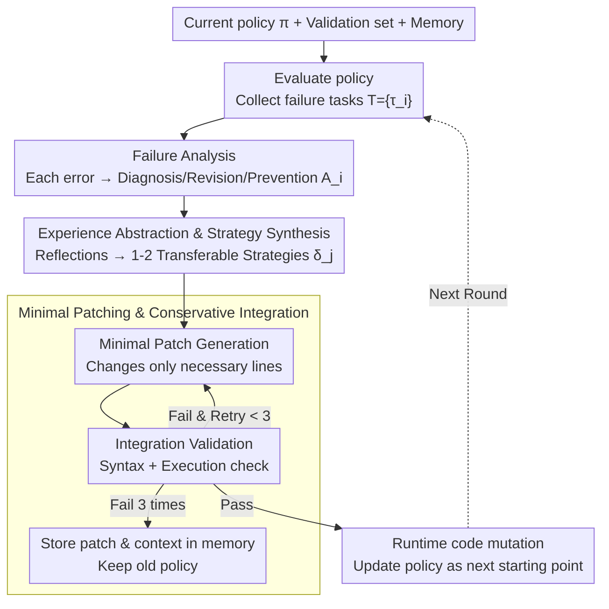

# Polaris: A Gödel Agent Framework for Small Language Models through Experience-Abstracted Policy Repair

**Conference**: ACL2026 Findings  
**arXiv**: [2603.23129](https://arxiv.org/abs/2603.23129)  
**Code**: No public repository provided in the paper cache  
**Area**: LLM Agent  
**Keywords**: Gödel Agent, Small Language Models, Self-improvement, Experience Abstraction, Policy Repair

## TL;DR
Polaris transforms the recursive self-improvement of Gödel Agents into a "failure analysis → experience abstraction → minimal code patch → execution validation" policy repair loop tailored for 7B/8B small models. This achieves interpretable, persistently reusable policy-level improvements on MGSM, DROP, GPQA, and LitBench.

## Background & Motivation
**Background**: Self-improvement for language agents generally follows two paths: response-level reflection and rewriting (e.g., ReAct, Reflexion, Self-Refine, CRITIC), or modifying model parameters and knowledge representations (e.g., model editing). Gödel Agents provide a third path: treating the agent policy as an explicit, inspectable, and modifiable program object, allowing the agent to modify its own policy based on execution trajectories.

**Limitations of Prior Work**: The original Gödel Agent approach imposes high demands on context window and tool-calling capabilities. When adapting it to Qwen2.5-7B-Instruct, the authors found that agents frequently suffer from OOM due to retaining excessive validation samples, tool-call histories, and debugging trajectories. Conversely, shorter contexts lead to tool-calling hallucinations, repetitive ineffective repairs, and non-targeted behaviors.

**Key Challenge**: Recursive self-improvement requires sufficiently rich failure experiences to generate transferable policy updates. However, small models possess limited context, VRAM, and meta-reasoning capabilities to carry large-scale historical trajectories. Balancing "sufficiently abstract experience" with "sufficiently small context" is the core problem of this paper.

**Goal**: Polaris seeks to enable policy-level self-improvement for small language models. It refrains from fine-tuning parameters or merely correcting individual answers; instead, it compresses a small number of failure samples into reusable strategies and generates minimal code patches that are written back to the current policy after syntax and execution checks.

**Key Insight**: The authors view failure samples as "experience." Rather than stuffing all failure trajectories into the context, they first abstract them into diagnoses, revisions, and preventions, then synthesize a few new strategies. This preserves the interpretability of failures while minimizing the risk of small models getting lost in long contexts.

**Core Idea**: Utilize experience abstraction to compress instance-level failures into policy-level repair strategies, performing recursive self-improvement through minimal verifiable patches manageable by small models.

## Method
The goal of Polaris is not to make the model "rethink the answer," but to have the agent modify how it solves the problem next time. It inherits the self-inspect, interact, self-update, and continue-improve framework of the Gödel Agent but replaces the original repair policy module with a more conservative experience-abstracted repairer. The entire system operates around a mutable policy `π`: it first runs the current policy on a validation set to identify failure samples, then analyzes failure causes to abstract repair strategies and generate code patches. A patch is integrated as the starting point for the next round only if it passes execution checks.

### Overall Architecture
The input includes the current agent policy, task goals, failure samples from the validation set, and agent memory; the output is a modified policy. Each round evaluates the current policy and collects failure tasks $T=\{\tau_i\}$. Subsequently, Polaris performs failure analysis on each task to obtain structured reflections $A_i=(\text{diagnosis}_i, \text{revision}_i, \text{prevention}_i)$. Strategy synthesis then compresses multiple $A_i$ into one or two transferable strategies $\delta_j$. Patch generation produces code patches affecting only necessary lines, and patch integration checks for execution feasibility (retrying up to 3 times). Upon success, the policy is updated via runtime code mutation.

### Key Designs

**1. Failure Analysis as Interpretable Experience Units: Decomposing errors into diagnosis, revision, and prevention**

Small models often mistake surface features of a single case for general rules, leading to divergent repairs. Polaris does not allow the model to write vague reflections. Instead, it requires `AnalyzeFailure` to produce a structured $A_i=(\text{diagnosis}_i, \text{revision}_i, \text{prevention}_i)$ for each failure—including input, reference answer, reasoning trajectory, and predicted output. Explicitly separating "what went wrong" from "how to modify the policy" forces the model beyond the surface of the case, ensuring reflections are targeted records for policy code repair rather than inconsequential thoughts.

**2. Experience-Abstraction Driven Strategy Synthesis: Replacing raw trajectories with universal strategies**

Original Gödel Agents cram massive historical trajectories into the context, quickly overwhelming 7B models. The critical step in Polaris is `StrategySynthesis`: it reads all reflections $\{A_i\}$ for the current round plus existing strategies in memory to synthesize one or two new transferable strategies $\delta_j$—such as finer task decomposition, numerical normalization, or context-specific verification. It further requires new strategies to avoid duplication with history. This distills experience; subsequent repairs reuse abstracted "rules" rather than repeating "cases," allowing experience to accumulate without context explosion.

**3. Minimal Patching and Conservative Integration: Making policy updates auditable, reversible, and executable**

To prevent "repairing for the worse," `PatchGeneration` creates only the minimal code patch required to implement the strategy without extra explanatory text. During integration, it updates a temporary policy to run syntax and execution checks, retrying up to 3 times on failure. Patches that persistently fail are archived in memory with their context rather than forced into the policy. Minimal patching limits side effects, execution checks block syntax errors, and memory logs ensure traceability—making self-modification feel like controlled automated program repair rather than open-ended rewriting.

### Loss & Training
Polaris involves no parameter training or gradient loss. The optimization goal is to improve validation/test performance through iterative policy repair. In experiments, Qwen2.5-7B-Instruct ran on two 32GB V100s, with each run allowed to evolve autonomously for 10 hours. MGSM and DROP utilized 50 validation samples and 250 test samples; GPQA used 20/100; LitBench used 20/250. The key hyperparameter is the number of failure samples $N$ used for reflection ($N=3$ vs $N=5$). To reduce context pressure, historical tool calls retained in memory were reduced from 10 (original GA) to 6.

## Key Experimental Results

### Main Results
The original Gödel Agent is nearly non-functional when migrated to 7B models. Even with reduced historical messages, $k=5$ failed entirely, and $k=3$ only yielded one successful run on DROP. Polaris's experience abstraction significantly improved the success rate, particularly on MGSM, GPQA, and LitBench.

| Method/Setting | MGSM successful | DROP successful | GPQA successful | LitBench successful | Main Observation |
|-----------|-----------------|-----------------|-----------------|---------------------|----------|
| Gödel Agent, k=3 | 0/5 | 1/5 | 0/5 | 0/5 | Context reduction leads to repetition/hallucination |
| Gödel Agent, k=5 | 0/5 | 0/5 | 0/5 | 0/5 | All unsuccessful, primarily due to OOM |
| Polaris, N=3 | 5/10 | 3/10 | 4/10 | 6/10 | SLMs can complete multi-round policy repair |
| Polaris, N=5 | 4/10 | 3/10 | 5/10 | 5/10 | Better abstraction but higher context pressure |

In successful runs, Polaris achieved non-monotonic but consistent "best-so-far" improvements over the CoT-SC baseline. The results emphasize that code-level policy mutation is a discrete search; thus, one should retain the "champion" policy and only replace it when a "challenger" is stably superior.

| Setting | MGSM Gain | DROP Gain | GPQA Gain | LitBench Gain |
|------|---------------|---------------|---------------|-------------------|
| Polaris N=3 | +4.0% | +3.9% | +9.0% | +8.8% |
| Polaris N=5 | +3.6% | +5.7% | +9.0% | +5.2% |
| Qwen3-8B N=3 | 4/5 success | 2/5 success | 3/5 success | 4/5 success |

### Ablation Study
The paper analyzes the necessity of designs by comparing original GA, different $N$, different base models, and failure modes.

| Analyzed Object | Key Finding | Description |
|----------|----------|------|
| Original Gödel Agent | k=5 all failed, k=3 only 1/5 | Context truncation alone doesn't solve SLM self-improvement |
| Experience Abstraction| Polaris N=3 total 18/40 successful | Failures can be compressed into executable repair strategies |
| N=3 vs N=5 | N=3 more volatile, N=5 more general | Trade-off between reflection depth and context burden |
| Base Model Strength | Higher success with stronger SLMs | Stronger reasoning improves stability but budgets remain critical |

### Key Findings
- **Experience abstraction is core**: Retaining failure trajectories causes context overflow; retaining abstracted strategies allows repairs to transfer to unseen instances.
- **Non-monotonicity**: Polaris's gains are often non-monotonic, but the best-so-far policy exceeds the initial policy and CoT-SC, resembling an anytime search rather than a standard training curve.
- **Task Sensitivity**: DROP is more prone to failure than MGSM because its longer context triggers OOM and redundant evaluation more easily.
- **System Stability**: The bottleneck for SLMs is not a single capability but the combined stability of meta-reasoning, tool calling, context management, and patch execution.

## Highlights & Insights
- The paper grounds "agent self-improvement" in inspectable policy patches rather than just verbal feedback. Once written into the policy, strategies are reusable across subsequent samples, which response-level correction cannot achieve.
- Experience abstraction is an ideal memory compression format for SLMs: it saves generalized strategies that guide code changes rather than long logs.
- The minimal patch design treats self-modification as automated program repair. This mitigates the risk of a model breaking the entire agent and enhances manual auditability.
- The honest presentation of unsuccessful runs is valuable, showing that real-world deployment first hits walls with tool calling, VRAM, and error recovery.

## Limitations & Future Work
- Polaris still relies on hand-crafted prompt templates for failure analysis and strategy synthesis; automating these templates is an open challenge.
- Execution checks guarantee runtime availability but not performance improvement; balanced executable "bad patches" can still degrade the policy.
- The success rate remains relatively low (especially on DROP); production use requires robust rollback, checkpointing, and champion-challenger mechanisms.
- Small model meta-reasoning depth is limited; abstractions may sometimes be too generalized. Future work could integrate external memory or verifiers to enhance repair quality.

## Related Work & Insights
- **vs. Gödel Agent**: GA demonstrated the feasibility of policy self-modification for strong models with large contexts; Polaris adapts this for SLMs using experience abstraction.
- **vs. Reflexion**: Reflexion-style methods update verbal memory for the next turn; Polaris generates persistent code patches that change the underlying solution program.
- **vs. Model Editing**: Model editing modifies weights (opaque/hard to audit); Polaris modifies explicit policy code (clear location of change).
- **vs. Automated Program Repair (APR)**: While APR repairs external code, Polaris repairs its own policy. This intersection warrants further exploration in test generation and patch ranking.

## Rating
- Novelty: ⭐⭐⭐⭐☆
- Experimental Thoroughness: ⭐⭐⭐⭐☆
- Writing Quality: ⭐⭐⭐⭐☆
- Value: ⭐⭐⭐⭐☆

<!-- RELATED:START -->

## Related Papers

- [\[ACL 2026\] Lightweight LLM Agent Memory with Small Language Models](lightweight_llm_agent_memory_with_small_language_models.md)
- [\[ACL 2026\] Don't Adapt Small Language Models for Tools; Adapt Tool Schemas to the Models](don39t_adapt_small_language_models_for_tools_adapt_tool_schemas_to_the_models.md)
- [\[ACL 2026\] Meta-Tool: Efficient Few-Shot Tool Adaptation for Small Language Models](meta-tool_efficient_few-shot_tool_adaptation_for_small_language_models.md)
- [\[ACL 2026\] CLAG: Adaptive Memory Organization via Agent-Driven Clustering for Small Language Model Agents](clag_adaptive_memory_organization_via_agent-driven_clustering_for_small_language.md)
- [\[ICML 2026\] Scaling Small Agents Through Strategy Auctions](../../ICML2026/llm_agent/scaling_small_agents_through_strategy_auctions.md)

<!-- RELATED:END -->
## Related Papers

- [\[ACL 2026\] Lightweight LLM Agent Memory with Small Language Models](lightweight_llm_agent_memory_with_small_language_models.md)
- [\[ACL 2026\] Don't Adapt Small Language Models for Tools; Adapt Tool Schemas to the Models](don39t_adapt_small_language_models_for_tools_adapt_tool_schemas_to_the_models.md)
- [\[ACL 2026\] Meta-Tool: Efficient Few-Shot Tool Adaptation for Small Language Models](meta-tool_efficient_few-shot_tool_adaptation_for_small_language_models.md)
- [\[ACL 2026\] CLAG: Adaptive Memory Organization via Agent-Driven Clustering for Small Language Model Agents](clag_adaptive_memory_organization_via_agent-driven_clustering_for_small_language.md)
- [\[ICML 2026\] Scaling Small Agents Through Strategy Auctions](../../ICML2026/llm_agent/scaling_small_agents_through_strategy_auctions.md)

<!-- RELATED:END -->
