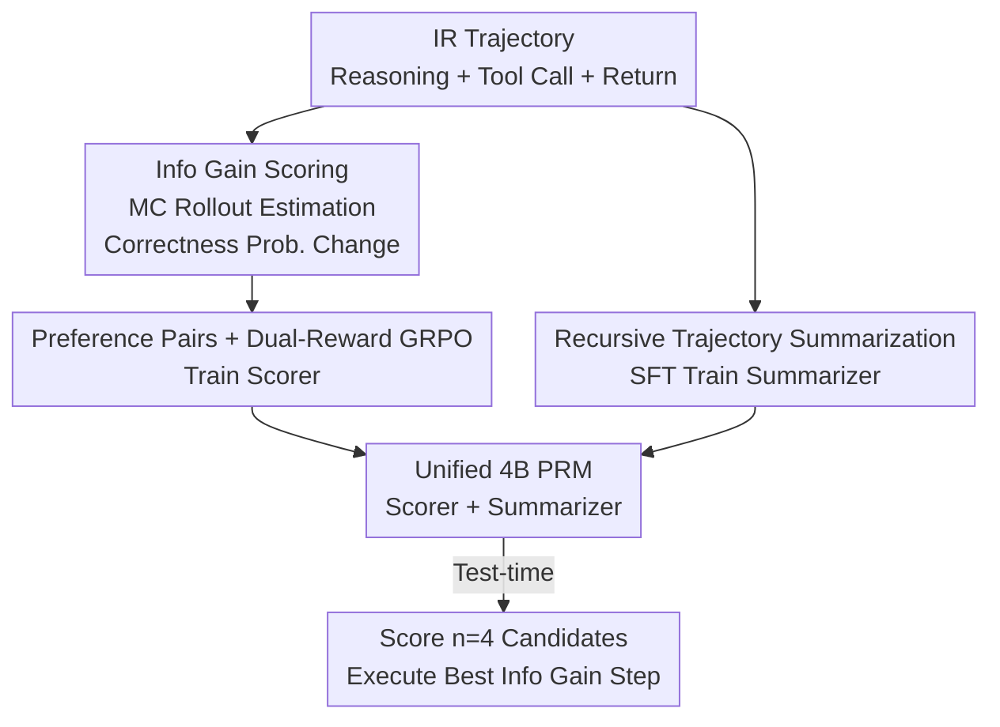

# PRInTS: Process Reward Modeling for Long-range Information Retrieval

**Conference**: ACL 2026  
**arXiv**: [2511.19314](https://arxiv.org/abs/2511.19314)  
**Code**: https://github.com/G-JWLee/PRInTS  
**Area**: Agent / Process Reward Modeling / Test-time Scaling  
**Keywords**: Process Reward Model, Information Retrieval Agent, Information Gain, Trajectory Summarization, GRPO

## TL;DR
PRInTS migrates "Process Reward Models (PRM)" from short-form mathematical reasoning to long-range information retrieval (IR) Agents. By utilizing a 4B model that simultaneously learns to "assign dense scores to each step based on information gain" and "recursively compress expanding trajectory contexts," the method achieves a 9.3% average improvement for 32B-scale Agents via test-time best-of-$n$ selection. Notably, the 30B+4B combination outperforms the 671B DeepSeek-V3.1 on the GAIA benchmark.

## Background & Motivation

**Background**: Currently, the mainstream approach for answering multi-step retrieval questions is to have LLM Agents alternate between "reasoning + tool invocation" using the ReAct paradigm. Enhancing these agents typically follows two paths: either fine-tuning the Agent itself (which requires massive data, is tied to specific model families, and involves expensive online RL) or training a model-agnostic reward model to rank and select better actions during test-time. The latter is more lightweight, with Process Reward Models (PRMs) representing the approach of scoring "each individual step."

**Limitations of Prior Work**: Existing PRMs designed for mathematical or logical reasoning suffer from two major flaws when applied to long-range IR. First, the **granularity of assessment is mismatched**: math PRMs evaluate short reasoning units of one or two sentences with binary "correct/incorrect" judgments. In IR, a "step" is a complete combination of "reasoning + tool call + tool return," where quality is determined by multiple dimensions (accuracy of tool output interpretation, informativeness of retrieval, and rationality of the next plan), which binary scores cannot capture. Second, **context explosion**: tool returns in IR trajectories are often lengthy, causing the history to expand rapidly. This makes scoring unreliable when the model processes long, noisy contexts.

**Key Challenge**: To "score a step accurately," the model must see the step within the full trajectory context (to avoid information gaps) but cannot be fed the ever-growing raw history directly (as noise drowns out judgment). There is a direct conflict between information sufficiency and context noise.

**Goal**: To train a unified generative PRM that can provide multi-dimensional dense scores for composite "reasoning + tool" steps while maintaining evaluation accuracy even as the trajectory grows indefinitely.

**Key Insight**: The authors redefine "step quality" as **Information Gain**—the degree to which a step increases the probability of "final correctness." This transforms vague quality assessment into a scalar target that can be estimated via Monte Carlo (MC) rollouts and trained using RL. Simultaneously, the same model acts as a "summarizer," recursively compressing the long trajectory into fixed-length summaries before scoring.

**Core Idea**: Empower a 4B generative PRM with dual capabilities of "information gain scoring + recursive trajectory summarization," guiding the underlying Agent purely through test-time step selection without modifying any of the Agent's weights.

## Method

### Overall Architecture

PRInTS is **one model serving two roles**: it acts both as a scorer (assigning information gain scores to candidate next steps) and a summarizer (recursively compressing historical trajectories). The pipeline is divided into "offline data construction + training" and "online test-time guidance." In the offline stage, MC rollouts are used to label information gain for each step, construct "win/loss" preference pairs, and generate recursive summaries. During training, the model learns scoring via GRPO (score reward + comparison reward + adaptive weights) and summarization via SFT, acquiring both abilities within a single PRM. At test-time, the Agent generates $n=4$ candidate next steps; PRInTS generates a CoT analysis and dense score for each based on the "current summary + latest tool return," executes the highest-scoring step, updates the summary, and proceeds to the next round.

### Key Designs

**1. Information Gain Scoring: Quantifying "Step Quality" as Probability Increase**

While math PRMs provide binary labels, IR steps have no objective "right or wrong," only whether they help reach the final answer. The authors define the quality of the current step $(s_t, a_t)$ as **Information Gain**—the change in the expected probability of "final correctness" before and after executing the step. This is estimated via MC: starting from a prefix, $M$ rollouts are run to produce answers, calculating the average accuracy $m_t = \frac{1}{M}\sum_{j=1}^{M}\mathbb{1}(o_{T_j}^{(j)}=a^*)$. The information gain score is defined as:

$$g_t = (m_t - m_{t-1}) \times M/2$$

A scaling factor of $M/2$ maps scores to $[-M/2, M/2]$, discretized with a step of 0.5 for intuitive comparison. $g_t > 0$ indicates the step (e.g., a retrieval that resolves uncertainty) improved the probability of success, while $g_t < 0$ suggests the step (e.g., making unverified assumptions) hindered progress. Anchoring quality to this estimable scalar is the foundation for subsequent RL training.

**2. Preference Pairs + Dual-Reward GRPO: Teaching the PRM to Both Estimate and Compare**

Absolute scores alone are insufficient. Within the $M$ rollouts, the authors select a step leading to a correct trajectory as a "potential winner" and randomly sample an "alternative (inferior) step" to form a preference pair. Both steps are then re-evaluated with $M$ rollouts to update their information gain scores, labeling them as win $(s^+,a^+)$ or loss $(s^-,a^-)$ based on the scores. During training, PRInTS (which outputs CoT then a scalar $\hat{g}_t$) is optimized via two rewards: a score reward $r_s^k = 1-\left|\frac{g^k-\hat{g}^k}{M}\right|$ to approach the absolute truth, and a comparison reward $r_c^k$ using $\mathrm{sgn}$ to force the winner's score above the loser's. These are combined using **adaptive weights**: $r^k = r_s^k + w\cdot r_c^k$, where $w = \frac{g^+-g^-}{M}$. Pairs with larger score differences are more reliable and receive higher weights. This dual-reward setup enables fine-grained feedback while remaining robust to noise.

**3. Recursive Trajectory Summarization: Compressing Exploding Contexts for Scoring**

Using raw long histories for scoring introduces noise. The same PRM acts as a summarizer, recursively updating a compact summary $h_t = \text{LLM}(q, h_{t-1}, o_{t-1}, s_t, a_t)$. This compresses the "query + previous summary + latest tool return + current step" into a new summary capturing key findings and plans. This recursive approach ensures $h_t$ remains a compressed representation of the full trajectory $H_t$ with a bounded input length. The summarizer is trained via SFT on labeled summaries and learned jointly with the scoring capability. During scoring, the model consumes $h_{t-1}$ instead of the raw history, ensuring stable evaluation regardless of trajectory length.

### Key Experimental Results

#### Main Results

On FRAMES, GAIA (Levels 1-3), and WebWalkerQA, measured by Avg@3 using LLM-as-Judge (GPT-5). PRInTS (4B PRM) brought consistent, significant test-time gains across different Agents (absolute average accuracy):

| Agent Backbone | Base Agent | Best PRM Baseline | PRInTS | Gain |
|--------|------|----------|--------|------|
| Qwen3-32B (Open-source) | 29.5 | 32.8 (Confidence) | **38.8** | +9.3% |
| Tongyi DeepResearch-30B-A3B (Specialized IR Agent) | 62.9 | 64.2 (Verbal-progress) | **66.8** | +3.9% |
| Gemini-2.5-Flash (Frontier, GAIA only) | 40.0 | 41.5 (StepWiser) | **44.0** | +4.0% |

Key Observation: On GAIA, PRInTS boosted DeepResearch-30B-A3B from 61.9% to 64.4%, allowing the "30B Agent + 4B PRM" combination to **outperform the 20x larger DeepSeek-V3.1-671B (63.1%)** and approach OpenAI DeepResearch (67.4%).

#### Ablation Study

Validating core components on Qwen3-32B using FRAMES + GAIA (L1, L2):

| Dimension | Configuration | Avg | Insight |
|------|------|-----|------|
| Context Repr. | Raw Full History $H_t$ | 39.5 | Noisy, worst performance |
| Context Repr. | Recent 2 steps $H_{-2:}$ | 44.1 | Better than 1 or 4 steps |
| Context Repr. | **Recursive Summary $h_t$ (Ours)** | **47.2** | +7.7% over full history |
| Reward Design | Score $r_s$ only | 44.2 | Lacks relative preference |
| Reward Design | **$r_s + w\cdot r_c$ (Adaptive)** | **48.2** | Best; robust to label noise |

### Key Findings
- **Summary > Raw History**: Feeding the full trajectory ($H_t$) performs worst. Recursive summarization ($h_t$) confirms that long histories introduce noise, while compression facilitates scoring.
- **Complementary Rewards**: Info gain estimation (absolute) and preference prediction (relative) cover different aspects. Adaptive weights filter noisy pairs by prioritizing large score gaps.
- **Gap Widens with Stronger Agents**: While standard PRMs show diminishing returns on strong Agents, PRInTS continues to provide substantial gains for specialized models like DeepResearch.

## Highlights & Insights
- **Redefining Step Quality as Information Gain**: Using the probability change of reaching the final answer bypasses the difficulty of "no objective truth" in IR steps, facilitating the transfer of PRM concepts to Agents.
- **Unified Scorer + Summarizer**: Summarization is not an external module; it is co-trained with scoring, making context management intrinsically serve accurate evaluation.
- **Test-time Scaling Efficiency**: A 4B PRM with 2k preference pairs pushes a 30B Agent to outperform a 671B model, offering a cost-effective paradigm for "small models guiding large tasks."

## Limitations & Future Work
- **Dependency on MC Rollouts**: Estimating info gain requires multiple rollouts, increasing labeling costs with trajectory length.
- **Refinement of Training Loops**: The SFT-GRPO iterations are mentioned as "repeating X rounds"; specific hyperparameters may vary by implementation.
- **Evaluation Bias**: Dependence on LLM-as-Judge (GPT-5) inherits the biases of the evaluator model.
- **Future Directions**: Incorporating summary quality into the reward function or enabling online co-updating of the scorer and Agent could further streamline the pipeline.

## Related Work & Insights
- **vs. Math/Logic PRMs (StepWiser, GenPRM)**: These evaluate short logic units with binary labels. PRInTS evaluates composite IR steps with dense info-gain scores, outperforming them significantly (+9.3% vs +1.5%) due to supervision granularity.
- **vs. Agent Fine-tuning (WebSailor, DeepResearch)**: Fine-tuning requires 10k–100k+ samples and is model-specific. PRInTS is model-agnostic, uses only 2k+ pairs, and is orthogonal to fine-tuning.
- **vs. Heuristic Scoring (Confidence, Verbal-progress)**: Heuristics offer marginal gains; PRInTS's dense scores are explicitly trained to distinguish subtle but critical quality differences.

## Rating
- Novelty: ⭐⭐⭐⭐⭐ 
- Experimental Thoroughness: ⭐⭐⭐⭐⭐ 
- Writing Quality: ⭐⭐⭐⭐ 
- Value: ⭐⭐⭐⭐⭐ 

<!-- RELATED:START -->

## Related Papers

- [\[ICML 2026\] Process Reward Agents for Steering Knowledge-Intensive Reasoning](../../ICML2026/llm_agent/process_reward_agents_for_steering_knowledge-intensive_reasoning.md)
- [\[ACL 2026\] IntrAgent: An LLM Agent for Content-Grounded Information Retrieval through Literature Review](intragent_an_llm_agent_for_content-grounded_information_retrieval_through_litera.md)
- [\[ACL 2026\] OCR-Memory: Optical Context Retrieval for Long-Horizon Agent Memory](ocr-memory_optical_context_retrieval_for_long-horizon_agent_memory.md)
- [\[ICLR 2026\] WebArbiter: A Principle-Guided Reasoning Process Reward Model for Web Agents](../../ICLR2026/llm_agent/webarbiter_a_principle-guided_reasoning_process_reward_model_for_web_agents.md)
- [\[AAAI 2026\] ProBench: Benchmarking GUI Agents with Accurate Process Information](../../AAAI2026/llm_agent/probench_benchmarking_gui_agents_with_accurate_process_infor.md)

<!-- RELATED:END -->
