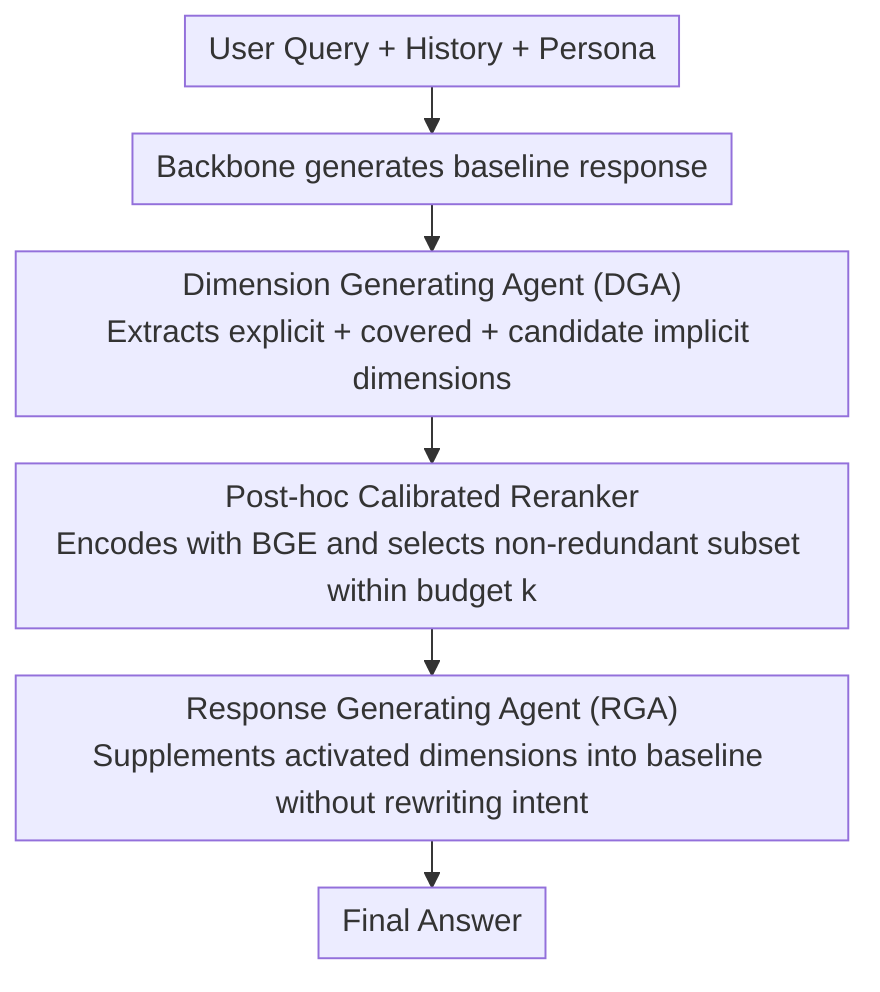

# ProPer Agents: Proactivity Driven Personalized Agents for Advancing Knowledge Gap Navigation

**Conference**: ACL 2026  
**arXiv**: [2601.09926](https://arxiv.org/abs/2601.09926)  
**Code**: [GitHub](https://github.com/i-kiran/ProPer-Agent)  
**Area**: LLM Agent / Personalized Assistant / Proactivity Calibration  
**Keywords**: Proactive assistant, Knowledge gap, Dimensional modeling, Personalized Agent, Calibrated proactivity

## TL;DR
ProPer models proactive agents as the problem of "discovering and calibrating unspoken task dimensions." Through a Dimension Generating Agent, a post-hoc reranker, and a Response Generating Agent, it selectively fills knowledge gaps, significantly improving response quality and win rates across medical, coding, and shopping recommendation tasks.

## Background & Motivation

**Background**: Traditional conversational assistants follow an ask-and-respond pattern, answering only what the user explicitly asks. Proactive assistants aim to anticipate user needs, such as supplementing risks, prompting constraints, following up on missing information, or providing more comprehensive suggestions.

**Limitations of Prior Work**: Many proactive systems either question the user too frequently, increasing user burden, or extrapolate based on context, often inserting unwanted suggestions at the wrong time. They typically handle only known unknowns expressed by the user, lacking explicit modeling of unknown unknowns.

**Key Challenge**: Good proactivity is not about "saying more" but about intervening moderately on critical dimensions that the user has not realized. Insufficient intervention leaves out important risks, while excessive intervention can feel intrusive, off-topic, or disrespectful of user intent.

**Goal**: Propose a controllable proactive personalized Agent framework that explicitly models user knowledge gaps and uses a calibration mechanism to decide which implicit dimensions are worth including in the final response.

**Key Insight**: The authors introduce "dimensions" as an intermediate representation. A dimension is a structured factor to consider when completing a task, such as input scale, risk constraints, preference trade-offs, disease severity, budget, or alternatives.

**Core Idea**: First, have the DGA learn to generate implicit dimensions that the "current user may not realize but are task-relevant." Then, use a reranker to control quantity, relevance, and diversity. Finally, let the RGA supplement these dimensions without disrupting the user's intent.

## Method

### Overall Architecture

ProPer decomposes proactivity into two steps: "discovering gaps" and "calibrating intervention," forming a pipeline from query to answer. After receiving the user query, chat history, and an optional persona, the system first has a backbone generate a baseline response. The Dimension Generating Agent (DGA) then extracts user-explicit dimensions, system-covered dimensions, and a set of candidate implicit dimensions "the user might not realize but are task-relevant" from the query and response. A post-hoc reranker selects a small set of activated dimensions from the candidates under budget constraints. Finally, the Response Generating Agent (RGA) supplements these dimensions into the baseline response without rewriting the user's intent. Here, a dimension refers to a structured factor to consider for task completion, such as input scale, risk constraints, preference trade-offs, disease severity, budget, or alternatives.

### Key Designs

**1. Dimension Generating Agent (DGA): Structured Prediction of "What to Supplement"**

When ordinary LLMs directly expand a response, they often stack content based on linguistic fluency without clarifying which key dimensions were supplemented. DGA treats "what should be supplemented" as an independent structured prediction problem. During training, it is fine-tuned with dimension-level supervision from successful interaction trajectories to learn dimensions that appear explicitly in user queries and reference answers and contribute to task success. During inference, it proposes candidate implicit dimensions and outputs confidence levels based on the current user state. This provides a checkable, structured source for discovering unknown unknowns rather than hiding them in generated text.

**2. Post-hoc Calibrated Reranker: A Throttle for Proactivity**

Proactivity requires moderation—without filtering, the system might dump all potential dimensions into the response, making it wordy and off-topic. The reranker first encodes all dimensions using BGE-small and then selects a subset within a budget $k$. The selection goal simultaneously considers three factors: the confidence given by DGA, alignment with unmet explicit needs, and non-redundancy among candidates. Specifically, $\lambda_1$ controls the activation intensity of knowledge gaps, and $\lambda_2$ controls diversity. With budget and diversity constraints, responses shift from "supplementing everything" to "supplementing a few targeted points."

**3. Response Generating Agent (RGA): Supplementing Dimensions Without Overstepping**

The most common failure of proactive assistants is being "over-enthusiastic," rewriting the entire segment or changing the user's original request after discovering a gap. RGA is a prompt-driven generation module that takes the baseline response, user query, explicit dimensions, and activated dimensions as input. The prompt requires it to preserve the baseline structure and prioritize filling gaps with concise information; it only asks a clarification question if an implicit dimension strictly requires specific user information. This set of constraints allows the model to maintain calibrated tone, scope, and intervention intensity.

### A Complete Example

Take a medical consultation as an example: A user asks, "Should I get a certain vaccine?" The baseline response provides a generic "Vaccination is recommended." DGA identifies that the user explicitly cares about "whether to get vaccinated," but task-relevant implicit dimensions also include risk frameworks, comorbidity factors, contraindications, and alternatives. The reranker selects a few non-redundant ones that best fit the user's unmet needs (e.g., comorbidities and contraindications) within budget $k$. Based on this, RGA adds brief risk background and protection tips while retaining the original structure, and follows up asking if the user has specific underlying diseases, ultimately providing a significantly more complete response without being intrusive.

### Loss & Training

Only the DGA requires training. Its supervision comes from dimension annotation: GPT-5 is used to extract user-explicit and system-explicit dimensions from raw interactions, which are organized into structured JSON training samples to fine-tune the DGA. The reranker does not involve LLM training but uses a fixed objective function for subset selection on the candidate set. RGA relies entirely on domain-specific prompts, with proactive boundaries defined for each of the three domains: medical, code contests, and shopping recommendations.

## Key Experimental Results

### Main Results
Evaluation covers three domains: Medical (MD), Code-Contests, and PWAB. GPT-5 serves as the judge, providing scores (0-5) and win rates.

| Contrast | MD μScore / Win% | Code μScore / Win% | PWAB μScore / Win% |
|------|------------------|--------------------|--------------------|
| Llama-8B | 2.19 / 10.52 | 1.26 / 15.51 | 2.34 / 6.83 |
| Llama-8B + ProPer | 3.86 / 89.48 | 2.13 / 84.49 | 4.06 / 93.17 |
| Qwen-8B | 2.93 / 18.73 | 2.24 / 24.76 | 3.12 / 12.50 |
| Qwen-8B + ProPer | 4.03 / 81.27 | 2.84 / 75.24 | 4.29 / 87.50 |
| GPT-4 vs Llama-ProPer | 3.28 / 29.74 | 3.19 / 68.93 | 3.46 / 23.61 |
| Llama-8B + ProPer vs GPT-4 | 3.73 / 70.26 | 2.08 / 31.07 | 4.11 / 76.39 |
| GPT-4 vs Qwen-ProPer | 3.26 / 19.26 | 3.11 / 43.63 | 3.53 / 17.40 |
| Qwen-8B + ProPer vs GPT-4 | 4.03 / 80.74 | 2.97 / 56.37 | 4.24 / 82.60 |

### Ablation Study

| $(\lambda_1, \lambda_2)$ | Llama MD | Qwen MD | Llama Code | Qwen Code | Llama PWAB | Qwen PWAB |
|---------------------------|----------|---------|------------|-----------|------------|-----------|
| (8.0, 1.0) | 4.00 | 4.15 | 2.11 | 2.81 | 3.96 | 3.71 |
| (2.0, 0.5) | 3.75 | 4.01 | 2.12 | 2.89 | 4.06 | 3.91 |
| (0.0, 0.2) | 3.70 | 3.91 | 2.08 | 2.79 | 4.17 | 3.80 |

### Multi-turn Robustness

| Domain | Multi-turn Simulated Samples | ProPer Wins | Explanation |
|----|----------------|-------------|------|
| Medical | 12 | 11 | Risks, constraints, and user needs emerge turn-by-turn; proactive dimensions are useful |
| Code-Contests | 12 | 9 | Tasks are more explicit; baseline is occasionally sufficient for narrow problems |
| PWAB | 12 | 12 | Shopping preferences and trade-offs are well-suited for implicit dimension completion |

### Key Findings
- ProPer wins against the same backbone base LLM on approximately 84% of samples, indicating that the improvement stems from explicit knowledge gap modeling rather than just model size.
- The largest improvements occur in Medical and Shopping Recommendations because these tasks naturally involve risks, preferences, constraints, and trade-offs; Code-Contests have explicit goals and less space for proactive supplements.
- Removing DGA causes a more significant performance drop than removing reranking or RGA, suggesting that "discovering what gap exists" is more fundamental than "how to phrase the supplement."
- CoT prompting improves the base LLM but still underperforms compared to ProPer, suggesting that simply letting the model self-reflect is insufficient for stably discovering user unknown unknowns.
- Multi-turn few-shot experiments show that ProPer's proactivity does not drift significantly, maintaining moderate intervention at least in short trajectories.

## Highlights & Insights
- Dimensions serve as a highly useful intermediate representation. They are not as heavy as full plans and are more structured than simple keywords, making them suitable for carrying information that "the user didn't say but the task requires."
- The paper shifts the definition of proactivity from "whether to actively ask questions" to "selecting which gaps are worth filling," which closer aligns with real assistant experiences.
- Budget $k$ and $(\lambda_1, \lambda_2)$ turn proactivity into controllable knobs. Different domains can adopt different intervention intensities instead of using a global prompt for all tasks.
- Improvements in medical cases are telling: ProPer doesn't just give answers but supplements risk frameworks, vaccine backgrounds, actual protection, and comorbidity factors, helping users build a more complete problem representation.

## Limitations & Future Work
- Primary evaluation relies on GPT-5 as a judge, which might prefer more detailed or structured answers; user studies are needed to measure trust, intrusiveness, and long-term task success.
- Implicit dimensions are currently free text; while interpretable, they lack standardization, potentially leading to redundancy, inconsistent phrasing, and difficulty in cross-domain comparisons.
- $(\lambda_1, \lambda_2)$ are fixed through parameter sweeps rather than dynamically learned based on user state; real systems need to adapt based on user proficiency, risk preference, and session stage.
- Multi-turn experiments only include 12 simulated dialogues per domain; more turns, complex interactions, and real user feedback remain to be verified.
- ProPer does not maintain a persistent user model or use multimodal/environmental states; personalized proactivity remains relatively shallow.
- Despite strong performance in the medical domain, safety, compliance, and liability boundaries for real clinical assistants far exceed benchmark scores.

## Related Work & Insights
- **vs clarification-based agents**: Clarification systems primarily handle needs the user knows but hasn't clarified, whereas ProPer focuses more on task dimensions the user hasn't yet realized.
- **vs context extrapolation agents**: Many proactive agents extrapolate from environmental states or historical behavior; ProPer explicitly generates dimensions and controls intervention via a reranker.
- **vs CoT/self-refine**: CoT allows models to reflect on response flaws but lacks an explicit representation of knowledge gaps; ProPer's DGA acts more like a checkable gap generator.

## Rating
- Novelty: ⭐⭐⭐⭐ Modeling unknown unknowns with dimensions and splitting proactive calibration into DGA/reranker/RGA is a clear and effective approach.
- Experimental Thoroughness: ⭐⭐⭐⭐ Covers three domains, component ablations, and multi-turn robustness, though user testing and long-term interactions are limited.
- Writing Quality: ⭐⭐⭐⭐ Concept definitions are comprehensive; methodology diagrams and RQs are well-organized.
- Value: ⭐⭐⭐⭐ Highly insightful for building non-intrusive yet helpful personalized Agents.

<!-- RELATED:START -->

## Related Papers

- [\[ACL 2026\] PersonaAgent: Bridging Memory and Action for Personalized LLM Agents](personaagent_bridging_memory_and_action_for_personalized_llm_agents.md)
- [\[AAAI 2026\] PerTouch: VLM-Driven Agent for Personalized and Semantic Image Retouching](../../AAAI2026/llm_agent/pertouch_vlm-driven_agent_for_personalized_and_semantic_image_retouching.md)
- [\[ICML 2026\] Scaling, Benchmarking, and Reasoning of Vision-Language Agents for Mobile GUI Navigation](../../ICML2026/llm_agent/scaling_benchmarking_and_reasoning_of_vision-language_agents_for_mobile_gui_navi.md)
- [\[ICLR 2026\] FingerTip 20K: A Benchmark for Proactive and Personalized Mobile LLM Agents](../../ICLR2026/llm_agent/fingertip_20k_a_benchmark_for_proactive_and_personalized_mobile_llm_agents.md)
- [\[ICML 2026\] Process Reward Agents for Steering Knowledge-Intensive Reasoning](../../ICML2026/llm_agent/process_reward_agents_for_steering_knowledge-intensive_reasoning.md)

<!-- RELATED:END -->
