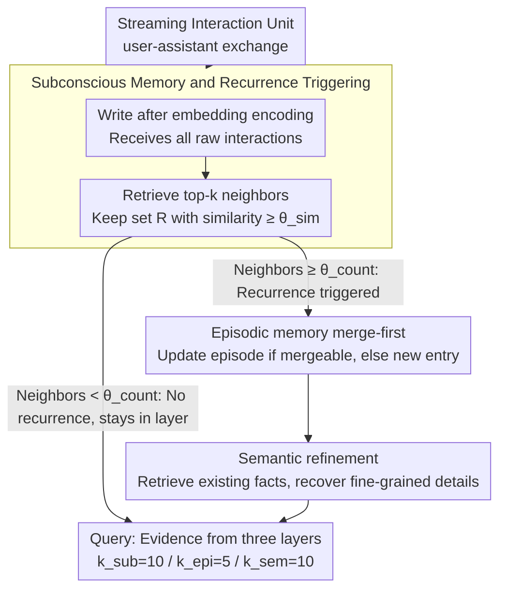

# RecMem: Recurrence-based Memory Consolidation for Efficient and Effective Long-Running LLM Agents

**Conference**: ACL2026 Findings  
**arXiv**: [2605.16045](https://arxiv.org/abs/2605.16045)  
**Code**: https://github.com/CaiusDai/RecMem  
**Area**: LLM Agent / Long-term Memory / Memory System  
**Keywords**: Long-horizon Agent, Memory Consolidation, Recurrence Triggering, Semantic Memory, Cost Efficiency  

## TL;DR
RecMem draws from the "consolidation through repetition" principle in human memory, placing raw interactions into a lightweight subconscious memory first. It only invokes the LLM to generate episodic and semantic memory upon detecting semantic recurrence, thereby reaching or exceeding the QA accuracy of mainstream memory systems on LoCoMo and LongMemEval-S at significantly lower construction token costs.

## Background & Motivation
**Background**: Long-horizon LLM agents need to retain user facts, preferences, events, and task states across multiple turns and sessions. Existing external memory systems usually process interaction content into summaries, facts, knowledge graphs, or memory nodes, which are then retrieved to augment responses.

**Limitations of Prior Work**: While systems such as Mem0, A-Mem, and MemoryOS differ in structure, most employ eager memory consolidation—triggering LLM calls to extract, summarize, or merge memory for every new interaction. This strategy's primary issue is high construction cost, especially since many one-off, noisy, or low-information interactions do not actually need immediate entry into long-term memory.

**Key Challenge**: Long-term agents must avoid information loss while refraining from paying LLM-level consolidation costs for every interaction. Premature consolidation wastes tokens and risks over-structuring temporary information; conversely, zero consolidation leaves subsequent retrieval without cross-temporal organization.

**Goal**: Design a training-free, text-based external memory system that reduces LLM calls during the memory construction phase in streaming interactions while maintaining long-range QA accuracy.

**Key Insight**: Drawing from multi-store theory and Complementary Learning Systems in cognitive science, the authors argue that isolated experiences should be kept in a fast-encoding layer, and only repeatedly activated patterns deserve consolidation into long-term memory.

**Core Idea**: Use a cheap embedding store to capture all raw interactions first, then use semantic similarity and recurrence frequency to trigger LLM consolidation. This treats "when to consolidate" as a first-class problem rather than defaulting to LLM summarization for every interaction.

## Method

### Overall Architecture
RecMem addresses "when the interaction is worth spending LLM tokens to consolidate into long-term memory" rather than just "what to remember." It divides memory into three layers with distinct roles: subconscious memory receives all raw interactions cheaply and supports retrieval; episodic memory stores multi-turn event narratives; semantic memory stores fine-grained facts. The system introduces no new retrieval models; the key lies in the "timing of construction": the system only calls the LLM for upward consolidation when a topic repeatedly appears in the subconscious layer and accumulates sufficient semantically similar historical interactions.

When a streaming interaction arrives, the system treats a user-assistant exchange as an atomic unit $u_i=(m_i^{usr},m_i^{ast},\tau_i)$, encoded by an embedding model as $v_i=\Phi(u_i)$ and written to the subconscious store. For each new unit, it retrieves top-$k$ nearest neighbors in the store, keeping a relevant set $\mathcal{R}_i$ with similarity no less than $\theta_{sim}$. When $|\mathcal{R}_i|\geq \theta_{count}$, indicating the topic is recurring and worth consolidating, the system feeds $\mathcal{R}_i\cup\{u_i\}$ into episodic and semantic layers; otherwise, the interaction remains in subconscious memory without consuming LLM tokens. During the query phase, evidence is retrieved from all three layers simultaneously, with default budgets $k_{sub}=10$, $k_{epi}=5$, and $k_{sem}=10$—where semantic retrieval is twice that of episodic to allow precise facts to supplement details lost in event summaries.

### Key Designs

**1. Subconscious memory and recurrence triggering: Using "frequency of occurrence" as the consolidation switch instead of summarizing every entry**

The waste in eager consolidation lies in treating one-off small talk, noise, or low-information content the same as significant events by paying LLM fees for extraction/summarization. RecMem ensures each new unit only undergoes lightweight structuring and vectorization into the subconscious store, then checks for "peers" in history. If the number of neighbors with similarity exceeding $\theta_{sim}$ reaches $\theta_{count}$, it triggers LLM consolidation. The paper provides two sets of thresholds: $\theta_{sim}=0.7, \theta_{count}=5$ for open-domain chit-chat, and $\theta_{sim}=0.6, \theta_{count}=4$ for long task-based interactions. This "recurrence is significance" proxy is effective because repeatedly mentioned topics are often more stable and likely to be queried in the future; meanwhile, non-recurring content is not lost, as it remains in the subconscious for retrieval.

**2. Episodic memory's merge-first strategy: Preventing a single topic from fracturing into parallel summaries**

In long-term dialogues, a topic often reappears and evolves. Creating a new episode for every recurrence would split a single narrative into disconnected summaries. RecMem attempts to merge new interactions with the most recent episodic entry: if similarity is high enough, an LLM merge updates the existing episode; otherwise, after a recurrence trigger, relevant interactions are sorted chronologically for the LLM to generate a new episode. This ensures each topic maintains a time-anchored, coherent narrative.

**3. Semantic refinement: Recovering fine-grained facts lost in summary compression**

Event-level summaries become more abstract as they merge, which often results in losing user preferences, timestamps, and entity relationships needed for precise QA. For each episode, RecMem first retrieves related existing semantic facts, then tasks the LLM to simultaneously: recover key entities/details missed in summaries from raw interactions, and maintain existing facts while handling preference shifts (e.g., changes in user taste). Each fact is stored as an independent semantic entry, and the semantic layer acts as detail compensation for the abstract episodic layer—coarse summaries manage "what happened," while fine facts provide "precise hits."

### Example: How a recurring topic is consolidated
Suppose a user mentions "I am preparing for a marathon" in several sessions. At the first mention, there are no near neighbors in the subconscious store ($|\mathcal{R}|=1 < \theta_{count}$); the system only stores the vectorized content without calling the LLM. As entries like "ran 20km this week," "got new running shoes," and "the goal is the April race" arrive, subconscious retrieval clusters these semantically similar units. When the neighbor count reaches $\theta_{count}$, recurrence is triggered. The LLM merges these interactions chronologically into an episode ("User is preparing for an April marathon with increasing weekly mileage"), and semantic refinement extracts independent facts like "Target race = April" and "New running shoes." Later, if asked "When is the user's race?", the semantic layer hits the precise fact directly, while the episodic layer provides the background of training evolution. Only the truly recurring topic incurred LLM costs.

### Loss & Training
RecMem is a training-free external memory system and does not require LLM fine-tuning. It relies on embedding retrieval, static thresholds, and LLM prompts for consolidation, merge, refinement, and answering. Experiments use GPT-4o-mini and GPT-4.1-mini as backends with temperature=0.0 and text-embedding-3-small for embeddings.

## Key Experimental Results

### Main Results

| Dataset / Model | Metric | RecMem | Strongest Comparison | Construction Cost Comparison |
|---------------|------|--------|------------------|--------------|
| LoCoMo / GPT-4.1-mini | Overall accuracy | 81.10 | A-Mem 68.83 / MemoryOS 67.60 | 193.2K tokens vs Mem0 1520.8K, A-Mem 1459.93K |
| LoCoMo / GPT-4o-mini | Overall accuracy | 72.47 | MemoryOS 63.64 / A-Mem 60.84 | 202.4K tokens vs Mem0 1233.5K, A-Mem 1143.3K |
| LongMemEval-S / GPT-4.1-mini | Overall accuracy | 76.80 | MemoryOS 74.40 / A-Mem 71.60 | 365.49K tokens vs Mem0 1626.54K, A-Mem 1264.25K |
| LongMemEval-S / GPT-4o-mini | Overall accuracy | 69.20 | MemoryOS 67.80 / Mem0 64.00 | 329.55K tokens vs Mem0 1244.87K, A-Mem 1180.23K |

### Ablation Study

| Configuration | LoCoMo GPT-4.1-mini Overall | Description |
|------|-----------------------------|------|
| Full RecMem | 81.10 | Full three-layer memory |
| w/o subconscious memory | 51.88 | Largest drop; removed raw interaction carrier |
| w/o episodic memory | 79.94 | Minor drop; removed event narratives |
| w/o semantic memory | 70.58 | Significant drop; missing fine-grained facts |
| Direct semantic extraction | 74.22 | Refinement without episodes; lower than 79.94 |

### Key Findings
- RecMem uses approximately 87.3% fewer construction tokens than Mem0 and 86.8% fewer than A-Mem on LoCoMo with GPT-4.1-mini, while achieving higher accuracy.
- On the longer LongMemEval-S, Full Context is no longer dominant; RecMem achieves the highest overall accuracy with lower construction costs.
- Temporal reasoning is a strength for RecMem as subconscious clustering aggregates coreferential topics across time, and episodic consolidation restores the evolution process chronologically.
- Ablations show the subconscious memory is the system's foundation; semantic memory is more critical to final accuracy than episodic memory, as many questions require precise facts rather than coarse summaries.

## Highlights & Insights
- The paper shifts the focus from "what to remember" to "when is it worth consolidating." This is highly practical because the cost bottleneck in long-term agents often occurs during continuous writing rather than single queries.
- The value of the subconscious layer is not just cost savings but also high-fidelity backup. Even if information does not recur enough to trigger consolidation, it remains directly retrievable during queries.
- Semantic refinement explains why simple summary memory is insufficient: the more summaries merge, the more abstract they become, losing user preferences and entity relationships necessary for precise evidence.

## Limitations & Future Work
- Recurrence triggering relies on static thresholds $\theta_{sim}$ and $\theta_{count}$; different domains or interaction densities might require hyperparameter tuning.
- Using recurrence as a salience proxy might miss important one-off information, such as unique deadlines, medical alerts, or contract terms. Although the subconscious memory retains the original text, it will not actively form higher-level memory entries.
- The 10/5/10 retrieval budget and three-layer structure proved effective on current benchmarks but might need validation in multi-user, multi-modal, or tool-execution log scenarios.
- Future work could involve adaptive triggering: dynamically adjusting thresholds based on user behavior, task type, or risk level instead of using fixed values.

## Related Work & Insights
- **vs Mem0**: Mem0 tends to extract interactions into atomic facts and update them continuously; RecMem delays this step, performing extraction only after a topic recurs.
- **vs A-Mem**: A-Mem organizes interactions using Zettelkasten-like notes and links; RecMem emphasizes cost control and recurrence triggering in streaming writes.
- **vs MemoryOS**: MemoryOS uses hierarchical memory to simulate OS-style management; RecMem's three-layer structure is simpler and achieves better cost-performance by dividing responsibilities between subconscious, episodic, and semantic layers.
- **Insight**: Long-term agents do not need to summarize all interactions into "permanent memory" immediately; establishing a cheap, retrievable buffer layer for delayed consolidation is more efficient.

## Rating
- Novelty: ⭐⭐⭐⭐☆ The idea of recurrence-triggered consolidation is clear and effective; it is more of a paradigm shift than a complex model innovation.
- Experimental Thoroughness: ⭐⭐⭐⭐☆ Covered two long-memory benchmarks, two LLM backends, multiple memory systems, and ablations. Real-world online deployment analysis could be strengthened.
- Writing Quality: ⭐⭐⭐⭐☆ Motivation is smooth, the three-layer structure is clearly explained, and the cost metrics are persuasive.
- Value: ⭐⭐⭐⭐⭐ High practical value for long-term agent memory system design, especially in scenarios where token costs are a core evaluation metric.

## Related Papers

- [\[ACL 2026\] TiMem: Temporal-Hierarchical Memory Consolidation for Long-Horizon Conversational Agents](timem_temporal-hierarchical_memory_consolidation_for_long-horizon_conversational.md)
- [\[ACL 2026\] HiGMem: A Hierarchical and LLM-Guided Memory System for Long-Term Conversational Agents](higmem_a_hierarchical_and_llm-guided_memory_system_for_long-term_conversational_.md)
- [\[ACL 2026\] OCR-Memory: Optical Context Retrieval for Long-Horizon Agent Memory](ocr-memory_optical_context_retrieval_for_long-horizon_agent_memory.md)
- [\[ACL 2026\] StructMem: Structured Memory for Long-Horizon Behavior in LLMs](structmem_structured_memory_for_long-horizon_behavior_in_llms.md)
- [\[ACL 2026\] PersonaAgent: Bridging Memory and Action for Personalized LLM Agents](personaagent_bridging_memory_and_action_for_personalized_llm_agents.md)

<!-- RELATED:END -->

<!-- RELATED:START -->

## Related Papers

- [\[ACL 2026\] TiMem: Temporal-Hierarchical Memory Consolidation for Long-Horizon Conversational Agents](timem_temporal-hierarchical_memory_consolidation_for_long-horizon_conversational.md)
- [\[ACL 2026\] HiGMem: A Hierarchical and LLM-Guided Memory System for Long-Term Conversational Agents](higmem_a_hierarchical_and_llm-guided_memory_system_for_long-term_conversational_.md)
- [\[ACL 2026\] StructMem: Structured Memory for Long-Horizon Behavior in LLMs](structmem_structured_memory_for_long-horizon_behavior_in_llms.md)
- [\[ACL 2026\] HeLa-Mem: Hebbian Learning and Associative Memory for LLM Agents](hela-mem_hebbian_learning_and_associative_memory_for_llm_agents.md)
- [\[ACL 2026\] Lightweight LLM Agent Memory with Small Language Models](lightweight_llm_agent_memory_with_small_language_models.md)

<!-- RELATED:END -->
