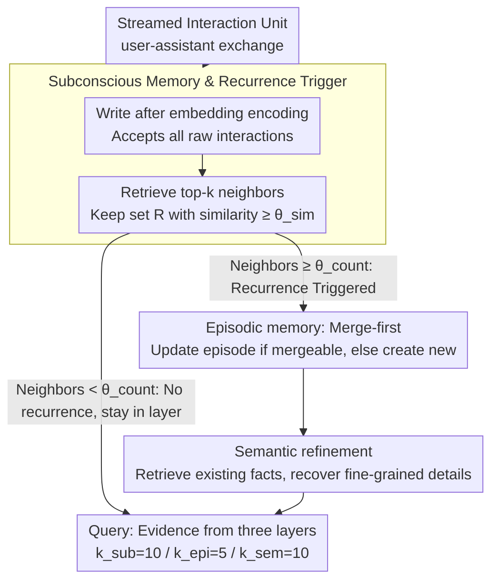

# RecMem: Recurrence-based Memory Consolidation for Efficient and Effective Long-Running LLM Agents

**Conference**: ACL2026 Findings  
**arXiv**: [2605.16045](https://arxiv.org/abs/2605.16045)  
**Code**: https://github.com/CaiusDai/RecMem  
**Area**: LLM Agent / Long-term Memory / Memory System  
**Keywords**: Long-running agents, memory consolidation, recurrence-based triggering, semantic memory, cost efficiency  

## TL;DR
RecMem draws inspiration from the human memory principle of "consolidation through repetition." It first stores raw interactions in a lightweight subconscious memory and triggers LLM-based episodic and semantic memory generation only when semantic recurrence is detected. This allows it to achieve or exceed the QA accuracy of mainstream memory systems on LoCoMo and LongMemEval-S at a significantly lower construction token cost.

## Background & Motivation
**Background**: Long-running LLM agents need to retain user facts, preferences, events, and task states across multiple turns and sessions. Existing external memory systems usually process interaction content into summaries, facts, knowledge graphs, or memory nodes, which are then retrieved to augment responses.

**Limitations of Prior Work**: Systems such as Mem0, A-Mem, and MemoryOS, despite structural differences, mostly adopt eager memory consolidation—calling an LLM to extract, summarize, or merge memory for every new interaction. The primary issue with this strategy is the high construction cost, especially since many one-off, noisy, or low-information interactions do not necessitate immediate entry into long-term memory.

**Key Challenge**: Long-term agents must avoid losing information but should not pay LLM-level consolidation costs for every interaction. Premature consolidation wastes tokens and may over-structure temporary information; completely avoiding consolidation results in a lack of cross-temporal organization for subsequent retrieval.

**Goal**: To design a training-free, text-based external memory system that reduces LLM calls during the memory construction phase of streaming interactions while maintaining long-term QA accuracy.

**Key Insight**: Following the multi-store theory and Complementary Learning Systems (CLS) in cognitive science, the authors argue that isolated experiences should be retained in a fast-encoding layer, and only repeatedly activated patterns deserve consolidation into long-term memory.

**Core Idea**: Use a cheap embedding store to capture all raw interactions first, then use semantic similarity and recurrence counts to trigger LLM consolidation. The question of "when to remember" is treated as a first-class problem, rather than defaulting to LLM summarization for every interaction.

## Method

### Overall Architecture
RecMem addresses "when an interaction is worth spending LLM tokens to consolidate into long-term memory" rather than just "what to remember." It divides memory into three roles: subconscious memory handles raw interactions cheaply and supports retrieval; episodic memory stores multi-turn event narratives; and semantic memory stores fine-grained facts. The system does not introduce new retrieval models; the key lies in the "construction timing": LLM calls for consolidation are only made when a topic repeatedly appears in the subconscious layer, accumulating enough semantically similar historical interactions.

When streaming interactions arrive, the system treats a user-assistant exchange as an atomic unit $u_i=(m_i^{usr},m_i^{ast},\tau_i)$, encodes it as $v_i=\Phi(u_i)$ using an embedding model, and writes it to the subconscious store. For each new unit, it retrieves top-$k$ neighbors in the store, keeping a relevant set $\mathcal{R}_i$ with similarities no less than $\theta_{sim}$. When $|\mathcal{R}_i|\geq \theta_{count}$, indicating the topic is recurring and worth consolidating, the system sends $\mathcal{R}_i\cup\{s_i\}$ to the episodic and semantic layers; otherwise, the interaction remains in subconscious memory without consuming LLM tokens. During the query phase, evidence is retrieved from all three layers simultaneously, with default budgets of $k_{sub}=10$, $k_{epi}=5$, and $k_{sem}=10$ (semantic retrieval is double that of episodic to recover details lost in event summaries).

### Key Designs

**1. Subconscious Memory & Recurrence Trigger: Using "frequency of appearance" as a consolidation switch**

The waste in eager consolidation stems from one-off small talk, noise, or low-information content being processed at LLM costs. RecMem performs only lightweight structuring and vectorized writing to the subconscious store for each new unit, then checks for "peers" in history. If the number of neighbors exceeding $\theta_{sim}$ reaches $\theta_{count}$, consolidation is triggered. The paper provides two sets of thresholds: $\theta_{sim}=0.7, \theta_{count}=5$ for open chat, and $\theta_{sim}=0.6, \theta_{count}=4$ for long task-oriented interactions. This "recurrence as salience" proxy is effective because repeatedly mentioned topics tend to be more stable and likely to be queried than one-off info, offering a higher return on token investment. Information that does not recur is not lost; it remains in the subconscious store for direct retrieval.

**2. Episodic Memory Merge-first Strategy: Preventing topic fragmentation**

In long-term dialogues, a topic often recurs and evolves. If a new episode is generated for every recurrence, the same narrative thread becomes fragmented into disconnected summaries. RecMem attempts to merge new interactions with the most recent episodic entry: if similarity is high enough, it updates the existing episode via LLM merge; if not, after a recurrence trigger, relevant interactions are sorted by timestamp and sent to the LLM to generate a new episode. This merge-first approach maintains a coherent, time-anchored narrative for each topic.

**3. Semantic Refinement: Recovering fine-grained facts lost in compression**

As event-level summaries are merged, they become more abstract, losing user preferences, timestamps, and entity relationships required for precise QA. To mitigate this, RecMem first retrieves related existing semantic facts for each episode, then instructs the LLM to simultaneously: recover key entities and details missed by the summary from raw interactions, and maintain existing facts while handling preference shifts (e.g., changes in user tastes). Each fact is stored as an independent semantic entry, serving as detail compensation for the episodic abstraction.

### Key Experimental Results

#### Main Results
| Dataset / Model | Metrics | RecMem | Prev. SOTA Memory System | Construction Cost Comparison |
|---------------|------|--------|------------------|--------------|
| LoCoMo / GPT-4.1-mini | Overall accuracy | 81.10 | A-Mem 68.83 / MemoryOS 67.60 | 193.2K tokens vs Mem0 1520.8K, A-Mem 1459.93K |
| LoCoMo / GPT-4o-mini | Overall accuracy | 72.47 | MemoryOS 63.64 / A-Mem 60.84 | 202.4K tokens vs Mem0 1233.5K, A-Mem 1143.3K |
| LongMemEval-S / GPT-4.1-mini | Overall accuracy | 76.80 | MemoryOS 74.40 / A-Mem 71.60 | 365.49K tokens vs Mem0 1626.54K, A-Mem 1264.25K |
| LongMemEval-S / GPT-4o-mini | Overall accuracy | 69.20 | MemoryOS 67.80 / Mem0 64.00 | 329.55K tokens vs Mem0 1244.87K, A-Mem 1180.23K |

#### Ablation Study
| Configuration | LoCoMo GPT-4.1-mini Overall | Explanation |
|------|-----------------------------|------|
| Full RecMem | 81.10 | Complete three-layer memory |
| w/o subconscious memory | 51.88 | Largest drop; removes raw interaction layer |
| w/o episodic memory | 79.94 | Removal of narrative has minor impact |
| w/o semantic memory | 70.58 | Significant drop due to loss of fine-grained facts |
| Direct semantic extraction | 74.22 | Lower than 79.94; shows refinement via episode is beneficial |

#### Key Findings
- RecMem consumes approximately 87.3% fewer construction tokens than Mem0 and 86.8% fewer than A-Mem on LoCoMo (GPT-4.1-mini) while achieving higher accuracy.
- On the longer LongMemEval-S, "Full Context" is no longer dominant; RecMem achieves the highest overall accuracy with lower construction costs.
- RecMem excels at temporal reasoning because subconscious clustering aggregates coreferent topics across time, and episodic consolidation restores the evolution process through chronological sorting.
- Ablations show that subconscious memory is the system's foundation; semantic memory is more critical to final accuracy than episodic memory, as many questions require precise facts rather than coarse summaries.

## Highlights & Insights
- The paper shifts the focus from "what to remember" to "when it is worth consolidating." This is highly practical because the cost bottleneck for long-term agents often occurs during continuous writing rather than single queries.
- The subconscious layer serves not only as a cost-saving measure but also as a high-fidelity backup. Information that does not recur enough for consolidation remains directly retrievable.
- Semantic refinement addresses the limitation of summary-only memory: as summaries become more consolidated and abstract, they lose precisely the fine-grained evidence—user preferences, times, entities—required for accurate QA.

## Limitations & Future Work
- Recurrence triggering depends on static thresholds $\theta_{sim}$ and $\theta_{count}$, which might require retuning for different domains or interaction densities.
- Using recurrence as a salience proxy may miss information that is mentioned only once but is highly important, such as one-time deadlines, medical alerts, or contract terms. Although the subconscious memory retains the text, it will not proactively form high-level memory.
- The retrieval budget (10/5/10) and three-layer structure worked well on benchmarks but may need validation in multi-user, multi-modal, or tool-execution contexts.
- Future work could explore adaptive triggering: dynamically adjusting thresholds based on user context, task type, or risk level.

## Related Work & Insights
- **vs Mem0**: Mem0 extracts interactions into atomic facts and updates them continuously; RecMem delays this step until a topic recurs.
- **vs A-Mem**: A-Mem organizes interactions using Zettelkasten-like notes and connections; RecMem emphasizes cost control and recurrence-based triggering during streaming.
- **vs MemoryOS**: MemoryOS manages memory like an operating system; RecMem's three-layer structure is simpler but achieves high cost-performance through the division of labor between subconscious, episodic, and semantic layers.
- **Insight**: For long-term agents, it is not necessary to summarize all interactions into "permanent memory" immediately; establishing a cheap, retrievable, and delay-consolidated buffer layer is highly effective.

## Rating
- Novelty: ⭐⭐⭐⭐☆ The idea of recurrence-triggered consolidation is clear and effective; it is more of a paradigm shift than a complex model innovation.
- Experimental Thoroughness: ⭐⭐⭐⭐☆ Covers two long-memory benchmarks, two LLM backends, multiple memory systems, and detailed ablations. Real-world online deployment analysis could be further strengthened.
- Writing Quality: ⭐⭐⭐⭐☆ Motivation is smooth, the three-layer structure is clearly explained, and cost metrics are compelling.
- Value: ⭐⭐⭐⭐⭐ Highly valuable for the design of memory systems in long-running agents, particularly in scenarios where token costs are a core evaluation metric.

<!-- RELATED:START -->

## Related Papers

- [\[ACL 2026\] TiMem: Temporal-Hierarchical Memory Consolidation for Long-Horizon Conversational Agents](timem_temporal-hierarchical_memory_consolidation_for_long-horizon_conversational.md)
- [\[ACL 2026\] HiGMem: A Hierarchical and LLM-Guided Memory System for Long-Term Conversational Agents](higmem_a_hierarchical_and_llm-guided_memory_system_for_long-term_conversational_.md)
- [\[ACL 2026\] OCR-Memory: Optical Context Retrieval for Long-Horizon Agent Memory](ocr-memory_optical_context_retrieval_for_long-horizon_agent_memory.md)
- [\[ACL 2026\] StructMem: Structured Memory for Long-Horizon Behavior in LLMs](structmem_structured_memory_for_long-horizon_behavior_in_llms.md)
- [\[ACL 2026\] PersonaAgent: Bridging Memory and Action for Personalized LLM Agents](personaagent_bridging_memory_and_action_for_personalized_llm_agents.md)

<!-- RELATED:END -->
