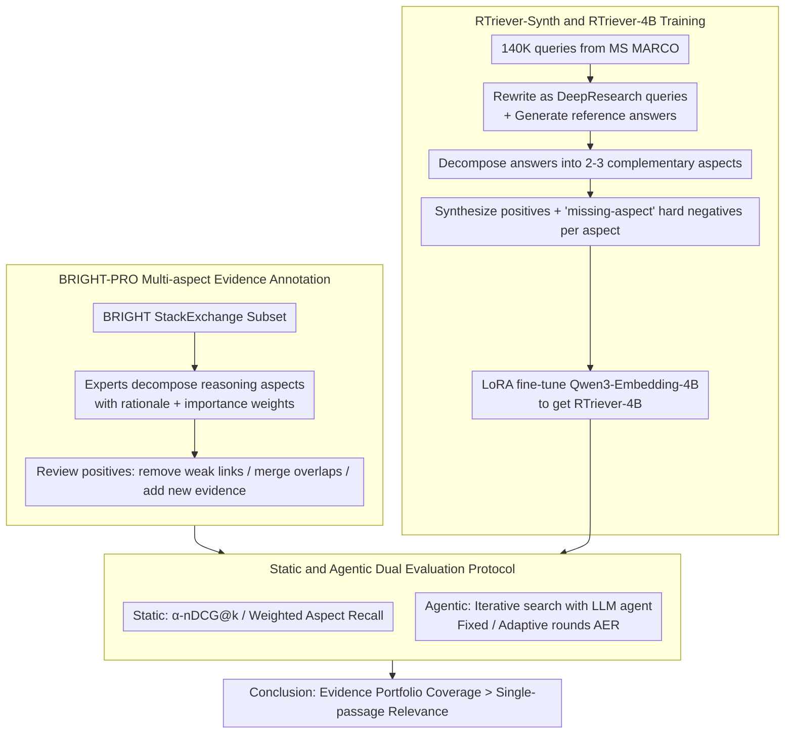

# Rethinking Reasoning-Intensive Retrieval: Evaluating and Advancing Retrievers in Agentic Search Systems

**Conference**: ACL2026  
**arXiv**: [2605.04018](https://arxiv.org/abs/2605.04018)  
**Code**: No public code  
**Area**: LLM Agent / Information Retrieval / Agentic Search  
**Keywords**: reasoning-intensive retrieval, agentic search, BRIGHT-PRO, RTriever, evidence coverage

## TL;DR
The paper proposes BRIGHT-PRO, which re-evaluates reasoning-intensive retrievers using multi-aspect evidence annotation and agentic search protocols. It also introduces RTriever-Synth to train RTriever-4B, demonstrating that retrievers should optimize for "evidence portfolio coverage" rather than single-passage relevance.

## Background & Motivation
**Background**: Traditional information retrieval (IR) systems primarily optimize keyword matching, semantic similarity, or single-passage relevance, which are suitable for factoid or single-hop questions. With the rise of Deep Research and agentic search systems, LLM agents iteratively plan, search, read, and synthesize information, effectively turning the retriever into a critical tool within the agent's reasoning chain.

**Limitations of Prior Work**: Complex queries usually require multiple complementary pieces of evidence to support an answer. However, existing benchmarks like BRIGHT have narrow gold passages (often from one or two web pages) and evaluate retrievers primarily on static ranked lists. On the training side, synthetic retrieval corpora often follow a one-query-one-positive pattern, leading models to learn "finding one relevant passage" instead of covering full reasoning aspects.

**Key Challenge**: In agentic search, the value of a retriever is not just the top relevance in a single search, but whether it can provide a comprehensive, complementary, and citable evidence portfolio to the agent in fewer rounds. Static single-passage metrics may fail to predict the final answer quality and search efficiency of the agent.

**Goal**: Ours expands BRIGHT to build the BRIGHT-PRO benchmark with multi-aspect evidence, designs both static and agentic evaluation protocols, and constructs RTriever-Synth to fine-tune RTriever-4B using aspect-decomposed positives and hard negatives for reasoning-intensive evidence selection.

**Key Insight**: The paper elevates retrieval from "passage relevance" to "evidence portfolio construction." This aligns with the usage patterns in agentic search, where agents require coverage of different sub-aspects of a problem rather than a single answer snippet.

**Core Idea**: Use human-annotated reasoning aspects as evaluation units and aspect-aware synthetic data as training signals to enable the retriever to learn complementary evidence retrieval, verifying the effects at both static and agent-in-the-loop levels.

## Method

### Overall Architecture
This paper follows two main tracks. The evaluation track is BRIGHT-PRO: starting from the StackExchange subset of BRIGHT, experts annotate reasoning aspects, importance weights, and corresponding positive documents for each query, followed by evaluations using static $\alpha$-nDCG / A-Recall and agentic search protocols. The training track is RTriever-Synth: 140K seed queries from MS MARCO are transformed into DeepResearch-style analytical queries. Reference answers are generated and decomposed into complementary reasoning aspects, for which positive passages and positive-conditioned hard negatives are synthesized. Finally, Qwen3-Embedding-4B is LoRA fine-tuned on this data to produce RTriever-4B. Both tracks converge on a dual static + agentic evaluation protocol that explicitly quantifies the value of "evidence portfolio coverage" for the final answer.

### Key Designs

**1. BRIGHT-PRO Multi-aspect Evidence Annotation: Shifting the unit from "one relevant passage" to "coverage of reasoning aspects"**

Answers to complex problems are often composed of multiple sub-questions. A retriever might only cover one high-weight aspect, performing well on traditional Recall while the resulting agent-synthesized answer misses critical premises. BRIGHT-PRO selects the StackExchange subset of BRIGHT (closer to open-domain natural language reasoning) and has domain experts decompose each query into several reasoning aspects. Each aspect is assigned a 1-2 sentence rationale and a significance weight based on a 1-5 Likert score. Simultaneously, original BRIGHT positives are audited to remove weakly relevant passages and merge overlaps, while new evidence is supplemented via web search. This ensures the benchmark measures the coverage of necessary angles rather than surface-level similarity.

**2. Static and Agentic Evaluation Protocols: Isolating retrieval quality and measuring system value in real agent loops**

In deployment, users care about search efficiency and reliability rather than $\alpha$-nDCG scores alone. Static metrics can sometimes misalign with these goals. Ours provides two protocols. On the static side, $\alpha$-nDCG@k uses a novelty penalty $\alpha=0.5$ to penalize redundant coverage of the same aspect, reporting Weighted Aspect Recall, NDCG, and Recall. On the agentic side, the retriever is integrated into an LLM agent that iteratively issues search queries, reads top-5 passages, and generates cited answers. The fixed-round protocol forces 1/2/3 rounds, while the adaptive protocol allows the agent to decide when to stop, using:

$$AER = OQ \times e^{-\gamma(R-1)}$$

to reward both answer quality $OQ$ and fewer rounds $R$. Together, these protocols expose the misalignment between static rankings and system performance.

**3. RTriever-Synth and RTriever-4B Training: Teaching retrievers to select "complementary evidence" rather than "one relevant passage"**

Standard contrastive retrievers learn to rank specific relevant passages higher, which is insufficient for agentic search. RTriever-Synth extracts 140K queries from MS MARCO, rewrites them into DeepResearch-style queries with personas and context, generates full reference answers, and decomposes them into 2-3 non-overlapping reasoning aspects. A positive passage blueprint is generated and instantiated for each aspect. The key is in the negatives: instead of random negatives, hard negatives are deliberately synthesized to be lexically similar to the query but missing a critical reasoning aspect. This forces the model to learn coverage over simple relevance.

### Loss & Training
RTriever-4B is based on Qwen3-Embedding-4B, with all linear projection layers fine-tuned via LoRA (rank 16, scaling factor 32) while original embedding parameters are frozen. Each step samples a query, a positive, and a hard negative, using other documents in the batch as in-batch negatives. It optimizes the query-document contrastive InfoNCE loss with temperature $\tau=0.02$, trained for 5 epochs with a peak learning rate of $1\times10^{-5}$ and 5% linear warm-up.

## Key Experimental Results

### Main Results
BRIGHT-PRO covers 7 expert domains, totaling 739 queries and 526,319 documents, with an average of 7.13 positive documents and 3.74 reasoning aspects per query.

| Subset | Queries | Documents | Avg Positives | Avg Aspects | Avg Query Length |
|------|---------|-----------|------------|----------------|-----------------|
| Biology | 103 | 59,513 | 7.81 | 3.94 | 92.6 |
| Earth Science | 115 | 123,575 | 7.44 | 3.83 | 82.2 |
| Economics | 99 | 52,240 | 7.81 | 3.71 | 123.5 |
| Psychology | 100 | 54,741 | 7.07 | 3.84 | 116.2 |
| Robotics | 101 | 63,920 | 6.17 | 3.71 | 218.8 |
| Stack Overflow | 115 | 109,188 | 4.60 | 3.32 | 172.0 |
| Sustainable Living | 106 | 63,142 | 9.25 | 3.86 | 116.9 |
| Overall | 739 | 526,319 | 7.13 | 3.74 | 131.4 |

In static retrieval evaluation, reasoning-trained retrievers significantly outperform general embedding models. RTriever-4B reaches the upper-middle tier after fine-tuning from Qwen3-Embedding-4B.

| Model | BRIGHT NDCG@10 | BRIGHT-PRO α-nDCG@25 Overall | Position |
|------|----------------|------------------------------|------|
| BGE-Reasoner-8B | 33.8 | 68.0 | Strongest reasoning retriever |
| DIVER-4B-1020 | 30.6 | 63.7 | Strong reasoning retriever |
| DIVER-4B | 28.9 | 59.9 | Strong reasoning retriever |
| RTriever-4B | 27.7 | 55.3 | Ours, better than most general embeddings |
| INF-Retriever-Pro | 26.3 | 53.8 | Reasoning retriever |
| Qwen3-8B | 23.7 | 49.5 | General embedding base |
| OpenAI-Embed-3L | 17.9 | 45.8 | General embedding |
| BM25 | 14.5 | 40.3 | One of the weakest in static eval |

### Ablation Study
Fixed-round agentic evaluation uses a GPT-5-mini agent, retrieving top-5 per round, reporting cumulative $\alpha$-nDCG, reasoning completeness, and overall quality. Static strength does not always equate to agent performance.

| Model | Round-3 α-nDCG@15 | Round-3 Completeness | Round-3 Overall | Observation |
|------|-------------------|----------------------|-----------------|------|
| BGE-Reasoner-8B | 63.04 | 4.42 | 4.31 | Leads in both retrieval and quality |
| DIVER-4B | 53.08 | 4.38 | 4.29 | Better agentic performance than DIVER-4B-1020 |
| RTriever-4B | 50.79 | 4.37 | 4.25 | Top 3 in answer quality |
| GTE-7B | 52.68 | 4.33 | 4.23 | Average static but strong agentic performance |
| DIVER-4B-1020 | 51.56 | 4.33 | 4.16 | Strong static but weaker agent fit |
| BM25 | 51.48 | 4.25 | 4.12 | Follow-up queries mitigate lexical mismatch |

The adaptive round protocol further illustrates differences in efficiency.

| Model / Agent | Avg Rounds | Completeness | Overall | AER | Analysis |
|--------------|----------|--------------|---------|-----|------|
| BGE-Reasoner + GPT-5-mini | 5.10 | 4.63 | 4.43 | 3.65 | High quality and early stopping |
| RTriever-4B + GPT-5-mini | 6.01 | 4.53 | 4.43 | 3.51 | Quality close to BGE, but more rounds |
| BM25 + GPT-5-mini | 5.73 | 4.50 | 4.42 | 3.53 | Surprisingly strong in agentic setting |
| GTE-7B + GPT-5-mini | 6.67 | 4.62 | 4.51 | 3.44 | High quality but at a higher cost |
| RTriever-4B + Qwen3.5 | 4.89 | 4.26 | 4.06 | 3.38 | Remains in the lead with a second agent |

### Key Findings
- BRIGHT-PRO's aspect-aware metrics successfully distinguish reasoning retrievers from general-purpose embedders, whereas BRIGHT's NDCG@10 fails to expose these differences.
- While RTriever-4B is not the strongest model, fine-tuning on 140K aspect-decomposed synthetic bundles allows it to outperform larger general models, proving training objectives matter more than parameter scale.
- Static retrieval rankings cannot fully predict agentic answer quality. DIVER-4B-1020 is stronger statically but weaker than DIVER-4B in the agentic loop; BM25 is weak statically but competitive due to LLM keyword-based follow-up queries.
- AER reveals the failure mode of "good answers but search takes too long." GTE-7B has high overall quality, but its 6.67 average rounds lower its AER.

## Highlights & Insights
- BRIGHT-PRO expands the retrieval evaluation unit from document to reasoning aspect, a crucial step for reasoning-intensive IR. It distinguishes between finding many pieces of evidence for the same angle versus covering all necessary angles.
- The agentic evaluation design is highly practical. Retrievers in an agent loop are queried repeatedly with increasingly specific queries, reactivating the value of lexical methods like BM25.
- The hard negatives in RTriever-Synth are not just semantically similar but are "proximal negatives missing key aspects," reflecting failure modes in complex QA.
- Ours reminds that agent system optimization should not just focus on stronger LLMs. A retriever that provides full coverage and fits the agent's query style can directly reduce search rounds and reasoning hallucinations.

## Limitations & Future Work
- BRIGHT-PRO is based only on the StackExchange subset of BRIGHT. While covering 7 domains, it does not yet extend to news, law, full-text medical, or corporate knowledge bases.
- The human cost for 739 queries and 175-query agentic samples is high, leading to limited scale and potential statistical instability in sub-domains.
- Using LLM-as-Judge for completeness and quality might still be subject to model bias.
- RTriever-Synth currently samples one positive/one negative triplet, underutilizing the multi-positive set; future research could explore multi-positive contrastive learning, aspect-aware sampling, and curriculum negatives.

## Related Work & Insights
- **vs BRIGHT**: BRIGHT first focused on reasoning-intensive retrieval but had narrow gold evidence and primarily static evaluation; BRIGHT-PRO adds aspect labels, weights, and agentic protocols.
- **vs DIVER / ReasonIR**: These methods train reasoning-aware retrievers but focus on single-passage relevance; RTriever-Synth emphasizes complementary positives and aspect coverage.
- **vs DeepResearch benchmarks**: Many DeepResearch benchmarks evaluate final answers, making it hard to isolate the retriever's contribution; Ours isolates the retriever as the variable within the same agent.
- **Insight**: When building agentic RAG, retriever evaluation should simultaneously report coverage, round cost, answer quality, and retriever-agent compatibility.

## Rating
- Novelty: ⭐⭐⭐⭐⭐ Well-integrated combination of multi-aspect coverage and agentic retriever-in-the-loop.
- Experimental Thoroughness: ⭐⭐⭐⭐☆ Extensive static and agentic analysis, though benchmark scale is limited by manual annotation.
- Writing Quality: ⭐⭐⭐⭐☆ Complete structure with clear pipelines, though some tables are dense.
- Value: ⭐⭐⭐⭐⭐ Strong reference value for Deep Research, agentic RAG, and reasoning retriever training.

<!-- RELATED:START -->

## Related Papers

- [\[ICLR 2026\] MC-Search: Evaluating and Enhancing Multimodal Agentic Search with Structured Long Reasoning Chains](../../ICLR2026/llm_agent/mc-search_evaluating_and_enhancing_multimodal_agentic_search_with_structured_lon.md)
- [\[ACL 2026\] BAPO: Boundary-Aware Policy Optimization for Reliable Agentic Search](bapo_boundary-aware_policy_optimization_for_reliable_agentic_search.md)
- [\[ICML 2026\] Process Reward Agents for Steering Knowledge-Intensive Reasoning](../../ICML2026/llm_agent/process_reward_agents_for_steering_knowledge-intensive_reasoning.md)
- [\[ACL 2026\] ToolOmni: Enabling Open-World Tool Use via Agentic Learning with Proactive Retrieval and Grounded Execution](toolomni_enabling_open-world_tool_use_via_agentic_learning_with_proactive_retrie.md)
- [\[ACL 2026\] OctoTools: An Agentic Framework with Extensible Tools for Complex Reasoning](octotools_an_agentic_framework_with_extensible_tools_for_complex_reasoning.md)

<!-- RELATED:END -->
