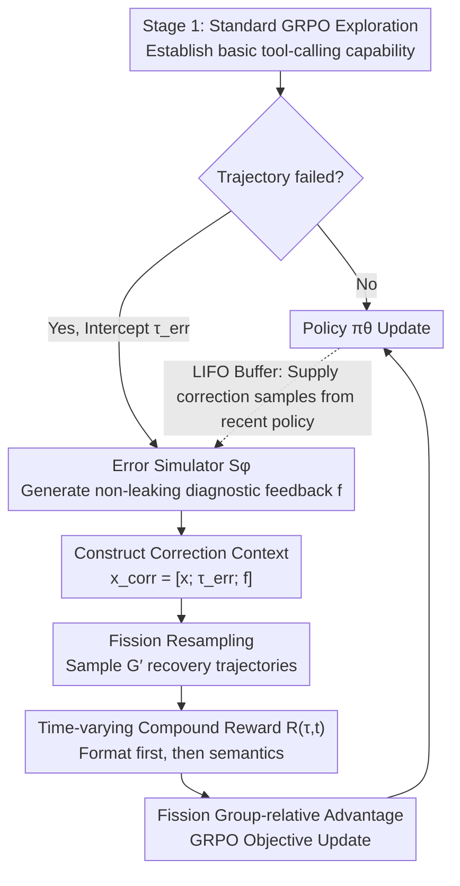

# Robust Tool Use via Fission-GRPO: Learning to Recover from Execution Errors

**Conference**: ACL 2026  
**arXiv**: [2601.15625](https://arxiv.org/abs/2601.15625)  
**Code**: [GitHub](https://github.com/zxzadm/Fission-GRPO)  
**Area**: LLM Alignment  
**Keywords**: Tool Use, Error Recovery, Reinforcement Learning, GRPO, Error Simulator

## TL;DR

Ours proposes Fission-GRPO, which dynamically transforms tool execution errors into online-policy correction training instances within the RL loop. By utilizing a learned error simulator to generate diagnostic feedback and resampling recovery trajectories, it improves the error recovery rate of Qwen3-8B by 5.7% and the overall accuracy from 42.75% to 46.75%.

## Background & Motivation

**Background**: While LLMs can call tools effectively, small models often fall into "hallucinated retry loops" when encountering API errors in multi-turn executions instead of interpreting feedback to recover.

**Limitations of Prior Work**: (1) Standard RL (e.g., GRPO) treats errors only as sparse negative rewards, indicating "what is wrong" without teaching "how to recover"; (2) Gradient vanishing occurs when the advantage variance is zero because all sampled trajectories fail; (3) Offline synthesized correction datasets suffer from distribution shift as the policy evolves.

**Key Challenge**: Prior methods treat errors as "outcomes to be avoided" rather than "experiences to be learned from."

**Goal**: Transform execution errors into dense, online-policy-aligned correction training signals.

**Key Insight**: Analogous to nuclear fission—a single error event triggers a chain reaction, generating multiple correction trajectories.

**Core Idea**: Intercept failure trajectories → generate diagnostic feedback using a learned error simulator → resample $G'$ recovery trajectories ("fission") from the augmented context to continuously align with the current policy's error patterns in the training loop.

## Method

### Overall Architecture

Fission-GRPO establishes a closed loop for "recovering from errors" within the RL training cycle. Inspired by the metaphor of nuclear fission, a single execution error triggers a chain reaction to sprout multiple correction trajectories. Training alternates through three stages: Stage 1 involves standard GRPO to explore and establish basic tool-calling capabilities; Stage 2 intercepts failure trajectories and uses a learned error simulator $S_\phi$ to generate diagnostic feedback and construct a correction context; Stage 3 resamples $G'$ recovery trajectories ("fission") from the correction context to update the policy. Consequently, errors are no longer just sparse negative rewards but are transformed on-the-fly into dense correction signals aligned with the current policy.

### Key Designs

**1. Error Simulator $S_\phi$: Replacing Expensive Real APIs with Controllable Diagnostic Feedback**

Interaction with real APIs is costly and non-reproducible, yet teaching a model "how to recover" requires plausible runtime errors. Fission-GRPO performs SFT on Qwen3-32B using approximately 2K samples (system prompts + tool descriptions + dialogue states + failed calls + correct calls + teacher diagnostic messages) to obtain the error simulator $S_\phi$. During inference, it takes a failed call as input and outputs a diagnostic string resembling a runtime error. A key constraint is "non-leaking"—describing the issue (e.g., "parameter status expects value OPEN") without providing the direct answer—thereby providing effective clues without allowing the model to take shortcuts. Human evaluation shows a 96% non-leaking rate (Cohen's κ=0.71) and generalization to unseen tool schemas.

**2. Fission Resampling: Amplifying a Single Error into Dense Signals**

Standard GRPO faces an issue where gradient vanishing occurs when a group of sampled trajectories all fail because the advantage variance is zero. Fission resampling targets each correction context $x_{\text{corr}} = [x; \tau_{\text{err}}; f]$ by sampling $G'$ recovery trajectories $\{\tau'_j\}_{j=1}^{G'} \sim \pi_\theta(\cdot \mid x_{\text{corr}})$, and then calculates normalized advantages within this fission group for the GRPO objective update. Since the diagnostic feedback $f$ injects additional information, the intra-group diversity is significantly improved, mitigating gradient vanishing caused by all-failure groups.

**3. Time-varying Compound Reward: Format First, then Semantics**

Tool calling requires both format compliance and precise parameters, but applying pressure to both simultaneously can lead to unstable training. Fission-GRPO uses a time-varying compound reward $R(\tau,t) = \frac{1}{3}[w_{\text{fmt}}(t)R_{\text{fmt}} + w_{\text{corr}}(t)R_{\text{corr}} + R_{\text{len}}]$ for staged guidance. The format weight $w_{\text{fmt}}(t)$ decreases over the course of training while the correctness weight $w_{\text{corr}}(t)$ increases. The correctness reward $R_{\text{corr}}$ combines function selection accuracy and parameter F1. Thus, the policy learns the correct output format early on and concentrates on semantic precision of parameters in later stages.

### Loss & Training

Standard GRPO and Fission-Correction GRPO alternate: the former handles routine exploration, while the latter specifically digests intercepted failure trajectories. A LIFO (Last-In-First-Out) buffer ensures that correction samples always originate from the most recent policy, preventing the distribution shift often associated with offline synthesized correction data.

## Key Experimental Results

### Main Results

Qwen3 series models on BFCL v4 Multi-Turn:

| Method | 1.7B | 4B | 8B |
|------|------|------|------|
| Base | 7.80 | 19.37 | 42.75 |
| GRPO | 17.12 | 36.38 | 42.75 |
| DAPO | 16.00 | 38.25 | — |
| **Ours (Fission-GRPO)** | **20.38** | **40.50** | **46.75** |

Generalization results on TAU-Bench show up to a +17.4% Gain on Retail.

### Ablation Study

| Configuration | Overall | Description |
|------|---------|------|
| GRPO only | 42.75 | No error recovery training |
| + Offline Error Data | 44.00 | Static distribution shift |
| + Fission (no simulator) | 44.50 | No diagnostic feedback |
| + Ours (Fission-GRPO) | **46.75** | Full framework |

### Key Findings

- The error recovery rate improved by 5.7% (from ~20% to ~26%), which is the primary source of the overall accuracy Gain.
- The simulator's non-leaking rate is 96% (human eval, Cohen's κ=0.71), maintaining generalization on unseen tool schemas.
- The Fission mechanism is consistently effective across model scales (Gains observed at 1.7B/4B/8B).

## Highlights & Insights

- The philosophy that **"errors are experiences rather than punishments"** changes the training paradigm for RL tool use—not just telling the model "you're wrong," but teaching it "how to fix it."
- The **LIFO buffer** ensures that correction samples remain aligned with the latest policy, avoiding distribution shifts in offline data.
- The **Fission metaphor** is intuitive and powerful—one error → multiple recovery attempts → dense signals.

## Limitations & Future Work

- The error simulator is based on Qwen3-32B (much larger than the target model), which necessitates cost considerations for deployment.
- Validation is limited to tool-calling scenarios; portability to reasoning or code error recovery remains to be verified.
- Tuning the LIFO buffer size and fission group size G' requires empirical effort.

## Related Work & Insights

- **vs DAPO/NGRPO**: These methods reshape the loss surface of negative signals but do not construct positive signals; Fission-GRPO proactively builds recovery trajectories.
- **vs ToolACE/LoopTool**: These use offline synthesis for correction data, leading to severe distribution shift issues; Fission-GRPO maintains alignment via online generation.

## Rating

- Novelty: ⭐⭐⭐⭐⭐ The idea of integrating error recovery training into the RL loop is highly innovative and elegant.
- Experimental Thoroughness: ⭐⭐⭐⭐⭐ Multiple model scales, multiple benchmarks, and human evaluation of simulator reliability.
- Writing Quality: ⭐⭐⭐⭐ Clear framework diagrams and vivid fission analogy.
- Value: ⭐⭐⭐⭐⭐ Practically advances the robustness of tool-using Agents.

<!-- RELATED:START -->

## Related Papers

- [\[ACL 2026\] ToolOmni: Enabling Open-World Tool Use via Agentic Learning with Proactive Retrieval and Grounded Execution](toolomni_enabling_open-world_tool_use_via_agentic_learning_with_proactive_retrie.md)
- [\[ICML 2026\] Recovering Policy-Induced Errors: Benchmarking and Trajectory Synthesis for Robust GUI Agents](../../ICML2026/llm_agent/recovering_policy-induced_errors_benchmarking_and_trajectory_synthesis_for_robus.md)
- [\[ACL 2026\] Feedback-Driven Tool-Use Improvements in Large Language Models via Automated Build Environments](feedback-driven_tool-use_improvements_in_large_language_models_via_automated_bui.md)
- [\[ACL 2026\] When Agents Look the Same: Quantifying Distillation-Induced Similarity in Tool-Use Behaviors](when_agents_look_the_same_quantifying_distillation-induced_similarity_in_tool-us.md)
- [\[CVPR 2026\] RAAS: LLM Agentic System Architecture Search with GRPO](../../CVPR2026/llm_agent/raas_llm_agentic_system_architecture_search_with_grpo.md)

<!-- RELATED:END -->
