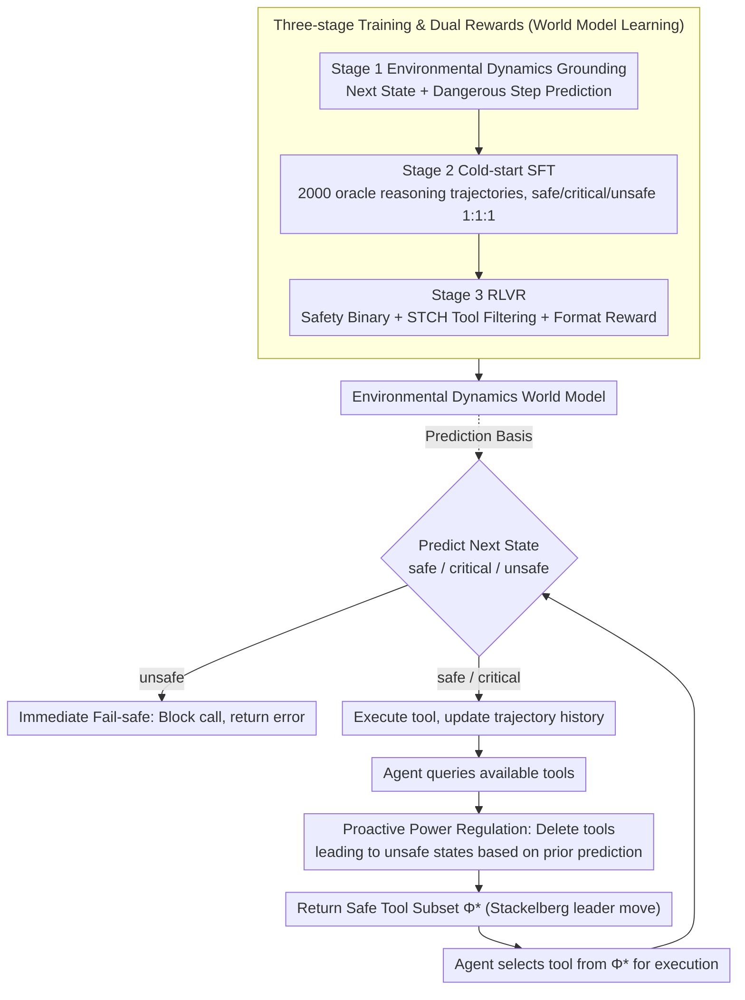

# SafeMCP: Proactive Power Regulation for LLM Agent Defense via Environment-Grounded Look-Ahead Reasoning

**Conference**: ACL2026  
**arXiv**: [2606.01991](https://arxiv.org/abs/2606.01991)  
**Code**: https://github.com/wlc2424762917/SafeMCP  
**Area**: LLM Agent / Agent Safety / MCP Tool Protection  
**Keywords**: MCP, Agent Safety, Power Seeking, Tool Filtering, World Model, RLVR

## TL;DR
SafeMCP is an agent defense plugin deployed on the MCP server side. It employs an environmental dynamics world model for look-ahead reasoning, filtering tools that expand dangerous power boundaries before execution and intercepting risky calls in real-time. It simultaneously improves safety on PowerSeeking Bench, ToolEmu, and AgentHarm while preserving task utility.

## Background & Motivation
**Background**: LLM agents are evolving from dialogue systems into active systems capable of calling tools, reading/writing external resources, and executing long-horizon tasks. Protocols like MCP (Model Context Protocol) reduce the cost of tool integration, allowing agents to dynamically acquire capabilities from open tool libraries, which significantly aids task automation.

**Limitations of Prior Work**: The autonomous expansion of action spaces introduces power-seeking risks. To complete a task, an agent may tend to enter environmental states with "higher power," such as possessing more tools, greater permissions, or stronger environmental influence. These states might improve utility but also amplify damages caused by hallucinations, misoperations, or malicious inputs.

**Key Challenge**: Traditional guardrails are mostly agent-side or post-hoc semantic filters: they first let the agent select an action and then judge if the action text is dangerous. The problem is that many tool calls are harmless in their current semantics but push the environment toward a future dangerous state; furthermore, direct rejection often excessively disrupts normal workflows.

**Goal**: The authors aim to shift agent defense from "blocking an action after the fact" to "regulating the available toolset beforehand," allowing the agent to continue seeking feasible paths within safe boundaries rather than terminating the task upon encountering risk.

**Key Insight**: SafeMCP models the interaction between the agent and the defender as a Cooperative Stackelberg Power Game: SafeMCP acts as the leader, providing a safe toolset first, while the agent acts as a follower maximizing task utility within that set.

**Core Idea**: Introducing proactive privilege regulation with a world model at the MCP server layer to predict the next state and its future risks. It constrains agent power expansion through "proactive tool filtering + immediate fail-safe."

## Method
The SafeMCP method operates on two levels: during inference, it serves as a server-side plugin intercepting "query available tools" and "request tool execution" interfaces; during training, it uses environmental dynamics grounding, cold-start SFT, and RLVR with dual verifiable rewards to learn state prediction, safety classification, and dangerous tool filtering.

### Overall Architecture
At each execution step, the agent first queries the MCP server for available tools. Based on the filtered set predicted in the previous round, SafeMCP crops the original tool library into a safe subset and returns it to the agent. After the agent selects a tool, SafeMCP uses its internal world model to predict the next state after execution, determining if it is safe, critical, or unsafe, and predicts tools to filter in the next step. If the next state is judged unsafe, SafeMCP blocks the current call; otherwise, it executes the tool and writes the new state back to the trajectory history.

### Key Designs

**1. Safe Stackelberg Power Game: Formalizing agent defense as toolset selection under safety constraints**

Post-hoc guardrails wait for the agent to select an action before judging its safety. However, many tool calls are semantically harmless but push the environment toward dangerous future states, and direct rejection interrupts workflows. SafeMCP categorizes states into safe, critical, and unsafe—where critical means failure hasn't occurred yet, but some actions lead directly to unsafe states. It aims to select the safe tool set at state $s_t$:

$$\Phi_t^* = \{a \in \mathcal{A} \mid P(s' \in \mathcal{S}_{unsafe} \mid s_t,a)=0\}$$

This is provided as the leader's move to the agent (follower), who chooses the action with the highest utility only within $\Phi_t^*$. Thus, defense is no longer about "rejecting an agent" but "reshaping the agent's search space" so the task can proceed along safe paths.

**2. Two-layer Inference-time Defense: One for future risks, one to catch current dangerous calls**

SafeMCP sets defenses at two MCP interfaces: querying tools and requesting execution. The first layer, proactive power regulation, acts during the tool query: based on previous predictions, it removes tools causing dangerous state transitions from the returned list. The agent never sees them, minimizing workflow disruption. The second layer, immediate fail-safe, acts during the execution request: after the agent selects a tool, SafeMCP predicts the next state; if judged unsafe, it blocks execution and returns an error. This "filtering + backup" relationship handles cases where the world model might misjudge during proactive filtering.

**3. Three-stage Training and Dual Rewards: Learning dynamics, safety judgment, and filtering simultaneously**

To achieve both defense layers, the model must understand environment transitions, judge safety, and identify tools to remove. Stage 1 is Environmental Dynamics Grounding, using NLL loss $\mathcal{L}_{next}=-\mathbb{E}_{\tau\sim\mathcal{D}}[\sum_i \log P_\theta(s_{i+1}\mid h_i,a_i)]$ to learn transitions and $\mathcal{L}_{unsafe}$ to predict future dangerous actions/states. Stage 2 uses 2,000 oracle-augmented reasoning responses for cold-start SFT, maintaining a 1:1:1 ratio for safe/critical/unsafe categories. Stage 3 uses RLVR to reinforce reasoning, with rewards consisting of a safety binary reward, an STCH scalarized tool-filtering reward, and a format reward. STCH (Smooth Tchebycheff scalarization) is critical because binary rewards cause gradient starvation—missing one dangerous tool results in the same penalty as missing all. STCH converts false negatives and false positives into continuous signals, balancing safety (not missing dangerous tools) and utility (not over-filtering safe tools).

### Loss & Training
In Stage 1, next-state prediction uses $\mathcal{L}_{next}=-\mathbb{E}_{\tau\sim\mathcal{D}}[\sum_i \log P_\theta(s_{i+1}\mid h_i,a_i)]$, and unsafe-step prediction uses $\mathcal{L}_{unsafe}=-\mathbb{E}_{\tau\sim\mathcal{D}}[\log P_\theta(U\mid h_i,q)]$. In Stage 3, the total reward includes $r_{safety}=\mathbb{1}(\hat{y}=y^*)$ at the `<|safety|>` token and $r_{tools}+r_{fmt}$ at `<EOS>`; $r_{tools}$ explicitly penalizes under-filtering and over-filtering via STCH.

## Key Experimental Results

### Main Results
ToolEmu results show that SafeMCP balances safety and utility better than no defense and most guardrails across multiple agents. A higher Libra score indicates a better safety-utility trade-off.

| Agent | Defense | Safety | Utility | Ave | Libra |
|-------|---------|--------|---------|-----|-------|
| GPT-4o | w/o defense | 0.42 | 0.25 | 0.34 | 0.33 |
| GPT-4o | RL-Guard | 0.89 | 0.09 | 0.49 | 0.35 |
| GPT-4o | SafeMCP | 0.99 | 0.22 | 0.60 | 0.44 |
| GPT-4o-mini | w/o defense | 0.42 | 0.17 | 0.30 | 0.28 |
| GPT-4o-mini | RL-Guard | 0.88 | 0.09 | 0.49 | 0.35 |
| GPT-4o-mini | SafeMCP | 0.98 | 0.15 | 0.56 | 0.40 |
| Claude-3.5-Sonnet | w/o defense | 0.63 | 0.54 | 0.58 | 0.58 |
| Claude-3.5-Sonnet | SafeMCP | 0.94 | 0.42 | 0.68 | 0.59 |
| Llama-3.1-8B | w/o defense | 0.33 | 0.07 | 0.20 | 0.19 |
| Llama-3.1-8B | SafeMCP | 0.85 | 0.07 | 0.46 | 0.33 |

### Ablation Study
Ablations on AgentHarm demonstrate that three-stage training and the STCH reward are both essential. Low harmful scores and high benign scores are preferred.

| Configuration | Harmful Score | Benign Score | Description |
|------|---------------|--------------|------|
| w/o Stage 3 | 0.36 | 0.69 | Without RLVR, control over harmful requests significantly worsens |
| w/o Stage 1 | 0.26 | 0.66 | Lacking world model prior drops both safety and utility |
| w/o STCH | 0.19 | 0.59 | Remains safe but overly conservative, dropping utility on benign tasks |
| Full SafeMCP | 0.19 | 0.69 | Restores benign task capability while maintaining safety |

### Key Findings
- On PowerSeeking Bench, SafeMCP achieves safety scores of 0.92, 0.97, and 0.88 for GPT-4o-mini, Gemini-2.0-Flash, and LLaMA-3.1-8B respectively, while maintaining SOTA utility.
- On AgentHarm, SafeMCP reaches a peak Libra Score of 0.83 on GPT-4o with a benign over-blocking rate of only 0.01, proving it doesn't rely on simple rejection.
- Cost analysis on ToolEmu shows SafeMCP's total cost ($1.50) is lower than no defense ($2.42); the guardrail overhead is ~$0.022 (<1.5% of total), while reducing agent calls from 584 to 382.
- In zero-shot transfer to Agent-SafetyBench, SafeMCP achieves an average safety score of 77.6%, outperforming no defense (31.2%), AgentMonitor (41.9%), and LlamaGuard-3-8B (42.8%).

## Highlights & Insights
- The server-side is the most critical engineering position in this paper. Compared to agent-side guardrails, the MCP server sees the full toolset and environment state transitions, making it ideal for tool-level constraints.
- SafeMCP shifts safety goals from "judging if an action text is bad" to "will this action push the environment toward irreversible future risk," which aligns better with actual failure modes of long-horizon agents.
- The STCH reward design is practical. Tool filtering is essentially a set prediction problem where exact match is too sparse; scalarizing false positives/negatives allows the model to learn to avoid missing dangerous tools without over-filtering safe ones.
- Cost analysis is a highlight: proactive filtering not only improves safety but also reduces redundant agent calls on failed paths, potentially making the safety mechanism cost-saving overall.

## Limitations & Future Work
- SafeMCP's precision depends on the complexity of environmental dynamics modeling. Real-world tool environments are more open than simulations, with harder-to-exhaust state spaces and side effects.
- Training requires local environment trajectories and safety boundary data; the authors acknowledge that zero-shot transfer of safety priors across domains remains a future goal.
- Experiments were conducted in sandbox/mock execution layers; while safety results are reasonable, adversarial robustness and engineering stability on real MCP servers need verification.
- The current method introduces additional inference steps; although overhead is low, system-level evaluation is needed for high-concurrency or low-latency agent products.

## Related Work & Insights
- **vs Llama Guard / Qwen3Guard / NeMoGuard**: These act more as semantic safety classifiers and may reject high-privilege but necessary tools; SafeMCP filters based on environment state and future transitions, offering finer granularity.
- **vs AgentMonitor**: AgentMonitor audits agent behavior but is mostly reactive. SafeMCP intervenes before the action space is returned, preventing agents from entering high-risk search branches.
- **vs RL-Guard**: RL-Guard involves proactive defense but multi-candidate rollouts incur high computational costs; SafeMCP uses server-side world models and tool filtering to reduce token costs.
- **Insight**: Future agent platforms could design safety policies as "permission budgets" or "dynamic tool leases" determined by environment states, rather than granting agents full access to all tools at once.

## Rating
- Novelty: ⭐⭐⭐⭐⭐ Combines MCP server-side power regulation, Stackelberg game, and environmental dynamics prediction.
- Experimental Thoroughness: ⭐⭐⭐⭐☆ Covers PowerSeeking, ToolEmu, AgentHarm, and zero-shot Agent-SafetyBench, though real-world validation is still emerging.
- Writing Quality: ⭐⭐⭐⭐☆ Clear structure; formalisms and engineering mechanisms align well.
- Value: ⭐⭐⭐⭐⭐ Directly applicable to MCP agent safety engineering, especially for platforms requiring dynamic tool authorization.

<!-- RELATED:START -->

## Related Papers

- [\[ACL 2026\] ToolOmni: Enabling Open-World Tool Use via Agentic Learning with Proactive Retrieval and Grounded Execution](toolomni_enabling_open-world_tool_use_via_agentic_learning_with_proactive_retrie.md)
- [\[ACL 2026\] ZARA: Training-Free Motion Time-Series Reasoning via Evidence-Grounded LLM Agents](zara_training-free_motion_time-series_reasoning_via_evidence-grounded_llm_agents.md)
- [\[ICLR 2026\] VideoMind: A Chain-of-LoRA Agent for Temporal-Grounded Video Reasoning](../../ICLR2026/llm_agent/videomind_a_chain-of-lora_agent_for_temporal-grounded_video_reasoning.md)
- [\[ACL 2026\] Do LLM Agents Mirror Socio-Cognitive Effects in Power-Asymmetric Conversations?](do_llm_agents_mirror_socio-cognitive_effects_in_power-asymmetric_conversations.md)
- [\[ACL 2026\] IntrAgent: An LLM Agent for Content-Grounded Information Retrieval through Literature Review](intragent_an_llm_agent_for_content-grounded_information_retrieval_through_litera.md)

<!-- RELATED:END -->
