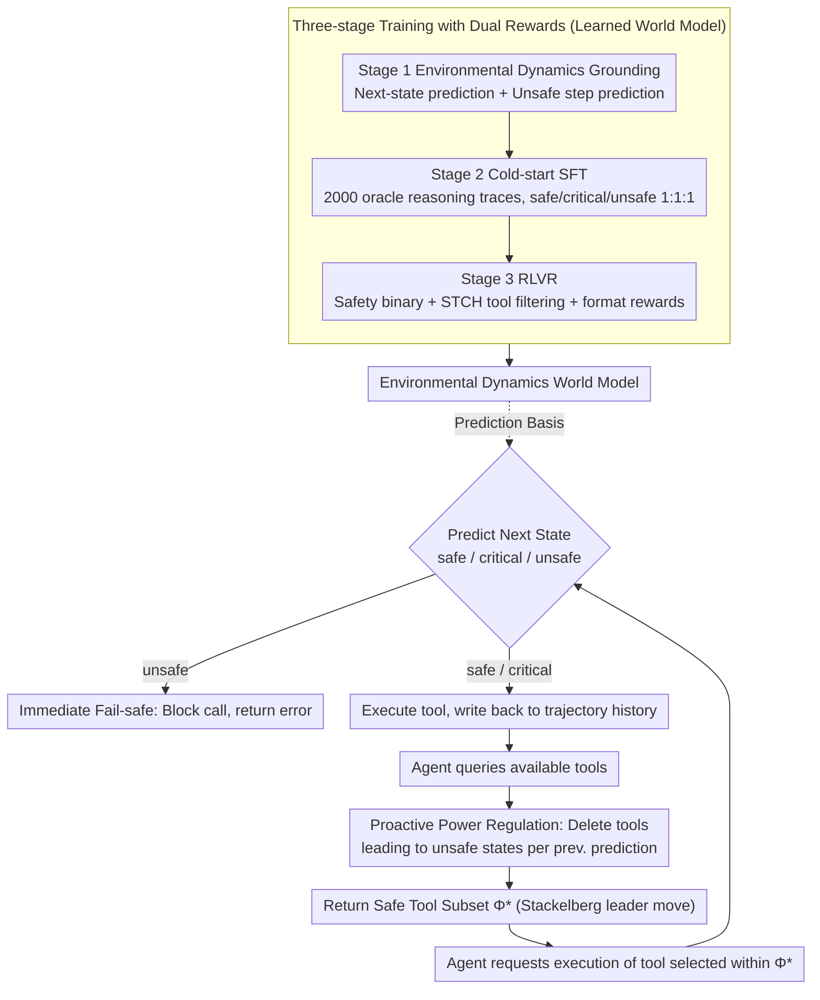

# SafeMCP: Proactive Power Regulation for LLM Agent Defense via Environment-Grounded Look-Ahead Reasoning

**Conference**: ACL2026  
**arXiv**: [2606.01991](https://arxiv.org/abs/2606.01991)  
**Code**: https://github.com/wlc2424762917/SafeMCP  
**Area**: LLM Agent / Agent Security / MCP Tool Protection  
**Keywords**: MCP, Agent Security, Power Seeking, Tool Filtering, World Model, RLVR

## TL;DR
SafeMCP is an agent defense plugin deployed on the MCP server side. It utilizes an environmental dynamics world model for look-ahead reasoning to first filter tools that might expand dangerous power boundaries, and kemudian performs real-time interception of initiated hazardous calls. It simultaneously enhances safety and preserves task utility across PowerSeeking Bench, ToolEmu, and AgentHarm.

## Background & Motivation
**Background**: LLM agents are evolving from dialogue systems into action systems capable of calling tools, reading/writing external resources, and executing long-horizon tasks. Protocols like MCP reduce the cost of tool integration, allowing agents to dynamically acquire capabilities from open tool repositories, which facilitates task automation.

**Limitations of Prior Work**: The autonomous expansion of action spaces introduces power-seeking risks. To complete tasks, an agent may tend to enter environmental states with "higher power," such as possessing more tools, greater permissions, or stronger environmental influence. While these states may improve utility, they also amplify damages caused by hallucinations, misoperations, or malicious inputs.

**Key Challenge**: Traditional guardrails are mostly agent-side or post-hoc semantic filters: they first let the agent select an action and then judge if the action text is dangerous. The problem is that many tool calls are harmless in their current semantics but push the environment into a future dangerous state; direct rejection often excessively interrupts normal workflows.

**Goal**: The authors aim to transform agent defense from "post-hoc blocking of an action" to "proactive regulation of the available tool set," allowing the agent to still find feasible paths within safe boundaries rather than terminating the task upon encountering risk.

**Key Insight**: SafeMCP models the interaction between the agent and the defender as a Cooperative Stackelberg Power Game: SafeMCP acts as the leader by first providing a safe tool set, while the agent acts as the follower to maximize task utility within that set.

**Core Idea**: Introduce proactive power regulation with a world model at the MCP server layer to predict the next state and its future risks, then constrain agent power expansion through "proactive tool filtering + immediate fail-safe."

## Method
The SafeMCP method operates on two levels: at inference time, it acts as a server-side plugin intercepting "query available tools" and "request tool execution" interfaces; during training, it uses environmental dynamics grounding, cold-start SFT, and RLVR with dual verifiable rewards to learn state prediction, safety category judgment, and dangerous tool filtering.

### Overall Architecture
At each execution step, the agent first queries the MCP server for available tools. SafeMCP prunes the original tool library into a safe subset based on the filtering set predicted in the previous round and returns it to the agent. After the agent selects a tool, SafeMCP uses an internal world model to predict the next state after execution, determines if the state is safe, critical, or unsafe, and predicts the tools to be filtered in the next step. If the next state is judged unsafe, SafeMCP directly blocks the current call; otherwise, it executes the tool and writes the new state back to the trajectory history.

### Key Designs

**1. Safe Stackelberg Power Game: Formalizing "defending agents" as tool set selection under safety constraints**

Post-hoc guardrails wait for the agent to select an action before determining its danger, but many tool calls with harmless current semantics push the environment into future dangerous states. SafeMCP categories states into safe, critical, and unsafe—where critical means it hasn't failed yet but certain actions could immediately lead to unsafe. It aims to select a safe tool set at state $s_t$:

$$\Phi_t^* = \{a \in \mathcal{A} \mid P(s' \in \mathcal{S}_{unsafe} \mid s_t,a)=0\}$$

This is provided to the agent as the leader's move; the agent, as the follower, picks the action with maximum utility within $\Phi_t^*$. Thus, defense is no longer about "rejecting an agent" but "reshaping the agent's search space."

**2. Two-layer Inference-time Defense: One for future risks, one to catch current hazardous calls**

The agent uses two interfaces on MCP: querying tools and requesting execution. SafeMCP sets defenses at both. The first layer, proactive power regulation, acts during the tool query: based on previous predictions, it removes tools leading to unsafe state transitions from the list. The second layer, immediate fail-safe, acts during execution requests: once a tool is selected, the world model predicts the next state; if judged unsafe, it blocks execution. These form a "proactive filtering + safety net" relationship.

**3. Three-stage Training and Dual Rewards: Learning dynamics, safety judgment, and filtering**

Stage 1 is Environmental Dynamics Grounding, using a next-state prediction NLL loss $\mathcal{L}_{next}$ to learn $P(s_{i+1}\mid h_i,a_i)$ and an unsafe step prediction loss $\mathcal{L}_{unsafe}$ to predict future dangerous actions/states. Stage 2 uses 2,000 oracle-augmented high-quality reasoning responses for cold-start SFT with balanced safe/critical/unsafe samples. Stage 3 uses RLVR, where rewards include a safety binary reward, a STCH scalarized tool-filtering reward, and a format reward. Smooth Tchebycheff scalarization (STCH) is critical here to avoid gradient starvation by turning discrete set errors into continuous signals, balancing safety (not missing dangerous tools) and utility (not over-filtering safe tools).

### Loss & Training
Stage 1 next-state prediction uses $\mathcal{L}_{next}=-\mathbb{E}_{\tau\sim\mathcal{D}}[\sum_i \log P_\theta(s_{i+1}\mid h_i,a_i)]$, and unsafe-step prediction uses $\mathcal{L}_{unsafe}=-\mathbb{E}_{\tau\sim\mathcal{D}}[\log P_\theta(U\mid h_i,q)]$. Stage 3 provides $r_{safety}=\mathbb{1}(\hat{y}=y^*)$ at the `<|safety|>` token and $r_{tools}+r_{fmt}$ at `<EOS>`; $r_{tools}$ explicitly penalizes under-filtering and over-filtering via STCH.

## Key Experimental Results

### Main Results
ToolEmu results show SafeMCP balances safety and utility better than no defense or most existing guardrails across various agents. A higher Libra score indicates a better safety-utility trade-off.

| Agent | Defense | Safety | Utility | Ave | Libra |
|-------|---------|--------|---------|-----|-------|
| GPT-4o | w/o defense | 0.42 | 0.25 | 0.34 | 0.33 |
| GPT-4o | RL-Guard | 0.89 | 0.09 | 0.49 | 0.35 |
| GPT-4o | SafeMCP | 0.99 | 0.22 | 0.60 | 0.44 |
| GPT-4o-mini | w/o defense | 0.42 | 0.17 | 0.30 | 0.28 |
| GPT-4o-mini | RL-Guard | 0.88 | 0.09 | 0.49 | 0.35 |
| GPT-4o-mini | SafeMCP | 0.98 | 0.15 | 0.56 | 0.40 |
| Claude-3.5-Sonnet | w/o defense | 0.63 | 0.54 | 0.58 | 0.58 |
| Claude-3.5-Sonnet | SafeMCP | 0.94 | 0.42 | 0.68 | 0.59 |
| Llama-3.1-8B | w/o defense | 0.33 | 0.07 | 0.20 | 0.19 |
| Llama-3.1-8B | SafeMCP | 0.85 | 0.07 | 0.46 | 0.33 |

### Ablation Study
Ablations on AgentHarm indicate that three-stage training and STCH rewards both contribute.

| Configuration | Harmful Score | Benign Score | Description |
|------|---------------|--------------|------|
| w/o Stage 3 | 0.36 | 0.69 | Without RLVR, control over harmful requests worsens |
| w/o Stage 1 | 0.26 | 0.66 | Lacking world model prior leads to safety and utility drops |
| w/o STCH | 0.19 | 0.59 | Remains safe but overly conservative, reducing benign utility |
| Full SafeMCP | 0.19 | 0.69 | Restores benign task capability while maintaining safety |

### Key Findings
- On PowerSeeking Bench, SafeMCP achieves safety scores of 0.92, 0.97, and 0.88 for GPT-4o-mini, Gemini-2.0-Flash, and LLaMA-3.1-8B while maintaining SOTA utility.
- On AgentHarm, SafeMCP reaches a peak Libra Score of 0.83 with GPT-4o, limiting benign over-blocking to 0.01.
- In ToolEmu cost analysis, SafeMCP reduces the total cost to \$1.50 (vs \$2.42 without guardrails) by reducing the number of agent calls from 584 to 382.
- In zero-shot transfer to Agent-SafetyBench, SafeMCP achieves an average safety score of 77.6%, significantly higher than LlamaGuard-3-8B (42.8%).

## Highlights & Insights
- The server-side position is the most critical engineering choice. Unlike agent-side guardrails, the MCP server sees the full toolset and environmental transitions, making it ideal for toolset constraints.
- It shifts the safety goal from "judging the action text" to "predicting if an action pushes the environment toward irreversible future risk," which fits long-horizon agent failure modes.
- The STCH reward addresses the sparse reward problem in set prediction by scalarizing false positive and false negative errors into continuous signals.
- Proactive filtering not only improves safety but also reduces redundant agent calls on failing paths, potentially saving total token costs.

## Limitations & Future Work
- Precision depends on the complexity of environmental dynamics. Real-world tool environments are more open and harder to exhaustively model.
- Training requires local environment trajectories and safety boundary data; cross-domain safety prior transfer is a future goal.
- Experiments were conducted in sandbox/mock execution layers; adversarial robustness and engineering stability on production MCP servers need verification.
- The method introduces additional inference steps, requiring systematic evaluation for high-concurrency or low-latency products.

## Related Work & Insights
- **vs Llama Guard / NeMoGuard**: These are semantic safety classifiers that may reject high-permission but necessary tools; SafeMCP filters based on state transitions with finer granularity.
- **vs AgentMonitor**: AgentMonitor is more reactive/auditing; SafeMCP intervenes before the action space is returned to prevent high-risk search branches.
- **vs RL-Guard**: SafeMCP reduces token costs by using server-side world models and filtering instead of expensive multi-candidate rollouts.
- **Insight**: Future agent platforms could design safety policies as "permission budgets" or "dynamic tool leases" determined by environmental states.

## Rating
- Novelty: ⭐⭐⭐⭐⭐ Combining MCP server-side regulation, Stackelberg games, and dynamics prediction is highly novel.
- Experimental Thoroughness: ⭐⭐⭐⭐☆ Extensive coverage across major benchmarks, though real-world deployment data is limited.
- Writing Quality: ⭐⭐⭐⭐☆ Clear structure; formalisms align well with engineering mechanisms.
- Value: ⭐⭐⭐⭐⭐ Direct engineering significance for MCP agent security, especially for platforms needing dynamic tool authorization.

<!-- RELATED:START -->

## Related Papers

- [\[ACL 2026\] ChartAgent: A Multimodal Agent for Visually Grounded Reasoning in Complex Chart Question Answering](chartagent_a_multimodal_agent_for_visually_grounded_reasoning_in_complex_chart_q.md)
- [\[ACL 2026\] ZARA: Training-Free Motion Time-Series Reasoning via Evidence-Grounded LLM Agents](zara_training-free_motion_time-series_reasoning_via_evidence-grounded_llm_agents.md)
- [\[ICLR 2026\] VideoMind: A Chain-of-LoRA Agent for Temporal-Grounded Video Reasoning](../../ICLR2026/llm_agent/videomind_a_chain-of-lora_agent_for_temporal-grounded_video_reasoning.md)
- [\[ACL 2026\] Do LLM Agents Mirror Socio-Cognitive Effects in Power-Asymmetric Conversations?](do_llm_agents_mirror_socio-cognitive_effects_in_power-asymmetric_conversations.md)
- [\[ACL 2026\] ToolOmni: Enabling Open-World Tool Use via Agentic Learning with Proactive Retrieval and Grounded Execution](toolomni_enabling_open-world_tool_use_via_agentic_learning_with_proactive_retrie.md)

<!-- RELATED:END -->
