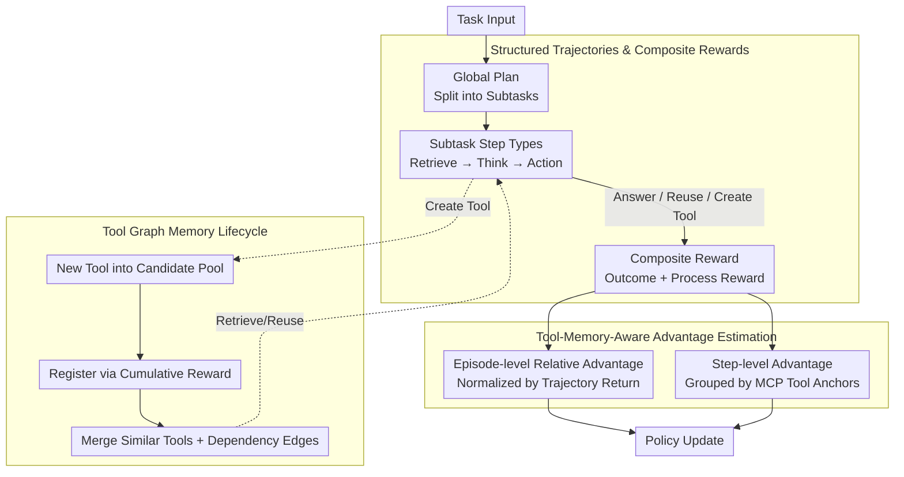

# SEARL: Joint Optimization of Policy and Tool Graph Memory for Self-Evolving Agents

**Conference**: ACL2026  
**arXiv**: [2604.07791](https://arxiv.org/abs/2604.07791)  
**Code**: https://github.com/circles-post/SEARL  
**Area**: LLM Agent / Reinforcement Learning  
**Keywords**: Self-evolving agents, tool graph memory, RLVR, credit assignment, MCP tools

## TL;DR
SEARL jointly optimizes agent policy parameters and external Tool Graph Memory. It addresses credit assignment in long trajectories by utilizing tool-anchored step-level advantages and process rewards, enabling small models to continuously create, reuse, and integrate tools in multi-hop QA and complex mathematical tasks.

## Background & Motivation
**Background**: RLVR has proven effective in single-turn mathematical reasoning. Agentic learning further requires models to learn from multi-step interaction trajectories, with the ability to generate tools, invoke tools, and accumulate experience.

**Limitations of Prior Work**: Many tool-based agents use static tool lists, limiting their ability to adapt to new tasks. Some self-generated tool methods store tools in unstructured repositories, making reuse and composition difficult. Experience memory methods save historical trajectories but lack explicit dependency relationships. For small models, generating a "monolithic universal tool" in one go is prone to failure.

**Key Challenge**: Training long-trajectory agents requires fine-grained credit assignment. However, the state space in open environments is vast and continuous; identical states rarely occur, rendering traditional step-level advantage estimation based on state grouping ineffective. Meanwhile, simple process rewards are susceptible to reward hacking.

**Goal**: The authors aim to allow agents to optimize both policy and tool-based memory during the RL training process. This ensures tools are not only created but also stored with dependencies in a graph structure, retrieved, merged, and reused across tasks, while providing stable anchors for step-level learning.

**Key Insight**: Tools are viewed as more stable abstractions than raw environment states. Although textual states differ across tasks, if they invoke the same tool or same class of tools, they likely share similar sub-problem structures. Therefore, step-level advantages can be aggregated according to tool anchors.

**Core Idea**: Use Tool Graph Memory to transform tools and execution dependencies into external structured states. Memory-anchored advantages are then used to assign fine-grained credit to tool creation, reuse, and execution, achieving mutual self-evolution of policy and memory.

## Method

### Overall Architecture
SEARL decomposes self-evolution into two mutually reinforcing threads: the policy model learns planning, retrieval, thinking, and action through RL, while the external Tool Graph Memory continuously grows, merges, and links within trajectories. This provides reusable tools for subsequent tasks and stable grouping anchors for advantage estimation. Given a task, the agent first generates a global plan to decompose the task into subtasks. Each subtask unfolds into four XML-style steps: Retrieve, Think, and Action. Retrieve selects relevant MCP tools from Tool Graph Memory, and Action either provides a direct answer, invokes an existing tool, or creates a new tool. The training utilizes outcome rewards for final answer correctness, combined with process rewards for planning, tool creation, tool execution, and formatting. The policy is updated using both episode-level relative advantages and tool-anchored step-level advantages, facilitating the crystallization of tool knowledge into a structured memory graph.

### Key Designs
**1. Structured Trajectories and Composite Rewards: Decomposing Open Behaviors into Rewardable Steps**

If only final answer rewards are used, it is nearly impossible to determine which specific action in a multi-step tool invocation was useful, resulting in sparse signals. SEARL requires each task to produce a high-level plan first, followed by explicit Retrieve, Think, and Action labels within subtasks, making trajectories parsable and auditable. Rewards consist of sparse outcome rewards and dense behavioral rewards: $r_s=1$ when the final answer is correct, supplemented locally by planning rewards, tool creation rewards, tool execution rewards, and format rewards. This allows training signals to precisely target critical behaviors—planning, tool creation, and execution—rather than being obscured by the success or failure of the entire trajectory.

**2. Tool-Memory-Aware Advantage Estimation: Replacing State Grouping with Tool Anchors**

The state space of open language environments is vast and continuous, meaning two identical states almost never appear. Traditional step-level advantage estimation via state grouping thus fails. SEARL retains episode-level advantages (normalized by total return across multiple rollouts of the same task), but step-level advantages are grouped by MCP tool anchors instead of raw states. All actions related to the same tool (or merged equivalent tools) are placed in the same group, and relative advantages are calculated using return-to-go. The rationale is that tools represent a more stable subtask abstraction than text states; grouping by tool allows for cross-trajectory comparisons of whether "actions related to this tool truly yield returns," thereby suppressing noise introduced by contextual differences.

**3. Tool Graph Memory Lifecycle: Enabling Tool Memory Growth and Linking**

Unstructured tool repositories expand during training, becoming redundant and difficult to reuse. SEARL projects the subtask dependency graph generated by the plan into the tool space to form task subgraphs. Successfully created MCP tools enter a candidate pool, and high-value tools are registered based on cumulative rewards in each training round. New tools are merged with existing ones based on the cosine similarity of name/description embeddings, and edges record the execution sequence dependencies of subtasks. During merging, edges are redirected to a unified node. Consequently, the graph structure preserves not just the tools themselves, but also compositional knowledge such as "which tools typically appear sequentially," providing reusable operational experience for subsequent planning and retrieval.

### Loss & Training
The training goal is to maximize the expected reward under a policy equipped with Tool Graph Memory, subject to a KL constraint relative to a reference policy: $\max_{\pi_\theta}\mathbb{E}[r_\phi(x,y)]-\beta D_{KL}[\pi_\theta(y\mid x;\mathcal{T}_G)\|\pi_{ref}(y\mid x;\mathcal{T}_G)]$. Advantage estimation is performed at two levels: episode-level advantages are normalized by trajectory total returns, and step-level advantages are normalized using return-to-go under the same tool anchor. Experiments utilize 10,000 RL training samples from Tool-star. The agent is equipped with a Python interpreter and a local Wikipedia search server. The evaluation metric is pass@1 accuracy, with Qwen3-32B serving as the judge.

## Key Experimental Results

### Main Results
SEARL was compared against various RL baselines in mathematical reasoning and multi-hop QA. It achieved or tied for the best performance on AIME24, HotpotQA, 2Wiki, and Bamboogle, maintaining the lowest average rank.

| Method | GSM8K | MATH500 | AIME24 | HotpotQA | 2wiki | Musique | Bamboogle | Avg Rank |
|------|-------|---------|--------|----------|-------|---------|-----------|----------|
| TIR Prompt | 0.2259 | 0.0540 | 0.0000 | 0.2300 | 0.1250 | 0.0350 | 0.1200 | 5.29 |
| GRPO | 0.8870 | 0.7360 | 0.1333 | 0.2150 | 0.3450 | 0.0900 | 0.1600 | 2.43 |
| DAPO | 0.8059 | 0.5520 | 0.1333 | 0.3350 | 0.3500 | 0.0650 | 0.2480 | 3.00 |
| REINFORCE++ | 0.8658 | 0.6800 | 0.1000 | 0.1100 | 0.2600 | 0.0000 | 0.0080 | 4.57 |
| ARPO | 0.8241 | 0.6480 | 0.3333 | 0.1400 | 0.2200 | 0.0650 | 0.1760 | 3.57 |
| SEARL | 0.8620 | 0.6820 | 0.3333 | 0.3350 | 0.3600 | 0.0900 | 0.3040 | 1.43 |

### Ablation Study
The paper analyzes mechanisms through training curves and component ablations. While primary ablations are presented as figures without a full numerical table, the authors explicitly report that removing Step-level Grouping caused the most significant degradation across most datasets, and Step Rewards also significantly impacted performance.

| Configuration | Key Metric / Phenomenon | Description |
|------|-----------------|------|
| Full SEARL | Avg Rank 1.43 | Joint optimization of policy and tool graph memory |
| w/o Step-level Grouping | Largest degradation in AIME24, Bamboogle, etc. | Tool-anchored grouping is core to credit assignment |
| w/o Step Rewards | Significant drop in most tasks | Final reward alone is insufficient for training tool behaviors |
| w/o Single Vanishing | Minor impact but decreased stability | Avoids meaningless advantage estimation from single-element groups |
| GRPO baseline | Lower training reward than SEARL, lower entropy | SEARL provides denser feedback and maintains exploration |

### Key Findings
- Multi-hop QA is a strength of SEARL. It reached 0.3350 on HotpotQA, tying with DAPO; achieved 0.3600 on 2Wiki (the highest); and reached 0.3040 on Bamboogle, significantly outperforming all baselines.
- Mathematical tasks exhibit a trade-off. GRPO performed best on GSM8K and MATH500 while SEARL was slightly lower, suggesting tool generation may introduce process noise in simple problems. However, on AIME24, SEARL tied with ARPO at 0.3333, indicating complex problems benefit more from tool decomposition.
- Training dynamics show SEARL maintains consistently higher rewards than GRPO with higher entropy, suggesting tool-anchored advantages and process rewards sustain exploration and prevent premature convergence to fixed tool patterns.
- Tool graphs evolve from small, scattered subgraphs in the early stages to multi-branch functional clusters connected across tasks, showing that memory consolidation is not just decorative but accumulates reusable skills.

## Highlights & Insights
- The most insightful point is "tools as state abstractions." While traditional RL struggles to find identical states in open language environments, tool invocations naturally aggregate similar sub-problems, providing a practical handle for long-trajectory credit assignment.
- Tool Graph Memory serves three purposes simultaneously: retrieving tools, recording dependencies, and merging experience. Compared to simply storing trajectories or tool lists, the graph structure more closely resembles an agent's "operational knowledge base."
- The authors do not force the model to generate monolithic large tools but encourage the generation of modular tools for specific subtasks. This is especially important for small models, which find it harder to write complex monolithic solvers in one go.
- The slight disadvantage in GSM8K/MATH500 honestly reveals the cost of tool-based agents: simple problems do not necessarily require tools, and automated toolization might instead slow down or disturb reasoning.

## Limitations & Future Work
- The authors admit SEARL still lags behind methods like GRPO on GSM8K and MATH500, indicating overhead associated with tool generation and retrieval for simple problems.
- Once a toolset is formed during training, it may limit the model's adaptation to new contexts, such as direct search scenarios or highly specialized domains. The generalization boundaries of the tool graph require further testing.
- Constrained by model scale, many generated tools remain trivial and may not be effectively reused by other LLMs. Future work may require stronger models or tool quality filtering mechanisms.
- Reward hacking remains a risk. While process rewards mitigate sparse feedback, they may also induce the model to pursue surface-level signals like correct formatting or successful tool calls rather than truly improving reasoning quality.

## Related Work & Insights
- **vs GRPO / DAPO / REINFORCE++**: These methods primarily optimize the policy itself. SEARL additionally optimizes external tool graph memory, making it superior for multi-hop QA requiring cross-step information composition.
- **vs ARPO**: ARPO also targets agent RL, but SEARL emphasizes tool memory structures and step-level tool anchors. Their tie on AIME24 suggests structured tools aid generalization in complex mathematics.
- **vs Alita / STELLA**: These self-generating tool methods focus on tool creation. SEARL further requires tools to be merged, retrieved, and integrated into advantage estimation via a graph structure.
- **Insight**: The key for long-trajectory agents is not "remembering all history" but compressing history into executable, composable, and searchable operational units. Tool graphs can be extended into API graphs, workflow graphs, or experimental procedure graphs.

## Rating
- Novelty: ⭐⭐⭐⭐☆ The combination of Tool Graph Memory and tool-anchored advantage is innovative and addresses the credit assignment problem in agent RL.
- Experimental Thoroughness: ⭐⭐⭐⭐☆ Covers math and multi-hop QA with strong baselines; however, ablation figures lack full numerical data, and tool quality assessment could be more granular.
- Writing Quality: ⭐⭐⭐⭐☆ The methodology structure is clear, with complete formulas and processes; some implementation details rely on the appendix.
- Value: ⭐⭐⭐⭐☆ Highly relevant for the self-evolution of small model agents, particularly for tool-intensive and multi-hop reasoning tasks.

<!-- RELATED:START -->

## Related Papers

- [\[ICML 2026\] Self-evolving LLM agents with in-distribution Optimization](../../ICML2026/llm_agent/self-evolving_llm_agents_with_in-distribution_optimization.md)
- [\[ICLR 2026\] MemGen: Weaving Generative Latent Memory for Self-Evolving Agents](../../ICLR2026/llm_agent/memgen_weaving_generative_latent_memory_for_self-evolving_agents.md)
- [\[ICML 2026\] Towards Pareto-Optimal Tool-Integrated Agents with Pareto Ranking Policy Optimization](../../ICML2026/llm_agent/towards_pareto-optimal_tool-integrated_agents_with_pareto_ranking_policy_optimiz.md)
- [\[ICLR 2026\] ReVeal: Self-Evolving Code Agents via Reliable Self-Verification](../../ICLR2026/llm_agent/reveal_self-evolving_code_agents_via_reliable_self-verification.md)
- [\[ICLR 2026\] Exploratory Memory-Augmented LLM Agent via Hybrid On- and Off-Policy Optimization](../../ICLR2026/llm_agent/exploratory_memory-augmented_llm_agent_via_hybrid_on-_and_off-policy_optimizatio.md)

<!-- RELATED:END -->
