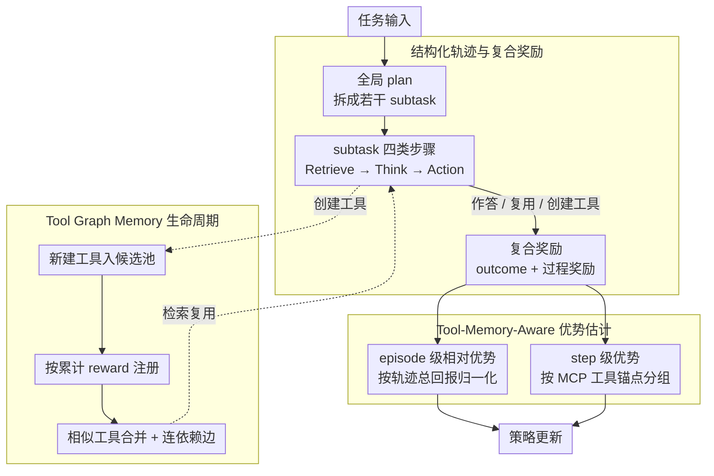

# SEARL: Joint Optimization of Policy and Tool Graph Memory for Self-Evolving Agents

**Conference**: ACL2026  
**arXiv**: [2604.07791](https://arxiv.org/abs/2604.07791)  
**Code**: https://github.com/circles-post/SEARL  
**Area**: LLM Agent / Reinforcement Learning  
**Keywords**: Self-evolving agents, Tool Graph Memory, RLVR, Credit assignment, MCP tools

## TL;DR
SEARL jointly optimizes agent policy parameters and external Tool Graph Memory, utilizing tool-anchored step-level advantages with process rewards to resolve long-trajectory credit assignment, enabling small-scale models to continuously create, reuse, and integrate tools in multi-hop QA and complex mathematical tasks.

## Background & Motivation
**Background**: RLVR has demonstrated effectiveness in single-turn mathematical reasoning. Agentic learning further requires models to learn from multi-step interaction trajectories, with the ability to generate tools, invoke them, and accumulate experience.

**Limitations of Prior Work**: Many tool-based agents use static tool lists, possessing limited adaptability to new tasks. Some self-generated tool methods store tools in unstructured repositories, leading to difficulties in reuse and composition. Experience memory methods save historical trajectories but lack explicit dependency relationships. For small models, generating a monolithic "universal tool" in one go often results in failure.

**Key Challenge**: Training agents on long trajectories requires fine-grained credit assignment. However, the state space in open environments is vast and continuous, where identical states rarely occur, making traditional step-level advantage based on state grouping difficult to implement. Simultaneously, simple process rewards are susceptible to reward hacking.

**Goal**: The authors aim to enable agents to simultaneously optimize policy and tool-based memory during the RL training process. This allows tools to be not only created but also stored with dependencies in a graph structure, retrieved, merged, and reused across tasks, while providing stable anchors for step-level learning.

**Key Insight**: Tools are regarded as more stable abstractions than raw environmental states. Although text states vary across different tasks, if they invoke the same tool or same class of tools, they likely share similar sub-problem structures. Thus, step-level advantages can be aggregated based on tool anchors.

**Core Idea**: Use Tool Graph Memory to transform tools and execution dependencies into external structured states, then use memory-anchored advantage to allocate fine-grained credit for tool creation, reuse, and execution, achieving joint self-evolution of policy and memory.

## Method

### Overall Architecture
SEARL decomposes self-evolution into two mutually reinforcing paths: the policy model learns to plan, retrieve, think, and act via RL, while the external Tool Graph Memory continuously grows, merges, and establishes edges within trajectories. This provides reusable tools for subsequent tasks and stable grouping anchors for advantage estimation. For a given task, the agent first generates a global plan to decompose the task into several subtasks. Each subtask unfolds into four XML-style steps: Planning, Retrieve, Think, and Action. Retrieve selects relevant MCP tools from the Tool Graph Memory, and Action either provides a direct answer, invokes an existing tool, or creates a new one. On the training side, outcome reward determines final answer correctness, supplemented by process rewards for planning, tool creation, tool execution, and formatting. The policy is updated using both episode-level relative advantage and tool-anchored step-level advantage, allowing tool knowledge to consolidate from scattered candidates into a structured memory graph.

### Key Designs
**1. Structured Trajectories and Composite Rewards: Decomposing Open-ended Behavior into Rewardable Steps**

If only final outcome rewards are used, it is nearly impossible to determine which action was useful in a multi-step tool invocation, resulting in excessively sparse signals. SEARL requires each task to first produce a high-level plan and then explicitly label Retrieve, Think, and Action within subtasks, making trajectories parsable and auditable. Rewards consist of sparse outcome rewards and dense behavioral rewards: $r_s=1$ when the final answer is correct, with local planning rewards, tool creation rewards, tool execution rewards, and format rewards superimposed. This ensures training signals land precisely on key behaviors like planning and tool management rather than being obscured by the success or failure of the entire trajectory.

**2. Tool-Memory-Aware Advantage Estimation: Replacing State Grouping with Tool Anchors**

The state space of open language environments is massive and continuous, with almost no two identical states, rendering traditional step-level advantage based on state grouping ineffective. SEARL retains episode-level advantage (normalized by total return across multiple rollouts of the same task), but step-level advantage is grouped by MCP tool anchors instead of raw states. All actions related to the same tool, or equivalent tools after merging, are placed into the same group to calculate relative advantage using return-to-go. The rationale is that a tool is a more stable subtask abstraction than text states; grouping by tool allows for cross-trajectory comparisons of whether "actions related to this tool truly yield benefits," thereby suppressing noise introduced by contextual differences.

**3. Tool Graph Memory Lifecycle: Enabling Persistent Growth and Linking of Tool Memory**

Unstructured tool repositories expand during training, becoming redundant and difficult to reuse. SEARL projects subtask dependency graphs generated by plans into tool space to form task subgraphs. Successfully created MCP tools enter a candidate pool, and high-value tools are registered each training round based on cumulative rewards. New tools are merged with existing ones based on the cosine similarity of name/description embeddings, while edges record the execution order of subtasks. During merging, edges are redirected to a unified node. Consequently, the graph structure preserves not only the tools themselves but also combinatorial knowledge such as "which tools typically appear sequentially," providing reusable operational experience for subsequent planning and retrieval.

### Loss & Training
The training objective is to maximize the expected reward under the policy equipped with Tool Graph Memory, constrained by a KL divergence relative to a reference policy: $\max_{\pi_\theta}\mathbb{E}[r_\phi(x,y)]-\beta D_{KL}[\pi_\theta(y\mid x;\mathcal{T}_G)\|\pi_{ref}(y\mid x;\mathcal{T}_G)]$. Advantage estimation is performed at two levels: episode-level advantage normalized by total trajectory return, and step-level advantage normalized by return-to-go under the same tool anchor. Experiments utilize 10,000 RL training samples from Tool-star. The agent is equipped with a Python interpreter and a local Wikipedia search server. The evaluation metric is pass@1 accuracy, with Qwen3-32B serving as the judge.

## Key Experimental Results

### Main Results
SEARL was compared against various RL baselines in mathematical reasoning and multi-hop QA. It achieved or tied for the best performance on AIME24, HotpotQA, 2Wiki, and Bamboogle, maintaining the lowest average rank.

| Method | GSM8K | MATH500 | AIME24 | HotpotQA | 2wiki | Musique | Bamboogle | Avg Rank |
|------|-------|---------|--------|----------|-------|---------|-----------|----------|
| TIR Prompt | 0.2259 | 0.0540 | 0.0000 | 0.2300 | 0.1250 | 0.0350 | 0.1200 | 5.29 |
| GRPO | 0.8870 | 0.7360 | 0.1333 | 0.2150 | 0.3450 | 0.0900 | 0.1600 | 2.43 |
| DAPO | 0.8059 | 0.5520 | 0.1333 | 0.3350 | 0.3500 | 0.0650 | 0.2480 | 3.00 |
| REINFORCE++ | 0.8658 | 0.6800 | 0.1000 | 0.1100 | 0.2600 | 0.0000 | 0.0080 | 4.57 |
| ARPO | 0.8241 | 0.6480 | 0.3333 | 0.1400 | 0.2200 | 0.0650 | 0.1760 | 3.57 |
| SEARL | 0.8620 | 0.6820 | 0.3333 | 0.3350 | 0.3600 | 0.0900 | 0.3040 | 1.43 |

### Ablation Study
The paper analyzes mechanisms through training curves and component ablations. While primary ablations are presented graphically without a full numerical table, the authors explicitly report that removing Step-level Grouping caused the greatest degradation across most datasets, and Step Rewards also significantly impacted performance.

| Configuration | Key Metrics / Phenomena | Description |
|------|-----------------|------|
| Full SEARL | Avg Rank 1.43 | Joint optimization of policy and tool graph memory |
| w/o Step-level Grouping | Maximum degradation on AIME24, Bamboogle, etc. | Tool-anchored grouping is core to credit assignment |
| w/o Step Rewards | Significant decline in most tasks | Final rewards alone are insufficient for training tool behaviors |
| w/o Single Vanishing | Minor impact but reduced stability | Avoids meaningless advantage estimation from single-element groups |
| GRPO baseline | Lower training reward than SEARL, lower entropy | SEARL provides denser feedback and maintains exploration |

### Key Findings
- Multi-hop QA is a major strength of SEARL. It reached 0.3350 on HotpotQA, tying with DAPO; achieved the highest score of 0.3600 on 2Wiki; and reached 0.3040 on Bamboogle, significantly outperforming all baselines.
- Math tasks exhibit a trade-off. GRPO was highest on GSM8K and MATH500, with SEARL slightly lower, suggesting tool generation might introduce process noise in simpler problems; however, SEARL tied with ARPO at 0.3333 on AIME24, indicating complex problems benefit more from tool decomposition.
- Training dynamics show that SEARL's reward consistently remains higher than GRPO's while maintaining higher entropy, suggesting that tool-anchored advantage and process rewards sustain exploration rather than prematurely converging to fixed tool-calling patterns.
- The tool graph evolves from small, fragmented subgraphs in early stages into multi-branch, cross-task functional clusters, demonstrating that memory consolidation is not decorative but actually accumulates reusable skills.

## Highlights & Insights
- The most enlightening concept is "tools as state abstractions." While finding identical states in open language environments is difficult, tool invocations naturally aggregate similar sub-problems, providing a practical handle for long-trajectory credit assignment.
- Tool Graph Memory serves three purposes simultaneously: retrieving tools, recording dependencies, and merging experience. Compared to simply storing trajectories or tool lists, a graph structure more closely resembles an agent's "operational knowledge base."
- Instead of generating monolithic universal tools, the authors encourage modular tool generation for specific subtasks. This is particularly important for small models, which struggle to write complex monolithic solvers.
- The slight disadvantage on GSM8K/MATH500 honestly reveals the overhead of tool-based agents: simple problems do not necessarily require tools, and automated tool-usage might instead slow down or disturb reasoning.

## Limitations & Future Work
- The authors admit SEARL still lags behind methods like GRPO on GSM8K and MATH500, indicating that generating and retrieving tools creates overhead for simpler problems.
- Once the toolset is formed during training, it may limit the model's adaptation to new contexts, such as direct search scenarios or highly specialized domains. The generalization boundaries of the tool graph require further testing.
- Constrained by model scale, many generated tools remain trivial and may not be effectively reused by other LLMs. Future work may require stronger models or tool quality filtering mechanisms.
- Reward hacking remains a risk. While process rewards mitigate sparse feedback, they might induce the model to pursue superficial signals like correct formatting or successful tool invocation rather than truly improving reasoning quality.

## Related Work & Insights
- **vs GRPO / DAPO / REINFORCE++**: These methods primarily optimize the policy itself. SEARL additionally optimizes external tool graph memory, making it superior in multi-hop QA requiring cross-step information composition.
- **vs ARPO**: ARPO also targets agent RL, but SEARL emphasizes the tool memory structure and step-level tool anchors. The two tie on AIME24, suggesting structured tools aid generalization in complex mathematics.
- **vs Alita / STELLA**: These self-generated tool methods focus on creation. SEARL further requires tools to be merged, retrieved, and integrated into advantage estimation via graph structures.
- **Insight**: The key to long-trajectory agents is not "remembering all history," but compressing history into executable, composable, and retrievable operational units. Tool graphs can be extended into API graphs, workflow graphs, or experimental procedure graphs.

## Rating
- Novelty: ⭐⭐⭐⭐☆ The combination of Tool Graph Memory and tool-anchored advantage is innovative and addresses the credit assignment problem in agent RL.
- Experimental Thoroughness: ⭐⭐⭐⭐☆ Covers math and multi-hop QA with strong baselines; however, ablation graphs lack full numerical data, and tool quality assessment could be more granular.
- Writing Quality: ⭐⭐⭐⭐☆ Clear methodology structure with complete formulas and workflows; some implementation details rely on the appendix.
- Value: ⭐⭐⭐⭐☆ Highly relevant for the self-evolution of small-scale model agents, particularly for tool-intensive and multi-hop reasoning tasks.

<!-- RELATED:START -->

## Related Papers

- [\[ICLR 2026\] Exploratory Memory-Augmented LLM Agent via Hybrid On- and Off-Policy Optimization](../../ICLR2026/llm_agent/exploratory_memory-augmented_llm_agent_via_hybrid_on-_and_off-policy_optimizatio.md)
- [\[ACL 2026\] MAGMA: A Multi-Graph based Agentic Memory Architecture for AI Agents](magma_a_multi-graph_based_agentic_memory_architecture_for_ai_agents.md)
- [\[ACL 2026\] BAPO: Boundary-Aware Policy Optimization for Reliable Agentic Search](bapo_boundary-aware_policy_optimization_for_reliable_agentic_search.md)
- [\[ACL 2026\] Mem²Evolve: Towards Self-Evolving Agents via Co-Evolutionary Capability Expansion and Experience Distillation](mem2evolve_towards_self-evolving_agents_via_co-evolutionary_capability_expansion.md)
- [\[ACL 2026\] WebClipper: Efficient Evolution of Web Agents with Graph-based Trajectory Pruning](webclipper_efficient_evolution_of_web_agents_with_graph-based_trajectory_pruning.md)

<!-- RELATED:END -->
