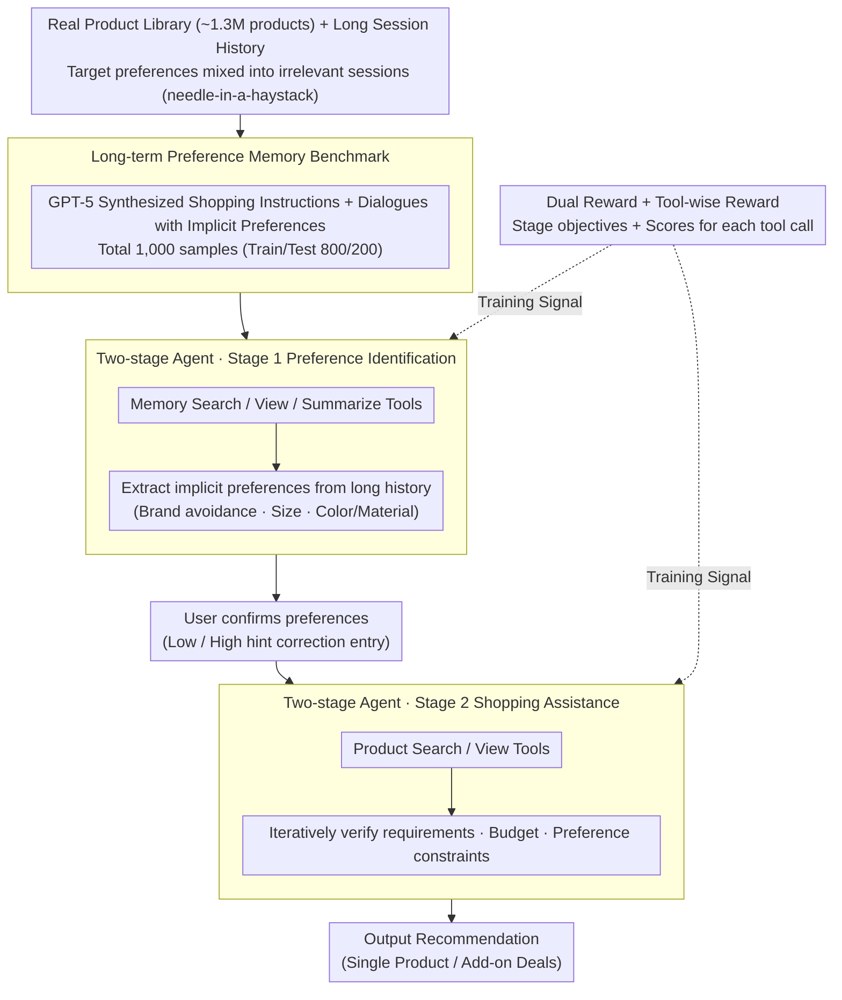

# Shopping Companion: A Memory-Augmented LLM Agent for Real-World E-Commerce Tasks

**Conference**: ACL2026  
**arXiv**: [2603.14864](https://arxiv.org/abs/2603.14864)  
**Code**: Undisclosed  
**Area**: LLM Agent / E-commerce Recommendation  
**Keywords**: Long-term memory, E-commerce Agent, Preference Identification, Tool use, Reinforcement Learning

## TL;DR
Shopping Companion constructs an e-commerce task benchmark with long-term user preference memory and a real product library. It employs a two-stage agent with dual rewards and tool-level rewards to jointly optimize preference identification and product recommendation, enabling a 4B model to approach the performance of strong closed-source models.

## Background & Motivation
**Background**: E-commerce LLM agents need to complete tasks such as product recommendation, budget constraint fulfillment, and add-on deals. Unlike standard QA, a shopping assistant must query product libraries, compare attributes, satisfy hard constraints, and understand brand, size, style, and budget preferences implicitly expressed by the user across multiple past conversation sessions.

**Limitations of Prior Work**: Existing benchmarks often only cover single-session product searches or evaluate long-term memory via QA without grounding in real downstream tasks. WebShop lacks long-term memory; LongMemEval does not evaluate shopping tasks; ShoppingBench and ShopSimulator do not integrate cross-session preference memory, real product retrieval, and user intervention into an end-to-end setting.

**Key Challenge**: Preference identification and shopping execution are coupled in real-world scenarios. Treating long-term memory retrieval as an upstream module and product recommendation as a downstream module leads to preference extraction errors that cannot be corrected by task feedback. Conversely, end-to-end execution often causes models to get lost within long histories and large product libraries.

**Goal**: This work aims to establish an e-commerce agent benchmark capable of simultaneously evaluating long-term memory, real product constraints, and multi-round user intervention. It also seeks to train a lightweight model that exceeds strong open-source models and approaches closed-source large models in preference capture and final recommendation success rates.

**Key Insight**: The paper models the shopping task as a Partially Observable Markov Decision Process (POMDP), where the state consists of the dialogue context, the long-term memory bank, and the current shopping instruction. Success requires the recommendation to satisfy both explicit requirements and implicit preferences found in memory.

**Core Idea**: The agent is decoupled into two stages—"Preference Identification" and "Shopping Execution." These stages are optimized using stage-level dual rewards to evaluate stage objectives and tool-wise rewards to evaluate intermediate tool calls, thereby improving sparse credit assignment in multi-round tool interactions.

## Method

### Overall Architecture
The paper builds a large-scale shopping simulation environment comprising 1,298,797 real products, long session histories, natural language shopping instructions, and two types of tasks: Single Product Recommendation and Add-on Deals. Each sample contains 15-50 historical rounds, with target preferences intentionally mixed with irrelevant sessions to form a "needle-in-a-haystack" scenario. Built upon this, the Shopping Companion agent runs serially in two stages: Stage 1 (Preference Identification) invokes memory search, view, and summary tools to extract implicit preferences (e.g., brand avoidance, size, style) relevant to the current instruction for user confirmation. Stage 2 (Shopping Assistance) uses the confirmed preferences as constraints, invoking product search and view tools to iteratively verify requirements, budget, and preferences, ultimately outputting a formatted recommendation. During training, stage-level dual rewards evaluate objectives for both stages, while tool-wise rewards evaluate each intermediate tool call to decompose the sparse final success rate into dense feedback for aligning preference extraction with product recommendation.

### Key Designs
**1. Long-term preference memory benchmark: Linking "Preference Memory" to shopping success rate**

Users often do not repeat all preferences in a current request; thus, a shopping assistant must go back to history for evidence. If a benchmark only performs memory QA, the memory module tends to optimize for text recall rather than task success. To address this, the authors sampled products and deal combinations from a real product library, used GPT-5 to generate shopping instructions and dialogue sessions containing implicit preferences, and mixed in irrelevant sessions in a LongMemEval style. This resulted in 1,000 instructions (800 for training, 200 for testing), each requiring the localization of preference evidence from history and mapping it to product constraints. Consequently, the value of long-term memory is directly tested by downstream recommendation results rather than just recall metrics.

**2. Two-stage agentic framework: Identifying preferences before executing shopping**

In a one-stage end-to-end agent, extracting the wrong preference from long history causes the error to persist through the search process without a mechanism for backtracking. Shopping Companion splits the process: Stage 1 is solely responsible for identifying preferences from long-term memory (brand avoidance, size history, color or material preferences, etc.) and presenting them to the user for confirmation. Stage 2 then treats the confirmed preferences as hard or soft constraints to retrieve candidates and verify them against the current instruction. This intermediate checkable state reduces the coupling between "preference extraction from long history" and "multi-constraint product solving" while providing a natural entry point for low-granularity or high-granularity user feedback.

**3. Dual Reward + Tool-wise Reward: Advancing final credit to intermediate actions**

For multi-round tool agents, relying solely on final success rates provides too sparse feedback—a recommendation failure could stem from memory search errors, product search errors, insufficient viewing, or formatting errors, with no way to distinguish between them. The composite reward in this paper consists of: Stage 1 reward measuring query relevance, preference attribute matching, and correct product count identification in add-on deals; Stage 2 reward measuring recommendation extractability, requirement satisfaction, and adherence to preference/budget/quantity constraints. The tool-wise reward further scores each memory search, memory view, product search, and product view, checking if they hit gold preference sessions or gold products. The final reward is the sum of stage rewards, tool rewards, and formatting rewards. By pushing feedback down to intermediate actions, RL more easily learns "what to search, what to view, and when to stop."

### Loss & Training
The training process consists of SFT followed by RL. SFT utilizes 2,948 successful step-level trajectories obtained via GPT-4.1 rejection sampling. LoRA fine-tuning is applied to Qwen3-4B-Thinking-2507 using LLaMA-Factory, with a rank of 64 and target layers covering q/k/v/o projections. RL is based on VeRL and GRPO, with 8 rollouts per sample, a maximum output length of 32,768, up to 20 assistant turns, batch size 16, mini-batch size 8, temperature 0.6, top-k 20, top-p 0.95, and a learning rate of $1\times10^{-6}$ for approximately 2.6 epochs.

## Key Experimental Results

### Main Results
The primary metrics include Stage 1 preference extraction accuracy (Acc.) and Stage 2 final recommendation success rate (Succ.). The following table summarizes the average results across two task types on the test set.

| Category | Model | Single Acc | Single Succ | Add-on Acc | Add-on Succ | Avg Acc | Avg Succ |
|------|------|------------|-------------|------------|-------------|---------|----------|
| Closed | GPT-5 | 82.0 | 75.0 | 66.0 | 54.0 | 74.0 | 64.5 |
| Closed | GPT-4.1 | 88.0 | 78.0 | 39.0 | 24.0 | 63.5 | 51.0 |
| Closed | GPT-4o | 79.0 | 72.0 | 41.0 | 26.0 | 60.0 | 49.0 |
| Closed | Qwen3-Max | 80.0 | 72.0 | 35.0 | 24.0 | 57.5 | 48.0 |
| Open | Qwen3-Next-80B-A3B | 63.0 | 57.0 | 29.0 | 18.0 | 46.0 | 37.5 |
| Open | Qwen3-30B-A3B | 60.0 | 53.0 | 21.0 | 13.0 | 40.5 | 33.0 |
| Open | Qwen3-4B | 49.0 | 44.0 | 11.0 | 6.0 | 30.0 | 25.0 |
| Ours | Qwen3-4B-LoRA | 82.0 | 72.0 | 42.0 | 31.0 | 62.0 | 51.5 |
| Ours | + Dual-reward RL | 89.0 | 81.0 | 50.0 | 38.0 | 69.5 | 59.5 |
| Ours | + Dual & Tool-wise Reward | 90.0 | 84.0 | 55.0 | 43.0 | 72.5 | 63.5 |

The final model achieved an average success rate of 63.5, close to GPT-5's 64.5, and significantly outperformed all open-source baselines. Single Product success reached 84.0%, but Add-on Deals remained at 43.0%, indicating that multi-item bundle tasks are more challenging.

### Ablation Study

| Strategy | Single Succ | Add-on Succ | Avg Succ | Description |
|------|-------------|-------------|----------|------|
| Oracle | 85.0 | 73.0 | 79.0 | Directly provided with gold preference evidence |
| One-Stage | 73.0 | 32.0 | 52.5 | Preference identification and execution are mixed |
| Two-Stage None | 75.0 | 55.0 | 65.0 | Explicit stages, no additional user hints |
| Two-Stage Low Hint | 78.0 | 59.0 | 68.5 | User points out gaps/errors |
| Two-Stage High Hint | 80.0 | 60.0 | 70.0 | User identifies missing dimensions without values |

| Training Strategy | Avg Rounds | Avg Tool Calls | Avg Response Length | Conclusion |
|----------|----------|--------------|--------------|------|
| Dual-Reward | 9.82 | 9.17 | 10485.39 | Relies solely on stage rewards; longer trajectories |
| Dual & Tool-wise | 8.89 | 8.47 | 10068.83 | Tool-wise rewards make retrieval more focused and shorter |

| Evaluator Meta-Eval | Single Product | Add-on Deals | Average |
|--------------|----------------|--------------|------|
| GPT-5 agent output | 0.96 | 0.92 | 0.94 |
| GPT-4.1 agent output | 0.92 | 0.88 | 0.90 |

### Key Findings
- Closed-source models perform strongly on single product tasks, but success rates for add-on deals drop significantly, even for GPT-5 (54.0%). Multi-product combinations, budgets, and preference matching form a complex combinatorial optimization challenge.
- The 4B model improved from an average success of 25.0 to 51.5 after LoRA, then to 59.5 with dual-reward RL, and reached 63.5 with tool-wise rewards, showing that training signals are progressively aligned with task goals.
- The two-stage architecture itself contributes significantly. One-Stage achieved only 32.0 on add-on deals, while Two-Stage None reached 55.0, proving that explicitly organizing preferences first significantly lightens the subsequent search burden.
- User intervention provides stable gains, but High Hint still lags 9 points behind Oracle, indicating that the bottleneck lies not only in preference identification but also in product retrieval and multi-constraint decision-making.

## Highlights & Insights
- The paper advances long-term memory evaluation from "fact recall" to "task success improvement." This is closer to real-world agent products than simple QA-based memory benchmarks.
- The two-stage design is practical: letting users confirm preferences before execution increases controllability and provides a natural point for error correction.
- The tool-wise reward is the most valuable engineering contribution of this work. It transforms gold sessions and gold products into intermediate action feedback, solving the problem of "not knowing where things went wrong" in multi-round tool interactions.
- Results demonstrate that lightweight models do not have to just follow closed-source giants. With properly designed benchmarks, tools, and rewards, a 4B agent can approach GPT-5 performance in vertical domains.

## Limitations & Future Work
- Add-on Deals remain difficult, with a final success rate of only 43.0%, suggesting significant room for improvement in budget, multi-product compatibility, and preference combinations.
- Tool-wise rewards are tightly coupled with the specific toolset and product library used in this paper; migrating to other agent scenarios like travel planning or medical assistance would require re-designing gold actions and reward servers.
- The benchmark uses LLM-synthesized instructions and preference sessions. While human-verified, real user preference expressions may be more ambiguous, contradictory, and dynamic.
- Long-term preference memory involves privacy and fairness issues. Real-world deployment requires mechanisms for users to view, correct, and delete memories and must avoid inferring sensitive attributes or inducing consumption.
- The code is not public. Reproducing the full environment requires the product library, search indices, tool protocols, and reward servers, presenting a high engineering barrier.

## Related Work & Insights
- **vs WebShop**: WebShop focuses on web shopping operations but lacks cross-session long-term preferences; Shopping Companion treats historical preferences as a necessary condition for task success.
- **vs LongMemEval**: LongMemEval evaluates memory through QA; this work embeds long-term memory into real recommendation tasks to measure the value of memory for downstream actions.
- **vs ShopSimulator**: ShopSimulator features interaction but with more static preferences; this work uses persistent memory banks and user confirmation mechanisms, making it closer to a real assistant.
- **vs Agentic Memory**: While Agentic Memory optimizes memory operation strategies, Shopping Companion applies this direction to e-commerce tool agents and extends tool-wise rewards to product search.

## Rating
- Novelty: ⭐⭐⭐⭐ Excellent integration of long-term memory, real product libraries, and user intervention.
- Experimental Thoroughness: ⭐⭐⭐⭐ Includes strong closed/open-source baselines, two-stage ablations, and reward ablations, though real-world user studies are lacking.
- Writing Quality: ⭐⭐⭐⭐ Problem formulation and reward design are clear, though some tool protocol details are slightly scattered in the appendix.
- Value: ⭐⭐⭐⭐⭐ Highly valuable for vertical agent benchmarks, memory systems, and tool-level RL.

<!-- RELATED:START -->

## Related Papers

- [\[ICLR 2026\] VitaBench: Benchmarking LLM Agents with Versatile Interactive Tasks in Real-world Applications](../../ICLR2026/llm_agent/vitabench_benchmarking_llm_agents_with_versatile_interactive_tasks_in_real-world.md)
- [\[ACL 2026\] MCP-Flow: Facilitating LLM Agents to Master Real-World, Diverse and Scaling MCP Tools](mcp-flow_facilitating_llm_agents_to_master_real-world_diverse_and_scaling_mcp_to.md)
- [\[ICLR 2026\] Exploratory Memory-Augmented LLM Agent via Hybrid On- and Off-Policy Optimization](../../ICLR2026/llm_agent/exploratory_memory-augmented_llm_agent_via_hybrid_on-_and_off-policy_optimizatio.md)
- [\[ICLR 2026\] MCP-Bench: Benchmarking Tool-Using LLM Agents with Complex Real-World Tasks via MCP Servers](../../ICLR2026/llm_agent/mcp-bench_benchmarking_tool-using_llm_agents_with_complex_real-world_tasks_via_m.md)
- [\[ACL 2026\] Benchmarking Web Agent Safety under E-commerce Deceptive Interfaces](benchmarking_web_agent_safety_under_e-commerce_deceptive_interfaces.md)

<!-- RELATED:END -->
