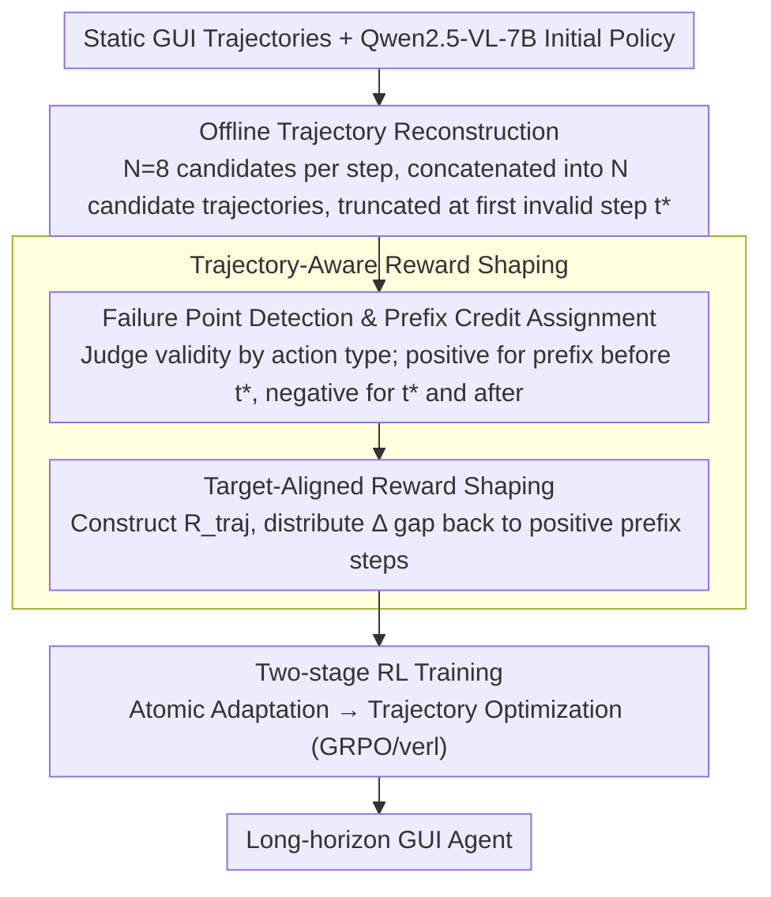

# SOLAR-RL: Semi-Online Long-horizon Assignment Reinforcement Learning

**Conference**: ACL2026 Findings  
**arXiv**: [2604.22558](https://arxiv.org/abs/2604.22558)  
**Code**: No public code (paper states implementation based on verl)  
**Area**: GUI Agent / Reinforcement Learning / Robotics & Embodied AI  
**Keywords**: GUI Agent, Semi-online Reinforcement Learning, Long-horizon Tasks, Credit Assignment, Reward Shaping

## TL;DR
SOLAR-RL utilizes offline trajectory reconstruction, failure point detection, and target-aligned reward shaping to process static GUI data into long-horizon training signals with pseudo-online feedback. This allows the Qwen2.5-VL-7B scale GUI agent to achieve stable performance on Android Control, GUI-Odyssey, and Android World, matching or exceeding strong offline baselines.

## Background & Motivation
**Background**: GUI agents are evolving from single-step clicks and element localization toward cross-application, multi-step, long-horizon tasks. Existing robust methods either rely on SFT/behavior cloning to learn from expert demonstrations or use online RL with environment interaction to collect new trajectories to mitigate covariate shift during deployment.

**Limitations of Prior Work**: Pure SFT tends to learn "local reactions on expert paths," lacking recovery capabilities once the interface state deviates slightly from the training distribution. While online RL provides real dynamic feedback, GUI environment interaction is expensive and unstable. Furthermore, tasks exceeding 30 steps often provide only terminal success/failure signals, leading to high training variance, sparse rewards, and policy collapse. Standard offline RL, though safe and inexpensive, typically treats static data as local step transitions, discarding global information regarding overall trajectory success or the point of initial failure.

**Key Challenge**: Long-horizon GUI tasks require online-style credit assignment, yet training should ideally maintain the controllability and low cost of offline data. The central issue is not merely increasing the number of trajectories, but determining how to recover "which prefixes are valid, which action first caused the task to deviate, and how subsequent actions should be penalized" from existing static trajectories.

**Goal**: The authors aim to design a semi-online RL mechanism that transforms static GUI data into multiple trainable candidate trajectories and assigns dense rewards consistent with global completion quality, without requiring real-time environment access.

**Key Insight**: The paper frames long-horizon failure as a credit assignment problem. By detecting the first "breakdown," the valid prefix before the breakdown can be assigned positive rewards, while the breakdown and subsequent actions are penalized, with the total return calibrated to trajectory-level quality.

**Core Idea**: Simulate offline branches of online rollouts and transform sparse terminal signals into target-aligned step-wise rewards through failure-point based retroactive credit assignment.

## Method

### Overall Architecture
SOLAR-RL maintains the GUI agent architecture but reconstructs the long-horizon optimization problem at the data and reward signal level. Using Qwen2.5-VL-7B-Instruct as the initial policy, static trajectories are processed into multiple trainable candidates. Expert labels or rules are then used to judge if each action remains valid, and shaped step-wise rewards are used to drive RL. The pipeline consists of two modules: Offline Trajectory Reconstruction, which generates $N$ candidates per step and concatenates them into $N$ reconstructed trajectories truncated at the first invalid step $t^*$; and Trajectory-Aware Reward Shaping, which calculates step validity scores based on action types, assigns prefix/suffix rewards, and aligns them with trajectory success/quality. Training follows a two-stage schedule: atomic adaptation followed by trajectory optimization to enhance long-horizon stability.

### Key Designs
**1. Offline Trajectory Reconstruction: Simulating Execution Branches on Static Data**

Standard offline RL only observes expert trajectories or local transitions, preventing it from observing "what happens after a deviation," which narrows the exploration space. For a given task, SOLAR-RL runs $N=8$ candidate rollouts at each time step and concatenates candidate actions with the same index into a trajectory candidate. While these candidates are generated offline, a ground-truth validity assessment determines if a path remains semantically consistent. This allows the training process to see different choices originating from the same context, approximating the diversity of online exploration without the cost and instability of real GUI environment interactions.

**2. Failure Point Detection & Prefix Credit Assignment: Locating the First Breakdown**

Failures in long-horizon GUI tasks are often triggered by a single early mistake. Penalizing the entire failed trajectory prevents the model from identifying which early actions were correct; conversely, rewarding steps based solely on local similarity may encourage meaningless long sequences. SOLAR-RL uses different validity criteria for different action types—coordinate actions (Click, Scroll) use spatial similarity, text actions (Type) use F1 score, and system actions (Launch, Wait/Back) use exact matching. Once step $t^*$ is judged invalid for the first time, steps $0$ to $t^*-1$ are treated as a valid prefix receiving positive rewards, while the breakdown step and subsequent invalid actions receive negative penalties. This clearly separates the "valid prefix" from the "breakdown consequences," concentrating credit on actions that actually advance the task.

**3. Target-Aligned Reward Shaping: Aligning Step-wise Rewards with Trajectory Quality**

Simply averaging terminal rewards across all steps introduces two problems: local reward scales become incomparable across different trajectory lengths, and models might "exploit" rewards by lengthening sequences or repeating locally correct actions. SOLAR-RL first constructs a trajectory-level reward $R_{traj}$, comprising the average step raw score, the current length relative to a reference length $T/N_{ref}$, and a success indicator. At the step level, valid actions retain positive scores while invalid actions are adjusted to $-(1-s_{raw})$, followed by normalization. Finally, the reward gap $\Delta=R_{target}-\sum_t r_t^{base}$ is calculated and distributed equally among the positive steps in the valid prefix. This target alignment pulls step-wise rewards back toward global objectives, maintaining dense feedback while constraining total returns to match execution quality.

### Loss & Training
SOLAR-RL is trained using the GRPO/verl framework, with modifications focused on reward definition rather than the optimizer. The policy is initialized with Qwen2.5-VL-7B-Instruct, using 15k high-quality static trajectories (approximately 94k steps). The trajectory reconstruction uses a temperature of 1.0 with 8 candidates per step. Training was performed on 32 NVIDIA L40S GPUs with a global batch size of 128, a maximum context length of 6,144 tokens, and 650 update steps (approximately 60 hours). A GRPO baseline was used for comparison with the same training budget, differing only in the use of sparse trajectory rewards versus trajectory-aware shaped rewards.

## Key Experimental Results

### Main Results

| Model | Training Paradigm | Android Control Low SR | Android Control High SR | GUI-Odyssey TM / EM | Android World SR | Training Data |
|--------|------|------|------|------|------|------|
| Qwen2.5-VL-7B | Generalist | 85.05 | 61.40 | 61.89 / 47.92 | N/A | No specialized GUI training |
| UI-TARS-7B-SFT | Online specialized | 94.81 | 77.99 | 86.94 / 68.82 | 33.3 | 145K trajectories |
| AgentCPM-GUI-8B | Offline specialized | 88.60 | 67.93 | 90.82 / 74.84 | N/A | >470K steps, >55K trajectories |
| UI-Venus-Navi-7B | Offline specialized | 86.16 | 68.61 | 87.30 / 71.09 | 49.1 | 350K steps |
| SOLAR-RL | Offline / semi-online shaping | 88.57 | 69.27 | 87.60 / 68.20 | 33.7 | 94K steps, 15K trajectories |

### Ablation Study

| Configuration | Key Metric | Description |
|------|---------|------|
| Direct GRPO, Super Long Low | Optimization struggles after 200 steps | Sparse terminal rewards cause late-stage collapse |
| Direct SOLAR-RL, Super Long Low | Higher and more stable action SR | Dense rewards mitigate long-horizon credit assignment |
| 2-stage GRPO, High Long | Saturates quickly at ~0.66-0.67 SR | Good initialization cannot fully solve long-range sparsity |
| 2-stage SOLAR-RL, High Long | SR ~0.70 | Trajectory-aware shaping provides continuous gains |
| 2-stage GRPO, High Super Long | SR ~0.58-0.60 with oscillations | Policy tends to stagnate in ultra-long paths |
| 2-stage SOLAR-RL, High Super Long | Peak SR ~0.66 | Advantages are more pronounced in long-horizon tasks |
| PressBack primitive | Accuracy >0.8 and faster convergence | More stable learning of error recovery actions |

### Key Findings
- SOLAR-RL achieves 69.27% SR on Android Control High, the highest in the offline category, surpassing UI-Venus (68.61%) and AgentCPM (67.93%). This suggests its advantages lie primarily in splits requiring multi-step reasoning.
- On GUI-Odyssey, SOLAR-RL's TM is 87.60, lower than AgentCPM's 90.82; however, AgentCPM uses over 55k trajectories, while SOLAR-RL uses only 15k, highlighting superior sample efficiency.
- On Android World, SOLAR-RL achieves 33.7% SR with 94k steps, slightly higher than UI-TARS-7B-SFT (33.3%), without requiring online interaction or 145k trajectories.
- Training dynamics show that the mean action reward for GRPO suffers policy collapse after approximately 600 steps, whereas SOLAR-RL improves monotonically and converges around 0.75.

## Highlights & Insights
- This paper effectively addresses the "long-horizon failure attribution" problem in GUI agents. While many GUI RL works emphasize online exploration or reward models, SOLAR-RL focuses on the failure point structure within static data.
- The concept of target-aligned reward shaping is highly practical: dense rewards must do more than simply distribute a terminal reward; they must explicitly constrain total returns to align with trajectory quality to prevent local reward hacking.
- The semi-online paradigm is well-suited for agent tasks where real environments are costly or unstable. Similar logic could be transferred to web automation, desktop operations, robot learning from offline demos, and tool-calling agents.
- The results suggest that data scale is not the only variable. Improved reward attribution allows 15k trajectories to achieve effects comparable to much larger training sets.

## Limitations & Future Work
- Semi-online feedback remains limited by the coverage of the offline dataset. Unobserved pop-ups, delays, rare app states, and cross-platform events cannot be generated from static trajectories.
- The current validity filter relies on ground-truth labels and action type rules. Replacing these with learned verifiers or process reward models could introduce reward noise, calibration drift, and reward hacking.
- Experiments are concentrated on Android mobile environments. Desktop and browser environments involve hovers, right-clicks, shortcuts, drag-and-drop, multiple windows, and asynchronous page changes, requiring redesigned validity criteria.
- The paper does not provide interaction evaluations in real online deployments. While SOLAR-RL is effective on static and dynamic benchmarks, it still needs validation against real-world app version changes and system state drifts.

## Related Work & Insights
- **vs SFT / Behavior Cloning**: SFT learns expert actions but lacks recovery mechanisms after deviation; SOLAR-RL exposes the model to deviation structures via candidate trajectories and failure points.
- **vs Online RL**: Online RL offers real dynamic feedback but is expensive and high-variance; SOLAR-RL simulates feedback with static data, trading coverage for stability and low cost.
- **vs UI-S1 / semi-online GUI RL**: UI-S1 uses a patch module to correct bias, while SOLAR-RL emphasizes outcome-aware credit assignment and reward shaping.
- **vs VAGEN / Bi-Level GAE**: VAGEN rewards explicit world modeling and performs hierarchical credit propagation; SOLAR-RL reconstructs rewards from trajectory validity and breakdown positions without a world model.

## Rating
- Novelty: ⭐⭐⭐⭐ Semi-online GUI RL is not entirely new, but the combination of failure-point detection and target-aligned shaping is highly targeted.
- Experimental Thoroughness: ⭐⭐⭐⭐ Covers three GUI benchmarks and training dynamics, though real-world environment validation is still limited.
- Writing Quality: ⭐⭐⭐⭐ Clear motivation and intuitive diagrams; some tables and formulas in the appendix have limited readability in specific formats.
- Value: ⭐⭐⭐⭐ Highly practical for training GUI agents at low cost, especially in scenarios with existing offline demos but difficult large-scale online interaction.

<!-- RELATED:START -->

## Related Papers

- [\[ICLR 2026\] MobileRL: Online Agentic Reinforcement Learning for Mobile GUI Agents](../../ICLR2026/llm_agent/mobilerl_online_agentic_reinforcement_learning_for_mobile_gui_agents.md)
- [\[CVPR 2026\] SAGE: Training Smart Any-Horizon Agents for Long Video Reasoning with Reinforcement Learning](../../CVPR2026/llm_agent/sage_training_smart_any-horizon_agents_for_long_video_reasoning_with_reinforceme.md)
- [\[ICLR 2026\] Unlocking Long-Horizon Agentic Search with Large-Scale End-to-End RL](../../ICLR2026/llm_agent/unlocking_long-horizon_agentic_search_with_large-scale_end-to-end_rl.md)
- [\[ICLR 2026\] AgentGym-RL: An Open-Source Framework to Train LLM Agents for Long-Horizon Decision Making via Multi-Turn RL](../../ICLR2026/llm_agent/agentgym-rl_an_open-source_framework_to_train_llm_agents_for_long-horizon_decisi.md)
- [\[ACL 2026\] TiMem: Temporal-Hierarchical Memory Consolidation for Long-Horizon Conversational Agents](timem_temporal-hierarchical_memory_consolidation_for_long-horizon_conversational.md)

<!-- RELATED:END -->
