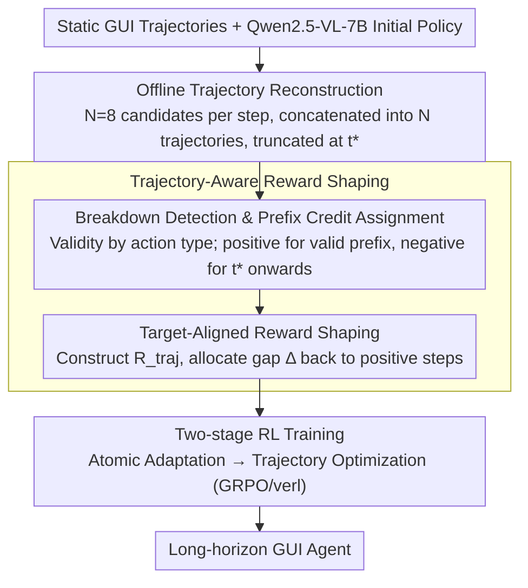

# SOLAR-RL: Semi-Online Long-horizon Assignment Reinforcement Learning

**Conference**: ACL2026 Findings  
**arXiv**: [2604.22558](https://arxiv.org/abs/2604.22558)  
**Code**: No public code (paper states implementation based on verl)  
**Area**: GUI Agent / Reinforcement Learning / Robotics & Embodied Intelligence  
**Keywords**: GUI Agent, Semi-online RL, Long-horizon Tasks, Credit Assignment, Reward Shaping

## TL;DR
SOLAR-RL processes static GUI data into long-horizon training signals with pseudo-online feedback via offline trajectory reconstruction, breakdown point detection, and target-aligned reward shaping, enabling the Qwen2.5-VL-7B GUI agent to achieve stable performance on Android Control, GUI-Odyssey, and Android World that matches or exceeds strong offline baselines.

## Background & Motivation
**Background**: GUI agents are evolving from single-step clicks and element localization toward cross-application, multi-step, long-horizon tasks. Existing robust methods either rely on SFT/behavior cloning to learn from expert demonstrations or utilize online RL with environment interactions to collect new trajectories to mitigate covariate shift during deployment.

**Limitations of Prior Work**: Pure SFT tends to learn "local reactions on expert paths," lacking recovery capabilities once the interface state deviates slightly from the training distribution. Online RL provides real dynamic feedback, but GUI environment interactions are expensive and unstable. Tasks exceeding 30 steps often provide only terminal success/failure signals, leading to high training variance, sparse rewards, and policy collapse. While standard offline RL is safe and cost-effective, it often treats static data as local step transitions, discarding global information such as "whether this trajectory succeeded overall and where it began to fail."

**Key Challenge**: Long-horizon GUI tasks require online-style credit assignment, yet training needs to maintain the controllability and low cost of offline data. The core problem is not simply increasing trajectory volume, but recovering "which prefixes are valid, which action first caused the task to deviate, and how subsequent actions should be penalized" from existing static trajectories.

**Goal**: The authors aim to design a semi-online RL mechanism that transforms static GUI data into multiple trainable candidate trajectories and assigns dense rewards consistent with global completion quality, without requiring real-time environment access.

**Key Insight**: Long-period failures are framed as a credit assignment problem. By detecting the first breakdown point, valid prefixes before the breakdown can be rewarded, subsequent actions can be penalized, and the total return can be calibrated to trajectory-level quality.

**Core Idea**: Use offline data to simulate branches of online rollouts and transform sparse terminal signals into target-aligned step-wise rewards through failure-point based retroactive credit assignment.

## Method

### Overall Architecture
SOLAR-RL maintains the GUI agent architecture but reconstructs the long-horizon optimization problem at the training data and reward signal level. Using Qwen2.5-VL-7B-Instruct as the initial policy, static trajectories are processed into multiple trainable candidates. Expert labels or rules are then used to judge action validity, and RL is driven by shaped step-wise rewards. The pipeline consists of two modules: Offline Trajectory Reconstruction, which generates $N$ candidates per step for the same task and concatenates them into $N$ reconstructed trajectories truncated at the first invalid step $t^*$; and Trajectory-Aware Reward Shaping, which calculates step validity scores by action type and synthesizes rewards from valid prefixes, invalid suffixes, and trajectory-level metrics (success/length/quality). This involves "breakdown point detection/prefix credit assignment" and "target-aligned reward shaping." Training follows a two-stage schedule: atomic adaptation followed by trajectory optimization to enhance long-horizon stability.

### Key Designs
**1. Offline Trajectory Reconstruction: Simulating Execution Branches on Static Data**

Standard offline RL observes only expert trajectories or local transitions, failing to see "what happens after a deviation," which restricts the exploration space. SOLAR-RL runs $N=8$ candidate rollouts at each time step for a given task and concatenates candidates with the same index into a trajectory candidate. Although generated offline, these can be evaluated against ground-truth validity to determine if a path remains semantically consistent. This allows training to see "different choices from the same context," approximating online exploration diversity without the cost or instability of real GUI interactions.

**2. Breakdown Point Detection & Prefix Credit Assignment: Locating the First Failure**

Failures in long-horizon GUI tasks are often triggered by an early critical error. Penalizing an entire failed trajectory prevents the model from identifying correct preceding actions, while rewards based only on local similarity can encourage meaningless long sequences. SOLAR-RL uses different validity criteria for action types—spatial similarity for coordinate actions (Click, Scroll), F1 score for text (Type), and exact matching for system actions (Launch, Wait/Back). Once an invalid action is detected at step $t^*$, the steps from $0$ to $t^*-1$ are treated as a valid prefix receiving positive rewards, while the breakdown step and subsequent actions receive negative penalties. This clearly separates valid prefixes from breakdown consequences, concentrating credit on actions that actually drive the task.

**3. Target-Aligned Reward Shaping: Aligning Step-wise Rewards with Trajectory Quality**

Distributing terminal rewards evenly across steps causes two issues: local reward scales become incomparable across different trajectory lengths, and models may "exploit rewards" by lengthening sequences or repeating locally correct actions. SOLAR-RL constructs a trajectory-level reward $R_{traj}$ based on average step raw scores, current length relative to a reference $T/N_{ref}$, and a success indicator. At the step level, valid actions retain positive scores while invalid actions are adjusted to $-(1-s_{raw})$, followed by normalization. Finally, the reward gap $\Delta=R_{target}-\sum_t r_t^{base}$ is calculated and distributed equally among positive steps in the valid prefix. This target alignment pulls step-wise rewards back to the global objective, maintaining dense feedback while ensuring the total return reflects execution quality.

### Loss & Training
SOLAR-RL is trained using the GRPO/verl framework, with modifications focused on reward definition rather than the optimizer. The policy is initialized with Qwen2.5-VL-7B-Instruct using 15k high-quality static trajectories (~94k steps). Reconstruction uses a temperature of 1.0 with 8 candidates per step. Training utilized 32 NVIDIA L40S GPUs with a global batch size of 128, maximum context length of 6,144 tokens, and 650 update steps over approximately 60 hours. The GRPO baseline uses the same budget but relies on sparse trajectory rewards.

## Key Experimental Results

### Main Results

| Model | Training Paradigm | Android Control Low SR | Android Control High SR | GUI-Odyssey TM / EM | Android World SR | Training Data |
|--------|------|------|------|------|------|------|
| Qwen2.5-VL-7B | Generalist | 85.05 | 61.40 | 61.89 / 47.92 | NR | No specific GUI training |
| UI-TARS-7B-SFT | Online specialized | 94.81 | 77.99 | 86.94 / 68.82 | 33.3 | 145K trajectories |
| AgentCPM-GUI-8B | Offline specialized | 88.60 | 67.93 | 90.82 / 74.84 | NR | >470K steps, >55K trajectories |
| UI-Venus-Navi-7B | Offline specialized | 86.16 | 68.61 | 87.30 / 71.09 | 49.1 | 350K steps |
| SOLAR-RL | Offline / semi-online shaping | 88.57 | 69.27 | 87.60 / 68.20 | 33.7 | 94K steps, 15K trajectories |

### Ablation Study

| Configuration | Key Metric | Description |
|------|---------|------|
| Direct GRPO, Super Long Low | Optimization stalls after 200 steps | Sparse terminal reward causes late-stage collapse |
| Direct SOLAR-RL, Super Long Low | Higher and more stable action SR | Dense reward alleviates long-horizon credit assignment |
| 2-stage GRPO, High Long | Saturates quickly at ~0.66-0.67 SR | Good initialization does not fully solve long-horizon sparsity |
| 2-stage SOLAR-RL, High Long | ~0.70 SR | Trajectory-aware shaping provides continued gains |
| 2-stage GRPO, High Super Long | ~0.58-0.60 SR with oscillation | Policy tends to stagnate in ultra-long paths |
| 2-stage SOLAR-RL, High Super Long | Peak SR ~0.66 | Advantages more pronounced in long-horizon tasks |
| PressBack primitive | Accuracy >0.8 and faster convergence | More stable learning of error-recovery actions |

### Key Findings
- SOLAR-RL achieves 69.27% SR on Android Control High, the highest in the offline category, surpassing UI-Venus (68.61%) and AgentCPM (67.93%). This indicates its strength in splits requiring multi-step reasoning.
- On GUI-Odyssey, SOLAR-RL's TM is 87.60, lower than AgentCPM's 90.82; however, AgentCPM uses over 55k trajectories while SOLAR-RL uses only 15k, highlighting superior sample efficiency.
- On Android World, SOLAR-RL achieves 33.7% SR with 94k steps, slightly higher than UI-TARS-7B-SFT (33.3%) without requiring online interaction or 145k trajectories.
- Training dynamics show that GRPO's mean action reward suffers from policy collapse after ~600 steps, whereas SOLAR-RL improves monotonically and converges around 0.75.

## Highlights & Insights
- This paper identifies the "long-horizon failure attribution" problem in GUI agents with high clarity. While many GUI RL works emphasize online exploration or reward models, SOLAR-RL focuses on the failure structure within static data.
- The target-aligned reward shaping concept is practical: dense rewards are not just distributed terminal rewards but are constrained to ensure total return aligns with trajectory quality, preventing local rewards from inducing incorrect objectives.
- The semi-online paradigm is suitable for agent tasks where real environments are costly or unstable. This approach can be transferred to web automation, desktop operations, robot learning from offline demos, and tool-calling agents.
- Results suggest that data scale is not the only variable. Superior reward attribution allows 15k trajectories to match the performance of much larger training sets.

## Limitations & Future Work
- Semi-online feedback remains constrained by the coverage of the offline dataset. Novel pop-ups, latency, rare app states, and cross-platform events cannot be generated from static trajectories.
- The current validity filter depends on ground-truth labels and rule-based action types. Replacing these with learned verifiers or process reward models might introduce reward noise, calibration drift, and reward hacking.
- Experiments are focused on Android environments. Desktop and browsers involve hovers, right-clicks, shortcuts, drag-and-drop, multiple windows, and asynchronous page changes, requiring redesigned validity criteria.
- The paper does not provide interaction evaluation in real-world online deployments. While effective on static and dynamic benchmarks, validation is needed against real app version changes and system state drift.
- Ablations are primarily qualitative via curves; providing final numerical values for ultra-long tasks in table format would facilitate reproduction and cross-comparison.

## Related Work & Insights
- **vs SFT / Behavior Cloning**: SFT learns expert actions but lacks recovery mechanisms after deviation; SOLAR-RL leverages candidate trajectories and failure points to expose the model to deviation structures.
- **vs Online RL**: Online RL provides real dynamic feedback but is expensive and high-variance; SOLAR-RL simulates feedback using static data, sacrificing some coverage for stability and low cost.
- **vs UI-S1 / Semi-online GUI RL**: UI-S1 uses a patch module to correct bias; SOLAR-RL emphasizes outcome-aware credit assignment and reward shaping.
- **vs VAGEN / Bi-Level GAE**: VAGEN rewards explicit world modeling and performs hierarchical credit propagation; SOLAR-RL relies on trajectory validity and breakdown positioning rather than an internal world model.

## Rating
- Novelty: ⭐⭐⭐⭐ Semi-online GUI RL is not entirely new, but the combination of failure-point detection and target-aligned shaping is highly targeted.
- Experimental Thoroughness: ⭐⭐⭐⭐ Covers three GUI benchmarks and training dynamics, though online real-world validation is still limited.
- Writing Quality: ⭐⭐⭐⭐ Clear motivation and intuitive diagrams; some tables and formulas in appendices have average readability.
- Value: ⭐⭐⭐⭐ Practical for low-cost GUI agent training, especially in scenarios with existing offline demos but limited capacity for large-scale online interaction.

<!-- RELATED:START -->

## Related Papers

- [\[CVPR 2026\] SAGE: Training Smart Any-Horizon Agents for Long Video Reasoning with Reinforcement Learning](../../CVPR2026/llm_agent/sage_training_smart_any-horizon_agents_for_long_video_reasoning_with_reinforceme.md)
- [\[ACL 2026\] TiMem: Temporal-Hierarchical Memory Consolidation for Long-Horizon Conversational Agents](timem_temporal-hierarchical_memory_consolidation_for_long-horizon_conversational.md)
- [\[ACL 2026\] StructMem: Structured Memory for Long-Horizon Behavior in LLMs](structmem_structured_memory_for_long-horizon_behavior_in_llms.md)
- [\[ICLR 2026\] Solving the Granularity Mismatch: Hierarchical Preference Learning for Long-Horizon LLM Agents](../../ICLR2026/llm_agent/solving_the_granularity_mismatch_hierarchical_preference_learning_for_long-horiz.md)
- [\[ACL 2026\] OCR-Memory: Optical Context Retrieval for Long-Horizon Agent Memory](ocr-memory_optical_context_retrieval_for_long-horizon_agent_memory.md)

<!-- RELATED:END -->
