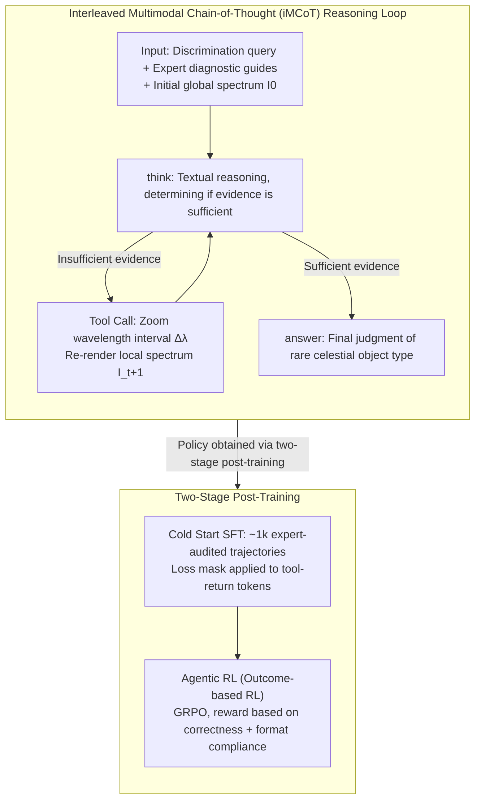

# Spec-o3: A Tool-Augmented Vision-Language Agent for Rare Celestial Object Candidate Identification

**Conference**: ACL 2026  
**arXiv**: [2601.06498](https://arxiv.org/abs/2601.06498)  
**Code**: [Project HomePage](https://github.com/jiaminghui/Spec-o3)  
**Area**: LLM Agent  
**Keywords**: Tool-Augmented Agent, Interleaved Multimodal Chain-of-Thought, Spectral Inspection, Reinforcement Learning, Domain VLM

## TL;DR

This paper proposes Spec-o3, a tool-augmented vision-language agent that simulates the spectral inspection workflow of astronomers through Interleaved Multimodal Chain-of-Thought (iMCoT). Using a two-stage training approach with cold-start SFT and outcome-based RL, it improves the macro-F1 of rare celestial object identification from 28.3% to 76.5%, achieving an inference speed ~50x faster than manual inspection.

## Background & Motivation

**Background**: Modern spectral survey projects (LAMOST, SDSS, DESI) generate massive amounts of data. Building rare celestial object catalogs requires a two-stage process: deep learning algorithms for candidate screening, followed by expert visual vetting. This visual inspection stage still relies heavily on manual labor.

**Limitations of Prior Work**: (1) Deep learning classifiers produce opaque probability scores and exhibit poor out-of-distribution generalization, making it difficult to gain expert trust; (2) Post-hoc explanation methods (e.g., Grad-CAM, SHAP) produce coarse feature attributions that cannot reliably map to astrophysical structures; (3) Manual inspection is unscalable—for instance, the LAMOST CV catalog required experts to visually inspect 170,000 candidates to confirm only 323 targets.

**Key Challenge**: The number of candidates from next-generation surveys will continue to skyrocket, but the speed of manual inspection cannot increase synchronously, becoming a primary bottleneck in astronomy.

**Goal**: Design a trustworthy and highly generalizable automated inspection agent that inspects spectra like an astronomer.

**Key Insight**: An astronomer's inspection process is essentially "thinking while looking at the spectrum"—observing the global morphology first, then repeatedly zooming in on wavelength regions of interest to check details, and finally making a judgment. Combining a VLM with a spectral visualization tool can simulate this iterative process.

**Core Idea**: Interleaved Multimodal Chain-of-Thought (iMCoT) — alternating between textual reasoning and fine-grained spectral plots rendered by tools, complemented by a two-stage post-training to achieve expert-level inspection capabilities.

## Method

### Overall Architecture

The agent is built on Qwen2.5-VL, taking a text prompt $T_0$ (containing discrimination queries and expert diagnostic guides) and an initial global spectrum image $I_0$ as input. The agent performs textual reasoning within `<think>...</think>` blocks and generates zoomed-in views of local wavelength regions $I_{t+1}$ via tool calls, iterating until a final judgment is provided in `<answer>...</answer>`. The trajectory is formalized as $\tau = (T_0, I_0, T_1, I_1, T_2, I_2, \ldots, T_N)$. The reasoning loop achieves expert levels through two-stage post-training: injecting domain priors and tool-use capabilities via cold-start SFT, followed by optimizing tool-use strategies via outcome-based reinforcement learning.

### Key Designs

1.  **Interleaved Multimodal Chain-of-Thought (iMCoT)**: Defines state $s_t = \{I_{\leq t}, T_{\leq t}\}$, where the agent decides at each step whether to output an answer or use $Tool_t$ to obtain more fine-grained evidence. Tool input consists of a wavelength interval $\Delta\lambda_t = (\lambda_t^{\min}, \lambda_t^{\max})$ and optional diagnostic label $l_t$, returning a local re-rendered plot. **Design Motivation**: To accurately simulate the "global judgment → local verification → final decision" workflow of astronomers, making the reasoning process auditable and physically consistent.

2.  **Cold Start SFT**: Samples ~4k spectra (SNR > 10) from official LAMOST catalogs covering 5 rare object types (CV, CS, SS, MG, WD). Initial reasoning trajectories are generated by GPT-5 based on expert guides, followed by three rounds of astronomer review (screening → revision → final vote) to obtain ~1k high-quality expert trajectories. A token-level loss mask is applied to tool-returned content during training to prevent the model from memorizing visualization results. **Design Motivation**: Inject domain priors and tool-use capabilities using a small number of high-quality expert demonstrations.

3.  **Agentic RL**: Uses the GRPO framework for outcome-based RL, utilizing only labeled data (without requiring full trajectories). The reward function is designed based on prediction correctness and format compliance: Correct + Correct Format $\to r=1$, Correct + Format Violation $\to r=1-\alpha$, Incorrect + Correct Format $\to r=0$, Incorrect + Format Violation $\to r=-\alpha$. **Design Motivation**: Since performance after cold-start is limited by scarce expert trajectories, RL leverages richer label data to further optimize the tool-use policy.

### Loss & Training

Cold start uses standard SFT loss (with loss mask for tool-return tokens). RL uses GRPO (8 rollouts/problem, max 8 tool calls/trajectory). Training is conducted serially with base models Qwen2.5-VL-3B/7B on 8×H100 GPUs.

## Key Experimental Results

### Main Results (SpecVI-Bench, 5 types of rare objects)

| Model | CV F1 | CS F1 | SS F1 | MG F1 | WD F1 | Average F1 |
| :--- | :--- | :--- | :--- | :--- | :--- | :--- |
| GaiaNet (DL Expert Model) | 67.2 | 87.1 | 70.3 | 51.8 | 48.2 | 64.9 |
| o3 (OpenAI) | 57.1 | 53.1 | 53.3 | 60.0 | 37.8 | 52.3 |
| Qwen2.5-VL-7B (base) | 25.4 | 31.5 | 27.3 | 29.0 | 28.1 | 28.3 |
| S1-VL-32B-SFT | 60.7 | 42.8 | 43.7 | 36.3 | 27.4 | 42.2 |
| **Spec-o3-7B** | **81.0** | **80.2** | **84.5** | **83.4** | **53.6** | **76.5** |

### Ablation Study

| # | SFT | RL | Tool | 3B F1 | 7B F1 |
| :--- | :--- | :--- | :--- | :--- | :--- |
| 0 (Full) | ✓ | ✓ | ✓ | 73.3 | 76.5 |
| 1 | ✗ | ✓ | ✓ | 35.7 (-37.6) | 40.5 (-36.0) |
| 2 | ✓ | ✗ | ✓ | 33.1 (-40.2) | 41.6 (-34.9) |
| 4 | ✓ | ✓ | ✗ | 43.5 (-29.8) | 55.8 (-20.7) |

### Key Findings

-   **Two-stage training interdependence**: Either pure RL or pure SFT only achieves ~35-41% F1. Their combination jumps to 73-76%—cold start provides domain priors, while RL optimizes tool-use policies.
-   **Tools are crucial**: Removing tools causes the 7B model's F1 to drop from 76.5% to 55.8%, as static global views are insufficient for detecting subtle diagnostic features.
-   **Cross-survey zero-shot generalization**: Maintains 77-81% F1 on SDSS/DESI, while expert DL models drop by 14-20%, indicating Spec-o3 relies on transferable diagnostic evidence rather than survey-specific artifacts.
-   **Cross-task zero-shot generalization**: Achieves 76.4% F1 on unseen O/B/A type spectra (o3: 60.9%), confirming it learned a general tool-assisted inspection paradigm.
-   **Inference efficiency**: ~0.2s/sample (8×H100), which is ~50x faster than expert manual inspection.

## Highlights & Insights

-   **First application of the "think-with-image" paradigm to scientific data analysis**, generalizing from natural images to astronomical spectra and demonstrating the huge potential of tool-augmented VLMs in vertical domains.
-   The data construction process is extremely rigorous: GPT-5 generation → astronomer screening → revision → two-person audit → final vote, ensuring high-quality cold-start data.
-   **High cold-start data efficiency**: Reducing SFT data from ~1k to ~200 trajectories resulted in only minor performance degradation (CV F1: 80.7 → 77.8).
-   The RL stage does not require explicit tool-use rewards, as tool usage becomes sufficiently reliable after cold-start.

## Limitations & Future Work

-   Assessment focuses on a limited set of rare object types and has not yet covered broader spectral subclasses.
-   The agent abstracts expert inspection into a "zoom-reasoning" loop; however, actual catalog construction requires cross-matching with external databases and other modalities.
-   Cold start still requires expert involvement, creating a barrier to extending to new tasks or surveys (though the synthetic data pipeline shows potential for reducing this demand).
-   Production-oriented risk control mechanisms (e.g., calibration, abstention, triage) are not yet provided.
-   Wait-and-see for white dwarf (WD) tasks as F1 is relatively low (53.6%), possibly because WD spectral features are subtler and require finer diagnostic strategies.

## Related Work & Insights

-   **o3's think-with-image**: Spec-o3 extends this paradigm from general VQA to scientific data analysis, linking abstract diagnosis to visual evidence.
-   **GRPO (DeepSeek-R1)**: Extends outcome-based RL from mathematical reasoning to scientific tool-use scenarios.
-   **Insight**: The key for vertical domain VLMs is not larger models, but tool-use and reasoning paradigms aligned with the domain workflow.

## Rating

-   **Novelty**: ⭐⭐⭐⭐⭐ Created the first iMCoT agent in the astronomical spectral field with a sophisticated two-stage training strategy.
-   **Experimental Thoroughness**: ⭐⭐⭐⭐⭐ Extremely comprehensive, including cross-survey, cross-task, extreme-case generalization, human expert evaluation, and ablation studies.
-   **Writing Quality**: ⭐⭐⭐⭐ Domain background is well-introduced and the method is described clearly, though the barrier is slightly high for non-astronomy readers.
-   **Value**: ⭐⭐⭐⭐⭐ Practically addresses actual bottlenecks in astronomical observation; the ~50× acceleration has significant engineering value, and the paradigm is generalizable to other scientific fields.

<!-- RELATED:START -->

## Related Papers

- [\[CVPR 2026\] VULCAN: Tool-Augmented Multi Agents for Iterative 3D Object Arrangement](../../CVPR2026/llm_agent/vulcan_tool-augmented_multi_agents_for_iterative_3d_object_arrangement.md)
- [\[ACL 2026\] Feedback-Driven Tool-Use Improvements in Large Language Models via Automated Build Environments](feedback-driven_tool-use_improvements_in_large_language_models_via_automated_bui.md)
- [\[ACL 2026\] Shopping Companion: A Memory-Augmented LLM Agent for Real-World E-Commerce Tasks](shopping_companion_a_memory-augmented_llm_agent_for_real-world_e-commerce_tasks.md)
- [\[ACL 2026\] Don't Adapt Small Language Models for Tools; Adapt Tool Schemas to the Models](don39t_adapt_small_language_models_for_tools_adapt_tool_schemas_to_the_models.md)
- [\[ACL 2026\] Robust Tool Use via Fission-GRPO: Learning to Recover from Execution Errors](robust_tool_use_via_fission-grpo_learning_to_recover_from_execution_errors.md)

<!-- RELATED:END -->
