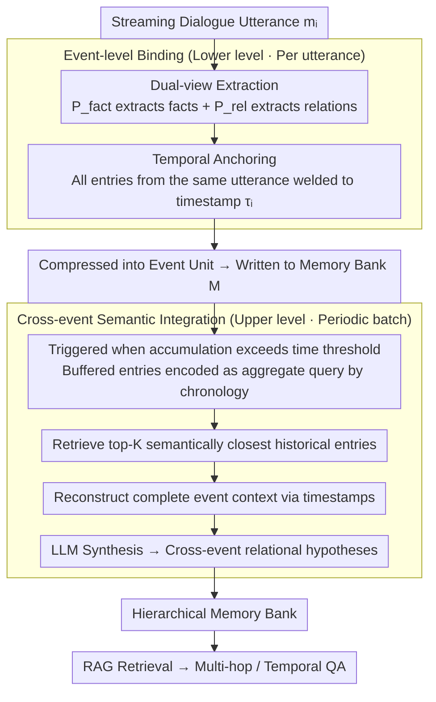

# StructMem: Structured Memory for Long-Horizon Behavior in LLMs

**Conference**: ACL 2026  
**arXiv**: [2604.21748](https://arxiv.org/abs/2604.21748)  
**Code**: [https://github.com/zjunlp/LightMem](https://github.com/zjunlp/LightMem)  
**Area**: LLM Agent / Dialogue Systems  
**Keywords**: Long-term memory, event-level binding, cross-event integration, hierarchical memory, multi-hop reasoning

## TL;DR

StructMem proposes a structure-enhanced hierarchical memory framework. Through event-level dual-view extraction and cross-event semantic integration, it achieves SOTA performance (76.82%) on the LoCoMo long-dialogue benchmark while significantly reducing token consumption (1.94M vs. 35.8M for graph memory) and API call counts.

## Background & Motivation

**Background**: Persistent memory systems are crucial for LLM agents to maintain coherence in long-term dialogues. Existing memory systems follow two paradigms: flat memory stores facts or summaries as independent units using vector databases for similarity retrieval; graph memory constructs knowledge graphs via entity-relation extraction to support structured reasoning.

**Limitations of Prior Work**: Flat memory is efficient but cannot model cross-event relationships—retrieval degrades to shallow similarity matching, failing in temporal reasoning and multi-hop QA. Graph memory restores relational structures but at extremely high cost—requiring cascaded LLM operations (entity extraction, relation extraction, deduplication, updates) and being fragile—noisy extraction generates propagating structural noise. Mem0^g consumes up to 35.8M tokens, 53,514 API calls, and 115,670 seconds of runtime.

**Key Challenge**: A fundamental trade-off between efficiency and structured reasoning. Flat methods are fast but shallow, while graph methods are deep but slow. The root cause lies in inappropriate memory unit selection: isolated facts lose context, and triplets impose rigid schemas.

**Goal**: Design a memory unit that preserves the causal and interpersonal context of events without requiring explicit schema design, entity resolution, and symbolic graph traversal.

**Key Insight**: The basic unit of conversational memory should not be isolated facts or triplets, but "temporally anchored relational events"—preserving "what happened" and "how events interrelate across subjects and time."

**Core Idea**: Use event-level binding (dual-view extraction + temporal anchoring) to preserve local structures and cross-event integration (semantic retrieval + batch synthesis) to build global connections, achieving structured reasoning without constructing explicit graphs.

## Method

### Overall Architecture

StructMem organizes conversational memory into two hierarchical levels. The lower level processes individual utterances: extracting dual pathways of "facts" and "relations" from each utterance and unifying them to the same timestamp, compressing an utterance into a temporally complete "event unit." The upper level operates between events, periodically clustering semantically similar historical events for synthesis to generate high-level relational hypotheses across time boundaries. The input is streaming dialogue, and the output is a hierarchical memory bank. Downstream tasks use RAG-style retrieval to answer multi-hop and temporal questions. The entire process does not construct an explicit knowledge graph; all entries are represented in natural language. The backbone is gpt-4o-mini, and embeddings use text-embedding-3-small, necessitating no model training.

### Key Designs

**1. Dual-View Extraction: Dual testimonies for one sentence**

A persistent problem in memory systems is that a single perspective only captures half the information—flat memory only keeps facts, while triplets only keep relations, both losing the context required for episodic grounding. StructMem calls the LLM twice for each utterance $m_i$ using two different prompts: $\Phi_i = \mathcal{L}(P_{fact} \| m_i)$ extracts fact entries (what was said, what was done), and $\Psi_i = \mathcal{L}(P_{rel} \| m_i)$ extracts relational entries (interpersonal dynamics, causal impacts, temporal dependencies). Both pathways are written in natural language rather than forced into triplets, preserving relational structure while avoiding the overhead of entity resolution and schema design.

**2. Temporal Anchoring: Welding facts and relations to the same moment**

If fact entries and relational entries are scattered independently in a vector database, temporal reasoning becomes impossible. StructMem anchors all entries produced by the same utterance to its original timestamp $\tau_i$. The memory bank is defined as $\mathcal{M} \leftarrow \bigcup_{i=1}^{N} \{ \langle x, \mathbf{e}_x, \tau_i \rangle \mid x \in \Phi_i \cup \Psi_i \}$, where $\mathbf{e}_x$ is the entry embedding. When any entry is hit during retrieval, the timestamp allows the reconstruction of fact and relation entries from the same moment into a complete event—the timestamp acts as the link to restore event integrity from flat retrieval.

**3. Cross-Event Semantic Integration: Enabling dialogue between related events**

Individual events remain isolated; multi-hop reasoning requires establishing connections across time, yet maintaining a graph per event is costly. StructMem adopts periodic batch processing: integration is triggered when cumulative events exceed a time threshold. Unintegrated entries in the buffer are first sorted chronologically and encoded into an aggregate query to retrieve the top-K semantically similar entries as seeds. For each seed, the complete event context $E_\tau(x^*) = \{x' \in \mathcal{M} \mid \tau(x') = \tau(x^*)\}$ is reconstructed via timestamps. Finally, the reconstructed events and buffered events are provided to the LLM for synthesis to generate cross-event relational hypotheses. This step is not lossy compression but an injection of new reasoning chains into the memory that did not exist in single entries. This is feasible because semantically related events naturally cluster within similar time windows; utilizing this temporal locality downgrades event-by-event graph updates to periodic batch processing, reducing API calls and token consumption.

## Key Experimental Results

### Main Results (LoCoMo Benchmark)

| Method | Overall | Multi-hop | Temporal | Token (M) | API Calls | Time (s) |
|------|---------|-----------|----------|-----------|-----------|----------|
| FullContext | 73.83 | 68.79 | 50.16 | – | – | – |
| Mem0 | 66.88 | 67.13 | 59.19 | 12.196 | 9181 | 30057 |
| Mem0^g (Graph) | 68.44 | 65.71 | 58.13 | 35.825 | 53514 | 115670 |
| Zep | 75.14 | 74.11 | 67.71 | – | – | – |
| Memobase | 75.78 | 70.92 | 85.05 | – | – | – |
| **StructMem** | **76.82** | **68.77** | **81.62** | **1.937** | **1056** | **22854** |

### Ablation Study

| Configuration | Multi-hop | Temporal |
|------|-----------|----------|
| Flat Memory (Baseline) | 66.31 | 78.50 |
| Graph Memory | 66.67 | 76.64 |
| w/o Cross-Event | 66.31 | 79.44 |
| StructMem (Full) | 68.77 | 81.62 |

### Key Findings
- **StructMem achieves a SOTA Overall score of 76.82%**, surpassing Memobase (75.78%) and Zep (75.14%), with temporal reasoning at 81.62%, second only to Memobase's 85.05%.
- **Efficiency advantages are significant**: Token consumption is only 1.94M, which is 1/18 of Mem0^g (35.8M); API calls are 1,056, which is 1/50 of Mem0^g (53,514).
- Ablations show that event-level structure primarily improves temporal reasoning (78.50→79.44), and cross-event integration further boosts it to 81.62%.
- Graph Memory actually performs worse in temporal reasoning than Flat Memory (76.64 vs 78.50), indicating that rigid triplet structures are harmful to temporal modeling.
- Flat retrieval performance peaks and plateaus at 60 entries, suggesting that the bottleneck lies in knowledge reasoning rather than coverage.

## Highlights & Insights
- The insight that **"memory units should be temporally anchored relational events"** is precise, identifying a third path between flat and graph approaches. The design of natural language representation coupled with time is simple yet effective.
- The use of the **temporal locality assumption** is clever: semantically related events cluster within short time windows, making periodic integration more efficient than event-by-event graph updates. This assumption holds strongly in dialogue scenarios.
- Cross-event integration generates "relational hypotheses" rather than compressed summaries, which is a creative enhancement—injecting reasoning chains into memory that are not directly present in the raw data.

## Limitations & Future Work
- The quality of dual-view extraction is highly dependent on prompt design; suboptimal prompts may lead to incomplete or inaccurate relational information.
- It lacks an explicit conflict resolution and memory update mechanism—user preferences may evolve over time, and historical summaries may become inconsistent with new information.
- Evaluated only on the LoCoMo benchmark; it has not been verified on other long-dialogue benchmarks (such as LongMemEval).
- While the temporal locality assumption holds in dialogue scenarios, it may not hold in other scenarios such as multi-day work logs.

## Related Work & Insights
- **vs Mem0^g**: A graph memory method requiring entity-relation extraction and graph maintenance. StructMem replaces triplets with natural language events, improving efficiency by 18x.
- **vs HiMem**: Organizes hierarchical text segments based on physical session boundaries. StructMem does not depend on session boundaries but uses semantic similarity for cross-event linking.
- **vs TiMem**: Introduces per-turn Chain-of-Thought reflection to deepen single-turn understanding, but incurs per-turn overhead. StructMem's batch integration strategy is more cost-effective.
- **vs EMem**: Retains original episodes to prioritize retrieval faithfulness. StructMem preserves original memories while actively synthesizing cross-event relationships.

## Rating
- Novelty: ⭐⭐⭐⭐ The hierarchical design of dual-view + temporal anchoring + semantic integration is innovative, though individual components are not entirely new.
- Experimental Thoroughness: ⭐⭐⭐ Only one benchmark (LoCoMo), and ablations are not sufficiently deep; however, the efficiency comparison is comprehensive.
- Writing Quality: ⭐⭐⭐⭐ The comparison of the three paradigms is intuitive and the method description is clear, though the Related Work section is long.
- Value: ⭐⭐⭐⭐ Significant efficiency gains (1/18 tokens, 1/50 API calls) are highly meaningful for practical deployment.

<!-- RELATED:START -->

## Related Papers

- [\[ACL 2026\] OCR-Memory: Optical Context Retrieval for Long-Horizon Agent Memory](ocr-memory_optical_context_retrieval_for_long-horizon_agent_memory.md)
- [\[ACL 2026\] TiMem: Temporal-Hierarchical Memory Consolidation for Long-Horizon Conversational Agents](timem_temporal-hierarchical_memory_consolidation_for_long-horizon_conversational.md)
- [\[ACL 2026\] OPeRA: A Dataset of Observation, Persona, Rationale, and Action for Evaluating LLMs on Human Online Shopping Behavior Simulation](opera_a_dataset_of_observation_persona_rationale_and_action_for_evaluating_llms_.md)
- [\[ACL 2026\] MemSearcher: Training LLMs to Reason, Search and Manage Memory via End-to-End RL](memsearcher_training_llms_to_reason_search_and_manage_memory_via_end-to-end_rein.md)
- [\[ICLR 2026\] MC-Search: Evaluating and Enhancing Multimodal Agentic Search with Structured Long Reasoning Chains](../../ICLR2026/llm_agent/mc-search_evaluating_and_enhancing_multimodal_agentic_search_with_structured_lon.md)

<!-- RELATED:END -->
