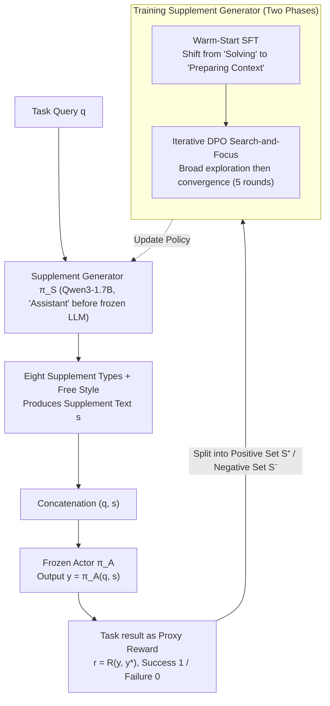

# Supplement Generation Training for Enhancing Agentic Task Performance

**Conference**: ACL 2026 Findings  
**arXiv**: [2604.20727](https://arxiv.org/abs/2604.20727)  
**Code**: None  
**Area**: Model Compression  
**Keywords**: Supplement Generation Training, Prompt Optimization, Small Model Assistant, DPO, Agentic Tasks

## TL;DR

SGT (Supplement Generation Training) trains a small LLM (1.7B) to generate instance-specific supplemental text (reasoning clues, summaries, error reminders, etc.). When appended to the input, these supplements allow a frozen large Actor model to solve tasks more effectively, achieving an average improvement of 21% across 5 benchmarks without modifying the Actor's parameters.

## Background & Motivation

**Background**: The most powerful language models are increasingly deployed as closed-source APIs with inaccessible gradients. Even when fine-tuning is possible, the computational overhead is high, and the continuous release of new models quickly makes old fine-tunings obsolete. Consequently, optimization pressure has shifted from the model weights to the input side. Existing prompt optimization methods include global template methods (e.g., DSPy and TextGrad, which optimize instruction templates) and local methods (e.g., LPO and Prompt-OIRL, which customize prompts for each input).

**Limitations of Prior Work**: Existing methods primarily focus on selecting or reordering from existing templates rather than generating new, input-specific content. Global methods optimize fixed templates across entire datasets, failing to adapt to the unique requirements of individual inputs. While local methods customize for each input, they still operate within a fixed pool of templates. Neither approach can learn to synthesize novel reasoning structures.

**Key Challenge**: Prompt optimization should not be limited to selecting or reordering existing templates. Instead, it should involve learning to synthesize new auxiliary content to prepare the optimal context for a frozen model. This is analogous to the relationship between an executive and an assistant—the assistant's job is not to relay instructions verbatim, but to prepare the correct context, provide relevant background, and frame each problem in the most effective manner.

**Goal**: To train a small, open-source "supplement generator" that dynamically produces auxiliary text for each input, guiding a frozen large Actor to perform better during inference.

**Key Insight**: Task outcomes are utilized as proxy reward signals to train the generator—if a supplement helps the Actor solve the task (success), the supplement is considered good. The training workflow combines SFT warm-start and iterative DPO to progressively refine the quality of the supplements.

**Core Idea**: A 1.7B small model learns to generate instance-specific supplemental text (8 predefined types + free-form). By using the Actor's task results as proxy rewards, the generation strategy is optimized via SFT+DPO. This approach does not modify the Actor's weights and only optimizes the input.

## Method

### Overall Architecture

SGT does not modify the expensive and non-differentiable large model; instead, it attaches a 1.7B small model as an "assistant" in front of it. A task query $q$ first enters the supplement generator $\pi_\mathcal{S}$ to produce supplemental text $s$. Subsequently, $s$ and $q$ are concatenated and fed into the frozen Actor $\pi_\mathcal{A}$ to obtain the final output $y = \pi_\mathcal{A}(q, s)$. Since there are no ground-truth labels for whether a supplement is intrinsically good, the success or failure of the Actor's task execution is used directly as a proxy reward to train the generator. The training involves two steps: first, a Warm-Start SFT is used to pivot the small model from "solving tasks itself" to "preparing context for the large model," followed by iterative DPO to refine supplement quality and type selection.

### Key Designs

**1. Eight Supplement Types + Task Result as Proxy Reward: Scoring supplements based on Actor accuracy**

It is difficult to define the quality of supplemental text directly. SGT bypasses this by predefining 8 supplement types—Answer (direct answer), Background (contextual knowledge), CoT (step-by-step reasoning), Rephrase (paraphrasing), Summary (abstracts), Mistakes (reminders of common errors), One-shot (single example), and Pairs (contrasting positive/negative examples)—and inferring the supplement's value from the Actor's final result. The reward is defined as $r = R(y, y^*)$, where success is 1 and failure is 0. For each query, the generated supplement set $S$ is split into a positive set $S^+$ and a negative set $S^-$ based on the reward. Thus, different tasks naturally develop preferences for different types (e.g., code tasks may favor Pairs, while QA tasks favor Background), which the model learns during training.

**2. Warm-Start SFT: Teaching the small model the act of "generating supplements"**

An untrained LLM instinctively attempts to solve a query directly rather than producing a supplement for another model to use. There is a gulf between initial and target behaviors. SGT uses an initial model $\pi_\mathcal{S}^0$ to generate 9 types (8 predefined + Free Style) for each query, sampling each 5 times. After obtaining proxy rewards via the Actor, successful supplements $S'^+$ are filtered out. Stratified sampling by type is then performed, followed by SFT using cross-entropy loss. This step initializes the model to be "capable of generation, formatted correctly, and able to perform preliminary type selection," making subsequent DPO more effective.

**3. Iterative DPO Search-and-Focus: Broad exploration followed by convergence to effective types**

In each iteration, the current model $\pi_\mathcal{S}^t$ generates new data to train the next generation $\pi_\mathcal{S}^{t+1}$. In the first round, the supplement set is constructed from three sources: Pre-Defined (8 types), OOD (3 likely non-predefined types), and Concat (3 pairs of successful type concatenations). In subsequent rounds, the model samples 20 times directly. Preference pairs are split into cross-type pairs (teaching the model to select types) and intra-type pairs (teaching the model to improve quality), with a limit of 20 pairs per category. The loss is defined as $\mathcal{L} = \mathcal{L}_{DPO} + \alpha \mathcal{L}_{NLL}$ ($\alpha = 1$). This allows broad exploration (search) in early iterations and concentration on the most effective types (focus) later. Experiments show that Pairs gradually dominate on Spider and HLE, while the distribution remains uniform on DS-1000—the model learns to tailor supplements to the task.

### Loss & Training
The SFT phase employs standard cross-entropy loss. The DPO phase utilizes DPO loss combined with a length-normalized NLL loss ($\alpha = 1$) over 5 iterations. The supplement generator is Qwen3-1.7B (with thinking mode disabled), and the Actors are v3.5-sonnet-v2 and GPT-OSS-120B.

## Key Experimental Results

### Main Results (Average Gain across 5 Benchmarks × 2 Actors)

| Method | Spider | DS-1000 | HotpotQA | HLE | superGPQA | Avg. Gain |
|------|--------|---------|----------|-----|-----------|-----------|
| $\emptyset \rightarrow \pi_A$ (Ours) | 0.674 | 0.553 | 0.694 | 0.030 | 0.288 | – |
| CoT Reasoning Extension | 0.676 | 0.565 | 0.655 | 0.028 | 0.340 | +5% |
| TextGrad | 0.687 | 0.613 | 0.677 | 0.028 | 0.298 | +1% |
| DSPy | 0.707 | 0.598 | 0.680 | 0.032 | 0.297 | +4% |
| SGT (SFT only) | 0.718 | 0.573 | 0.689 | 0.035 | 0.273 | +5% |
| **SGT (DPO iter5)** | **0.784** | **0.593** | **0.705** | **0.049** | **0.314** | **+21%** |

### Ablation Study: Incremental Training Phases

| DPO Iteration | Avg. Gain |
|----------|-----------|
| SFT only | +5% |
| DPO iter1 | +10% |
| DPO iter3 | +16% |
| DPO iter5 | +21% |

### Key Findings
- **SGT consistently outperforms all baselines across all benchmarks**, with an average Gain of +21%, significantly exceeding TextGrad (+1%) and DSPy (+4%).
- **Structured reasoning tasks benefit the most**: Spider improved from 0.674 to 0.784 (+16.3%p), as supplements helped the Actor externalize intermediate reasoning steps.
- **Open-ended reasoning tasks (HotpotQA) show smaller improvements**, as the bottleneck is knowledge acquisition rather than reasoning organization.
- The small model (1.7B) performs poorly when solving tasks directly (-23%), but is highly effective as a supplement generator (+21%), indicating that supplement generation $\neq$ task solving.
- Type distributions shifted significantly during DPO: on Spider, the Pairs type transitioned from a uniform distribution to a dominant one, while DS-1000 maintained diversity—the model automatically adapted to task characteristics.
- Iterative DPO improvements continued until the 5th round without obvious saturation.

## Highlights & Insights
- **The "Assistant-Executive" analogy is precise**: The small model is not there to solve the problem, but to "prepare the lesson" for the large model. This insight into role division translates into a highly practical system architecture.
- **Emergent "search-and-focus" strategy**: Early iterations explore type diversity while later iterations concentrate on effective types. This is not explicitly programmed but results from DPO and natural selection.
- **Task-adaptive type selection**: The model learns to generate Pairs for Spider (contrasting correct/incorrect SQL) and Summary + CoT for DS-1000. This automatic strategy adaptation is the key reason SGT surpasses fixed-template methods.
- The framework is transferable to any "small model aiding large model" scenario, such as query rewriting in RAG or planning assistance in Agents.

## Limitations & Future Work
- Dataset sizes were limited to hundreds or thousands of instances; scaling behavior in large-scale scenarios remains unknown.
- Supplement types are predefined as 8 categories. Although DPO discovers new types, initialization still relies on manual design.
- Evaluation was conducted in low-resource settings; whether performance holds with larger data volumes in production is uncertain.
- While the generator and Actor come from different families, potential collinearity issues in same-family combinations have not been explored.
- The Actor was set to medium reasoning intensity (GPT-OSS medium); the gains from SGT may diminish under high reasoning intensity settings.

## Related Work & Insights
- **vs. DSPy**: DSPy optimizes global prompt templates, whereas SGT generates new instance-specific content. DSPy yields +4%, SGT yields +21%.
- **vs. TextGrad**: TextGrad uses LLM feedback to iterate on prompt variables globally. TextGrad yields +1%, SGT yields +21%.
- **vs. LPO**: Local prompt optimization restricts edits to "optimizing tokens" on existing prompts. SGT generates entirely new auxiliary content.
- **vs. Liu et al. (2022)**: Early work showed LLM-generated contextual knowledge can improve Actors. SGT does not fix the supplement type but learns the optimal policy.

## Rating
- Novelty: ⭐⭐⭐⭐ The role of the supplement generator is novel (assisting rather than solving), and the SFT+DPO workflow is an engineering innovation.
- Experimental Thoroughness: ⭐⭐⭐⭐ Comprehensive testing across 5 benchmarks, 2 Actors, multiple baselines, type distribution analysis, and ablation studies.
- Writing Quality: ⭐⭐⭐⭐ The "Executive-Assistant" analogy is vivid, and Figures 1/2 are clear, though some method details (sampling strategies) are dense.
- Value: ⭐⭐⭐⭐⭐ +21% average improvement with a 1.7B model and no Actor modification provides high practical deployment value.

<!-- RELATED:START -->

## Related Papers

- [\[ICLR 2026\] PerfGuard: A Performance-Aware Agent for Visual Content Generation](../../ICLR2026/llm_agent/radiometrically_consistent_gaussian_surfels_for_inverse_rendering.md)
- [\[ICLR 2026\] AgentSynth: Scalable Task Generation for Generalist Computer-Use Agents](../../ICLR2026/llm_agent/agentsynth_scalable_task_generation_for_generalist_computer-use_agents.md)
- [\[ACL 2026\] GOAT: A Training Framework for Goal-Oriented Agent with Tools](goat_a_training_framework_for_goal-oriented_agent_with_tools.md)
- [\[ICLR 2026\] MC-Search: Evaluating and Enhancing Multimodal Agentic Search with Structured Long Reasoning Chains](../../ICLR2026/llm_agent/mc-search_evaluating_and_enhancing_multimodal_agentic_search_with_structured_lon.md)
- [\[ACL 2025\] Agentic Reasoning: A Streamlined Framework for Enhancing LLM Reasoning with Agentic Tools](../../ACL2025/llm_agent/agentic_reasoning_tools.md)

<!-- RELATED:END -->
