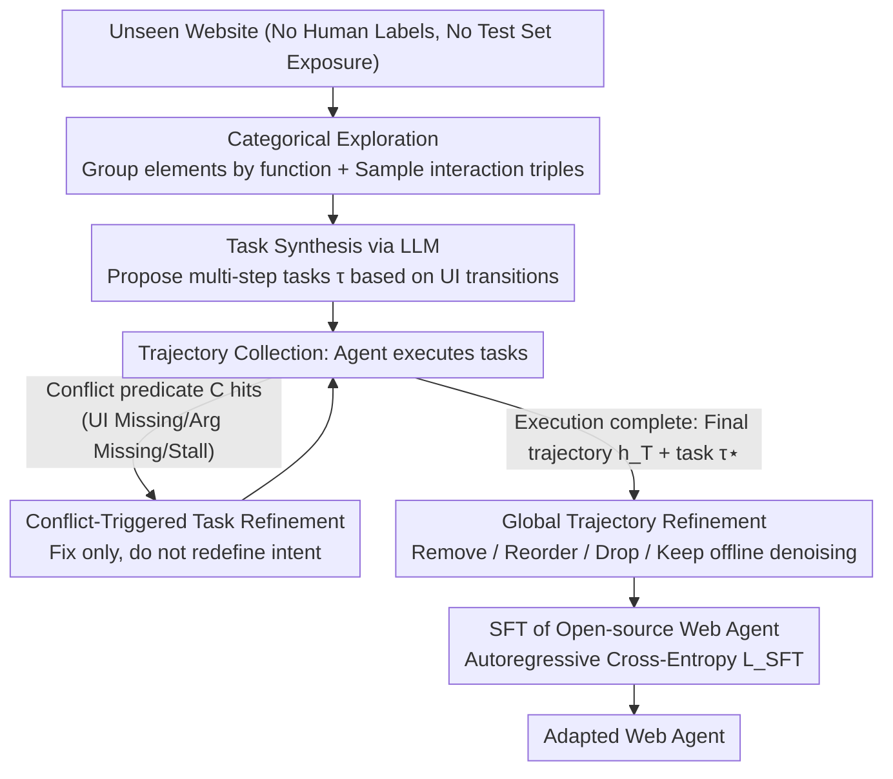

# SynthAgent: Adapting Web Agents with Synthetic Supervision

**Conference**: ACL 2026  
**arXiv**: [2511.06101](https://arxiv.org/abs/2511.06101)  
**Code**: [GitHub](https://github.com/aiming-lab/SynthAgent)  
**Area**: LLM Agent / Web Agent Adaptation  
**Keywords**: Synthetic Data, Web Agent, Dual Refinement, Categorical Exploration, Trajectory Quality

## TL;DR

This paper proposes SynthAgent, a Web Agent adaptation framework based entirely on synthetic supervision. It systematically covers functional areas of web pages to synthesize diverse tasks through categorical exploration, and enhances synthetic data quality via a dual refinement strategy comprising task refinement (triggered by conflict detection to fix hallucinations) and trajectory refinement (denoising with a global perspective). It significantly outperforms existing synthesis methods on WebArena and Online-Mind2Web.

## Background & Motivation

**Background**: LLM-driven Web Agents demonstrate strong web interaction capabilities on standardized benchmarks but suffer from sharp performance degradation when deployed to new, unseen websites. Adapting to new environments requires environment-specific tasks and demonstration data, yet human annotation is costly and unscalable.

**Limitations of Prior Work**: (1) Self-Instruct lets LLMs "imagine" tasks without environmental grounding, resulting in simple and repetitive tasks; (2) OS-Genesis synthesizes tasks backward from single-step observations, where insufficient context leads to heavy hallucinations (referencing non-existent elements or states); (3) Explorer continuously refines tasks during execution but frequently alters task intent (averaging 8.6 changes), causing 68.3% of trajectories to exceed step budgets.

**Key Challenge**: Task synthesis requires environmental grounding to avoid hallucinations, but over-grounding tasks during execution introduces trajectory noise—a fundamental design tension in synthetic supervision.

**Goal**: Design a fully synthetic supervision framework to efficiently adapt Web Agents to new environments without human intervention or test-set leakage.

**Key Insight**: Decouple task refinement and trajectory refinement into two collaborative and complementary stages: task refinement ensures feasibility but introduces noise, while subsequent trajectory refinement eliminates that noise.

**Core Idea**: Dual refinement—refining tasks only when explicit conflicts are detected during execution (conflict-triggered rather than continuous), followed by refining trajectories using global context post-execution, thereby ensuring both task feasibility and trajectory quality.

## Method

### Overall Architecture

SynthAgent aims to adapt open-source Web Agents to unfamiliar websites without human labels or test-set exposure. The pipeline consists of four stages: first, Categorical Exploration for task synthesis, where web elements are grouped by functionality and interaction triples $(o_t, a_t, o_{t+1})$ are sampled uniformly to generate multi-step tasks based on real UI transitions; second, Conflict-triggered Task Refinement during trajectory collection, where tasks are modified only when explicit conflicts occur; third, Global Trajectory Refinement, which uses the complete trajectory and final task $\tau^{\star}$ to remove noise and misaligned actions offline; finally, supervised fine-tuning (SFT) of open-source models on the refined data. The core tension is that task refinement introduces noise for feasibility, which trajectory refinement then cleans. Training utilizes standard autoregressive cross-entropy:

$$\mathcal{L}_{\text{SFT}} = \mathbb{E}_{(\tau^{\star}, h^{\star}) \sim \mathcal{D}} \left[ -\sum_{t=1}^{T} \log p_\theta(a_t | \tau^{\star}, o_{\leq t}, a_{<t}) \right]$$

### Key Designs

**1. Categorical Exploration: Transforming Random Clicks into Functional Coverage**

Random exploration, like in OS-Genesis, often clicks redundant elements repeatedly while missing critical functional areas, leading to simple and repetitive tasks. SynthAgent frames this as a function-aware coverage problem: on each page $o_t$, the LLM classifies interactive elements by semantic roles (e.g., "Account Management," "Search Filters"). At most 2 unvisited elements are sampled per category, with a sampling budget cap per category to prevent dense areas from dominating the exploration. This discovers 6.0 functional categories per page on average, enhancing synthetic task diversity.

**2. Conflict-Triggered Task Refinement: Modify Tasks Only on Error, Maintain Intent**

Explorer continuously refines tasks at every step, changing them 8.6 times on average and causing 68.3% of trajectories to exceed step budgets due to intent drift. SynthAgent defines a lightweight conflict predicate $\mathcal{C}(h_t, \tau_t) = \neg\textsf{ExistsUI} \vee \textsf{MissingArgs} \vee \textsf{Stall}$, capturing non-existent UI references, missing arguments, and execution stalls. LLM refinement is triggered only when this hits, following principles to specify missing details, align with actual observations, reduce scope, and maintain category. Since initial tasks are well-specified by categorical exploration, refinement "corrects" rather than "redefines," triggering only 2.0 times on average with a 6.3% timeout rate.

**3. Global Trajectory Refinement: Cleaning Noise with a Global View**

Noise left by task refinement is addressed with a global perspective post-execution. This offline stage reviews the complete trajectory $h_T$ and final task $\tau^{\star}$ to perform four types of edits: Remove(i) for irrelevant/redundant steps, Reorder(i,j) for swappable steps, Drop($h_T$) for overly noisy trajectories, and Keep($h_T$) for high-quality ones. The design prioritizes precision; Reordering accounts for only 4.1% of operations to avoid breaking causal dependencies, yet reordered trajectories show a significantly higher preference win rate (42% vs 27%).

### Loss & Training

Standard SFT paradigm with a historical context window of the last 3 steps. Up to 500 task-trajectory pairs are synthesized per website, and a single model is trained by mixing data from five websites (learning rate 1e-5, batch size 32, 3 epochs).

## Key Experimental Results

### Main Results

**WebArena (5 Websites) - Qwen2.5-VL-7B Backbone**

| Method | Training Data | Shopping | CMS | Reddit | Gitlab | Maps | Overall |
|------|---------|---------|-----|--------|--------|------|---------|
| Base Qwen | - | 13.71 | 8.24 | 9.43 | 6.18 | 5.50 | 8.80 |
| +Self-Instruct | Synthetic | 18.18 | 8.77 | 3.85 | 12.50 | 9.38 | 11.50 |
| +OS-Genesis | Synthetic | 14.55 | 10.53 | 11.54 | 16.07 | 12.50 | 13.27 |
| +Explorer | Synthetic | 10.91 | 3.51 | 0.00 | 1.82 | 3.12 | 4.44 |
| **+SynthAgent** | **Synthetic** | **20.00** | **21.05** | **15.38** | **19.64** | **28.12** | **20.80** |

**Online-Mind2Web (136 Real Websites)**

| Method | GPT-4.1 Judge | GPT-5.1 Judge | WebJudge | Average |
|------|-------------|-------------|---------|------|
| Self-Instruct | 17.67 | 13.00 | 19.67 | 16.78 |
| OS-Genesis | 19.53 | 11.00 | 19.33 | 16.62 |
| **SynthAgent** | **31.67** | **15.67** | **23.33** | **23.56** |

### Ablation Study

| Configuration | Overall | Gain |
|------|---------|------|
| SynthAgent (Full) | 20.80 | - |
| w/o Categorical Exploration | 17.26 | -3.54 |
| w/o Task Refinement | 15.93 | -4.87 |
| w/o Trajectory Refinement | 16.81 | -3.99 |
| w/o Dual Refinement | 15.93 | -4.87 |

### Key Findings

- Explorer's performance is lower than the base model; continuous refinement generates long, misaligned "negative supervision" trajectories.
- Synthetic data quality: SynthAgent's trajectory quality (82.6) far exceeds Explorer (36.4) and OS-Genesis (52.0).
- SynthAgent achieves a 96.5% trajectory completion rate vs. Explorer's 30.5%, with lower API costs ($0.13 vs $0.22/trajectory).
- Performance gains persist on stronger backbones like Qwen3 (15.93→24.34), verifying model-agnosticism.

## Highlights & Insights

- The design insight that "task refinement and trajectory refinement are synergistic" is precise—the former ensures feasibility at the cost of noise, which the latter subsequently removes.
- The comparison between conflict-triggered and continuous refinement reveals a critical design principle: initial task quality dictates the refinement strategy.
- Categorical exploration converts random exploration into a structured coverage problem, which is simple yet effective.

## Limitations & Future Work

- Validated only in offline and limited online environments; synthesis for real-world active websites remains unexplored.
- Synthesis relies entirely on GPT-4.1; the use of more advanced LLMs or parameter optimization was not explored.
- Only standard SFT was used; more advanced training methods like DPO or online RL were not investigated.

## Related Work & Insights

- **vs OS-Genesis**: OS-Genesis synthesizes tasks from single-step observations leading to hallucinations; SynthAgent resolves this via categorical exploration and conflict-triggered refinement.
- **vs Explorer**: Explorer's continuous refinement causes intent drift; SynthAgent's conflict-triggered approach maintains intent consistency.
- **vs AgentTrek**: AgentTrek relies on offline tutorials which may be outdated; SynthAgent synthesizes by interacting directly with the environment.

## Rating

- Novelty: ⭐⭐⭐⭐ The collaborative dual refinement design and conflict-trigger mechanism are clear innovations.
- Experimental Thoroughness: ⭐⭐⭐⭐⭐ Two benchmarks, multiple backbones, detailed ablation, data quality analysis, and scaling experiments.
- Writing Quality: ⭐⭐⭐⭐⭐ Clear motivation and deep analysis of design tensions.
- Value: ⭐⭐⭐⭐ Provides a practical, high-quality synthetic data solution for unsupervised Web Agent adaptation.

<!-- RELATED:START -->

## Related Papers

- [\[ICLR 2026\] Towards Scalable Oversight via Partitioned Human Supervision](../../ICLR2026/llm_agent/towards_scalable_oversight_via_partitioned_human_supervision.md)
- [\[ICLR 2026\] Web-CogReasoner: Towards Knowledge-Induced Cognitive Reasoning for Web Agents](../../ICLR2026/llm_agent/web-cogreasoner_towards_knowledge-induced_cognitive_reasoning_for_web_agents.md)
- [\[ACL 2026\] ExpSeek: Self-Triggered Experience Seeking for Web Agents](expseek_self-triggered_experience_seeking_for_web_agents.md)
- [\[ACL 2026\] Don't Click That: Teaching Web Agents to Resist Deceptive Interfaces](dont_click_that_teaching_web_agents_to_resist_deceptive_interfaces.md)
- [\[ACL 2026\] WebClipper: Efficient Evolution of Web Agents with Graph-based Trajectory Pruning](webclipper_efficient_evolution_of_web_agents_with_graph-based_trajectory_pruning.md)

<!-- RELATED:END -->
