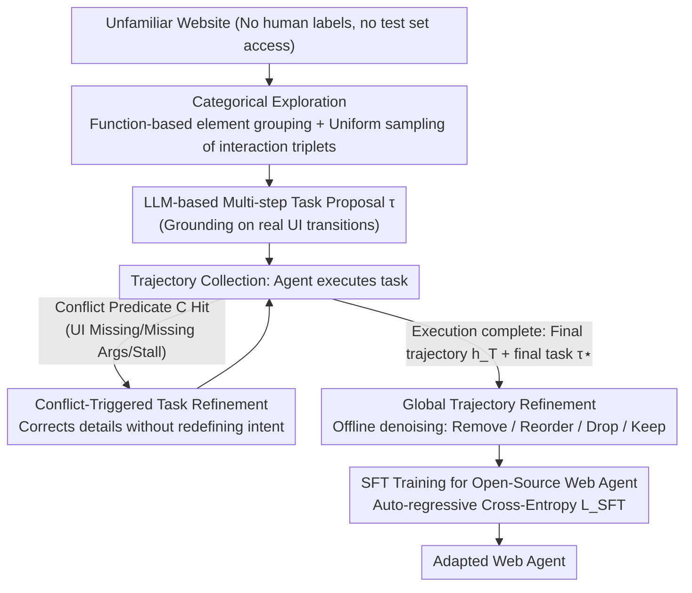

# SynthAgent: Adapting Web Agents with Synthetic Supervision

**Conference**: ACL 2026  
**arXiv**: [2511.06101](https://arxiv.org/abs/2511.06101)  
**Code**: [GitHub](https://github.com/aiming-lab/SynthAgent)  
**Area**: LLM Agent / Web Agent Adaptation  
**Keywords**: Synthetic Data, Web Agent, Dual Refinement, Categorical Exploration, Trajectory Quality

## TL;DR

This paper presents SynthAgent, a framework for adapting Web Agents based entirely on synthetic supervision. It systematically covers functional areas of web pages to synthesize diverse tasks through categorical exploration. Then, a dual refinement strategy is employed: task refinement (triggered by conflict detection to correct hallucinations) and trajectory refinement (denoising from a global perspective). SynthAgent significantly outperforms existing synthesis methods on WebArena and Online-Mind2Web.

## Background & Motivation

**Background**: LLM-driven Web Agents demonstrate robust web interaction capabilities on standardized benchmarks but suffer sharp performance degradation when deployed to new, unseen websites. Adapting to new environments requires environment-specific tasks and demonstration data, yet human annotation is costly and unscalable.

**Limitations of Prior Work**: (1) Self-Instruct lets LLMs "imagine" tasks without environmental grounding, resulting in simple and repetitive tasks; (2) OS-Genesis synthesizes tasks backward from single-step observations, where insufficient context leads to frequent hallucinations (referencing non-existent elements or states); (3) Explorer refines tasks continuously during execution, but frequent shifts in task intent (8.6 times on average) cause 68.3% of trajectories to exceed step budgets.

**Key Challenge**: Task synthesis requires environmental grounding to avoid hallucinations, yet over-grounding tasks during execution introduces trajectory noise—a fundamental design tension in synthetic supervision.

**Goal**: Design a fully synthetic supervision framework to efficiently adapt Web Agents to new environments without human intervention or test set leakage.

**Key Insight**: Decouple task refinement and trajectory refinement into two synergistic and complementary stages: task refinement ensures feasibility but introduces noise, while trajectory refinement subsequently eliminates that noise.

**Core Idea**: Dual refinement—refining tasks only when explicit conflicts are detected during execution (conflict-triggered rather than continuous) and refining trajectories using global context post-execution to guarantee both task feasibility and trajectory quality.

## Method

### Overall Architecture

SynthAgent aims to adapt open-source Web Agents to unfamiliar websites without human labels or touching test sets. The pipeline connects four stages: First, categorical exploration for task synthesis involves grouping web elements by function and uniformly sampling interaction triplets $(o_t, a_t, o_{t+1})$, allowing the LLM to propose multi-step tasks based on real interface transitions. Second, conflict-triggered task refinement occurs during trajectory collection, adjusting tasks only when they explicitly conflict with observations. Third, global trajectory refinement is performed offline post-execution, using the complete trajectory and final task $\tau^{\star}$ to remove noise and misaligned actions. Finally, the open-source model is fine-tuned via SFT on the refined synthetic data. The core tension of the design is that task refinement introduces noise to ensure feasibility, which trajectory refinement then cleans; the two are complementary. Training utilizes standard auto-regressive cross-entropy:

$$\mathcal{L}_{\text{SFT}} = \mathbb{E}_{(\tau^{\star}, h^{\star}) \sim \mathcal{D}} \left[ -\sum_{t=1}^{T} \log p_\theta(a_t | \tau^{\star}, o_{\leq t}, a_{<t}) \right]$$

### Key Designs

**1. Categorical Exploration: Transforming Random Clicks into Functional Coverage**

Random exploration, such as in OS-Genesis, often clicks redundant elements repeatedly while missing important functional areas, leading to simple and repetitive tasks. SynthAgent reformulates this as a function-aware coverage problem: on each page $o_t$, the LLM is first asked to categorize interactive elements by semantic roles (e.g., "Account Management," "Search Filters"). For each category, at most 2 unvisited elements are sampled for interaction, with a sampling budget cap per category to prevent a single dense region from consuming the entire exploration phase. This yields an average of 6.0 functional categories per page, enhancing the diversity of synthesized tasks.

**2. Conflict-Triggered Task Refinement: Modify Only on Errors, Preserve Intent**

Explorer refines tasks continuously at every step, averaging 8.6 modifications and causing 68.3% of trajectories to exceed step budgets due to constant intent drift. SynthAgent takes the opposite approach by defining a lightweight conflict predicate $\mathcal{C}(h_t, \tau_t) = \neg\textsf{ExistsUI} \vee \textsf{MissingArgs} \vee \textsf{Stall}$, capturing instances where referenced UI elements are missing, arguments are absent, or execution is stalled. The LLM is invoked for refinement only when this predicate is met, following four principles: specify missing details, align with actual observations, reduce scope, and maintain the original category. Since the initial tasks are well-specified by categorical exploration, refinement "corrects" rather than "redefines," triggering only 2.0 times on average with a 6.3% timeout rate, effectively maintaining intent consistency.

**3. Global Trajectory Refinement: Post-hoc Denoising from an "Omniscient" Perspective**

A global perspective is required to clean the noise left behind by task refinement. This stage offline reviews the complete trajectory $h_T$ and the final task $\tau^{\star}$, performing four types of edits: Remove(i) for irrelevant or redundant steps, Reorder(i,j) for swappable steps, Drop($h_T$) for overly noisy trajectories, and Keep($h_T$) for high-quality ones. The design intentionally favors precision—if a reordering is uncertain, it is rejected to avoid breaking causal dependencies. Consequently, Reorder accounts for only 4.1% of operations, yet reordered trajectories show a significantly higher win rate (42% vs 27%), proving that a small amount of precise reordering significantly boosts quality.

### Loss & Training

A standard SFT paradigm is used, with the history context window taking the most recent 3 steps. Up to 500 task-trajectory pairs are synthesized for each website. Data from five websites are mixed for training a single model (learning rate 1e-5, batch size 32, 3 epochs).

## Key Experimental Results

### Main Results

**WebArena (5 Websites) - Qwen2.5-VL-7B Backbone**

| Method | Training Data | Shopping | CMS | Reddit | Gitlab | Maps | Overall |
|------|---------|---------|-----|--------|--------|------|---------|
| Base Qwen | - | 13.71 | 8.24 | 9.43 | 6.18 | 5.50 | 8.80 |
| +Self-Instruct | Synthetic | 18.18 | 8.77 | 3.85 | 12.50 | 9.38 | 11.50 |
| +OS-Genesis | Synthetic | 14.55 | 10.53 | 11.54 | 16.07 | 12.50 | 13.27 |
| +Explorer | Synthetic | 10.91 | 3.51 | 0.00 | 1.82 | 3.12 | 4.44 |
| **+SynthAgent (Ours)** | **Synthetic** | **20.00** | **21.05** | **15.38** | **19.64** | **28.12** | **20.80** |

**Online-Mind2Web (136 Real Websites)**

| Method | GPT-4.1 Judge | GPT-5.1 Judge | WebJudge | Average |
|------|-------------|-------------|---------|------|
| Self-Instruct | 17.67 | 13.00 | 19.67 | 16.78 |
| OS-Genesis | 19.53 | 11.00 | 19.33 | 16.62 |
| **SynthAgent (Ours)** | **31.67** | **15.67** | **23.33** | **23.56** |

### Ablation Study

| Configuration | Overall | Gain/Change |
|------|---------|------|
| SynthAgent (Full) | 20.80 | - |
| w/o Categorical Exploration | 17.26 | -3.54 |
| w/o Task Refinement | 15.93 | -4.87 |
| w/o Trajectory Refinement | 16.81 | -3.99 |
| w/o Dual Refinement | 15.93 | -4.87 |

### Key Findings

- Performance of Explorer is lower than the base model—continuous refinement generates overly long, misaligned "negative supervision" trajectories.
- Synthetic Data Quality: SynthAgent achieves a trajectory quality score of 82.6, far exceeding Explorer (36.4) and OS-Genesis (52.0).
- SynthAgent achieves a trajectory completion rate of 96.5% vs. Explorer's 30.5%, with lower API costs ($\$0.13$ vs. $\$0.22$ per trajectory).
- Improvements persist on a stronger Qwen3 backbone (15.93 $\rightarrow$ 24.34), verifying method model-agnosticism.

## Highlights & Insights

- The design insight that "task refinement and trajectory refinement are synergistic" is precise—the former ensures feasibility while introducing noise, which the latter subsequently eliminates.
- The comparison between conflict-triggered and continuous refinement reveals a key design principle: the quality of the initial task determines the necessary refinement strategy.
- Categorical exploration converts random exploration into a structured coverage problem, which is simple yet effective.

## Limitations & Future Work

- Validated only in offline and limited online environments; the synthesis for live, highly dynamic websites remains unexplored.
- Task and trajectory synthesis relies entirely on GPT-4.1; the use of more advanced LLMs or parameter optimization was not investigated.
- Only standard SFT was used; more advanced training methods like DPO or online RL were not explored.

## Related Work & Insights

- **vs. OS-Genesis**: OS-Genesis synthesizes tasks from single-step observations leading to hallucinations; SynthAgent resolves this through categorical exploration and conflict-triggered refinement.
- **vs. Explorer**: Explorer's continuous refinement leads to intent drift and excessive trajectory length; SynthAgent's conflict-triggered approach maintains intent consistency.
- **vs. AgentTrek**: AgentTrek relies on offline tutorials which may be outdated; SynthAgent synthesizes by interacting directly with the current environment.

## Rating

- Novelty: ⭐⭐⭐⭐ The synergistic dual refinement design and conflict-triggered mechanism are clear innovations.
- Experimental Thoroughness: ⭐⭐⭐⭐⭐ Includes two benchmarks, multiple backbones, detailed ablations, data quality analysis, and scalability experiments.
- Writing Quality: ⭐⭐⭐⭐⭐ Clear problem motivation and in-depth analysis of design tensions.
- Value: ⭐⭐⭐⭐ Provides a practical, high-quality synthetic data solution for unsupervised Web Agent adaptation.

<!-- RELATED:START -->

## Related Papers

- [\[ICLR 2026\] Towards Scalable Oversight via Partitioned Human Supervision](../../ICLR2026/llm_agent/towards_scalable_oversight_via_partitioned_human_supervision.md)
- [\[ICLR 2026\] Web-CogReasoner: Towards Knowledge-Induced Cognitive Reasoning for Web Agents](../../ICLR2026/llm_agent/web-cogreasoner_towards_knowledge-induced_cognitive_reasoning_for_web_agents.md)
- [\[ACL 2026\] ExpSeek: Self-Triggered Experience Seeking for Web Agents](expseek_self-triggered_experience_seeking_for_web_agents.md)
- [\[ACL 2026\] Waking Up Blind: Cold-Start Optimization of Supervision-Free Agentic Trajectories](waking_up_blind_cold-start_optimization_of_supervision-free_agentic_trajectories.md)
- [\[ACL 2026\] Don't Click That: Teaching Web Agents to Resist Deceptive Interfaces](dont_click_that_teaching_web_agents_to_resist_deceptive_interfaces.md)

<!-- RELATED:END -->
