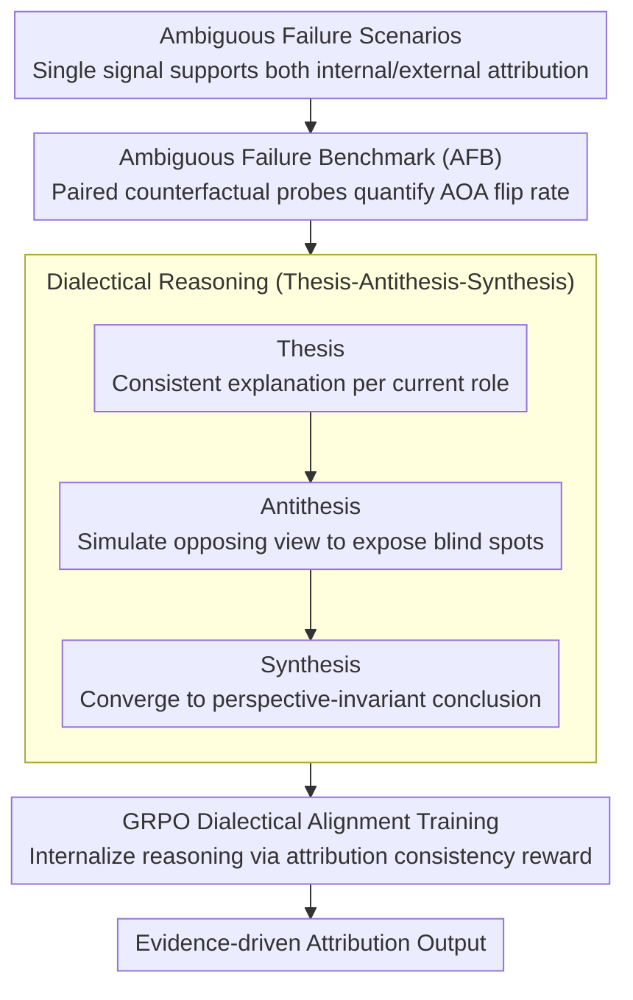

# Taming Actor-Observer Asymmetry in Agents via Dialectical Alignment

**Conference**: ACL 2026  
**arXiv**: [2604.19548](https://arxiv.org/abs/2604.19548)  
**Code**: [https://unikcc.github.io/ReTAS/](https://unikcc.github.io/ReTAS/)  
**Area**: LLM Reasoning  
**Keywords**: Actor-observer asymmetry, attribution bias, dialectical alignment, multi-agent collaboration, self-reflection

## TL;DR

It is discovered that LLM Agents exhibit human-like "Actor-Observer Asymmetry" (AOA) cognitive bias during role-playing—tending to attribute their own failures to external factors as actors, while attributing others' failures to internal errors as observers. ReTAS is proposed to eliminate this bias through dialectical reasoning (Thesis-Antithesis-Synthesis) and GRPO alignment.

## Background & Motivation

**Background**: LLM multi-agent frameworks assign specialized capabilities through role-playing (e.g., executor, reviewer), utilizing self-reflection and mutual auditing to enhance reliability. However, role assignment serves not only as a functional specification but also as a cognitive prior that shapes reasoning.

**Limitations of Prior Work**: When an Agent acts as an "Actor" (during self-reflection) and faces failure, it tends to attribute the cause to external factors (e.g., server issues). Conversely, as an "Observer" (when auditing others), it tends to attribute failures to internal errors (e.g., code logic). This contradictory attribution prevents Agents from reaching a consensus, undermining collaboration reliability.

**Key Challenge**: Role-playing is a fundamental design of multi-agent systems, yet role-induced cognitive bias is its side effect. Simply instructing Agents to "remain objective" is ineffective due to role inertia leading to defensive justification, while forcing opposing perspectives leads to over-correction and unfounded self-blame.

**Goal**: To quantify AOA bias in LLMs and design a structured reasoning method to eliminate this perspective-dependent attribution inconsistency.

**Key Insight**: Drawing from Fichtean dialectics (Thesis $\rightarrow$ Antithesis $\rightarrow$ Synthesis)—robust attribution requires expressing a stance, facing negation, and finally synthesizing into a unified truth.

**Core Idea**: Train the ReTAS model to decompose reflection into three explicit stages: Thesis (role-consistent explanation), Antithesis (simulating the opposing perspective to expose blind spots), and Synthesis (reconciling conflicting views to reach a perspective-invariant conclusion), using GRPO with attribution rewards to align the model.

## Method

### Overall Architecture

ReTAS addresses a latent cognitive bias: for the same failure signal, an Agent in the "Actor" position blames the environment, while in the "Observer" position, it blames the other's logic. The methodology consists of three steps: first, quantifying this bias using a deliberately constructed ambiguous failure benchmark; second, rewriting the reflection process into a "Thesis $\rightarrow$ Antithesis $\rightarrow$ Synthesis" dialectical reasoning trajectory as a supervisory signal; and finally, using GRPO to internalize this perspective-invariant reasoning into the model with "attribution consistency" as a reward, transforming "role-driven attribution" into "evidence-driven attribution."

### Key Designs

**1. Ambiguous Failure Benchmark (AFB): Stripping Bias from Capability**

To measure "bias" rather than "correctness," it is crucial that the scenarios themselves lack a definitive answer. AFB constructs 200 inherently ambiguous failure scenarios where a single signal can reasonably support contradictory root causes—for instance, a timeout could be attributed to infrastructure latency (external) or overly aggressive configuration (internal). The benchmark uses paired counterfactual probes: the same scenario is framed with either Actor or Observer system prompts, forcing the model to choose between "Internal/External," and calculating the ratio of attribution flips between perspectives. Ambiguity is necessary because clear-cut cases would conflate attribution differences with capability differences; in ambiguous scenarios, systematic flips can be purely mapped to cognitive bias. Results show most models exhibit AOA flips in over 20% of scenarios.

**2. Dialectical Reasoning: Suppressing Role Inertia with Structured Constraints**

Simply commanding Agents to "stay objective" is largely ineffective as role priors pull the model back into defensive justification. ReTAS adopts Fichtean dialectics to split reflection into three explicit stages: **Thesis** first provides an explanation consistent with the current role; **Antithesis** forces the simulation of an opposing perspective to expose blind spots and counter-evidence of the Thesis; **Synthesis** then reconciles these conflicting views to converge on a perspective-invariant conclusion based on objective evidence. This three-stage structure is embedded as a fixed CoT framework—its value lies in using structure to ensure the opposing perspective is considered rather than bypassed by role inertia.

**3. GRPO Dialectical Alignment Training: Making Consistency a Reward**

Since prompting alone cannot ensure stable dialectical reasoning, ReTAS uses GRPO to internalize this behavior. The reward signal targets the bias itself: penalties are applied to trajectories yielding inconsistent attributions between Actor and Observer perspectives, while rewards are given for trajectories converging on the true root cause. Guided by this attribution consistency reward, the model learns to generate perspective-invariant dialectical reasoning chains, formalizing the "statement-negation-synthesis" process into a stable reasoning habit.

### Loss & Training

The training utilizes the GRPO optimization framework with attribution consistency as the core reward signal. Evaluation is conducted on the AFB benchmark and various downstream tasks, covering models such as GPT-5 series, DeepSeek-V3.2, and Qwen3-4B.

## Key Experimental Results

### Main Results

| Model | Human-Agent AOA Flip Rate | Agent-Agent AOA Flip Rate |
|------|---------------------------|---------------------------|
| GPT-5.1 | 6% | 26% |
| GPT-5 | 23% | 33% |
| DeepSeek-V3.2 | 15% | 39% |
| Qwen3-4B | 33% | - |
| QwQ-32B | 21% | - |

### Ablation Study

| Configuration | Attribution Consistency | Task Performance | Note |
|------|----------|---------|------|
| Standard Role-playing | Low | Baseline | Exhibits AOA bias |
| + "Remain Objective" Instructions | Slight Gain | No change | Role inertia counteraction |
| + Dialectical Prompting (No training) | Medium Gain | Gain | Structured but unstable |
| ReTAS (Dialectical Alignment) | **Significant Gain** | **Significant Gain** | Internalized dialectical reasoning |

### Key Findings

- AOA bias is prevalent across all tested models, with Agent-Agent scenarios (39% flip rate for DeepSeek) being more severe than Human-Agent scenarios.
- ReTAS effectively reduces attribution inconsistency while significantly improving failure resolution rates in ambiguous scenarios.
- The three-stage structure of dialectical reasoning is more effective than simple "multi-perspective thinking."
- The degree of bias correlates with model capability—stronger models are generally more consistent (GPT-5.1 has the lowest flip rate at 6%).

## Highlights & Insights

- **Introduction of Social Psychology Theory to AI Agent Analysis**: AOA as a human cognitive bias is systematically verified in LLMs, providing key insights for the reliability design of multi-agent systems.
- **Creative Application of Dialectics as a De-biasing Tool**: The Thesis-Antithesis-Synthesis structure is naturally suited for reconciling conflicting perspectives and is more actionable than a "stay objective" instruction.
- **Clever AFB Benchmark Design**: By deliberately constructing ambiguous scenarios without deterministic root causes, any systematic flip can be attributed to cognitive bias rather than capability limits.

## Limitations & Future Work

- The AFB benchmark scale is relatively small (200 scenarios) and may not cover all bias patterns.
- Generalization of dialectical alignment training—whether it transfers to domains not covered by AFB.
- The synthesis stage may still be dominated by one perspective, not fully eliminating bias.
- AOA bias in non-failure scenarios (e.g., success attribution) has not been explored.

## Related Work & Insights

- **vs Reflexion/Self-reflection methods**: Self-reflection typically occurs within a role framework; affected by AOA bias, it may reinforce incorrect attributions. ReTAS breaks role inertia through an explicit antithesis stage.
- **vs Multi-Agent Debate methods**: Debate lets different Agents hold opposing sides but lacks a structured synthesis mechanism. The Synthesis stage of ReTAS provides an explicit framework for conflict reconciliation.

## Rating

- Novelty: ⭐⭐⭐⭐⭐ The discovery of AOA in LLMs is an original contribution; the dialectical alignment solution is creative.
- Experimental Thoroughness: ⭐⭐⭐⭐ Uses multiple models, a dedicated benchmark, and ablation analysis, though the benchmark scale could be increased.
- Writing Quality: ⭐⭐⭐⭐⭐ Problem definition is clear, and the integration of social psychology with AI methodology is seamless.

<!-- RELATED:START -->

## Related Papers

- [\[ICML 2026\] Position: Assistive Agents Need Accessibility Alignment](../../ICML2026/llm_agent/position_assistive_agents_need_accessibility_alignment.md)
- [\[ACL 2025\] Multiple LLM Agents Debate for Equitable Cultural Alignment](../../ACL2025/llm_agent/multiple_llm_agents_debate_for_equitable.md)
- [\[AAAI 2026\] MoralReason: Generalizable Moral Decision Alignment For LLM Agents Using Reasoning-Level Reinforcement Learning](../../AAAI2026/llm_agent/moralreason_generalizable_moral_decision_alignment_for_llm_agents_using_reasonin.md)
- [\[ACL 2026\] ProPer Agents: Proactivity Driven Personalized Agents for Advancing Knowledge Gap Navigation](proper_agents_proactivity_driven_personalized_agents_for_advancing_knowledge_gap.md)
- [\[ACL 2026\] Uncertainty Quantification in LLM Agents: Foundations, Emerging Challenges, and Opportunities](uncertainty_quantification_in_llm_agents_foundations_emerging_challenges_and_opp.md)

<!-- RELATED:END -->
