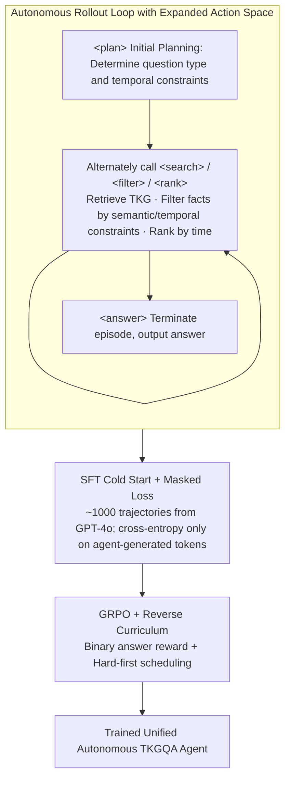

# Temp-R1: A Unified Autonomous Agent for Complex Temporal KGQA via Reverse Curriculum Reinforcement Learning

**Conference**: ACL 2026  
**arXiv**: [2601.18296](https://arxiv.org/abs/2601.18296)  
**Code**: https://github.com/zjukg/Temp-R1  
**Area**: LLM Agent / Temporal Knowledge Graph Question Answering  
**Keywords**: Temporal KGQA, Autonomous Agent, GRPO, Reverse Curriculum, Tool Calling

## TL;DR
Temp-R1 transforms Temporal Knowledge Graph Question Answering (TKGQA) from manually designed fixed prompt workflows into an autonomous agent trainable via reinforcement learning. By employing explicit internal actions, SFT cold start, GRPO, and a "hard-first" reverse curriculum, it outperforms strong baselines driven by GPT-4o/DeepSeek-V3 using an 8B open-source model.

## Background & Motivation
**Background**: Temporal Knowledge Graph Question Answering (TKGQA) requires models to answer questions based on fact quadruplets with timestamps. This involves retrieving entity relationships while processing chronological orders, time intervals, multi-hop dependencies, and answer granularity. Recent LLM methods typically decompose the task into fixed modules like decomposers, planners, retrievers, and generators, linked by multiple carefully designed prompts.

**Limitations of Prior Work**: Fixed workflows achieve decent short-term results but suffer from high costs and poor flexibility. They often rely on closed-source APIs like GPT-4o or DeepSeek-V3, leading to escalating costs over multi-turn calls for complex questions. Furthermore, manually prescribed processes restrict the model's exploration paths, making it difficult to dynamically adjust reasoning steps for different question types.

**Key Challenge**: TKGQA requires open-ended, multi-step, variable-length temporal reasoning, yet existing methods lock the reasoning process within fixed prompt templates. While standard ReAct-style agents possess tool-calling capabilities, they tend to cram all internal reasoning into a single `<think>` block, leading to excessive cognitive load under complex temporal constraints.

**Goal**: The authors aim to train a small open-source model that can autonomously decide when to plan, retrieve, filter temporal constraints, rank facts, and output answers, while avoiding being misled by simple questions during early RL training.

**Key Insight**: This paper formulates TKGQA as an MDP: the state consists of the original question and the historical interaction trajectory; actions include external `<search>` and internal `<plan>`, `<filter>`, and `<rank>`, ending with `<answer>`. Thus, temporal reasoning is no longer a hard-coded prompt flow but a sequence of actions learned by a policy model.

**Core Idea**: First, teach the model valid action formats using a small number of high-quality trajectories. Then, train it using GRPO under verifiable answer rewards, employing a hard-first reverse curriculum that forces the model to learn complex tool chains before transferring to simpler questions.

## Method
The core of Temp-R1 is not a new retriever but a shift in the control paradigm for TKGQA. Traditional methods follow a "decompose-then-retrieve-then-generate" pipeline where models fill predefined slots. Temp-R1 allows the model to choose its actions. It can plan question types and temporal constraints, search the TKG, filter facts that do not satisfy temporal conditions, rank facts chronologically if necessary, and finally provide an answer. This process preserves tool-use interpretability while allowing different trajectories for different questions.

### Overall Architecture
The paper defines a temporal KG: facts are $(s,p,o,t)$ quadruplets, where $s/o$ are entities, $p$ is a relation, and $t$ is a timestamp. The goal of TKGQA is to infer entity or time answers based on a question $q$ and relevant temporal facts.

In the agent MDP, the state is $s_t=(q,h_t)$, where $h_t$ records actions and observations up to the current step. The action space is divided into internal and external actions. Internal actions include `<plan>`, `<filter>`, and `<rank>`, responsible for initial planning, filtering facts by semantic/temporal constraints, and ranking facts chronologically, respectively. External actions include `<search>` to call the TKG retriever; `<answer>` terminates the episode. Combined, the training process follows three steps: rollout to form executable trajectories, SFT cold start to learn formats and basic policies, and RL optimization using GRPO with reverse curriculum.

### Key Designs

**1. Autonomous Rollout Loop with Expanded Action Space: Decomposing complex temporal reasoning into observable, optimizable action sequences**

Fixed workflows cram all implicit reasoning into one `<think>` tag, which often results in confusion under complex temporal constraints, and RL cannot separately reward different steps. Temp-R1 provides explicit actions: each response must start with `<plan>` for initial planning, followed by alternating `<search>` for TKG retrieval, `<filter>` for screening facts by semantics and time, and `<rank>` for chronological ordering. Each step falls into an observable token segment, allowing RL to provide signals for specific tool uses rather than just the final answer. The history $h_t$ in state $s_t=(q,h_t)$ records all previous actions and observations, guiding the model on whether to continue planning, retrieve, or finish.

**2. SFT Cold Start + Masked Loss: Teaching valid formats before RL exploration**

Directly applying RL to a base model results in illegal tags, meaningless searches, or chaotic reasoning, leading to KL divergence spikes and training instability. The authors use GPT-4o to construct ~1000 high-quality $(q,\tau_{gold})$ trajectories, filter out invalid structures or semantic errors, and perform SFT cold start. Crucially, the loss is calculated only on tokens generated by the agent; system prompts, user questions, and retrieved observations are masked. The model learns "how to write actions" without being distracted by environment text, providing a stable initial policy.

**3. GRPO + Reverse Curriculum: Learning flexible policies with verifiable rewards and preventing shortcuts with hard-first logic**

The reward uses a simple binary signal: 1 for an exact match with the gold answer, and 0 otherwise. This is naturally suited for verifiable tasks like KGQA, eliminating the cost of a reward model. For each question, a group of trajectories is sampled, and rewards are normalized into advantage using group mean and standard deviation to optimize the GRPO objective with KL regularization. The critical component is the training schedule: standard easy-first curriculum allows models to quickly learn a `<search>→<answer>` shortcut, failing to combine `<filter>`/`<rank>` for complex queries. The hard-first reverse curriculum does the opposite, feeding multi-hop/multi-constraint questions early. Only when accuracy exceeds a threshold are simple questions added, forcing the agent to master the full toolchain before transferring to simpler scenarios.

### Mechanism Example: Agent Trajectory
For a multi-hop question with chronological constraints (e.g., "In what year did X win an award after holding a certain position?"), Temp-R1 does not answer immediately. It uses `<plan>` to identify it as a "multi-constraint + temporal ranking" problem requiring the position's start time. Then, it uses `<search>` to retrieve facts for X, `<filter>` to remove award facts earlier than the position's start, `<rank>` to order the remaining facts and select the earliest, and finally `<answer>` to output the year. For simple questions, it might navigate directly from `<plan>` to `<search>→<answer>`. This adaptive behavior is observed in ablations, where `<think>` steps increase from 1.36 to 2.93 and `<search>` from 1.33 to 1.92 for complex tasks.

### Loss & Training
The SFT stage optimizes masked cross-entropy, applying loss only on action and reasoning tokens. The RL stage uses GRPO, with the trajectory ratio $\rho_i(\theta)=\frac{\pi_\theta(\tau_i|q)}{\pi_{old}(\tau_i|q)}$ and advantage $\hat A_i=\frac{r_i-mean(\{r_k\})}{std(\{r_k\})+\eta}$, where reward $r_i$ is a binary match signal. Implementation-wise, the authors fine-tune Llama3.1-8B-Instruct using an E5 retriever similar to Search-R1. GRPO utilizes only ~9% of the unlabeled QA pairs from the MultiTQ training set.

## Key Experimental Results

### Main Results
MultiTQ is the core experiment. Temp-R1 is compared against TKG embedding methods, prompt-based LLM workflows, and fine-tuning based LLM methods using Hits@1.

| Method Type | Method | Overall | Multiple | Single | Entity | Time |
|----------|------|---------|----------|--------|--------|------|
| TKG embedding | EmbedKGQA | 0.206 | 0.134 | 0.235 | 0.290 | 0.001 |
| TKG embedding | MultiQA | 0.293 | 0.159 | 0.347 | 0.349 | 0.157 |
| Prompt-based LLM | TempAgent | 0.702 | 0.316 | 0.857 | 0.624 | 0.870 |
| Prompt-based LLM | RTQA | 0.765 | 0.424 | 0.902 | 0.692 | 0.942 |
| FineTune-based LLM | TimeR4 | 0.728 | 0.335 | 0.887 | 0.639 | 0.945 |
| FineTune-based LLM | PoK | 0.779 | 0.409 | 0.929 | 0.696 | 0.962 |
| **Ours** | **Temp-R1** | **0.780** | **0.550** | 0.888 | **0.714** | **0.969** |

In overall scores, Temp-R1 (0.780) slightly exceeds PoK (0.779). Importantly, it reaches 0.550 on complex "multiple" questions, significantly higher than PoK (0.409), RTQA (0.424), and MemoTime (0.459). The 19.8% **Gain** highlighted in the abstract primarily stems from complex categories, proving that autonomous action sequences alleviate the rigidity of fixed workflows.

| Dataset | Method | Overall | Simple | Medium | Complex | Note |
|--------|------|---------|--------|--------|---------|------|
| TimelineKGQA-Cron | RAG Baseline | 0.235 | 0.704 | 0.092 | 0.009 | Success on simple, fails on complex |
| TimelineKGQA-Cron | GPT-4o | 0.206 | 0.069 | 0.130 | 0.376 | Vanilla closed models struggle with structured TKGQA |
| TimelineKGQA-Cron | PoK | 0.651 | 0.737 | 0.539 | 0.683 | Strong FT baseline |
| TimelineKGQA-Cron | Temp-R1 | 0.705 | 0.960 | 0.486 | 0.672 | Best overall, massive lead in "simple" |
| TimelineKGQA-ICEWS Actor | GPT-4o | 0.113 | 0.051 | 0.035 | 0.353 | Poor performance in specialized OOD domains |
| TimelineKGQA-ICEWS Actor | PoK | 0.602 | 0.744 | 0.456 | 0.578 | Strong OOD baseline |
| TimelineKGQA-ICEWS Actor | Temp-R1 | 0.642 | 0.866 | 0.388 | 0.595 | Lead maintained in OOD overall |

TimelineKGQA results demonstrate that Temp-R1 does not merely overfit MultiTQ. In the ICEWS Actor OOD setting, its overall score of 0.642 outperforms PoK (0.602) while GPT-4o only achieves 0.113, showing that small open-source agents with task-specific RL can be more stable than general-purpose closed models.

### Ablation Study
Ablations on MultiTQ removing internal actions, reverse curriculum, and SFT cold start:

| Configuration | Overall | Multiple | Single | Entity | Time | Main Conclusion |
|------|---------|----------|--------|--------|------|----------|
| Temp-R1 | 0.780 | 0.550 | 0.888 | 0.714 | 0.969 | Full model |
| w/o internal actions | 0.620 | 0.388 | 0.729 | 0.563 | 0.783 | Reasoning burden returns to implicit `<think>` |
| w/o Reverse CL | 0.556 | 0.143 | 0.750 | 0.447 | 0.868 | Largest drop; multiple-choice performance collapses |
| w/o SFT | 0.582 | 0.325 | 0.703 | 0.536 | 0.713 | RL struggles to learn stable formats and toolchains |

### Key Findings
- **Reverse Curriculum is the most critical training strategy**. Removing it drops the overall score from 0.780 to 0.556 and "Multiple" from 0.550 to 0.143, as easy-first or mixed training causes the model to settle for simple search shortcuts.
- **Internal actions are capability carriers, not cosmetic formatting**. Removing `<filter>`/`<rank>` severely degrades temporal constraint handling even if `<search>` remains.
- **Model scale remains important**. Qwen 7B peaks at ~0.790 accuracy, while 1.5B only reaches 0.532. However, both Llama and Qwen architectures benefit, showing backbone independence.
- **Trajectory complexity adapts to question difficulty**. In complex questions, `<think>` steps increase from 1.36 to 2.93 and `<search>` from 1.33 to 1.92, satisfying agent behavior expectations.

## Highlights & Insights
- This paper's primary value is reframing the TKGQA prompt pipeline as a policy learning problem. It avoids hard-coding modules, allowing the model to learn when to use specific internal actions.
- The **hard-first reverse curriculum** is highly suitable for tool-based agents. Many agent tasks have a structure where "simple samples can be solved via shortcuts, but complex samples require combined tools." Training on hard problems first reduces shortcut learning.
- **Binary answer rewards**, while simple, are effective for verifiable tasks like KGQA. They eliminate reward model costs and allow GRPO to directly optimize for answer correctness.

## Limitations & Future Work
- The experiments capped at 8B models, with no verification on 14B or larger models, which might further improve complex temporal reasoning despite increased training costs.
- The generalizability of reverse curriculum to non-TKGQA tasks remains unproven. For tasks without clear easy/hard distinctions or high noise in hard samples, hard-first training might be unstable.
- Rewards only consider the final answer, failing to distinguish between "correct process with wrong format" and "wrong process with a lucky hit." Future work could incorporate trajectory-level rewards.
- The current retriever and datasets are fixed. Real-world open environments with incomplete TKGs and inconsistent temporal granularities will be more challenging.

## Related Work & Insights
- **vs TempAgent / MemoTime / RTQA**: These rely on manual decomposition and generation flows. Temp-R1 uses action spaces and RL to learn dynamic trajectories, offering greater flexibility.
- **vs Search-R1**: While Search-R1 proved RL + search is effective for general QA, Temp-R1 extends this to TKGQA with temporal-specific actions like `<filter>` and `<rank>`.
- **vs PoK / TimeR4**: These are strong fine-tuning baselines for TKGQA. Temp-R1 trains a full agent policy rather than just fine-tuning answer generation, leading to better OOD performance.
- **Insight**: For verifiable structured reasoning tasks, task-specific intermediate operations can be explicitly defined as action tokens and learned via small-scale SFT and RL, rather than relying on pure natural language chain-of-thought.

## Rating
- **Novelty**: ⭐⭐⭐⭐ Systematically integrates GRPO, autonomous tool calling, and reverse curriculum for TKGQA with high task alignment.
- **Experimental Thoroughness**: ⭐⭐⭐⭐ Includes main results, OOD, ablations, scale analysis, and trajectory analysis; needs more verification on larger models and noisy KGs.
- **Writing Quality**: ⭐⭐⭐⭐ Clear structure and rich tables; some training details are in the appendix.
- **Value**: ⭐⭐⭐⭐ Strong reference for temporal KGQA and verifiable agent training, particularly the transferability of the hard-first curriculum.

<!-- RELATED:START -->

## Related Papers

- [\[ICLR 2026\] Memory-T1: Reinforcement Learning for Temporal Reasoning in Multi-session Agents](../../ICLR2026/llm_agent/memory-t1_reinforcement_learning_for_temporal_reasoning_in_multi-session_agents.md)
- [\[ICLR 2026\] Tree Search for LLM Agent Reinforcement Learning](../../ICLR2026/llm_agent/tree_search_for_llm_agent_reinforcement_learning.md)
- [\[ACL 2026\] Hierarchical Reinforcement Learning with Augmented Step-Level Transitions for LLM Agents](hierarchical_reinforcement_learning_with_augmented_step-level_transitions_for_ll.md)
- [\[CVPR 2026\] CGL: Advancing Continual GUI Learning via Reinforcement Fine-Tuning](../../CVPR2026/llm_agent/cgl_advancing_continual_gui_learning_via_reinforcement_fine-tuning.md)
- [\[ACL 2026\] OctoTools: An Agentic Framework with Extensible Tools for Complex Reasoning](octotools_an_agentic_framework_with_extensible_tools_for_complex_reasoning.md)

<!-- RELATED:END -->
