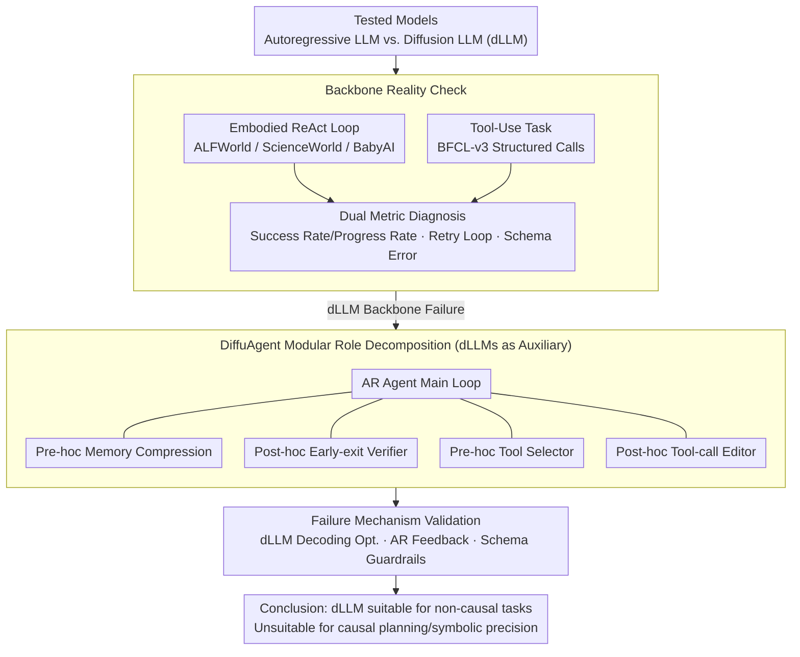

# The Bitter Lesson of Diffusion Language Models for Agentic Workflows: A Comprehensive Reality Check

**Conference**: ACL2026  
**arXiv**: [2601.12979](https://arxiv.org/abs/2601.12979)  
**Code**: None  
**Area**: Agent / Diffusion Language Models  
**Keywords**: Diffusion Language Models, Agents, Tool Call, Long-horizon Planning, DiffuAgent  

## TL;DR
This paper systematically evaluates the performance of diffusion language models (dLLMs) in embodied and tool-use agents. It finds that despite the speed potential offered by parallel decoding, dLLMs significantly lag behind autoregressive (AR) LLMs in long-horizon causal planning and strict format generation. Furthermore, the authors utilize DiffuAgent to demonstrate that dLLMs are better suited as non-causal auxiliary modules, such as for memory compression and tool filtering.

## Background & Motivation
**Background**: LLM agents have become the mainstream paradigm in ReAct-style embodied tasks, tool calling, and interactive decision-making. Typical systems place the language model at the center of a loop, reading historical trajectories, environmental feedback, or tool descriptions at each step to generate the next "thought" and "action." While powerful, this workflow is naturally limited by autoregressive decoding; as multi-turn tasks grow longer, latency and inference costs become increasingly significant.

**Limitations of Prior Work**: dLLMs update multiple tokens simultaneously through parallel denoising, theoretically breaking the token-by-token generation bottleneck. However, agent scenarios do not merely require "writing text quickly"; they demand that the model can revise plans based on the latest feedback, maintain state consistency across multiple interactions, and output perfectly valid JSON or function call formats. While existing dLLMs perform close to same-scale LLMs on general language benchmarks, systematic verification of their ability to serve as agent backbones is lacking.

**Key Challenge**: The advantage of dLLMs stems from non-autoregressive parallel generation, whereas the critical capabilities of agents often derive from causal, incremental, and error-correctable decision-making processes. Embodied tasks require the model to strictly constrain new observations into the next action, and tool use requires every bracket, field name, and parameter value to be precisely placed. Bidirectional attention and blurred intermediate states during parallel denoising might specifically weaken these two types of capabilities.

**Goal**: The authors aim to answer three questions: First, can current dLLMs directly serve as the backbone for embodied and tool-use agents? Second, are their failures accidental fluctuations or systematic patterns? Third, if they cannot serve as backbones, can dLLMs still undertake auxiliary cognitive roles in agentic workflows?

**Key Insight**: Instead of looking only at single-turn QA, the paper selects ALFWorld, ScienceWorld, and BabyAI from AgentBoard, alongside BFCL-v3 tool-use tasks, to observe behaviors in realistic multi-turn closed loops. This perspective is vital because a dLLM's ability to generate short text does not expose agent-level defects like "repeatedly hitting a wall" or "execution failure due to a single character error in formatting."

**Core Idea**: Through unified experiments, dLLMs are placed in both agent backbone and auxiliary module positions to prove that "diffusion parallel generation is suitable for non-causal compression and filtering, but unsuitable for the causal planning and symbolic precision required by current agents."

## Method
The method does not involve proposing a single training algorithm but rather constructing a reality check and modular diagnostic framework. The authors first treat dLLMs as complete agent backbones, directly replacing AR LLMs like Qwen-8B and Ministral-8B to observe their success or failure. Subsequently, the authors propose DiffuAgent, which deconstructs dLLMs into modules for memory, verification, tool selection, and format editing to analyze which cognitive roles they are fit for.

### Overall Architecture
The overall process is divided into two layers.

The first layer is a **backbone reality check**. Embodied tasks use a ReAct workflow where the model generates intermediate thoughts $q_t$ and actions $a_t$ at step $t$ based on historical actions and observations $e_{1:t-1}$ and the task description $u_{task}$. Tool-use tasks provide the user request and a tool library; the model must output a set of structured calls $\mathcal{C}=\{(\tau_i,\alpha_i)\}$, which are then processed by a tool executor. The authors compare Qwen-8B and Ministral-8B against LLaDA-8B, Dream-7B, FdLLM-7B, and DVar-8B.

The second layer is the **DiffuAgent modular evaluation**. Instead of letting dLLMs control the entire loop, they are embedded as pluggable cognitive modules on the periphery of an AR agent. For the embodied side, this includes a pre-hoc memory and a post-hoc early-exit verifier; for the tool-use side, it includes a pre-hoc tool selector and a post-hoc tool-call editor. This allows for distinguishing between "backbone failure" and "unusable specific local capabilities."

### Key Designs

**1. Backbone Reality Check: Direct evaluation of long-horizon planning and tool use.**  
To distinguish whether dLLMs are simply "weaker" or if their "interaction mechanism is fundamentally broken," the authors use them as backbones in a ReAct loop and utilize complementary metrics to diagnose issues. In embodied tasks (ALFWorld/ScienceWorld/BabyAI), success rate measures completion, while progress rate measures how much of the target was reached. In tool use (BFCL-v3), function names, parameters, structures, and multi-turn states are checked. The authors also track "retry loops"—repeating the same action for more than three steps—to identify cases where dLLMs ignore new observations.

**2. DiffuAgent Modular Role Decomposition: Downgrading dLLMs to auxiliary modules.**  
Since they fail as backbones, are specific local capabilities still useful? dLLMs are embedded as modular components. On the embodied side: a pre-hoc memory compresses trajectories every $k_{mem}=5$ steps; a post-hoc early-exit verifier predicts if a loop is stuck every $k_{earlyexit}=5$ steps. On the tool side: a pre-hoc selector filters relevant tools from the library, and a post-hoc editor attempts to fix malformed calls. This separates "backbone failure" from "local utility," testing dLLM value in tasks not requiring token-by-token commitment.

**3. Failure Mechanism Validation: Ruling out "poor decoding" as an explanation.**  
The authors test various remedies: dLLM decoding optimizations like APD, D2F, and DCD; AR self-refine and periodic AR feedback; and mock Tau-Bench with lightweight schema guardrails. These experiments investigate if such techniques can elevate dLLMs to AR agent levels. While they improve local metrics (e.g., D2F raising Dream-7B's BFCL Single-Live from 1.5 to 34.3), they do not resolve the fundamental bottlenecks in long-horizon causal planning and symbolic precision.

### Loss & Training
This paper does not train new dLLMs or propose new supervised losses. The focus is on inference-only evaluation. AR models are deployed via vLLM; dLLMs are implemented using Fast-dLLM/FastAPI, running on a single NVIDIA A800 80GB. Embodied tasks use ReAct prompts; BFCL uses official templates to construct OpenAI API-style inputs.

## Key Experimental Results

### Main Results
Embodied task results are stark: AR Qwen-8B achieves an average success rate of 45.0%, while the best dLLM, LLaDA-8B, reaches only 7.5%; DVar-8B scores just 2.0%. Progress rates follow the same trend, indicating dLLMs struggle even with intermediate sub-goals.

| Model | ALFWorld SR | ScienceWorld SR | BabyAI SR | Avg SR | Avg Progress |
|-------|-------------|------------------|-----------|--------|--------------|
| Qwen-8B | 76.1 | 26.7 | 32.1 | 45.0 | 62.1 |
| Ministral-8B | 45.5 | 13.3 | 36.6 | 31.8 | 54.9 |
| LLaDA-8B | 5.2 | 1.1 | 16.1 | 7.5 | 16.4 |
| Dream-7B | 0.7 | 0.6 | 8.9 | 3.4 | 8.7 |
| FdLLM-7B | 3.3 | 0.7 | 5.4 | 3.1 | 8.9 |
| DVar-8B | 0.7 | 0.0 | 5.4 | 2.0 | 8.9 |

Tool-use experiments also show a massive gap. While Qwen-8B reaches 57.8% overall in BFCL, DVar-8B (the top dLLM) only hits 28.0%. Crucially, all dLLMs scored 0.0% in multi-turn tool calling, indicating inability to maintain state and format stability.

| Model | Non-Live | Single-Turn Live Avg. | Multi-Turn Avg. | Hallucination Rel. | Hallucination Irrel. | Overall |
|-------|----------|-----------------------|-----------------|--------------------|----------------------|---------|
| Qwen-8B | 87.5 | 78.0 | 12.5 | 94.4 | 68.0 | 57.8 |
| Ministral-8B | 49.8 | 60.0 | 4.0 | 66.7 | 58.0 | 39.5 |
| LLaDA-8B | 23.0 | 11.6 | 0.0 | 66.7 | 56.0 | 19.4 |
| Dream-7B | 4.2 | 1.5 | 0.0 | 27.8 | 77.0 | 13.6 |
| FdLLM-7B | 1.2 | 0.0 | 0.0 | 5.6 | 99.0 | 15.0 |
| DVar-8B | 35.0 | 34.1 | 0.0 | 44.4 | 63.0 | 28.0 |

### Ablation Study
DiffuAgent results show more nuance. While weak as backbones, dLLMs significantly aid AR agents as memory modules. With a Qwen-8B agent, using LLaDA-8B as a memory module (40.5% SR) outperforms using Qwen-8B itself (34.9%). This suggests dLLM global compression is effective in non-causal roles like "summarizing history."

| Agent | Memory Module | Avg SR | Avg Progress | Note |
|-------|---------------|--------|--------------|------|
| Qwen-8B | w/o | 28.4 | 50.6 | Recent interaction only |
| Qwen-8B | Qwen-8B | 34.9 | 54.8 | AR memory gain |
| Qwen-8B | LLaDA-8B | 40.5 | 59.6 | Best setting |
| Qwen-8B | Dream-7B | 38.9 | 57.3 | Outperforms AR memory |

Tool-use ablations show dLLMs are better selectors than editors. LLaDA-8B as a selector (12.5% multi-turn) remains somewhat effective, but dLLM editors largely fail (0.0% to 2.0%), highlighting their struggle with strict schema repair.

| Main Agent | Selector | Editor | BFCL Multi-Turn Avg. | Insight |
|------------|----------|--------|----------------------|---------|
| Qwen-8B | Qwen-8B | - | 18.5 | AR selector is strongest |
| Qwen-8B | LLaDA-8B | - | 12.5 | dLLM is a viable selector |
| Qwen-8B | - | LLaDA-8B | 16.0 | LLaDA as editor is okay |
| Qwen-8B | - | FdLLM-7B | 2.0 | Format editing fails |

### Key Findings
- Efficiency advantages in dLLMs do not translate to agent success. While FdLLM-7B and DVar-8B have high throughput, embodied SR is below 3.1% and multi-turn tool use is 0.0%.
- Embodied failure is characterized by **retry loops**. Models repeat old actions despite new observations, failing to map feedback to new plans during parallel denoising.
- Tool-use failure is characterized by **schema and parameter errors**. dLLMs often identify the correct tool but generate broken brackets or incorrect keys, rendering the output unparsable.
- dLLM roles are naturally limited to **non-causal modules**. They perform well in memory compression and tool filtering but fail in backbone decision-making and format editing.

## Highlights & Insights
- The primary value of this paper is re-evaluating the "dLLMs are faster" narrative within agent loops. Speed only matters if the action is valid; if every step is a repeat or an error, high throughput just generates invalid trajectories faster.
- The deconstruction of agent capabilities into different cognitive roles in DiffuAgent is insightful. It demonstrates that dLLMs aren't useless for agents; they are simply unfit for the central causal backbone role in current paradigms.
- The concepts of "non-causal" and "fuzzy" failures are highly explanatory. One corresponds to the inability to branch in embodied tasks, while the other corresponds to schema collapse in tool use.

## Limitations & Future Work
- Benchmark coverage is still limited (mainly AgentBoard and BFCL). It remains to be seen how dLLMs perform in web agents, code repair, or software engineering.
- The focus is solely on inference-only. The study does not address whether training on agent trajectories or co-designing diffusion-native workflows could lead to qualitative improvements.
- If future agent frameworks are redesigned specifically for diffusion generation, the conclusions here may need re-evaluation.

## Related Work & Insights
- **vs. LLaDA / Dream**: These works emphasize general performance/efficiency. This paper tests them in agents to show that general benchmark competitiveness does not equal agent viability.
- **vs. ReAct / AgentBoard**: Inherits the thought-action loop but extends the subject to dLLMs, identifying unique behaviors like retry loops.
- **vs. BFCL**: Attributes failures to symbolic precision issues under diffusion noise and shows that guardrails cannot fix deep semantic/structural errors.

## Rating
- Novelty: ⭐⭐⭐⭐☆ Timely topic; shifts focus from general generation to the agentic reality check.
- Experimental Thoroughness: ⭐⭐⭐⭐☆ Comprehensive main experiments and modular deconstructions.
- Writing Quality: ⭐⭐⭐⭐☆ Clear "bitter lesson" narrative.
- Value: ⭐⭐⭐⭐⭐ Highly important caveat for the diffusion LLM and agent communities; clearly delineates the roles dLLMs should play.

<!-- RELATED:START -->

## Related Papers

- [\[CVPR 2026\] Towards GUI Agents: Vision-Language Diffusion Models for GUI Grounding](../../CVPR2026/llm_agent/towards_gui_agents_vision-language_diffusion_models_for_gui_grounding.md)
- [\[ACL 2026\] Dynamic Generation of Multi-LLM Agents Communication Topologies with Graph Diffusion Models](dynamic_generation_of_multi-llm_agents_communication_topologies_with_graph_diffu.md)
- [\[ACL 2026\] Don't Adapt Small Language Models for Tools; Adapt Tool Schemas to the Models](don39t_adapt_small_language_models_for_tools_adapt_tool_schemas_to_the_models.md)
- [\[ACL 2026\] Lightweight LLM Agent Memory with Small Language Models](lightweight_llm_agent_memory_with_small_language_models.md)
- [\[ICLR 2026\] Agentic Context Engineering: Evolving Contexts for Self-Improving Language Models](../../ICLR2026/llm_agent/agentic_context_engineering_evolving_contexts_for_self-improving_language_models.md)

<!-- RELATED:END -->
