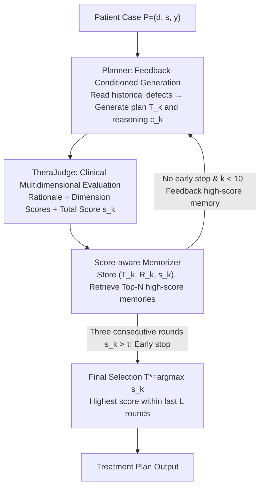

# TheraAgent: Self-Improving Therapeutic Agent for Precise and Comprehensive Treatment Planning

**Conference**: ACL 2026  
**arXiv**: [2605.05963](https://arxiv.org/abs/2605.05963)  
**Code**: None  
**Area**: LLM Agent / Medical AI / Treatment Plan Generation  
**Keywords**: Self-improving agent, treatment planning, TheraJudge, clinical safety, test-time iteration  

## TL;DR
TheraAgent transforms treatment plan generation from a one-shot response into a generate-reflect-refine self-improving agent workflow. By utilizing a clinical multidimensional evaluator, TheraJudge, and score-aware memory to continuously refine plans, it significantly outperforms strong baselines in the HealthBench treatment planning subset and blind physician evaluations.

## Background & Motivation
**Background**: LLMs are already capable of medical Q&A, diagnostic assistance, and clinical text generation. However, treatment plan generation is more complex than single-step Q&A. It requires the simultaneous selection of medications, dosages, indications, contraindications, monitoring indicators, follow-up plans, and risk controls.

**Limitations of Prior Work**: General-purpose LLMs or medically fine-tuned models often adopt one-shot generation. One-off outputs tend to be superficial, incomplete, or even pose safety risks, such as missing dosages, ignoring contraindications, or failing to specify when to stop or escalate treatment.

**Key Challenge**: In practice, doctors formulate treatment plans by repeatedly checking diagnoses, guidelines, patient conditions, and potential harms, whereas most LLMs provide a merely fluent textual answer. Treatment plan quality is not a single accuracy metric but a combinatorial optimization of multiple clinical dimensions.

**Goal**: The authors aim to construct a therapeutic agent capable of self-improvement during inference. The model generates an initial draft, which a clinical evaluator then critiques. The model then uses this feedback to refine the plan, progressively achieving a more precise, complete, and safe treatment solution.

**Key Insight**: The paper formalizes treatment plan quality as $Q(T\mid P)=\sum_i q_i(T\mid P)$, where each $q_i$ corresponds to dimensions such as Accuracy, Targeting, Completeness, and Harm Control. This provides an objective function for subsequent multidimensional feedback and memory retrieval.

**Core Idea**: An internal critic aligned with clinical standards is used as the feedback source in the reasoning loop, transforming "writing a treatment plan" into a test-time optimization process of "generation, evaluation, memory, and re-generation."

## Method
The core of TheraAgent is not training a new medical model but designing an agentic workflow. The base model can be a strong reasoning model like DeepSeek-R1. An outer system manages the Planner, TheraJudge, and Memorizer, allowing the model to incorporate errors and scores from previous plans over multiple reasoning rounds.

### Overall Architecture
Input consists of patient cases $P=(d,s,y)$, where $d$ is basic clinical information, $s$ represents symptoms and test results, and $y$ is the confirmed diagnosis. The goal is to generate a treatment plan $T$ and an explicit reasoning process $c$. Unlike closed-ended classification, treatment plans exist in an open combinatorial space and must satisfy accuracy, completeness, individualization, consensus consistency, and harm control.

In the $k$-th iteration, the Planner generates a candidate plan $T_k$ and reasoning $c_k$ based on case $P$ and the memory from the previous round $\mathcal{M}^{(k-1)}$. TheraJudge then evaluates the plan, outputting feedback rationale $R_k$, scores for each clinical dimension $\{q_{k,i}\}$, and a total score $s_k$. The Memorizer stores $(T_k, R_k, s_k)$ and retrieves high-quality historical plans and reflections in the next round as context for the Planner.

The final output is not simply the last round's answer but rather the highest-scoring version selected from the last $L$ rounds: $T^*=\arg\max s_k$. The system also features early stopping: if scores exceed a threshold $\tau$ for three consecutive rounds, the process stops to reduce unnecessary overhead. The paper defaults to a maximum of 10 rounds, an output window $L=3$, and a Top-N memory of 3.

### Key Designs

**1. Planner's Feedback-Conditioned Generation: Targeted Refinement**

The most common flaws in treatment plans are omitted items and unclear safety boundaries—forgetting dosages, missing contraindications, or failing to mention when to stop or escalate. Thus, the Planner does not just look at the current case; it reads the text, rationale, and scores of the previous round or high-scoring historical plans from the Memorizer, formalized as $(T_k, c_k)=f_{\theta}(P, \mathcal{M}^{(k-1)})$. By explicitly placing specific issues identified by TheraJudge back into the prompt, the next round of generation can focus on mending those gaps rather than producing another equally superficial plan.

**2. TheraJudge's Clinical Multidimensional Evaluation: Structured Feedback**

Standard LLM judges are easily deceived by fluent writing and superficial medical terminology. Treatment plans require a clinical critic capable of identifying specific risks and accountability. TheraJudge outputs rationales, dimension scores, and total scores based on dimensions such as Scientific Consensus Compliance, Plan Completeness, Situation Targeting, Rationale-Measure Coherence, and Harm Control. It can use RAG to retrieve over 600 clinical guidelines/literatures to strengthen evidence and use 3 few-shot expert examples per department to stabilize scoring behavior. Because the evaluation dimensions mirror a real physician's diagnostic framework, the feedback effectively informs the next round regarding safety and completeness gaps.

**3. Score-aware Memorizer and Final Selection: Retaining Useful Experience**

A common pitfall for self-improving agents is treating all history as experience; allowing errors from low-scoring plans back into the context can lead to error reinforcement and late-stage drift. The Memorizer stores each round as $M_i=(T_i, R_i, s_i)$. The next round only retrieves the Top-N highest-scoring entries for in-context refinement. The final output is selected by picking the highest-scoring $T^*=\arg\max s_k$ within the last $L$ rounds. Coupled with an early stopping mechanism (stopping when scores exceed $\tau$ for three consecutive rounds), this saves computation. The paper uses a maximum of 10 rounds, $L=3$, and Top-N=3.

### Key Experimental Results

### Main Results
The authors selected samples related to treatment planning from HealthBench, totaling 1,241 cases across Endocrinology (265), Gastroenterology (262), Neurology (395), and Respiratory (319). Representative model results and TheraAgent outputs are extracted below.

| Model | Overall ↑ | Global Health ↑ | Hedging ↑ | Context Seeking ↑ | Communication ↑ | Accuracy ↑ | Completeness ↑ | Context Awareness ↑ |
|------|-----------|-----------------|-----------|-------------------|------------------|------------|----------------|---------------------|
| DeepSeek-R1 | 42.94 | 39.53 | 48.85 | 39.02 | 48.16 | 41.89 | 47.29 | 31.97 |
| Gemini-2.5-Pro | 43.49 | 34.42 | 44.48 | 38.85 | 51.46 | 41.32 | 39.49 | 34.08 |
| Claude-4-Sonnet | 44.28 | 35.10 | 46.50 | 40.91 | 50.64 | 40.63 | 40.86 | 36.26 |
| TheraAgent | 48.94 | 47.49 | 55.63 | 44.65 | 55.29 | 44.80 | 51.72 | 37.16 |

TheraAgent's Overall score is 4.66 points higher than the runner-up, Claude-4-Sonnet. In specific dimensions, it is 2.91 points higher in Accuracy and 4.43 points higher in Completeness, indicating that iterative feedback effectively reduces medical errors and plan omissions.

### Ablation Study
The authors verified that the evaluator and memory mechanism are effective through various lenses. Ablations of TheraJudge on HealthBench show that few-shot examples and dimensional scoring are more critical than pure RAG. Memory ablations show that selecting the "top three highest-scoring memories" is superior to using all or only recent memories.

| Configuration | HealthBench Score ↑ | Description |
|------|---------------------|------|
| Base Model w/o Judge | 41.15 | Non-iterative baseline without a judge |
| Vanilla Judge | 48.50 | Standard evaluator brings significant improvement |
| Dimensions only | 48.66 | Dimensional scoring provides more specific feedback |
| Few-shots only | 50.62 | Expert examples best stabilize scoring behavior |
| RAG only | 45.98 | RAG alone has minor gains on HealthBench |
| Dimensions + Few-shots | 52.36 | Optimal combo balancing structure and stability |

| Memory Configuration | HealthBench Score ↑ | Insight |
|-------------|---------------------|------|
| w/o Memory | 41.15 | Degrades to a process lacking historical experience |
| All Memory | 48.59 | All history in context is helpful but noisy |
| Nearest Three Memory | 0.5002 | Recent memory continues to improve results |
| Best Three Memory | 0.5236 | Top three by score is most effective; quality filtering is key |

### Key Findings
- In blind physician evaluations using 35 physician-authored cases, TheraAgent was ranked as the best solution in 65.7% of cases, compared to 25.7% for DeepSeek-R1 and 8.6% for the original physician's plan.
- In pairwise comparisons with physician's plans, TheraAgent achieved an 86% win rate, particularly excelling in Targeting, Completeness, and Harm Control. This is attributed to the fact that real physician records often omit explicit thresholds and monitoring details due to workflow compression, which TheraAgent explicitly expands.
- TheraJudge's correlation with HealthBench is significantly higher than traditional text metrics (Spearman 0.6669, Pearson 0.7052). BLEU/ROUGE/BERTScore showed weak correlation.
- Cost is a significant trade-off. DeepSeek-R1 averages 1,358 tokens and 30.6s per call. TheraAgent (3 rounds) requires 6 calls, 13,445 tokens, and 332.6s (9.9x cost). At 10 rounds, it reaches 87,005 tokens and 753.5s (64.1x cost).

## Highlights & Insights
- The paper identifies the essence of medical scenarios: treatment planning is not just "answering medical knowledge" but generating safe decision drafts in an open space under multiple constraints.
- The value of TheraJudge lies not just in final evaluation, but in turning evaluation into an optimization signal for the next round. This is more like an internal agent controller than a typical end-of-chain LLM-as-a-judge.
- Score-aware memory is a crucial practical detail. If errors from low-scoring plans repeatedly enter the context, they can reinforce incorrect logic.
- The observation that TheraAgent outperformed physician's plans in blind tests should be interpreted carefully: it suggests physician records are often abbreviated working documents rather than a lack of clinical skill. TheraAgent is positioned as a structured draft and safety reminder, not a replacement for doctors.

## Limitations & Future Work
- Inference cost is very high, particularly for the 10-round version. This may be acceptable for high-risk planning but less so for emergency or low-resource settings.
- Validation primarily relied on strong models (DeepSeek-R1, GPT-4o). Benefits for smaller or local proprietary models require further assessment.
- Input is currently text-based. It does not yet incorporate time-series lab data, imaging, or structured EHR data directly.
- TheraJudge itself can produce errors. It is not a clinical gold standard; real-world deployment must involve physician oversight and local guideline adaptation.

## Related Work & Insights
- **vs MedPlan**: MedPlan is more of a phase-based/RAG system; TheraAgent focuses on multi-round self-improvement and internal judge feedback.
- **vs TxAgent**: TxAgent emphasizes treatment reasoning and tool ecosystems, while TheraAgent focuses on iterative evaluation and rewriting of plan text.
- **vs General self-reflection agents**: While general agents use free-form self-critique, TheraAgent constrains reflection to clinical dimensions, guidelines, and expert examples, making it suitable for safety-sensitive domains.

## Rating
- Novelty: ⭐⭐⭐⭐☆ Systematizes self-improving agents for treatment planning; the TheraJudge + Memory combo is highly practical.
- Experimental Thoroughness: ⭐⭐⭐⭐☆ Covers HealthBench, blind physician tests, judge agreement, and cost, though multi-modal clinical input is missing.
- Writing Quality: ⭐⭐⭐⭐☆ Clear motivation and framework; case analyses are persuasive.
- Value: ⭐⭐⭐⭐⭐ Highly relevant for the safe deployment of medical LLM agents, especially the inclusion of clinical evaluators in the reasoning loop.

<!-- RELATED:START -->

## Related Papers

- [\[CVPR 2026\] Learning to Adapt: Self-Improving Web Agent via Cognitive-Aware Exploration](../../CVPR2026/llm_agent/learning_to_adapt_self-improving_web_agent_via_cognitive-aware_exploration.md)
- [\[ICLR 2026\] Agentic Context Engineering: Evolving Contexts for Self-Improving Language Models](../../ICLR2026/llm_agent/agentic_context_engineering_evolving_contexts_for_self-improving_language_models.md)
- [\[ICLR 2026\] EvoTest: Evolutionary Test-Time Learning for Self-Improving Agentic Systems](../../ICLR2026/llm_agent/evotest_evolutionary_test-time_learning_for_self-improving_agentic_systems.md)
- [\[ICLR 2026\] Darwin Gödel Machine: Open-Ended Evolution of Self-Improving Agents](../../ICLR2026/llm_agent/darwin_gödel_machine_open-ended_evolution_of_self-improving_agents.md)
- [\[ICLR 2026\] Huxley-Gödel Machine: Human-Level Coding Agent Development by an Approximation of the Optimal Self-Improving Machine](../../ICLR2026/llm_agent/huxley-godel_machine_human-level_coding_agent_development_by_an_approximation_of.md)

<!-- RELATED:END -->
