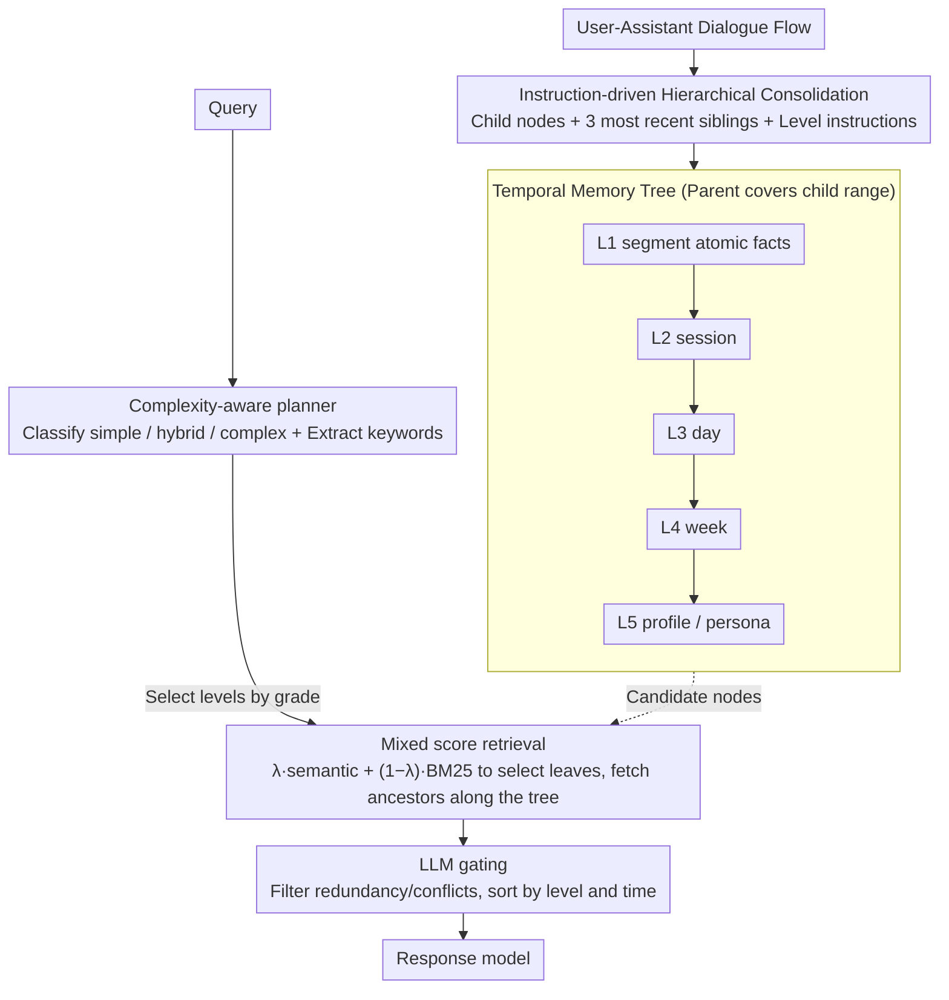

# TiMem: Temporal-Hierarchical Memory Consolidation for Long-Horizon Conversational Agents

**Conference**: ACL2026 Findings  
**arXiv**: [2601.02845](https://arxiv.org/abs/2601.02845)  
**Code**: https://github.com/TiMEM-AI/timem  
**Area**: LLM Efficiency / Long-term Memory / Conversational Agents  
**Keywords**: Temporal-Hierarchical Memory, Long-horizon Conversational Agents, Memory Compression, Adaptive Retrieval, Personalization

## TL;DR
TiMem organizes long-range conversational memory into a five-layer Temporal Memory Tree with explicit temporal containment. By employing complexity-aware retrieval to dynamically balance fine-grained facts and high-level personas, it improves accuracy on LoCoMo and LongMemEval-S while significantly reducing recalled context length.

## Background & Motivation
**Background**: Long-range conversational agents must maintain consistent persona understanding and factual memory across multiple turns, days, or even weeks of interaction. Common approaches typically follow two routes: expanding the model's context window or compressing KV/hidden states, or utilizing external memory as persistent storage managed via embedding retrieval, clustering, graph structures, or OS-style memory tiers.

**Limitations of Prior Work**: These methods often treat "semantic similarity" as the primary organizational principle, with time being a secondary attribute. Consequently, similar segments spanning long intervals may be conflated, leading to a lack of clear evidentiary chains between short-term events and long-term preferences. Furthermore, if high-level summaries replace original segments too early, factual details necessary for specific queries are lost.

**Key Challenge**: Long-range memory requires both compression to prevent the continuous expansion of context length and retrieval costs, and the preservation of temporal continuity to avoid breaking down persona, preferences, and event causality into fragmented pieces. The problem is not merely "how much to recall," but "how to organize temporally adjacent and hierarchically related memories into a retrievable structure."

**Goal**: The authors aim to construct a plug-and-play memory framework that requires no additional fine-tuning and can be integrated with different LLM backends. It should be capable of distilling session, day, week, and profile representations from raw dialogue and selecting the appropriate level based on query complexity.

**Key Insight**: Drawing from memory consolidation in cognitive science, the paper proposes gradually transforming short-term episodic memory into stable semantic/persona memory. A key observation is that dialogue history is naturally chronological. Therefore, the memory hierarchy should first satisfy temporal containment before undergoing semantic integration at each level.

**Core Idea**: Utilize a Temporal Memory Tree to partition long conversations into a memory tree that is "strictly nested temporally and hierarchically abstracted semantically." Query complexity then determines which levels to recall, balancing accuracy, personalization, and context costs.

## Method

### Overall Architecture
TiMem addresses the dilemma of "compressing while preserving temporal evidence" in long-range conversations. Instead of training new models, it splits the system into two LLM prompt-driven stages: during writing, the growing user-assistant dialogue stream is distilled into a temporal hierarchical tree; during querying, nodes matching the query complexity are extracted from this tree.

In the writing stage, each turn or short segment of dialogue is first converted into a bottom-layer factual segment, then merged bottom-up into five levels: session, day, week, and profile. Each node contains a time interval and textual memory, with a strict constraint that a parent's time interval must cover all its children. This ensure that any bottom-level fact can be traced back up the tree to its corresponding long-term pattern or persona. In the query stage, three steps are followed: first, a recall planner classifies the query as simple, hybrid, or complex and extracts keywords; next, candidate leaves are selected from L1 bottom-level memory using a hybrid score of semantic similarity and BM25, and ancestor nodes are recalled along the tree; finally, LLM gating filters redundant or conflicting candidates, which are then sorted by level and temporal distance before being sent to the response model.

### Key Designs

**1. Temporal Memory Tree: Using temporal containment as the memory backbone instead of semantic clustering**

Many memory systems store timestamps but rely on similarity for aggregation, which conflates similar segments from different times and loses specific evidence for long-term profiles. TiMem elevates time from an attribute to a structural constraint: each memory node $m$ stores a time interval $\tau(m)$ and semantic text $\sigma(m)$. Parent-child edges strictly require the parent's interval to cover the child's. Thus, L1 segment, L2 session, L3 day, L4 week, and L5 profile are stacked sequentially. Higher levels contain fewer, more abstracted nodes. Since long-range personalization often depends on "how an event settles into a preference or persona clue," this explicit temporal containment ensures high-level personas are linked to traceable temporal evidence, avoiding misalignment from pure semantic clustering.

**2. Instruction-driven Hierarchical Consolidation: Compressing while retaining recent history**

Retaining only raw dialogue causes retrieval costs to explode, while retaining only summaries loses factual details needed for specific questions. TiMem uses a set of hierarchical consolidators to balance these: the consolidator for level $i$ receives its set of child nodes, the $w_i=3$ most recent nodes at the same level, and level-specific instructions to output a new level $i$ memory. L1 is written immediately after each turn, while L2-L5 are triggered periodically at the end of session, day, week, or month windows. Including recent history at the same level reduces fragmentation across windows, allowing short-term facts and long-term patterns to coexist. The entire process is prompt-driven without dataset-specific fine-tuning.

**3. Complexity-aware Hierarchical Retrieval and Gating: Separating layer selection from node filtering**

Different queries require different memory granularities; a fixed retrieval range either misses information or floods the context with irrelevant summaries. TiMem's planner first maps a query to one of three grades: simple, hybrid, or complex. Simple queries default to factual layers L1-L2 and profile L5; hybrid adds certain pattern layers; complex retrieves the full L1-L5 range. Bottom-level candidates are picked using a hybrid score:

$$s = \lambda\, s_{sem} + (1-\lambda)\, s_{lex}$$

where $s_{sem}$ is semantic similarity and $s_{lex}$ is the BM25 lexical score, with $\lambda=0.9$ in experiments. Recalled candidates then pass through an LLM gating stage to retain only truly query-relevant memories. The split between the planner (range) and gating (compression) allows accuracy and token costs to be tuned independently and offers better interpretability than a single reranker.

### Loss & Training
TiMem does not involve supervised training or parameter updates. In all experiments, memory writing, the planner, gating, and response generation use a unified LLM configuration; Qwen3-Embedding-0.6B is used for embeddings, while gpt-4o-mini-2024-07-18 is used for response and memory operations. Key hyperparameters include a bottom-layer retrieval budget $k=20$, a history window $w_i=3$, and a semantic-lexical hybrid coefficient $\lambda=0.9$.

## Key Experimental Results

### Main Results
The paper evaluates TiMem on two long-range conversational memory benchmarks, LoCoMo and LongMemEval-S, comparing it against MemoryBank, A-MEM, Mem0, MemoryOS, and MemOS. The primary metric is LLM-as-a-Judge (LLJ) accuracy, alongside F1/ROUGE-L and efficiency metrics for LoCoMo.

| Dataset | Metric | TiMem | Best Baseline | Gain |
|--------|------|-------|----------|------|
| LoCoMo | Overall LLJ | 75.30 | MemOS 69.24 | +6.06 |
| LoCoMo | F1 / ROUGE-L | 54.40 / 54.68 | MemoryOS 45.36 / MemOS 47.41 | +9.04 F1 / +7.27 RL |
| LongMemEval-S, gpt-4o-mini | Overall LLJ | 76.88 | MemOS 68.68 | +8.20 |
| LongMemEval-S, gpt-4o | Overall LLJ | 78.96 | MemOS 73.07 | +5.89 |

Across four categories in LoCoMo, TiMem achieved Single-Hop 81.43, Temporal 77.63, Open-Domain 52.08, and Multi-Hop 62.20, outperforming all baselines. In LongMemEval-S, TiMem maintained leading performance in Knowledge Update, Multi-Session, and Temporal Reasoning, demonstrating that the temporal tree supports both factual QA and cross-session temporal reasoning.

### Ablation Study
The planner, gating, and hierarchical structure were the primary subjects of ablation. "Mem Len" represents the average tokens recalled into the context per query.

| Configuration | LoCoMo LLJ | LoCoMo Mem Len | LME-S LLJ | LME-S Mem Len | Note |
|------|------------|----------------|-----------|---------------|------|
| Fixed Simple, no gating | 73.51 | 3710.30 | 73.20 | 3371.53 | Narrow range but high noise |
| Fixed Hybrid, with gating | 73.38 | 691.59 | 75.00 | 1673.93 | Most stable fixed strategy |
| planner, no gating | 72.99 | 4411.09 | 73.80 | 3941.98 | Dynamic levels but still noisy |
| planner + gating | 75.30 | 511.25 | 76.88 | 1270.62 | Full TiMem, best balance |

Hierarchical ablation further proves that neither bottom-level facts alone nor high-level summaries alone are sufficient.

| Memory Hierarchy & Recall | LoCoMo LLJ | LoCoMo Mem Len | LME-S LLJ | LME-S Mem Len | Conclusion |
|----------------|------------|----------------|-----------|---------------|------|
| L1 only, flat recall | 70.06 | 995.15 | 57.40 | 1823.98 | Detail-rich but lacks structure |
| L1 only, hierarchical recall | 73.18 | 361.23 | 72.40 | 437.42 | Hierarchy restores dependencies |
| L2-L5 only, hierarchical recall | 57.08 | 3786.44 | 64.20 | 2344.92 | Summaries lose factual evidence |
| L1-L5, flat recall | 70.71 | 1715.65 | 55.40 | 4519.26 | Unstable without tree recall |
| L1-L5, hierarchical recall | 75.30 | 511.25 | 76.88 | 1270.62 | Mutually complementary |

### Key Findings
- The full TiMem recalls only 511.25 tokens on LoCoMo, 52.20% less than Mem0's 1070.10 tokens, yet achieves higher accuracy, indicating more structured compression and filtering rather than just context stuffing.
- The consolidation calls for the five-layer TMT are 25%-30% higher than L1-only, but this is an amortized cost during the writing phase; the input context during online inference is significantly shortened.
- Accuracy degrades as the L1 segment granularity coarsens: dropping from 75.30% with 1 turn to 65.26% with 8 turns, highlighting the importance of atomic evidence for long-range QA.
- Performance is relatively insensitive to $\lambda$ in the range $\lambda \in [0.7, 1.0]$, with peak performance at $\lambda=0.9$.

## Highlights & Insights
- The most significant highlight is elevating "temporal continuity" from metadata to a structural constraint. Unlike systems where similarity dictates aggregation, TiMem's temporal containment ensures high-level personas have traceable temporal evidence.
- The combination of a planner and gating is highly practical: the planner defines the search scope across layers, while gating determines which nodes enter the final context. This split is more interpretable and allows for easier tuning of latency and token costs.
- The manifold analysis provides a diagnostic perspective: on LoCoMo, high-level memory separates 10 user clusters more clearly; on LongMemEval-S, hierarchical consolidation reduces embedding dispersion by approximately 50%, showing that abstraction can either differentiate personas or suppress noise depending on data distribution.
- The framework is transferable to other tasks requiring long-term state modeling, such as education tutors, medical follow-ups, or personal assistants, where events naturally accumulate over time.

## Limitations & Future Work
- TiMem relies on LLMs for consolidation, planning, and gating. While fine-tuning-free, system costs and stability are tied to the underlying LLM's quality; a planner misjudgment can lead to over- or under-retrieval.
- The five-layer temporal windows are empirical. Time scales vary across applications (e.g., customer service vs. education), and the segment/session/day/week/profile setup may not be universally optimal.
- The evaluation focuses on QA-style memory; future work should explore real-world multi-turn interactions involving user preference changes, privacy deletions, and conflicting memory overwrites.
- Future directions include combining TMT with learnable routing or lightweight RL to automatically adjust windows and budgets, and adding explicit conflict resolution for evolving personas.

## Related Work & Insights
- **vs Mem0 / A-MEM**: These prioritize semantic organization and agentic updates. TiMem distinguishes itself by using a temporal tree to constrain all consolidation paths, providing clearer evidentiary chains at the cost of predefined windows.
- **vs RAPTOR / MemTree**: While RAPTOR uses tree-like summaries, it organizes via semantic clustering. TiMem emphasizes temporal containment, making it more suitable for user states that evolve over time.
- **vs MemoryOS / MemOS**: These emphasize OS-level management (memory tiers, virtual memory). TiMem acts as a data structure and retrieval protocol for long-range personalization, which could complement OS-style lifecycle management.
- **Insight**: Memory for long-range agents should be viewed as a "write-time structure formation" problem rather than just a retrieval problem. High-quality memory layout may determine response quality more than a stronger reranker.

## Rating
- Novelty: ⭐⭐⭐⭐☆ Systematizes temporal containment and hierarchical consolidation for long-range memory.
- Experimental Thoroughness: ⭐⭐⭐⭐☆ Solid coverage of main results, ablation, and efficiency, though long-term conflict resolution could be deeper.
- Writing Quality: ⭐⭐⭐⭐☆ Clear logic and well-supported by tables; some implementation details rely on prompts in the appendix.
- Value: ⭐⭐⭐⭐⭐ Highly relevant for building long-range personalized agents with context cost constraints.

<!-- RELATED:START -->

## Related Papers

- [\[ACL 2026\] HiGMem: A Hierarchical and LLM-Guided Memory System for Long-Term Conversational Agents](higmem_a_hierarchical_and_llm-guided_memory_system_for_long-term_conversational_.md)
- [\[ACL 2026\] RecMem: Recurrence-based Memory Consolidation for Efficient and Effective Long-Running LLM Agents](recmem_recurrence-based_memory_consolidation_for_efficient_and_effective_long-ru.md)
- [\[ACL 2026\] OCR-Memory: Optical Context Retrieval for Long-Horizon Agent Memory](ocr-memory_optical_context_retrieval_for_long-horizon_agent_memory.md)
- [\[ACL 2026\] StructMem: Structured Memory for Long-Horizon Behavior in LLMs](structmem_structured_memory_for_long-horizon_behavior_in_llms.md)
- [\[ACL 2026\] SOLAR-RL: Semi-Online Long-horizon Assignment Reinforcement Learning](solar-rl_semi-online_long-horizon_assignment_reinforcement_learning.md)

<!-- RELATED:END -->
