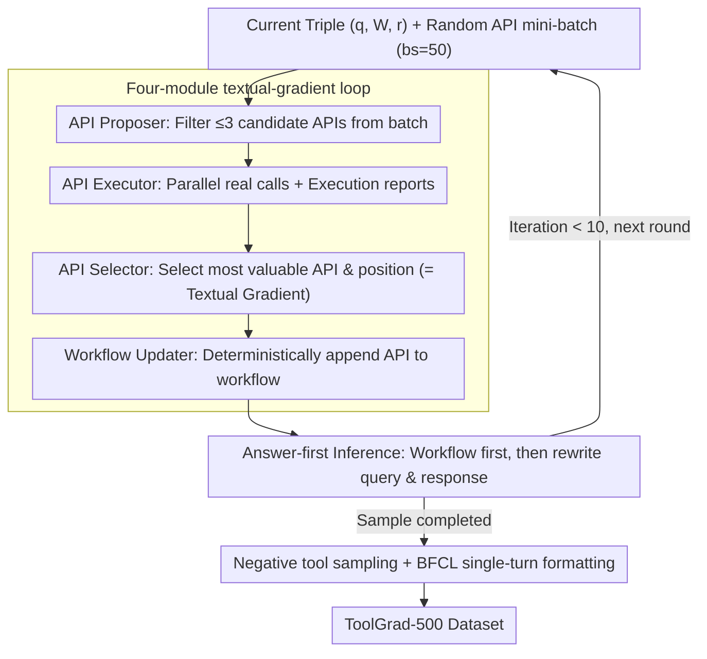

# ToolGrad: Efficient Tool-use Dataset Generation with Textual "Gradients"

**Conference**: ACL2026  
**arXiv**: [2508.04086](https://arxiv.org/abs/2508.04086)  
**Code**: https://github.com/zhongyi-zhou/toolgrad  
**Area**: LLM Agent / Tool-use Data Generation  
**Keywords**: Tool call, synthetic data, textual gradient, answer-first, API workflow

## TL;DR
ToolGrad reverses tool-use data generation from "writing queries first and searching tool chains via DFS" to "generating successfully executable tool chains first and then back-inferring user queries." By using an API selection loop similar to textual gradients to construct ToolGrad-500, the pass rate for data generation reaches 99.8%. Small models like Gemma-3 trained on this data outperform several powerful closed-source models in single-turn tool calling.

## Background & Motivation
**Background**: Tool calling allows LLMs to access search, databases, code execution, and various APIs, providing a critical path to reduce hallucinations, enhance factuality, and execute complex tasks. The key to training such models is not just the API list, but a large number of supervised samples consisting of "user request - tool calling chain - final response."

**Limitations of Prior Work**: Mainstream synthesis schemes typically let LLMs generate a user query based on a set of APIs, then let an agent search for a viable tool chain via DFS or ReAct-style exploration. This query-first process is costly, has a high failure rate, and failed samples waste significant tool calls. Worse, even if DFS finds a successful path, low-quality or incorrect tool steps might be mixed into the exploration, contaminating the model when used as "ground truth" for training.

**Key Challenge**: Real user questions are naturally ambiguous, while tool chains are concrete and verifiable. Searching for an answer from a vague query requires expensive exploration; however, if one already has an executable tool chain, back-inferring a query that can be solved by that chain is much easier. The problem is: how to directly generate complex and effective tool chains from an 8k-scale API database.

**Goal**: The authors aim to design a data generation framework with a high pass rate, low tool calling cost, and the ability to produce complex multi-API workflows. They also seek to verify whether small models trained on this cheap synthetic data can acquire real tool-calling capabilities on ToolBench and BFCL.

**Key Insight**: The paper draws inspiration from the "textual gradient" concept of TextGrad but changes the optimization target from the prompt to the dataset. Instead of a critic writing natural language suggestions at each step, the LLM selects the most valuable API from a report of candidate API executions, treating this discrete choice as the "gradient" of the data generation process.

**Core Idea**: First construct a successful tool answer, then generate the corresponding user query. Tool chain construction is completed through a four-step iteration: API proposal, execution, selection, and workflow update, avoiding the large-scale failed explorations in query-first searching.

## Method

### Overall Architecture
ToolGrad addresses the issues of tool-use training data being "expensive to generate, prone to failure, and mixed with incorrect tool steps" by reversing the generation direction. Each sample produced is a triple $(q, \mathcal{W}, r)$: $q$ is the user query, $\mathcal{W}$ is a workflow composed of multiple API chains, and $r$ is the final response to the user based on that workflow. Since the inference model trained by the authors predicts the complete tool call in a single output (rather than ReAct-style step-by-step calls), the data must contain a structured API workflow.

The entire generation starts from an initial workflow and "grows" it round by round. In each round, a random API mini-batch is taken, and four modules work in sequence: the API Proposer selects a few potentially useful APIs and instructions from the mini-batch; several API Executors call these APIs in parallel and generate execution reports; the API Selector compares these reports, chooses the most valuable API and where it should be appended in the workflow; the Workflow Updater deterministically writes the API into the workflow and then lets the LLM generate a new user query and final response based on the updated workflow. After several rounds, an answer-first sample is fully formed.

### Key Designs

**1. Answer-first tool chain generation: Ensure the call chain works first, then back-infer the query**

Real user questions are inherently vague. Starting from a vague query to search for a viable tool chain using DFS/ReAct is expensive and often fails. Even if a successful path is found, low-quality steps mixed in will contaminate the training as "ground truth." ToolGrad turns this search problem into a more controllable generation problem: it does not start from the query; instead, it uses executable API calls as anchor points. As each API is merged into the workflow, the system updates the corresponding query and response, ensuring the triple remains consistent. A tool chain is a structured, verifiable object, while a query is just a natural language description; back-inferring the latter from the former is much easier than reverse searching, eliminating "unsolvable queries" and failed tool steps from the training set.

**2. Four-module textual-gradient loop: Using discrete API selection as the "gradient" for data generation**

The challenge is to gradually build a complex workflow in an 8k-scale API database while suppressing the tool calling cost per round. ToolGrad adopts the "textual gradient" idea from TextGrad but shifts the optimization target from the prompt to the data sample. The API Proposer uses a standard LLM to propose up to $m=3$ candidates from an API batch of size $bs=50$, filtering out most irrelevant APIs since tool execution is the truly expensive part. The API Executor use an LLM agent that supports tool calling to actually run these candidates, returning success/failure and call history. The API Selector reads the reports and chooses the most valuable API and its position in the chain—this discrete choice acts as the signal telling the system "which API direction to optimize the current sample," serving as the textual gradient in ToolGrad. Finally, the Workflow Updater deterministically appends the API and has the LLM rewrite the query/response without relying on search.

**3. Negative tool sampling and single-turn function call formatting: Making training resemble real deployment where "visible APIs exceed necessary APIs"**

If only correct tools are provided during training, the model cannot learn tool selection. However, presenting all 8k APIs is unrealistic. ToolGrad takes a middle ground: for each positive API in the workflow, it samples a batch of similar negative APIs based on embedding similarity. This forces the model to face a top-$p$ set of candidate tools rather than just the correct ones. These similar negative samples provide a harder training environment closer to RAG-based tool selection. For generation, each sample undergoes 10 iterations with $p=10$ negative tools, generated using gemini-2.5-flash-lite with 500 different seeds, forming ToolGrad-500 organized in BFCL-style single-turn tool calling format.

### Loss & Training
ToolGrad is a data generation framework and does not train the generator itself. After generating ToolGrad-500, the authors use Supervised Fine-Tuning (SFT) to train Gemma-3 1B, 4B, and 12B models to output Python-style tool use given OpenAI-style tool definitions. Control data includes ToolBench-generated data, and baselines include Gemini-2.5, Claude-4.5, GPT-5 series, and tool-calling models like ToolACE and Hammer. Evaluation is primarily conducted on ToolBench-I3 single-turn tool use and BFCL v1/v2 single-turn tool calling.

## Key Experimental Results

### Main Results
The following table compares the efficiency of query-first DFS and ToolGrad for data generation. ToolGrad is not only more successful but also generates more complex tool chains.

| Data Gen Method | Pass rate ↑ | Avg GT tools ↑ | LLM cost ↓ | Tool cost ↓ |
|:---|:---:|:---:|:---:|:---:|
| DFS / ToolBench-style | 63.8% | 2.1 | 64.5 | 34.3 |
| ToolGrad | 99.8% | 3.4 | 63.9 | 20.0 |

This table provides the most compelling evidence: while LLM calling costs remain nearly the same, tool calling costs drop from 34.3 to 20.0, while the pass rate increases from 63.8% to 99.8% and average tool chain complexity increases from 2.1 to 3.4. The authors also checked failure logs and found only 3 API execution failures out of 500 runs, a failure rate of approximately 0.2%.

### Ablation Study
The authors further compare the absolute judge scores of small models trained on ToolGrad-500 against closed-source models on ToolBench single-turn tool use.

| Model / Data | Score | Note |
|:---|:---:|:---|
| ToolGrad-Gemma-3-1B | 14.1 | 1B model already exceeds Gemini-2.5-flash-lite |
| ToolGrad-Gemma-3-4B | 17.6 | Second highest in the table |
| ToolGrad-Gemma-3-12B | 19.6 | Highest in the table |
| Gemini-2.5-flash-lite | 6.9 | The teacher model for ToolGrad data generation |
| Gemini-2.5-pro | 11.4 | Strong closed-source baseline |
| Claude-4.5-opus | 15.4 | Strong closed-source baseline |
| GPT-5-nano | 15.4 | Strong closed-source baseline |
| GPT-5-mini | 14.7 | Strong closed-source baseline |

Consistency across Gemma model versions also supports data effectiveness: ToolGrad improves Gemma-3-1B from 1.0 to 14.1, 4B from 11.2 to 17.6, and 12B from 9.8 to 19.6. The paper also reports overall score gains of +8.1, +8.0, and +6.3 on BFCL for the 1B, 4B, and 12B models respectively, with larger gains in the non-live synthetic subset and gains of +1.93, +4.74, and +4.22 in the live subset.

### Key Findings
- The answer-first process significantly reduces contamination from unsolvable queries and failed trajectories. Compared to query-first, ToolGrad is anchored by executable tool chains, making samples naturally easier to verify.
- The fact that student models outperform teacher models is a strong signal. Although Gemini-2.5-flash-lite was used to generate the data, the trained ToolGrad-Gemma-3-12B outperforms it on ToolBench and BFCL, suggesting the data structure itself provides additional supervisory value.
- Scaling is not infinitely beneficial. The pass rate tends to saturate around 8-12 iterations; gains are observed when increasing sample size from 100 to 500/1k, but performance declines beyond that. The authors attribute this to a lack of cross-sample memory, leading to repetitive tool-use patterns.

## Highlights & Insights
- The "answer before query" reversal has strong engineering intuition. In tool-calling scenarios, executable chains are easier to verify than natural language queries. Ensuring a valid answer before back-inferring the query transforms a difficult search problem into a more controllable generation problem.
- ToolGrad’s adaptation of textual gradients is ingenious. Instead of having the LLM write vague suggestions, it forces the LLM to select an API from an execution report. This discrete action is both interpretable and directly alters the direction of data generation.
- The paper evaluates data generation efficiency alongside downstream model capability, avoiding the trap of only proving that "generation is cheap." Crucially, small models trained on cheaper data can generalize to OOD tool sets.

## Limitations & Future Work
- The current training format focuses on single-turn, one-time output of complete tool calls, which does not directly cover ReAct/DFS-style multi-step interactions or agent frameworks with intermediate reasoning.
- The paper only validates SFT using ToolGrad data and does not explore the value of these high-pass-rate tool chain data in RL or preference optimization.
- Query generation is still back-inferred by an LLM, which may not align with real user expressions regarding linguistic style, ambiguity, or context omission.
- The scaling plateau is a clear bottleneck. The lack of global memory causes different samples to repetitively explore similar API combinations. Future work could introduce shared memory, coverage constraints, or DPP-style diversity selection to improve scaling efficiency.

## Related Work & Insights
- **vs ToolBench / ToolLLM**: ToolBench generates queries first then searches tool chains via DFS, providing broad coverage but at high cost and failure rates. ToolGrad generates tool chains first then queries, sacrificing some naturalness of query-first for high resolvability and pass rates.
- **vs TextGrad**: TextGrad uses natural language feedback to optimize prompts. ToolGrad borrows the "textual gradient" concept, but the gradient is manifested via the API Selector's discrete choice in execution reports, used to optimize data samples rather than prompts.
- **vs ToolACE / Hammer**: ToolACE and Hammer focus more on training or constructing strong tool-calling models. ToolGrad focuses on the data generation mechanism and can serve as a data source for post-training these models, especially for rapidly bootstrapping tool capabilities in small models.

## Rating
- Novelty: ⭐⭐⭐⭐☆ The answer-first reversal is simple but effective, and applying textual gradients to API selection is quite distinctive.
- Experimental Thoroughness: ⭐⭐⭐⭐☆ Covers data efficiency, ToolBench, BFCL, and scaling studies, though experiments on multi-turn agents and RL usage are missing.
- Writing Quality: ⭐⭐⭐⭐☆ Clear motivation, easy-to-understand framework and module descriptions, though cost metrics could be explained in more detail.
- Value: ⭐⭐⭐⭐⭐ Tool-use data generation is a core bottleneck in agent training; this paper provides a low-cost, reproducible, and strong baseline.

<!-- RELATED:START -->

## Related Papers

- [\[ACL 2026\] Meta-Tool: Efficient Few-Shot Tool Adaptation for Small Language Models](meta-tool_efficient_few-shot_tool_adaptation_for_small_language_models.md)
- [\[ICLR 2026\] Efficient Agent Training for Computer Use](../../ICLR2026/llm_agent/efficient_agent_training_for_computer_use.md)
- [\[ICLR 2026\] Benchmarking LLM Tool-Use in the Wild](../../ICLR2026/llm_agent/benchmarking_llm_tool-use_in_the_wild.md)
- [\[ACL 2026\] Robust Tool Use via Fission-GRPO: Learning to Recover from Execution Errors](robust_tool_use_via_fission-grpo_learning_to_recover_from_execution_errors.md)
- [\[AAAI 2026\] AutoTool: Efficient Tool Selection for Large Language Model Agents](../../AAAI2026/llm_agent/autotool_efficient_tool_selection_for_large_language_model_agents.md)

<!-- RELATED:END -->
