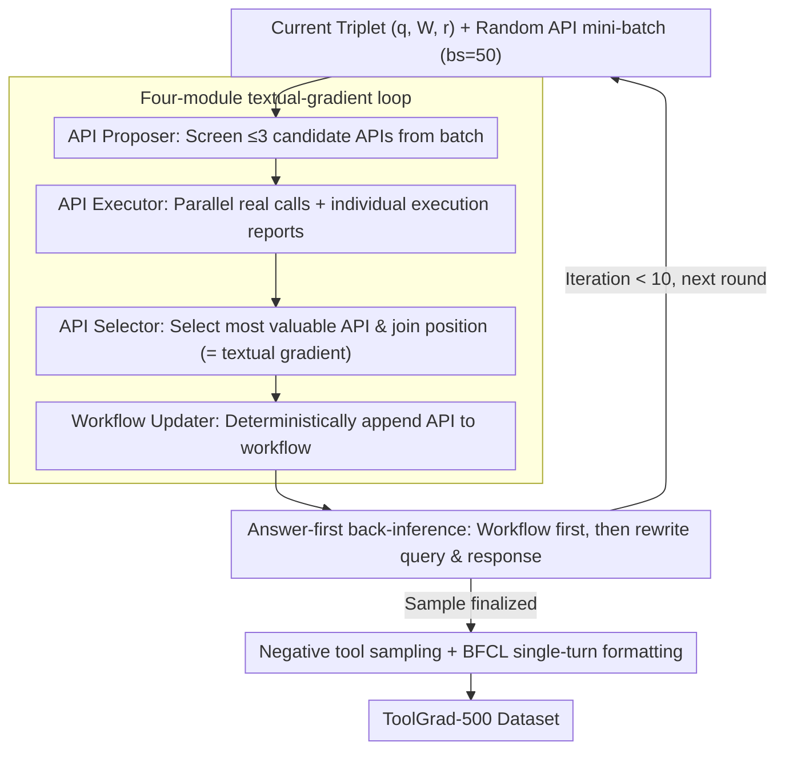

# ToolGrad: Efficient Tool-use Dataset Generation with Textual "Gradients"

**Conference**: ACL2026  
**arXiv**: [2508.04086](https://arxiv.org/abs/2508.04086)  
**Code**: https://github.com/zhongyi-zhou/toolgrad  
**Area**: LLM Agent / Tool-use Data Generation  
**Keywords**: Tool calling, synthetic data, textual gradients, answer-first, API workflow

## TL;DR
ToolGrad reverses the tool-use data generation process from "writing user queries first and searching for tool chains via DFS" to "generating successfully executable tool chains first and then back-inferring user queries." By employing a textual-gradient-like API selection loop to construct ToolGrad-500, the framework achieves a data generation pass rate of 99.8%. Small models like Gemma-3 trained on this data outperform several powerful closed-source models in single-turn tool invocation.

## Background & Motivation
**Background**: Tool calling enables LLMs to access search, databases, code execution, and various APIs, providing a critical path for reducing hallucination, enhancing factuality, and executing complex tasks. The key to training such models is not just the list of APIs, but a large number of "user request - tool calling chain - final answer" supervised samples.

**Limitations of Prior Work**: Mainstream synthesis schemes typically let an LLM generate a user query based on a set of APIs, then use an agent to find a feasible tool chain through DFS or ReAct-style exploration. This query-first process is costly, has a high failure rate, and failed samples waste extensive tool calls. Worse, even if DFS finds a successful path, low-quality or incorrect tool steps may be mixed into the exploration, contaminating the model when used as "ground truth" for training.

**Key Challenge**: Real user questions are naturally vague, whereas tool chains are concrete and verifiable. Searching for an answer from a vague query requires expensive exploration; however, if an executable tool chain is already available, back-inferring a query that can be solved by that tool chain is much simpler. The problem lies in how to directly generate complex and effective tool chains from a database of 8k APIs.

**Goal**: The authors aim to design a data generation framework with a high pass rate, low tool-calling cost, and the ability to produce complex multi-API workflows. They seek to verify whether small models trained on this inexpensive synthetic data can acquire real tool-calling capabilities on ToolBench and BFCL.

**Key Insight**: The paper draws inspiration from the "textual gradient" concept in TextGrad but switches the optimization target from prompts to the dataset. Instead of having a critic write natural language suggestions, the LLM selects the most valuable API from the execution reports of candidate APIs, treating this discrete selection as the "gradient" of the data generation process.

**Core Idea**: Construct a successful tool answer first, then generate the corresponding user query. Tool chain construction is completed through a four-step iteration: API proposal, execution, selection, and workflow update, avoiding large-scale failed exploration in query-first searching.

## Method

### Overall Architecture
ToolGrad addresses the issues where tool-calling training data is "expensive to generate, prone to failure, and easily contaminated with incorrect tool steps" by reversing the generation direction. Each produced sample is a triplet $(q, \mathcal{W}, r)$: $q$ is the user query, $\mathcal{W}$ is the workflow consisting of multiple API chains, and $r$ is the final answer to the user based on that workflow. Since the trained inference model predicts the complete tool invocation in a single output (rather than ReAct-style step-by-step calls), the data must include structured API workflows.

The generation starts from an initial workflow and "grows" it round by round. In each round, a random API mini-batch is sampled, and four modules work in sequence: the API Proposer selects a few potentially useful APIs and usage instructions from the mini-batch; multiple API Executors execute these APIs in parallel and generate individual execution reports; the API Selector compares these reports to choose the most valuable API and its insertion point in the workflow; the Workflow Updater deterministically writes the API into the workflow and asks the LLM to generate a new user query and final answer based on the updated workflow. After several rounds, an answer-first sample is fully formed.

### Key Designs

**1. Answer-first toolchain generation: Ensure path execution first, then infer user questions**
Real user questions are naturally vague. Searching for feasible tool chains from vague queries using DFS/ReAct is both expensive and frequently unsuccessful. Even when a successful path is found, low-quality steps mixed in during search pollute the training as "ground truth." ToolGrad transforms this search problem into a more controllable generation problem: instead of starting from a query, it treats executable API calls as generation anchors. As each API is merged into the workflow, the system synchronously updates the corresponding query and response to maintain triplet consistency. Since tool chains are structured and verifiable, back-inferring natural language descriptions is much easier and eliminates "unsolvable queries" and failed steps from the training set.

**2. Four-module textual-gradient loop: Using discrete API selection as the data generation "gradient"**
To step-by-step build complex workflows from an 8k-scale API database while minimizing per-round tool-calling costs, ToolGrad borrows the "textual gradient" idea from TextGrad. It changes the optimization target from prompts to data samples: the API Proposer uses a standard LLM to suggest at most $m=3$ candidates from an API batch of size $bs=50$, filtering out the vast majority of irrelevant APIs (since execution is the expensive part). The API Executor uses an LLM agent supporting tool calls to actually run these candidates, returning success/failure and call history. The API Selector reads the execution reports and chooses the most valuable API and its position—this discrete choice acts as a signal telling the system "which API direction to optimize the current data sample," serving as the textual gradient in ToolGrad. Finally, the Workflow Updater deterministically appends the API and rewrites the query/response without relying on search.

**3. Negative tool sampling & single-turn function calling formatting: Simulating real deployment where "visible APIs exceed required APIs"**
If only correct tools are provided during training, the model cannot learn tool selection. However, presenting the full 8k APIs is impractical. ToolGrad takes a middle ground: for each positive API in the workflow, it samples a batch of similar negative APIs based on embedding similarity. This forces the model to face a top-$p$ candidate set rather than just the correct answers, providing a more difficult training environment closer to RAG-retrieved tool selection. For generation, each sample undergoes 10 iterations with $p=10$ negative tools, using gemini-2.5-flash-lite with 500 different seeds to form the ToolGrad-500 dataset, organized in the BFCL style for single-turn tool invocation.

### Loss & Training
ToolGrad is a data generation framework and does not train the generator itself. After generating ToolGrad-500, the authors use supervised fine-tuning to train Gemma-3 1B, 4B, and 12B models to output Python-style tool use given OpenAI-style tool definitions. Control data includes ToolBench-generated data, and comparison models include closed-source models such as Gemini-2.5, Claude-4.5, and GPT-5 series, as well as tool-calling models like ToolACE and Hammer. Evaluation targets ToolBench-I3 and BFCL v1/v2 single-turn tool calling.

## Key Experimental Results

### Main Results
The following table compares the generation efficiency of query-first DFS and ToolGrad. ToolGrad is not only more successful but also generates more complex tool chains.

| Data Generation Method | Pass rate ↑ | Avg. GT Tools ↑ | LLM cost ↓ | Tool cost ↓ |
|:-----------------------|:------------|:----------------|:-----------|:------------|
| DFS / ToolBench-style  | 63.8%       | 2.1             | 64.5       | 34.3        |
| ToolGrad               | 99.8%       | 3.4             | 63.9       | 20.0        |

This table is the most convincing evidence: LLM invocation costs remain nearly constant while tool-calling costs drop from 34.3 to 20.0. Simultaneously, the pass rate rises from 63.8% to 99.8%, and the average tool chain complexity increases from 2.1 to 3.4. Failed log analysis showed only 3 empty samples due to API execution failure out of 500 runs (~0.2% failure rate).

### Ablation Study
The authors further compare the absolute judge scores of small models trained on ToolGrad-500 against closed-source models on ToolBench single-turn tool use.

| Model / Data             | Score | Remarks                                         |
|:-------------------------|:------|:------------------------------------------------|
| ToolGrad-Gemma-3-1B      | 14.1  | 1B model already exceeds Gemini-2.5-flash-lite |
| ToolGrad-Gemma-3-4B      | 17.6  | Second highest in the table                     |
| ToolGrad-Gemma-3-12B     | 19.6  | Highest in the table                            |
| Gemini-2.5-flash-lite    | 6.9   | Teacher model for ToolGrad data generation      |
| Gemini-2.5-pro           | 11.4  | Closed-source SOTA baseline                     |
| Claude-4.5-opus          | 15.4  | Closed-source SOTA baseline                     |
| GPT-5-nano               | 15.4  | Closed-source SOTA baseline                     |
| GPT-5-mini               | 14.7  | Closed-source SOTA baseline                     |

Training comparisons within the same Gemma model group also support data validity: ToolGrad improves Gemma-3-1B from 1.0 to 14.1, 4B from 11.2 to 17.6, and 12B from 9.8 to 19.6. The paper also reports overall score gains on BFCL of +8.1, +8.0, and +6.3 for the 1B, 4B, and 12B models respectively, with larger gains in the non-live synthetic subset and gains of +1.93, +4.74, and +4.22 in the live subset.

### Key Findings
- The answer-first process significantly reduces unsolvable queries and failed trajectory contamination. By anchoring generation to successful tool chains, samples are naturally easier to verify.
- Small models outperforming the teacher model is a strong signal. Although Gemini-2.5-flash-lite generated the data, ToolGrad-Gemma-3-12B outperforms it on ToolBench and BFCL, suggesting the data structure itself provides additional supervisory value.
- Scaling does not improve performance indefinitely. The pass rate tends to saturate around 8-12 iterations; benefits are observed when increasing sample counts from 100 to 500/1k, but performance declines beyond that. The authors attribute this to the lack of cross-sample memory, leading to repeated utility of specific tool patterns.

## Highlights & Insights
- The "answer before question" reversal is deeply rooted in engineering intuition. In tool-use scenarios, executable chains are easier to verify than natural language queries. Ensuring valid answers before back-inferring questions transforms a difficult search problem into a more controllable generation problem.
- The adaptation of textual gradients is noteworthy. Instead of having the LLM write vague advice, ToolGrad has the LLM perform a discrete action—choosing an API from an execution report—which is both interpretable and directly alters the data generation trajectory.
- The paper evaluates generation efficiency alongside downstream model capability, avoiding the trap of only proving that generation is "cheap." More importantly, small models trained on cheaper data generalize to OOD tool sets.

## Limitations & Future Work
- The current training format focuses on single-turn, one-shot outputs of complete tool calls, which does not directly cover ReAct/DFS-style multi-step interactions or agent frameworks with intermediate reasoning.
- The paper only validates the effect of SFT using ToolGrad data and does not explore the value of these high-pass-rate tool chain datasets in RL or preference optimization.
- Query generation still relies on LLM back-inference, which may not match real user expression patterns—such as linguistic style, vagueness, or context omissions.
- The scaling plateau is a clear bottleneck. The lack of global memory leads to different samples redundantly exploring similar API combinations. Future work could incorporate shared memory, coverage constraints, or diversity-based selection like DPP to improve data scaling efficiency.

## Related Work & Insights
- **vs ToolBench / ToolLLM**: ToolBench generates queries first and then uses DFS to search for tool chains, offering broad coverage but at high cost and failure rates. ToolGrad generates tool chains first, sacrificing some query naturalness for high resolvability and pass rate.
- **vs TextGrad**: TextGrad uses natural language feedback to optimize prompts. ToolGrad adapts the "textual gradient" concept, but the gradient is manifested as the API Selector's discrete choice among execution reports, used to optimize data samples rather than prompts.
- **vs ToolACE / Hammer**: ToolACE and Hammer focus more on training strong tool-calling models. ToolGrad focuses on the data generation mechanism and can serve as a data source for post-training these models, particularly for bootstrapping small model tool capabilities.

## Rating
- Novelty: ⭐⭐⭐⭐☆ The answer-first reversal is simple yet effective, and the application of textual gradients to API selection is distinctive.
- Experimental Thoroughness: ⭐⭐⭐⭐☆ Covers data efficiency, ToolBench, BFCL, and scaling studies, though multi-turn agent and RL experiments are missing.
- Writing Quality: ⭐⭐⭐⭐☆ Clear motivation, easy-to-understand framework and module descriptions, though some cost metrics could be explained in more detail.
- Value: ⭐⭐⭐⭐⭐ Tool-use data generation is a core bottleneck in agent training; this paper provides a low-cost, reproducible, and strong baseline.

<!-- RELATED:START -->

## Related Papers

- [\[ICLR 2026\] Efficient Agent Training for Computer Use](../../ICLR2026/llm_agent/efficient_agent_training_for_computer_use.md)
- [\[ACL 2026\] Robust Tool Use via Fission-GRPO: Learning to Recover from Execution Errors](robust_tool_use_via_fission-grpo_learning_to_recover_from_execution_errors.md)
- [\[ACL 2026\] Meta-Tool: Efficient Few-Shot Tool Adaptation for Small Language Models](meta-tool_efficient_few-shot_tool_adaptation_for_small_language_models.md)
- [\[ACL 2026\] Feedback-Driven Tool-Use Improvements in Large Language Models via Automated Build Environments](feedback-driven_tool-use_improvements_in_large_language_models_via_automated_bui.md)
- [\[ICLR 2026\] AgentSynth: Scalable Task Generation for Generalist Computer-Use Agents](../../ICLR2026/llm_agent/agentsynth_scalable_task_generation_for_generalist_computer-use_agents.md)

<!-- RELATED:END -->
